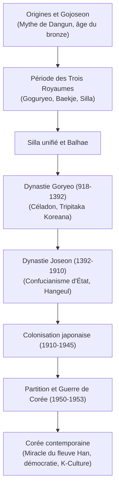

## Introduction : Un carrefour géopolitique et une résilience millénaire

Située au cœur de l'Asie du Nord-Est, la péninsule coréenne a subi les assauts répétés des empires nomades, de la Chine continentale et de l'archipel japonais. Loin d'être un simple théâtre passif, la Corée a toujours réinventé son héritage pour bâtir une civilisation raffinée : les céladons de Goryeo, l'imprimerie à caractères mobiles métalliques et l'alphabet **Hangeul**, chef-d'œuvre de rationalité linguistique conçu par le roi Sejong le Grand.

## 1. Des mythes fondateurs aux Trois Royaumes
Selon le mythe consigné dans le *Samguk Yusa*, Gojoseon fut fondé en 2333 av. J.-C. par Dangun Wanggeom. Historiquement, la péninsule abrite la plus forte concentration de dolmens au monde.
À partir du Ier siècle av. J.-C., trois puissants royaumes émergent :
- **Goguryeo** : Puissance militaire du Nord, repoussant les invasions chinoises des Sui et des Tang.
- **Baekje** : Foyer culturel maritime raffiné, transmettant le bouddhisme et l'architecture au Japon antique.
- **Silla** : Société aristocratique encadrée par le système des rangs d'os et l'élite des *Hwarang*, qui unifie la péninsule en 676.

## 2. La dynastie Goryeo (918–1392)
Fondée par Wang Geon, Goryeo donne son nom à la Corée. L'époque voit l'épanouissement du bouddhisme, la gravure des 81 258 tablettes de la *Tripitaka Koreana* à Haeinsa et l'invention des caractères métalliques mobiles bien avant Gutenberg.

## 3. La dynastie Joseon (1392–1910)
Fondée par Yi Seong-gye, Joseon fait du néo-confucianisme son pilier institutionnel. Sous le règne du **roi Sejong le Grand** (1418–1450), la science fleurit et l'alphabet **Hangeul** est promulgué en 1446 pour instruire le peuple. À la fin du XVIe siècle, l'amiral Yi Sun-sin brise l'invasion japonaise de Toyotomi Hideyoshi grâce à ses célèbres navires-tortues (*Geobukseon*).

## 4. Tragédies modernes : Colonisation et Guerre de Corée
Après l'annexion forcée par le Japon en 1910, les Coréens résistent farouchement (Mouvement du 1er mars 1919). Libérée en 1945, la péninsule est tragiquement scindée le long du 38e parallèle. La **Guerre de Corée (1950–1953)** laisse le pays dévasté et figé dans un armistice surveillé par la zone démilitarisée (DMZ).

## 5. Le miracle du fleuve Han et le rayonnement mondial
Partant d'une extrême pauvreté, la Corée du Sud réussit une industrialisation fulgurante tout en arrachant la démocratie au prix de luttes héroïques (soulèvement de Gwangju en 1980, manifestations de juin 1987). Aujourd'hui, portée par des géants technologiques et l'onde mondiale de la **K-Culture** (K-Pop, cinéma, séries), la Corée incarne un dynamisme remarquable sur la scène internationale.
