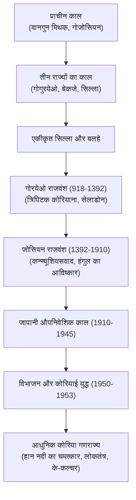

## प्रस्तावना: भौगोलिक नियति और अदम्य साहस

यूरेशियाई महाद्वीप के पूर्वी छोर पर स्थित कोरियाई प्रायद्वीप ने सदियों से विदेशी आक्रमणों का सामना किया है। फिर भी, कोरियाई जनता ने अपनी पहचान को सुरक्षित रखते हुए गोरयेओ सेलाडोन मिट्टी के बर्तन, धातु के जंगम प्रकार की छपाई और राजा सेजोंग द्वारा आविष्कृत वैज्ञानिक वर्णमाला **हंगुल (Hangul)** जैसी अनूठी सांस्कृतिक उपलब्धियाँ हासिल कीं।

## 1. प्राचीन गोजोसियन और तीन राज्य
पौराणिक कथाओं के अनुसार, 2333 ईसा पूर्व में दानगुन ने गोजोसियन की स्थापना की थी। दुनिया के आधे से अधिक प्राचीन डोलमेन मकबरे कोरिया में स्थित हैं।
ईसा पूर्व पहली सदी तक तीन प्रमुख राज्यों का उदय हुआ:
- **गोगुरयेओ**: उत्तर का शक्तिशाली घुड़सवार साम्राज्य, जिसने चीनी आक्रमणों को विफल किया।
- **बेकजे**: दक्षिण-पश्चिम का समुद्री राज्य, जिसने जापान में बौद्ध धर्म और कला का प्रसार किया।
- **सिल्ला**: दक्षिण-पूर्व का राज्य, जिसने 'हवारंग' योद्धाओं के दम पर 676 ईस्वी में प्रायद्वीप का एकीकरण किया।

## 2. गोरयेओ राजवंश (918–1392)
वांग जियोन द्वारा स्थापित इस राजवंश के नाम पर ही देश का नाम 'कोरिया' पड़ा। यह काल उत्कृष्ट सेलाडोन कला और हेइंसा मंदिर में 81,000 से अधिक लकड़ी के ब्लॉकों पर उकेरे गए बौद्ध ग्रंथों (*त्रिपिटक कोरियाना*) के लिए प्रसिद्ध है।

## 3. जोसियन राजवंश और हंगुल का निर्माण
1392 में स्थापित जोसियन राजवंश ने कन्फ्यूशियस दर्शन को अपनाया। महान **राजा सेजोंग (1418–1450)** ने 1443 में आम जनता को साक्षर बनाने के लिए वैज्ञानिक वर्णमाला **हंगुल** का निर्माण किया। 1592 के जापानी आक्रमण के दौरान एडमिरल ली सुन-सिन ने अपनी 'कछुआ नावों' (*जियोबुकसोन*) से देश की रक्षा की।

## 4. औपनिवेशिक काल और कोरियाई युद्ध
1910 में जापान ने कोरिया पर कब्जा कर लिया। 1945 में स्वतंत्रता के बाद शीत युद्ध के कारण देश 38वीं समानांतर रेखा पर विभाजित हो गया। 1950-1953 के **कोरियाई युद्ध** ने प्रायद्वीप को तबाह कर दिया और एक सशस्त्र संघर्ष विराम (DMZ) स्थापित हुआ।

## 5. हान नदी का चमत्कार और के-कल्चर
युद्ध की राख से उठकर दक्षिण कोरिया ने तीव्र औद्योगिकीकरण हासिल किया, जिसे 'हान नदी का चमत्कार' कहा जाता है। 1980 के ग्वांगजू आंदोलन से लोकतंत्र स्थापित हुआ। आज दक्षिण कोरिया विश्व की अग्रणी आर्थिक व तकनीकी महाशक्ति है और इसका **के-कल्चर** (K-Pop, सिनेमा, साहित्य) पूरी दुनिया पर छाया हुआ है।
