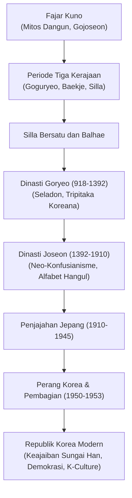

## Pengantar: Takdir Geopolitik dan Ketahanan Bangsa Korea

Terletak di persimpangan strategis Asia Timur, Semenanjung Korea telah mengalami serbuan tiada henti dari kekuatan daratan Eurasia dan kepulauan Jepang. Namun, rakyat Korea tidak pernah menyerah. Mereka menyerap kebudayaan Asia Timur dan melahirkan warisan peradaban yang agung: porselen seladon Goryeo, cetak blok kayu Tripitaka Koreana, huruf cetak logam bergerak pertama di dunia, serta alfabet fonetik ilmiah **Hangul** yang diciptakan oleh Raja Sejong yang Agung.

## 1. Dari Gojoseon hingga Zaman Tiga Kerajaan
Menurut mitologi, Gojoseon didirikan oleh Dangun pada 2333 SM. Korea menyimpan lebih dari separuh dolmen megalitikum dunia.
Pada abad pertama SM, muncullah Tiga Kerajaan:
- **Goguryeo**: Kerajaan militer perkasa di utara yang menahan invasi dinasti Sui dan Tang.
- **Baekje**: Kerajaan maritim di barat daya yang menyebarkan agama Buddha dan arsitektur ke Jepang kuno.
- **Silla**: Kerajaan di tenggara yang mengandalkan sistem kasta *Golpum* dan ksatria muda *Hwarang*, berhasil menyatukan semenanjung pada 676 M.

## 2. Dinasti Goryeo (918–1392)
Didirikan oleh Wang Geon, Goryeo menjadi asal-usul nama "Korea". Zaman ini terkenal dengan porselen seladon bertatahkan giok yang indah serta pelestarian 81.258 balok kayu ajaran Buddha (*Tripitaka Koreana*) di Kuil Haeinsa.

## 3. Dinasti Joseon (1392–1910)
Didirikan oleh Yi Seong-gye di Hanyang (Seoul), Joseon menjadikan Neo-Konfusianisme sebagai landasan negara. Puncaknya terjadi pada masa **Raja Sejong yang Agung** (1418–1450) yang menciptakan alfabet fonetik **Hangul** pada 1443 agar rakyat jelata dapat membaca dan menulis. Selama Invasi Jepang (1592–1598), Laksamana Yi Sun-sin menyelamatkan negeri dengan taktik brilian dan Kapal Kura-kura (*Geobukseon*).

## 4. Penjajahan Jepang dan Perang Korea
Dianeksasi oleh Jepang pada 1910, bangsa Korea melancarkan perlawanan gigih seperti Gerakan 1 Maret 1919. Setelah pembebasan tahun 1945, Perang Dingin membelah Korea di garis paralel ke-38. **Perang Korea (1950–1953)** memporak-porandakan negeri dan menyisakan gencatan senjata di Zona Demiliterisasi (DMZ).

## 5. Keajaiban Sungai Han dan Ledakan K-Culture
Dari puing-puing perang, Korea Selatan membangun industri modern ("Keajaiban Sungai Han") dan merebut demokrasi melalui pengorbanan rakyat (Pemberontakan Gwangju 1980 dan Gerakan Juni 1987). Kini, Korea Selatan berdiri sebagai raksasa teknologi tinggi dan pelopor fenomena global **K-Culture** (K-Pop, film, dan drama).
