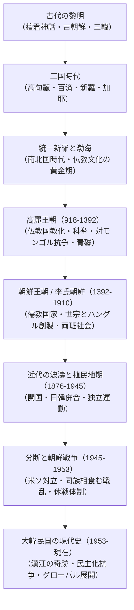
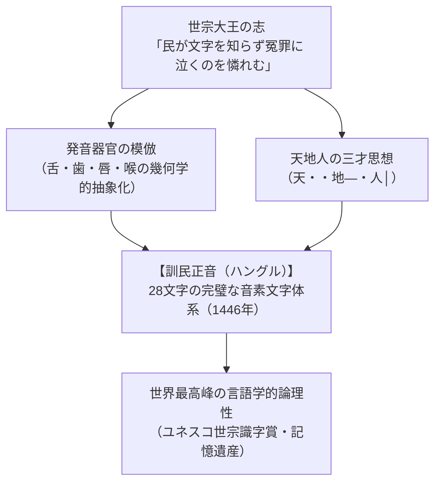
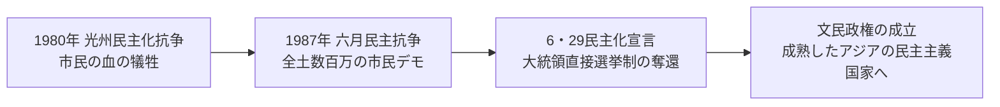

## 序論：半島という地政学的宿命と不屈のアイデンティティ

ユーラシア大陸の東端、中国大陸と日本列島を繋ぐ架け橋の位置に突出する朝鮮半島（韓半島）。この地に展開した数千年に及ぶ歴史は、北方騎馬民族の躍動、中華帝国からの圧倒的な軍事・文化的大波、そして海洋勢力からの外圧という、世界史的にも類を見ない激動の地政学的力学に晒され続けてきた。

しかし、朝鮮半島の歴史を単なる「大国に翻弄された受動的な歴史」として捉えることは、その本質を見誤る致命的な過ちである。朝鮮半島の諸王朝と民衆は、絶え間ない外圧と侵略の危機に直面しながらも、中華文明の精華（漢字・儒教・仏教・律令制度）を主体的に摂取・昇華させ、独自の洗練された文化・制度体系（高麗青磁、高麗八万大蔵経、世界最高峰の表音文字ハングル、金属活字印刷、比類なき王朝記録文化など）を築き上げた。

さらに近現代においては、植民地支配の過酷な試練、国家分断の悲劇と壊滅的な朝鮮戦争の惨禍を経験しながらも、廃墟の中から「漢江の奇跡」と称される急速な経済成長を成し遂げ、民衆の手による血みどろの闘争を経て強固な民主化を達成した。そして今日、K-POP、映画、ドラマ、文学などのKカルチャーが全世界を席巻している。

本稿では、神話の時代から現代に至る朝鮮半島の歴史を年代順に徹底的に追究し、各時代の政治構造、対外関係、思想文化、社会変容を学術的深みをもって包括的に解読する。

## 第1章：朝鮮半島の黎明と古代国家――檀君神話から三韓の形成へ

### 1.1 旧石器・新石器時代と櫛目文土器文化
朝鮮半島における人類の足跡は、約70万年前に遡る旧石器時代前期の遺跡（公州石壮里遺跡、漣川全谷里遺跡など）によって確認されている。特に漣川全谷里遺跡で発見されたアシュリアン型両面握斧（ハンドアックス）は、東アジアには存在しないとされていた従来の考古学理論を覆す世界的大発見となった。

紀元前6000年頃から始まる新石器時代には、温暖化に伴う定住生活と漁労・狩猟・初期農耕が始まり、その特徴的な遺物として**櫛目文土器（コーム・セラミックス / 빗살무늬토기）**が半島全域で広く出土する。尖底または丸底の器面に魚の骨や櫛状の施文具で幾何学的な文様が刻まれており、これはシベリアから沿海州、ユーラシア北方に広がる環北太平洋文化圏との深いつながりを示唆している。

紀元前1000年頃（前10世紀〜前8世紀）に入ると、遼東半島から朝鮮半島にかけて青銅器文化が受容され、無文土器とともに**琵琶形銅剣（遼寧式銅剣）**や支石墓（ドルメン / 고인돌）が爆発的に普及した。世界の支石墓の約半数以上が朝鮮半島に集中しており、全羅北道の高敞、全羅南道の和順、仁川の江華島などの支石墓群は、強大な階級社会と首長権の成立を物語るユネスコ世界文化遺産に登録されている。平底の無文土器、半月形石刀による稲作農耕の拡大は、集落の巨大化と余剰生産物の蓄積、そして部族国家の形成を加速させた。

### 1.2 檀君神話と古朝鮮（Gojoseon）の成立
朝鮮民族の建国神話として受け継がれているのが、13世紀の僧一然が著した『三国遺事』に記された**檀君（タングン）神話**である。

天上界を統べる天帝・桓因（ファニン）の子である桓雄（ファヌン）が、人間の世界を救うために風伯、雨師、雲師を率いて太白山の神壇樹の下に降臨した。そこに一頭の熊と一頭の虎が現れ、人間になりたいと願った。桓雄は「ヨモギ一握りとニンニク二十個を食べ、百日間日の光を見ずに耐えよ」と告げた。虎は途中で脱落したが、熊は洞窟の中で耐え抜き、美しい女性（熊女 / ウンニョ）へと変身した。桓雄は熊女と結婚し、生まれた子どもが**檀君王倹（タングンワンゴム）**である。檀君は紀元前2333年に平壌城に都を置き、国号を**朝鮮（古朝鮮）**と定めたとされる。

この神話は、北方系天神信仰を持つ移住部族（桓雄集団）と、土着のトーテミズム（熊トーテム集団）の結合を象徴的に表現したものである。歴史学的実証の観点からは、紀元前4世紀頃までに遼寧地方から大同江流域にかけて、中国の戦国諸雄（特に燕）と軍事的に対抗し得る強大な政治勢力としての「古朝鮮」が形成されていたことが『史記』や『戦国策』の記述から確認できる。古朝鮮は「犯禁八条（人を殺した者は死刑、人を傷つけた者は穀物で賠償、盗んだ者は奴隷など）」という厳格な成文法を持ち、秩序ある階級社会を形成していた。

### 1.3 衛満朝鮮と漢の四郡の設置
紀元前195年頃、中国の漢初期の混乱を逃れて燕から千余人の徒党を率いて亡命してきた**衛満（ウィマン）**が、古朝鮮の準王（ジュンワン）を放逐して王位を奪取した。これを**衛満朝鮮**と呼ぶ。衛満朝鮮は高度な鉄器文化を全面的に導入して軍事力を飛躍的に高め、中国の漢と周辺の諸部族の仲介貿易を独占して強盛を誇った。

しかし、衛満朝鮮の強大化と北方遊牧民・匈奴との提携を警戒した漢の武帝は、紀元前109年、水陸両面から5万の大軍を発して侵攻した。古朝鮮は王倹城（平壌）において1年余りにわたり頑強に抵抗したが、支配層の内紛により紀元前108年に陥落した。漢の武帝は旧古朝鮮の領土に**楽浪郡（ナンナン）・玄菟郡・臨屯郡・真番郡**のいわゆる「漢の四郡」を設置し、直接支配を試みた。これにより、中国の進んだ官僚制と漢字文化、漆器・金工技術が半島へ直接流入することとなった。

### 1.4 三韓（馬韓・辰韓・弁韓）の社会と鉄器の流通
漢の郡県支配が北部大同江流域に敷かれる一方で、朝鮮半島南部では土着の農耕社会が成熟し、紀元前後に**三韓（馬韓・辰韓・弁韓）**と呼ばれる小国連合体が形成された。
- **馬韓（マハン）**：半島南西部（後の百済の基盤）に位置し、54の小国からなる最大の連合。首長は「辰王」を名乗った。
- **辰韓（チンハン）**：半島南東部（後の新羅の基盤）に位置し、12の小国からなる。
- **弁韓（ピョンハン）**：洛東江下流域（後の加耶の基盤）に位置し、12の小国からなる。特に良質な鉄鉱石を産出し、楽浪郡や倭（日本列島）へ大量の鉄を輸出する交易ハブとして栄えた。

三韓社会では、政治的支配者である「臣智（シンチ）」「邑借（ウプチャ）」と、宗教的司祭である「天君（チョングン）」が分離しており、罪人が逃げ込んでも捕らえられない治外法権の聖域**「蘇塗（ソド）」**が存在するなど、独自のアニミズム的共同体秩序が維持されていた。

## 第2章：三国時代と加耶諸国――高句麗・百済・新羅の覇権抗争

### 2.1 高句麗（Goguryeo）：北方の雄と好太王の遠征
紀元前37年、卒本（チョルボン）において朱蒙（東明聖王）によって建国されたと伝えられる**高句麗**は、険峻な山岳地帯に拠点を置く極めて戦闘的な騎馬狩猟民族国家として出発した。

313年、第15代美川王が漢四郡の最後の拠点であった楽浪郡を滅ぼし、漢民族の勢力を半島から駆逐して領域国家としての基礎を固めた。そして4世紀末から5世紀にかけて、高句麗は最盛期を迎える。
- **広開土王（好太王 / 在位391-412）**：北方の鮮卑族（後燕）や契丹を撃破して満州の広大な平原を制覇し、南方では南下して百済を討ち、倭の侵入に苦しむ新羅の要請に応えて5万の救援軍を派遣し、倭軍を任那・加耶地域まで退却させた。その偉大な業績は、長男の長寿王が建立した高さ6.39メートルの巨大な**「好太王碑（広開土王碑）」**に刻まれている。
- **長寿王（在位413-491）**：427年に首都を平壌へと遷都して本格的な南下政策を推進し、475年には百済の首都漢城（現在のソウル）を攻略して百済の蓋鹵王を戦死させ、朝鮮半島の中部以北を完全に掌握した。
- **高句麗古墳壁画**：集安や平壌周辺に残る古墳群には、鮮やかな色彩で四神（青龍・白虎・朱雀・玄武）や狩猟図、手搏図、当時の貴族の生活風俗が描かれており、北方のダイナミックな宇宙観と高度な芸術性を示している。

### 2.2 百済（Baekje）：洗練された海洋文化と古代日本への架け橋
紀元前18年、高句麗から南下した温祚（オンジョ）によって漢江流域に建国された**百済**は、肥沃な穀倉地帯を背景に発展した。4世紀後半の第13代近肖古王（在位346-375）の時代には、北で高句麗の故国原王を平壌城で討ち取り、南では馬韓の残余勢力を統合して全盛期を築いた。

百済は東シナ海を縦横に往来する卓越した航海術と対外外交を展開し、中国の東晋・南朝諸王朝と緊密に連携して仏教や儒教、先端技術を導入した。475年に高句麗に首都漢城を奪われると、熊津（ウンジン / 現在の公州）、さらに泗沘（サビ / 現在の扶余）へと遷都して国家の再興を図った。第25代武寧王（在位501-523）は王権を安定させ、中国南朝の梁と修好を深めた。公州で発掘された武寧王陵は、レンガ造りの羨道墳であり、優美な金製冠飾、青銅鏡、中国産陶磁器など贅を尽くした副葬品が出土した。

百済は古代日本（ヤマト政権）と極めて深い友好関係を結び、仏教の公伝（聖王による仏像・経典の伝来）、五経博士、儒学、医術、暦法、寺院建築技術（飛鳥寺の建立など）を日本列島へと惜しみなく伝達した。百済の洗練された美意識は、扶余で発見された国宝「百済金銅大香炉」の優美な彫刻に見事に結実している。蓮の花の上にそびえる重なる山並み、仙人や動物、頂点に羽ばたく鳳凰の姿は、仏教と道教の理想郷が融合した古代東アジア美術の極致である。

### 2.3 新羅（Silla）：骨品制・花郎道と奇跡の逆転
紀元前57年、朴赫居世（パク・ヒョッコセ）によって慶州盆地に建国された**新羅**は、地理的に東南の僻地に位置していたため、三国の中で最も国家形成が遅れていた。しかし、この遅れこそが新羅に独自の強靭な社会構造を育ませた。
- **骨品制（コルプムジェ）**：王族を中心とする「聖骨（ソンゴル）」「真骨（チンゴル）」、貴族層の「六頭品〜四頭品」、そして平民という厳格な世襲身分制度。官職の昇進上限から衣服の色、家屋の規模、さらには使用できる食器の素材に至るまで骨品によって厳密に規定された。
- **花郎道（ファランド）**：貴族階級の美貌と徳を兼ね備えた青少年のエリート育成組織。「事君以忠（忠誠）」「事親以孝（孝行）」「交友以信（信義）」「臨戦無退（勇気）」「殺生有択（慈悲）」という世俗五戒を規範とし、平時は名山大川を巡って歌舞を楽しみ心身を鍛錬し、戦時には死を恐れぬ精鋭部隊として戦陣に散った。名将・金庾信（キム・ユシン）ら多くの英雄が花郎出身であった。
- **黄金文化の輝き**：慶州の大陵苑（天馬塚、皇南大塚）などから出土した新羅の純金製王冠は、樹木と鹿の角を模したシベリア・シャーマニズムの伝統を受け継ぐものであり、翡翠の勾玉がびっしりと垂下する眩い造形美は「黄金の国・新羅」の威容を今に伝えている。

6世紀、第23代法興王が異次頓（イチャドン）の殉教を契機に仏教を公認して律令を頒布し、続く第24代**真興王（在位540-576）**は百済と同盟して高句麗から漢江流域を奪い、直後に同盟を破棄して漢江下流域を独占。黄海を通じた中国（隋・唐）との直接海上交易ルートを確保した。これが後の新羅による三国統一の決定的な布石となった。

### 2.4 加耶（Gaya）諸国：小国分立と製鉄の王国
洛東江流域に位置した金官加耶、大加耶などの小国連合体である**加耶諸国**は、優れた製鉄技術と海上交易網を誇り、新羅と百済、そしてヤマト政権の狭間で独自の文化を開花させたが、領域国家への統合を果たせぬまま、6世紀半ばに新羅によって併合された。

## 第3章：統一新羅と渤海（南北国時代）――黄金の仏教文化と東アジア秩序

### 3.1 唐・新羅軍事同盟と三国の落日
7世紀初頭、中国を再統一した隋、そして唐は、東アジアの覇権を確立すべく高句麗へ幾度も大遠征を敢行した。しかし高句麗は、乙支文徳将軍による薩水の戦い（612年）や、安市城の戦い（645年）において、楊広（隋の煬帝）や李世民（唐の太宗）の親征軍をことごとく撃退した。

度重なる対外戦争で疲弊する高句麗と、新羅に圧迫される百済が結託する中、新羅の外交家・**金春秋（キム・チュンチュ / 後の武烈王）**は長安へ渡り、唐の皇帝・高宗との間で軍事同盟（**羅唐同盟**）を締結した。

660年、唐の蘇定方率いる水陸13万の大軍と、金庾信率いる新羅軍5万が百済を挟撃。黄山伐の戦いで階伯（ケベク）将軍率いる決死隊が玉砕し、百済は滅亡した。百済の遺臣による復興軍と倭国が派遣した救援軍4万余は、663年の**白村江の戦い（はくすきのえのたたかい）**において羅唐連合水軍に壊滅的敗北を喫した。

続いて668年、内紛で弱体化した高句麗の平壌城が陥落し、高句麗も滅亡した。

### 3.2 羅唐戦争の激突と朝鮮半島統一（676年）
百済と高句麗を滅ぼした唐は、旧百済領に熊津都督府、旧高句麗領に安東都護府を置き、さらに新羅をも鶏林州都督府として自国の直轄領に組み込もうとする野心を露わにした。

新羅の第30代文武王は、直ちに旧百済・旧高句麗の遺民勢力と手を組み、唐に対する全面的な解放戦争（**羅唐戦争**）に突入した。買肖城の戦い（675年）において唐の20万大軍を撃退し、翌676年の伎伐浦海戦で唐水軍を粉砕した新羅は、ついに唐の軍事勢力を大同江以南から完全に駆逐し、**朝鮮半島史上初の内発的統一**を成し遂げた。

### 3.3 統一新羅の繁栄と仏教文化の極致
首都・金城（慶州）は「屋根を並べる家々の瓦が連なり、琴の音が絶えない」大都会へと発展し、唐の長安、イスラム帝国のバグダードと並ぶ国際都市となった。
- **仏教哲学の深化**：**元暁（ウォニョ）**は『和諍論』を著して宗派対立を止揚する「一心思想」を唱え、民衆に「南無阿弥陀仏」の念仏を普及させた。**義湘（ウィサン）**は唐に留学して華厳宗を大成し、浮石寺を創建した。また僧**慧超（ヘチョ）**はインドと中央アジアを巡礼し、貴重な旅行記『往五天竺国伝』を遺した。
- **不滅の建築・美術**：宰相・金大城の発願によって造営された**仏国寺（ブルグクサ）**の多宝塔・釈迦塔、そして花崗岩のドーム状石窟に鎮座する**石窟庵（ソックラム）の本尊釈迦如来坐像**は、数学的精密さと神秘的な宗教的荘厳さが完璧に調和した東洋美術の最高傑作である。世界最古の木版印刷物とされる『無垢浄光大陀羅尼経』が釈迦塔内から発見されたことも、当時の高度な印刷技術を証明している。また、東洋最古の天文台とされる慶州の「瞻星台（チョムソンデ）」は、直線と円を組み合わせた花崗岩造りの優美なボトル状建築であり、春分・秋分・夏至・冬至など二十四節気や天体の運行を精密に観測し、王権の権威と農事暦を支えた科学的モニュメントである。さらに新羅の仏教美術の頂点を極める「金銅弥勒菩薩半跏思惟像（韓国国宝78号および83号）」は、右足を左膝の上に乗せ、右手の指先を頬に軽く当てて深く沈思する姿をしており、日本の広隆寺の宝冠弥勒菩薩像との劇的な様式的一致と文化交流の証左として世界的な名声を博している。
- **張保皐（チャン・ボゴ）の海上帝国**：9世紀、莞島に清海鎮（チョンヘジン）を設置した張保皐は、黄海・東シナ海の海賊を掃討し、唐・新羅・日本を網羅する強大な国際海上交易ネットワークを支配した。日本の天台宗の高僧・円仁（慈覚大師）の『入唐求法巡礼行記』にも、張保皐とその配下の新羅商人たちの多大な支援が詳細に記録されている。

### 3.4 渤海（Balhae）の建国と「南北国時代」
高句麗滅亡から30年後の698年、高句麗の遺民である**大祚栄（テ・ジョヨン / 高王）**は、靺鞨（まっかつ）族を率いて満州東部の東牟山に拠点を置き、国を建てた。これが**渤海（海東の盛国）**である。

渤海は高句麗の後継国家を自認し、唐の制度を取り入れながらも独自の五京十五府六十二州の広大な領域を統治した。日本とも緊密な遣渤海使・遣日本使の交流を維持した。南の統一新羅と北の渤海が並立したこの時代を、朝鮮史では**「南北国時代」**と位置づける。926年、契丹（遼）の侵攻によって渤海が滅亡すると、その遺民の多くは高麗へと亡命し、朝鮮半島の民族的統合の一翼を担った。

## 第4章：高麗王朝の栄枯盛衰――仏教の精神、武臣政権と対モンゴル抗争

### 4.1 王建の建国と後三国の統一
9世紀末、統一新羅は貴族たちの激しい王位継承争いと地方農民の反乱によって統治能力を失い、後百済（甄萱）と後高句麗（弓裔）が割拠する「後三国時代」へと突入した。

開城（ケソン）の豪族出身であった**王建（ワンゴン / 太祖）**は、弓裔を追放して918年に**高麗（コリョ）**を建国。935年に新羅の敬順王から平和的に主権を譲り受け、翌936年に後百済を制圧して後三国を再統一した。高麗という国号は、ヨーロッパ諸言語における「Korea（コリア）」の語源となった。

王建は高句麗継承の意志を明確にし、西京（平壌）を重視して北方領土の回復を図った。また死に臨んで遺訓**『訓要十条』**を遺し、仏教の崇敬、風水地理思想の尊重、中国文化の無批判な模倣への警戒を求めた。

### 4.2 官僚制度の確立と文化の精華
第4代光宗は、豪族勢力を抑圧して王権を強化するため、奴婢按検法を断行して不当に奴婢とされていた人々を良民に解放し、958年には中国・後周から帰化した双冀の進言を受け、科挙制度を導入した。第6代成宗の時代には、崔承老の『時務二十八条』を採用して儒教的統治機構（二省六部）を整えた。

高麗文化の最大の精華が、世界に冠たる**高麗青磁（コリョチョンジャ）**である。中国の宋磁の影響を受けつつも、独自の「翡翠色（ひすいいろ）」と呼ばれる神秘的な青緑色の釉薬と、土を彫り込んで異なる色の土を埋め込む「象嵌（ぞうがん）技法」を開発し、宋の人々からも「天下第一」と絶賛された。また、1234年には西洋のグーテンベルクより200年以上早く金属活字が開発され、現存する世界最古の金属活字印刷本『白雲和尚抄録仏祖直指心体要節（直指）』が1377年に刊行された。

### 4.3 武臣政権の成立と三別抄の抵抗
高麗中期、文臣貴族が権力を独占し、軍人を極端に差別したため、1170年に鄭仲夫らがクーデターを起こし、文臣を虐殺して政権を奪取した（**武臣の乱**）。以後、崔忠献に始まる**崔氏武臣政権**が約60年間にわたり王権を傀儡化し、私兵集団である「都房」や「三別抄」を中核とする軍事独裁を敷いた。

### 4.4 モンゴルの侵略と八万大蔵経
13世紀、チンギス・カンに始まるモンゴル帝国（元）の大軍が高麗へ怒涛の勢いで侵攻した。崔氏政権は首都を開城から江華島（カンファド）へと移し、干潟と海峡を盾にして30年近くにわたり徹底抗戦を繰り広げた。

この国難に際し、仏の力によってモンゴル軍を調伏しようと国家的大事業として彫造されたのが、現在海印寺に保管されている**『高麗八万大蔵経（八万八千枚の版木）』**である。一切の誤字脱字のない完璧な木版印刷美術であり、世界記録遺産に登録されている。

1270年、高麗朝廷がついに元に屈服して開城に還都すると、対モンゴル抗争の精鋭部隊であった**三別抄（サムビョルチョ）**は珍島、さらに済州島へと拠点を移して最後まで抗戦を続けた。元への服属期、高麗王家は元の皇女を王妃に迎える「駙馬国（ふばこく）」へと転落したが、14世紀後半、第31代**恭愍王（コンミンワン）**は元の衰退に乗じて反元改革を断行し、元の奇皇后一族（奇轍ら）を粛清して領土を奪還した。

## 第5章：朝鮮王朝（李氏朝鮮）の五百年――性理学の理想社会と文化の黄金期

### 5.1 李成桂の易姓革命と漢陽遷都
恭愍王の死後、親元派と親明派の対立、そして倭寇（前期倭寇）の猖獗によって高麗は危機に瀕していた。倭寇討伐で圧倒的な軍功を挙げた新興武将・**李成桂（イ・ソンゲ）**は、1388年、明の遼東を攻めるよう命じられた遠征軍を鴨緑江の威化島から引き返すという軍事クーデターを断行した（**威化島回軍**）。

李成桂は鄭道伝（チョン・ドジョン）ら急進的な**新進士大夫（朱子学を奉じる官僚層）**と手を組み、過大な仏教寺院の荘園を没収する「科田法」を実施。1392年、高麗の恭譲王を廃して王位に就き、国号を**朝鮮（Joseon）**と改め、1394年には風水地理的に最高の吉地とされた漢陽（ハニャン / 現在のソウル）へと遷都した。ここに、1910年まで518年間にわたって続く単一王朝の幕が開いた。

### 5.2 統治構造と比類なき記録文化
朝鮮王朝は徹底した法治と文民統治を追求した。最高行政機関である**議政府（領議政・左議政・右議政の三政丞）**と、行政実務を担当する**六曹（吏・戸・礼・兵・刑・工）**が中央を司り、全国を八道に区分して観察使を派遣した。

王朝の統治法典として『経国大典』が編纂され、王権の専断を防ぐため、官僚の不正を糾弾する司憲府、王への諫言を行う司諫院、経書や歴史を講義する弘文館からなる**「三司（言論機関）」**が極めて強力な発言権を持った。

さらに朝鮮王朝は、世界史上に類を見ない徹底した記録文化を誇った。
- **『朝鮮王朝実録』**：太祖から哲宗に至る25代472年間の国政全般を編年体で記録した膨大な記録遺産。史官が国王の言動を影のように追って記録した「史草」は国王自身すら閲覧を固く禁じられ、政権交代後も客観的記述が厳格に守られた。
- **『承政院日記』**：国王の秘書室である承政院が毎日の国事・謁見・上疏を詳細に記録したもので、単一の記録物としては世界最大の文字数（約2億4千万字）を誇り、いずれもユネスコ世界記憶遺産に登録されている。

### 5.3 世宗大王と訓民正音（ハングル）の創製
朝鮮王朝第4代国王・**世宗（セジョン / 在位1418-1450）**の治世は、朝鮮文化と科学技術が空前の黄金期を迎えた時代である。
世宗は優秀な若手学者を集めた国家シンクタンク**「集賢殿（チピョンジョン）」**を設置し、儒教的王道政治を展開した。
- **科学技術の飛躍**：蒋英実（チャン・ヨンシル）らを登用し、世界初の標準雨量計である「測雨器」、自動時報水時計「自撃漏」、天体観測機器「渾天儀」、日時計「仰釜日晷」を次々と開発させた。農事直説を編纂して朝鮮の気候風土に適した農法を普及させた。
- **訓民正音（ハングル）の創製（1443年創製・1446年頒布）**：世宗の最も不滅の功績である。当時、民衆は難解な漢文を学ぶことができず、自らの思いを文字で表現できずに冤罪や不当な搾取に苦しんでいた。世宗は「文字が民の苦しみを救う」という崇高なヒューマニズムに基づき、発音器官（舌・唇・歯・喉）の形状をかたどった子音字と、天地人の三才をかたどった母音字からなる、極めて論理的かつ科学的な表音文字体系を独力で創製した。

### 5.4 朱子学（性理学）の深化と党争の激化
朝鮮王朝は仏教を徹底的に排斥する「崇儒排仏」政策を国是とし、社会の隅々まで朱子学の規範を浸透させた。この儒教的知識人階級を**両班（ヤンバン）**と呼ぶ。

16世紀には、**退渓・李滉（イ・ファン）**（主理派・敬の思想・日本の山崎闇斎らに多大な影響）と、**栗谷・李珥（イ・イ）**（主気派・理気妙合・現実改革論）という二大儒学者が現れ、朝鮮性理学の理論的水準は本場・中国をも凌駕する高みに達した。

しかし同時に、両班社会は学脈や地縁に根ざした激しい派閥抗争（**党争 / 士林の分派**：東人・西人、南人・北人、老論・少論）へと埋没し、中央政界の意思決定を麻痺させていくこととなった。

### 5.5 壬辰倭乱（文禄・慶長の役）と丁卯・丙子胡乱
16世紀末から17世紀初頭、朝鮮王朝は未曾有の対外侵略の劫火に焼き尽くされた。
- **壬辰倭乱（1592-1598）**：天下統一を果たした豊臣秀吉による20万の大軍の侵略。緒戦において漢陽や平壌が次々と陥落したが、三道水軍統制使・**李舜臣（イ・スンシン）**将軍が考案した装甲軍艦**「亀甲船（コブクソン）」**と卓越した戦術（閑山島沖海戦、鳴梁海戦など）によって日本水軍の補給路を完全に遮断。さらに郭再祐ら全国で決起した**義兵（民衆ゲリラ）**の奮戦と明の援軍により、秀吉の死とともに日本軍を撃退した。
- **丁卯・丙子胡乱（1627, 1636）**：満州で勃興した清（後金）のホンタイジによる侵略。南漢山城に籠城した第16代仁祖は降伏を余儀なくされ、三田渡において清の皇帝に三跪九叩頭の礼をとる屈辱を味わった（**三田渡の盟約**）。

### 5.6 朝鮮通信使と誠信の交わり
秀吉の侵略によって途絶えた対日国交は、徳川家康の強い要請と対馬藩・宗氏の周旋により回復した。1607年から1811年にかけて、朝鮮王朝は12回にわたり**朝鮮通信使**を日本へ派遣した。

通信使は正使・副使・従事官をはじめ、学者、画家、楽隊など300〜500名に及ぶ大規模な文化使節団であった。釜山から瀬戸内海を経て大坂、京都、東海道を通り江戸へと至る往復の道中、各地で日本の文人や儒学者、町人たちと漢詩の唱和、筆談復唱、絵画の交換を行い、熱狂的な文化交流を繰り広げた。対馬の儒学者・雨森芳洲が説いた「互いに欺かず、争わず、真実をもって交わる」という**「誠信の交わり」**は、東アジアの平和外交の不朽のモデルとして今なお語り継がれている。

## 第6章：朝鮮後期の社会変容と思想――実学の開花と近代の波濤

### 6.1 実学（シルハク）の勃興と英祖・正祖の蕩平策
戦乱の荒廃を経て、18世紀の朝鮮社会には新たな息吹が生まれた。観念的・空理空論的な性理学を批判し、農業・商業の振興や民生の安定、実証的な学問を追求する**実学（シルハク）**が勃興した。
- **経世致用派**：星湖・李瀷、柳馨遠ら。土地制度改革を重視。
- **利用厚生派（北学派）**：朴斉家、朴趾源ら。清の先進的な商業・技術・レンガ建築などを積極的に導入すべきと主張。
- **実事求是派**：金正喜ら。金石学や文献の実証的研究。
- **茶山・丁若鏞（チョン・ヤギョン / 1762-1836）**：実学の集大成者。『牧民心書』『経世遺表』などを著し、官僚の腐敗防止、農民救済、機械技術の導入（水原華城の建設における起重機の発明）を提唱した。

第21代**英祖**と第22代**正祖**は、党派間の偏りをなくして人材を登用する**蕩平策（タンピョンチェク）**を推進。王室図書館である「奎章閣（キュジャンガク）」を設置し、正祖の主導で先進的な城郭都市**水原華城（スウォンファソン）**を築城するなど、文芸復興期をもたらした。

### 6.2 勢道政治の腐敗と民衆の反乱
しかし1800年に正祖が急死すると、幼少の王が続き、安東金氏や豊壌趙氏といった特定の外戚家門が権力を独占する**勢道政治（セドチョンチ）**が60年余り続いた。売官鬻爵が横行し、三政の紊乱（田政・軍政・還穀の過酷な搾取）により農民の生活は破綻。1811年の洪景来の乱や、1862年の晋州民乱を皮切りとする全国規模の壬戌農民蜂起が勃発した。

この混迷の中で、崔済愚（チェ・ジェウ）は「人はすなわち天なり（人乃天）」と唱える平等主義宗教**「東学（トンハク）」**を創始し、民衆の熱狂的な支持を集めた。

### 6.3 興宣大院君の鎖国と開国（江華島事件）
1863年、高宗が即位すると、実父の**興宣大院君（フンソンデウォングン）**が摂政として実権を掌握した。大院君は両班の拠点であった書院を撤廃し、王権強化のために景福宮を再建した。対外的には徹底的な鎖国攘夷政策をとり、フランス軍を撃退した丙寅洋擾（1866年）や米軍を撃退した辛未洋擾（1871年）を経て、全国に「斥和碑」を建立した。

しかし1873年に大院君が失脚し、閔妃（明成皇后）一族が実権を握ると、日本は1875年に**江華島事件**を引き起こして軍事的圧力をかけ、翌1876年に不平等条約である**日朝修好条規（江華島条約）**を締結させた。これにより朝鮮は開国を余儀なくされた。

### 6.4 甲申政変、東学農民革命と日清戦争
開国後の朝鮮政界は、清への依存を維持しながら漸進的改革を目指す「事大党（温穏開化派）」と、日本の明治維新をモデルに急進的近代化を目指す金玉均・朴泳孝らの「独立党（急進開化派）」に分裂した。1884年、急進派は日本の支援を受けてクーデター（**甲申政変**）を起こしたが、袁世凱率いる清軍の軍事介入によりわずか3日で失敗に終わった。

1894年、全琫準（チョン・ボンジュン）率いる農民軍が「斥洋斥倭」「輔国安民」を掲げて蜂起した（**東学農民革命 / 甲午農民戦争**）。危機に瀕した朝鮮朝廷が清に援軍を要請すると、日本も天津条約を名目に軍を派遣。日清両軍が朝鮮半島に侵入し、**日清戦争**が勃発した。日本軍は東学農民軍を近代兵器で徹底的に鎮圧し、清軍をも撃破した。

## 第7章：大韓帝国の終焉から植民地支配、そして国家分断へ

### 7.1 大韓帝国の宣布と乙巳条約
日清戦争に勝利した日本は朝鮮への影響力を強めたが、ロシアが三国干渉を通じて介入すると、閔妃はロシアに接近した。1895年、日本の公使・三浦梧楼の指揮下で閔妃が王宮内で惨殺される**乙未事変**が発生。身の危険を感じた高宗はロシア公使館へ逃れる事態となった（俄館播遷）。

1897年、王宮に戻った高宗は、清の冊封体制からの完全な独立を誇示するため、国号を**大韓帝国**と改め、自ら皇帝に即位した（光武改革）。しかし、1904年に勃発した日露戦争で日本が勝利すると、1905年、日本は軍事威嚇の下で**第二次日韓協約（乙巳保護条約）**を強要し、大韓帝国の外交権を強奪して統監府（初代統監：伊藤博文）を設置した。

高宗は1907年、オランダのハーグで開かれた万国平和会議に密使を送り条約の不法性を訴えたが（ハーグ密使事件）、日本によって強制退位させられた。軍隊解散命令を受けた旧韓国軍兵士らは全国の**義兵闘争（丁未義兵）**に合流し、激しい抗日武装闘争を展開した。1909年10月26日、ハルビン駅において安重根（アン・ジュングン）が伊藤博文を射殺。そして1910年8月29日、**日韓併合条約**が公布され、大韓帝国は滅亡、朝鮮総督府による植民地支配が始まった。

### 7.2 植民地支配の三期と民族独立運動
日本の朝鮮統治（1910-1945）は、大きく三つの時期に区分される。
1. **武断統治期（1910-1919）**：憲兵警察制度による徹底的な言論・集会・結社の弾圧、土地調査事業による農民の土地喪失。
2. **三・一独立運動（1919年）**：高宗の急死と米ウィルソン大統領の民族自決論に触発され、1919年3月1日、ソウルのタプコル公園で「独立宣言書」が読み上げられ、全土および海外で数百万人規模の非暴力平和デモが展開された。柳寛順（ユ・グァンスン）をはじめとする多数の民衆が犠牲となったが、この運動を契機に上海で**大韓民国臨時政府**が樹立された。
3. **文化統治期（1920-1931）**：三・一運動の衝撃を受けた総督府が方針を軟化させ、新聞の発行や一定の文化的活動を容認したが、実態は民族分裂工作と治安維持法による警察機構の強化であった。
4. **皇民化政策・戦時動員期（1931-1945）**：満州事変および日中戦争・太平洋戦争の激化に伴い、「内鮮一体」をスローガンに創氏改名、神社参拝、朝鮮語教育の禁止が強制され、強制連行・労働力動員、日本軍慰安婦問題など、深刻な人権侵害と民族文化の抹殺が図られた。

### 7.3 解放と冷戦の激流：38度線による分断
1945年8月15日、日本のポツダム宣言受諾により朝鮮半島は35年間の植民地支配から解放された（光復）。しかし、米ソ冷戦の開幕に伴い、北緯38度線を境界として北部にソ連軍、南部にアメリカ軍が進駐した。

信託統治を巡る激しい左右対立の中、1948年8月15日に南部で李承晩（イ・スンマン）を大統領とする**大韓民国**が成立し、同年9月9日には北部で金日成（キム・イルソン）を首相とする**朝鮮民主主義人民共和国**が樹立された。民族の悲願であった統一独立国家の夢は破れ、半島は二つのイデオロギー国家へと分断された。

## 第8章：朝鮮戦争と現代韓国――漢江の奇跡、民主化闘争からグローバル文化大国へ

### 8.1 朝鮮戦争（1950-1953）：同族相食む焦土の惨禍
1950年6月25日早朝、ソ連のスターリンと中国の毛沢東の支持を取り付けた北朝鮮軍が、38度線を越えて韓国へ全面侵攻を開始した（**朝鮮戦争 / 6・25動乱**）。

ソ連製T-34戦車を先頭にした北朝鮮軍の電撃戦により、わずか3日でソウルが陥落。韓国軍と国連軍（米軍中心）は半島南東部の釜山円形陣地（洛東江戦線）まで追い詰められた。しかし、ダグラス・マッカーサー将軍率いる国連軍による奇跡的な**仁川上陸作戦（1950年9月15日）**が成功し、戦局は一挙に逆転。国連軍はソウルを奪還し、鴨緑江近くまで北進した。

ところが、危機感を抱いた中国共産党が数十万規模の「中国人民志願軍（抗美援朝義勇軍）」を電撃投入したため、戦線は再び南下。1951年以降、戦線は38度線付近で膠着状態に陥った。1953年7月27日、板門店において**休戦協定**が調印されたが、平和条約は締結されないまま、軍事境界線（DMZ）を挟んだ対峙が現在も続いている。この戦争による死傷者は数百万人に達し、国土は文字通りの灰燼に帰した。

### 8.2 開発独裁と「漢江の奇跡（Miracle on the Han River）」
戦後の韓国は世界最貧国の一つであった。李承晩の独裁が1960年の**四・一九革命**によって倒れた後、1961年に軍事クーデターを起こした**朴正煕（パク・チョンヒ / 在位1961-1979）**が実権を掌握した。

朴正煕政権は、強い国家主導による重化学工業化と輸出志向型経済モデルを推進した。1965年には国内の猛烈な反対を押し切って**日韓基本条約**を締結し、請求権資金と無償・有償資金を導入。浦項総合製鉄（現POSCO）の建設、京釜高速道路の開通、農村近代化運動「セマウル運動」などを強力に牽引した。これにより韓国経済は驚異的な高度経済成長を遂げ、**「漢江の奇跡」**と世界から賞賛された。現代（ヒョンデ）、サムスン、LG、SKといった**財閥（チェボル）**がグローバル企業へと急成長したのもこの時代である。

### 8.3 血で勝ち取った民主化：光州から六月民主抗争へ
しかし、経済発展の影で、労働者の過酷な犠牲（全泰壱の焼身抗議）と、維新憲法による過酷な人権弾圧が続いた。1979年10月26日、朴正煕が側近の金載圭によって暗殺されると、「ソウルの春」の期待が高まったが、全斗煥（チョン・ドゥファン）を中心とする新軍部がクーデターで実権を掌握した。

1980年5月、戒厳令拡大に抗議した全羅南道・光州市の市民と学生に対し、空挺部隊が無差別発砲と虐殺を敢行した（**光州民主化抗争 / 5・18光州事件**）。市民は武装して抵抗したが無残に鎮圧された。しかし、光州の血は韓国民衆の民主化への闘志を決定的に点火した。

1987年6月、大学生・朴鍾哲（パク・ジョンチョル）の拷問致死事件の隠蔽と、大統領直接選挙制を拒否する護憲措置を契機に、全国数百万の市民、サラリーマン（ネクタイ部隊）が街頭を埋め尽くす**六月民主抗争**が勃発。ついに軍事政権は屈服し、大統領直接選挙制を骨子とする「6・29民主化宣言」を勝ち取った。1988年のソウルオリンピック成功を経て、1993年には金泳三による文民政権が誕生し、金融実名制の導入など軍政の遺制を解体した。

### 8.4 現代韓国の歴代政権とダイナミックな政治潮流
民主化以降の韓国政治は、保革の激しい政権交代と、国民の直接的民意が政治を突き動かすダイナミズムを特徴とする。
- **金大中政権（1998-2003）**：IMF危機を「金集め運動」と果敢なITインフラ投資で克服。北朝鮮への「太陽政策」で初の南北首脳会談を実現しノーベル平和賞を受賞。
- **盧武鉉政権（2003-2008）**：脱権威主義と地域主義克服を掲げ、ネット世論を背景に草の根民主主義を推進。
- **李明博・朴槿恵政権（2008-2017）**：保守政権による経済成長路線の回帰。しかし2016年末、民間人による国政介入スキャンダルに対し、毎週末100万人を超える市民がソウル光化門広場を埋め尽くす「ろうそく集会」が展開され、憲政史上初の大統領弾劾・罷免が実現した。
- **文在寅政権から尹錫悦政権へ**：板門店宣言など南北対話の進展から、米韓同盟強化と日韓関係改善へと舵を切るなど、激動の国際環境の中で揺れ動く。

### 8.5 世界を揺るがすKカルチャーとハイテク産業
情報通信（IT）インフラの超高速化と文化産業の国家戦略的育成を推進した結果、2000年代以降、韓国のエンターテインメントは爆発的な進化を遂げた。BTSやBLACKPINKをはじめとする**K-POP**のビルボード制覇、ポン・ジュノ監督の映画『パラサイト 半地下の家族』のアカデミー賞作品賞受賞、ドラマ『イカゲーム』の世界的大ヒット、そして2024年の作家ハン・ガンのノーベル文学賞受賞など、**Kカルチャー**は東アジアを超えて全世界のポップカルチャー・現代文学を先導する存在となった。

また産業面では、サムスン電子やSKハイニックスによるメモリ半導体、LGエナジーソリューションらによる二次電池、現代自動車グループのEV、世界最強の造船業など、世界経済のサプライチェーンを支える中核拠点となっている。

## 第9章：朝鮮半島の伝統生活文化と精神構造――オンドル、韓服、パンソリと「恨（ハン）」の美学

歴史の激動の基層には、厳しい自然環境と共同体秩序の中で育まれた独自の生活文化と精神構造が存在する。これらは現代の韓国人のアイデンティティや行動様式の根幹を形作っている。

### 9.1 オンドル（温突）と住居文化の熱力学的知恵
朝鮮半島の冬は、シベリア高気圧の影響により零下十数度以下まで冷え込む極寒の気候である。この過酷な寒さを克服するために古代から発展したのが、世界に類を見ない床下暖房システム**「オンドル（温突 / 온돌）」**である。
- **構造と原理**：台所のかまど（アグンジ）で薪を燃やした熱気と煙を、部屋の床下に配置された石の通路（クレドゥル）に通し、床全体を温めてから煙突（クルトゥク）へと排出する。床には蓄熱性の高い平らな岩（クドゥルジャン）を敷き詰め、その上に黄土を塗り、油紙を張る。
- **生活様式への影響**：オンドルの存在は、朝鮮半島において徹底した床座生活（床に直接座り、床に布団を敷いて眠る）を定着させた。部屋全体を対流で温めるのではなく、身体が直接接触する床面を伝導熱で温めるため、頭寒足熱の極めて健康的な居住空間が生み出される。現代の韓国のマンションにおいても、配管にお湯を通す温水パイプ式オンドルが100%普及しており、伝統技術が現代生活に完全に息づいている。

### 9.2 韓服（ハンボク）と陰陽五行の色彩美
韓国の伝統衣装である**韓服（ハンボク / 한복）**は、直線と柔らかな曲線が調和した優美なシルエットを特徴とする。
- **構造**：男性はパジ（ズボン）とチョゴリ（上着）、女性はチマ（スカート）とチョゴリを基本とし、帯（オッコルム）を結んで整える。身体を締め付けず、風をはらんでふんわりと広がるフォルムは、自然との一体感を尊ぶ思想の反映である。
- **五方色（オバンセク）の哲学**：韓服や建築の丹青（タンチョン）には、陰陽五行思想に基づく**五方色（青＝東・木、赤＝南・火、黄＝中央・土、白＝西・金、黒＝北・水）**が象徴的に用いられる。邪気を祓い、無病息災と福を祈願する色彩体系であり、白衣を好んだことから朝鮮民族は古くから「白衣民族（ペグイミンジョク）」とも称された。

### 9.3 キムジャン文化と共同体精神（プマシ・チョン）
韓国の食文化を代表するキムチは、単なる保存食を超えた民族的連帯の象徴である。
冬の直前、親族や近隣住民が総出で集まり、数百株もの白菜を塩漬けにし、唐辛子、ニンニク、ショウガ、塩辛（アミやイワシ）、大根などを混ぜ合わせた薬念（ヤンニョム）を手作業で塗り込んで越冬用のキムチを漬け込む行事を**「キムジャン（김장）」**と呼ぶ。

この共同労働には、互いに労働力を交換し助け合う伝統的互助組織**「プマシ（품앗이）」**の精神と、理屈を超えた深い人間的愛情・情愛を意味する**「情（チョン / 정）」**の文化が凝縮されている。キムジャン文化は2013年、ユネスコ人類無形文化遺産に登録された。

### 9.4 パンソリと「恨（ハン）」から「興（フン）」への昇華
朝鮮半島の芸能と精神文化を語る上で欠かせないのが、**「恨（ハン / 한）」**と**「興（フン / 흥）」**という両義的な情動である。
- **「恨（ハン）」**：度重なる外乱、苛烈な階級抑圧、理不尽な運命に対する悲哀、無念、痛切な悲劇感情が心の内底に沈殿・蓄積されたもの。
- **「興（フン）」**：その沈殿した悲哀や恨みを、歌、踊り、酒、リズムによって爆発的に解き放ち、熱狂的な歓喜へと転換させる生命エネルギー。

このダイナミズムを完璧に体現するのが、一人の唱者（ソリクン）が一人の鼓手（コスク）の太鼓（プク）のリズムに合わせて、数時間にわたり物語を歌（ソリ）、語り（アニリ）、身振り（ノルムセ）で演じ分ける伝統声楽**「パンソリ（판소리）」**である。『春香歌』『沈清歌』などの演目は、虐げられた民衆の悲嘆と抵抗、そして最後には悪が滅び善が報われる痛快なカタルシスを描き出し、2003年にユネスコ無形文化遺産に選定された。現代のK-POPが持つ圧倒的な歌唱力、情感の爆発力、中毒的なビート感の深層にも、このパンソリと「恨・興」の伝統が脈々と受け継がれている。

## 第10章：21世紀の地政学的展望と朝鮮半島の未来――多極化世界における役割

### 10.1 米中戦略競争の最前線としての半島地政学
冷戦終結から30年以上が経過した現在も、朝鮮半島は世界で最も軍事緊張が高く、大国の利害が直接衝突する「地政学的断層線」であり続けている。

西には台頭する巨大国家・中国、北には軍事大国・ロシア、東には日米同盟を軸とする海洋勢力が対峙する中で、韓国は「米韓相互防衛条約」に基づく強固な安全保障同盟を基盤としながらも、最大貿易相手国である中国との経済的相互依存、そして北朝鮮による核・ミサイル開発の高度化という極めて複雑な連立方程式を解かねばならない立場にある。

近年では、従来の「大国に挟まれた受動的なバッファー国家」という枠組みを脱し、自らの卓越した先端技術力（半導体・バッテリー・防衛産業）、強大なソフトパワー（Kカルチャー）、自由民主主義の価値観を背景に、国際社会の平和と繁栄に能動的に貢献する**「グローバル中枢国家（Global Pivotal State: GPS）」**としての外交的地位を確立しつつある。

### 10.2 南北統一問題の現在地と平和共存の模索
かつて「民族の至上命題」とされた南北統一は、分断から70年以上を経て新たな局面を迎えている。

韓国の若い世代の間では、急激な統一に伴う天文学的な経済的コストや社会統合の混乱への懸念から、「無理な早期統一よりも、平和的な二国家体制としての共存と交流の定着を望む」という現実主義的な意識が広がりつつある。一方で、離散家族の高齢化、北朝鮮住民の人権問題、非核化プロセスの停滞など、解決すべき歴史的課題は依然として重く横たわっている。

半島における恒久的な平和体制の構築は、単に朝鮮民族のみならず、北東アジア全体、ひいては地球規模の安全保障秩序にとって不可欠のピースである。

### 10.3 結語：試練を跳ね返すダイナミズム
古朝鮮の建国神話から5000年。北方大陸の激震と南方海洋の波浪が激突する半島という過酷な地政学的宿命の中で、幾度となく国家存亡の危機に瀕しながらも、その都度不屈の生命力、創造的知性、そして民衆の連帯によって不死鳥のごとく再生を遂げてきた韓国の歴史。

苦難を単なる悲劇として受動的に耐えるのではなく、民衆の血と汗によって自らの手で運命を切り拓き、世界の最先端へと躍進してきたその歴史的ダイナミズムは、21世紀の不確実なグローバル社会においても、未来を照らす類を見ない鮮烈な光を放ち続けている。
