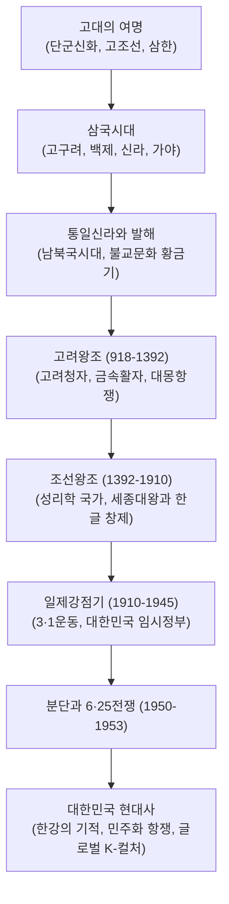

## 서론: 반도라는 지정학적 숙명과 불굴의 정체성

유라시아 대륙 동단, 대륙과 해양 세력이 교차하는 한반도의 역사는 수천 년간 거대한 외세의 침략과 압박 속에서 전개되었습니다. 그러나 한국사는 결코 수동적인 피지배의 역사가 아닙니다. 선조들은 끊임없는 국난 속에서도 주체적으로 문화를 발전시켜 고려청자, 팔만대장경, 세계 최초의 금속활자, 그리고 세계에서 가장 과학적인 표음문자인 **한글(훈민정음)**을 창제했습니다.

근현대에 이르러 식민지 지배와 한국전쟁의 폐허 속에서도 대한민국은 '한강의 기적'이라 불리는 눈부신 경제 성장과 피로 쟁취한 민주화를 달성했습니다. 오늘날 K-POP, K-무비, 첨단 반도체 등 세계를 선도하는 K-컬처의 저력은 바로 이 불굴의 역사적 역동성에 뿌리를 두고 있습니다.

## 1. 한반도의 여명과 고조선
연천 전곡리 아슐리안형 주먹도끼의 발견으로 구석기 문화가 입증되었으며, 빗살무늬토기와 전 세계 고인돌의 절반 이상이 밀집된 지석묘군은 청동기 시대의 권력 출현을 보여줍니다.
《삼국유사》에 기록된 **단군신화**는 환웅 집단과 곰 토템 부족의 결합을 상징하며, 기원전 2333년 고조선 건국으로 이어졌습니다. 고조선은 '범금팔조'의 엄격한 법률을 지녔으나 기원전 108년 한 무제의 침략으로 한사군이 설치되었고, 남부에서는 마한·진한·변한의 삼한 사회가 철기 문화를 발전시켰습니다.

## 2. 삼국시대와 가야
- **고구려**: 주몽이 건국한 북방의 강국으로, 광개토대왕과 장수왕 대에 만주와 한강 유역을 장악하고 살수대첩과 안시성 전투에서 수·당의 침략을 격퇴했습니다.
- **백제**: 한강 유역에서 발원하여 해상 무역을 장악하고 중국 남조 및 고대 일본(야마토)과 교류하며 불교와 선진 기술을 전파했습니다. 백제금동대향로는 그 예술적 극치입니다.
- **신라**: 골품제와 화랑도를 바탕으로 법흥왕·진흥왕 대에 한강 유역을 확보하고 삼국 통일의 기틀을 마련했습니다.

## 3. 통일신라와 고려왕조
신라는 나당동맹으로 백제(660)와 고구려(668)를 멸망시킨 뒤, 나당전쟁에서 당군을 몰아내고 676년 삼국 통일을 완수했습니다. 불국사, 석굴암, 장보고의 청해진 해상무역이 번영했으며, 북방에는 대조영이 고구려를 계승한 **발해**를 건국하여 남북국시대를 열었습니다.

918년 왕건이 건국한 **고려**는 과거제를 도입하고 불교를 국교로 삼았으며, 신비로운 비취색의 상감청자를 완성했습니다. 1234년 금속활자를 발명하고 해인사 팔만대장경을 판각하며 몽골 제국의 침략에 30년간 항전했습니다.

## 4. 조선왕조 오백년과 훈민정음 창제
1392년 이성계가 위화도 회군을 거쳐 건국한 조선은 성리학을 지도이념으로 삼고 한양(서울)으로 천도했습니다.
제4대 **세종대왕(재위 1418-1450)**은 집현전을 설치하고 측우기 등 과학 기구를 제작했으며, 1443년 백성을 지극히 사랑하는 마음으로 가장 과학적인 문자인 **훈민정음(한글)**을 창제했습니다. 16세기 말 임진왜란(1592-1598)에서는 삼도수군통제사 **이순신** 장군이 거북선과 탁월한 지략으로 해상을 장악하여 국난을 극복했습니다.

## 5. 근대의 격랑, 식민지배, 그리고 분단
19세기 말 서구 열강의 침략과 동학농민혁명, 청일전쟁을 거치며 1897년 대한제국이 선포되었으나 1910년 일제에 국권을 피탈당했습니다. 35년간의 가혹한 식민통치 속에서도 1919년 3·1운동과 대한민국 임시정부 수립을 통해 독립 투쟁을 이어갔습니다.
1945년 광복을 맞았으나 미소 냉전으로 38도선이 그어졌고, 1950년 발발한 **6·25전쟁**으로 강토는 폐허가 되었으며 휴전선(DMZ)으로 분단이 고착화되었습니다.

## 6. 한강의 기적, 민주화, 그리고 글로벌 K-컬처
전쟁의 잿더미 속에서 한국은 수출 주도형 경제 개발을 통해 세계 10위권의 경제 대국으로 도약하는 **'한강의 기적'**을 일궈냈습니다. 동시에 1980년 5·18 광주민주화운동과 1987년 6월 민주항쟁을 거치며 성숙한 민주주의를 확립했습니다.
21세기 오늘날, 반도체·배터리 등 첨단 산업과 BTS, 영화 《기생충》, 노벨문학상 수상자 한강으로 대표되는 **K-컬처**는 전 세계인의 마음을 사로잡으며 한국의 문화적 긍지를 드높이고 있습니다.
