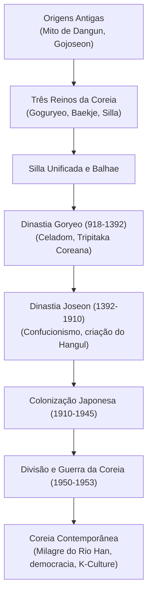

## Introdução: Destino Geopolítico e Resiliência Inabalável

Projetando-se na ponta leste da Eurásia, a Península Coreana viveu sob constantes pressões militares de grandes impérios. No entanto, o povo coreano transformou adversidades em conquistas culturais monumentais: o celadom de Goryeo, a prensa de tipos móveis de metal e o sistema fonético **Hangul**, projetado pelo Rei Sejong.

## 1. De Gojoseon aos Três Reinos
A tradição atribui a fundação de Gojoseon a Dangun em 2333 a.C. A península abriga a maior densidade de antas (dólmens) do planeta.
Mais tarde, despontaram três reinos:
- **Goguryeo**: Fortaleza militar nortista que rechaçou dinastias chinesas.
- **Baekje**: Reino marítimo que introduziu o budismo e a erudição clássica no Japão.
- **Silla**: Sociedade organizada pelo sistema *Golpum* e pelos guerreiros *Hwarang*, unificando a península em 676.

## 2. A Dinastia Goryeo (918–1392)
Fundada por Wang Geon, Goryeo originou a palavra ocidental «Coreia». Destacou-se pela porcelana celadom e pela impressão budista da *Tripitaka Coreana* a partir de mais de 80 mil matrizes de madeira no Templo Haeinsa.

## 3. A Dinastia Joseon (1392–1910)
Sediada em Hanyang (Seul), governou sob princípios neoconfucionistas. Sob o **Rei Sejong, o Grande** (1418–1450), a cultura atingiu seu apogeu com a criação do alfabeto **Hangul** em 1443. Na Guerra Imjin (1592–1598), o Almirante Yi Sun-sin defendeu a nação com seus lendários «Navios-Tartaruga» (*Geobukseon*).

## 4. Período Colonial e Guerra da Coreia
Anexada pelo Japão em 1910, a Coreia resistiu bravamente, culminando no Movimento de 1º de Março de 1919. Com o fim da Segunda Guerra, o país foi dividido no Paralelo 38. A devastadora **Guerra da Coreia (1950–1953)** resultou num armistício armado na Zona Desmilitarizada (DMZ).

## 5. O Milagre do Rio Han e a Onda K-Culture
Ressurgindo da miséria, a Coreia do Sul protagonizou uma rápida industrialização aliada a heroicas lutas democráticas (Gwangju em 1980 e junho de 1987). Hoje, desponta como potência tecnológica e epicentro da **K-Culture** mundial.
