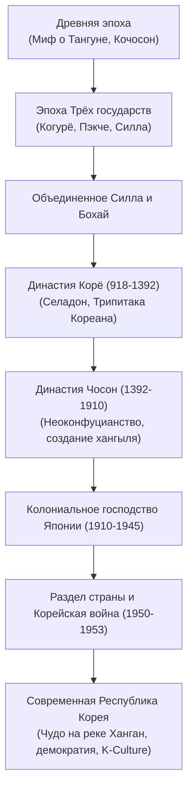

## Введение: Геополитический перекресток и стойкость духа

Корейский полуостров на протяжении тысячелетий служил ареной столкновения континентальных и морских держав. Несмотря на постоянную угрозу иноземных завоеваний, корейский народ создал самобытную цивилизацию, подарив миру селадон Корё, Трипитаку Кореана, металлический подвижный шрифт и уникальную фонетическую письменность — **хангыль**, созданную ваном Седжоном Великим.

## 1. От Древнего Чосона до Трёх государств
Согласно летописям, Древний Чосон (Кочосон) был основан Тангуном в 2333 году до н. э. На полуострове сосредоточено более половины всех мегалитических дольменов мира.
К I веку до н. э. сформировались Три государства:
- **Когурё**: Могущественное северное царство всадников, успешно отражавшее вторжения китайских династий Суй и Тан.
- **Пэкче**: Морская держава с утонченной культурой, передавшая буддизм и науки в древнюю Японию.
- **Силла**: Государство со строгой сословной системой «рангов кости» и корпусом юношей-воинов *хваранов*, объединившее полуостров в 676 году.

## 2. Династия Корё (918–1392)
Основанная Ван Гоном династия дала Корее ее современное международное название. Корё прославилось изумрудным селадоном, созданием деревянных печатных блоков *Трипитака Кореана* в храме Хэинса и изобретением металлического наборного шрифта.

## 3. Династия Чосон (1392–1910)
Ли Сонге основал Чосон со столицей в Ханьяне (Сеул), сделав основой государства неоконфуцианство. Золотой век наступил при **ване Седжоне Великом** (1418–1450), создавшем в 1443 году научный алфавит **хангыль**. Во время Имджинской войны (1592–1598) адмирал Ли Сунсин разгромил японский флот с помощью легендарных бронированных кораблей-черепах (*кобуксонов*).

## 4. Колониальный гнет и Корейская война
В 1910 году Япония аннексировала Корею. Освобождение в 1945 году обернулось трагедией раздела по 38-й параллели. Кровопролитная **Корейская война (1950–1953)** закрепила раскол нации, создав демилитаризованную зону (ДМЗ).

## 5. «Чудо на реке Ханган» и глобальный культурный триумф
Поднявшись из руин, Южная Корея совершила стремительный экономический рывок («чудо на реке Ханган») и добилась демократии (восстание в Кванджу 1980 г., Июньские протесты 1987 г.). Сегодня Корея — мировой лидер в области микроэлектроники и центр всемирного феномена **K-Culture** (K-Pop, кинематограф, литература).
