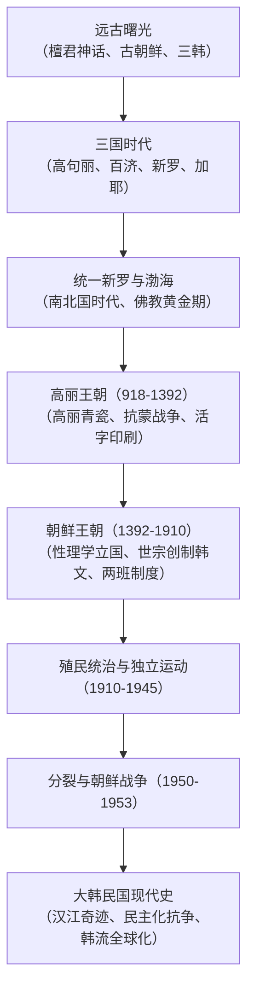

## 序论：半岛的地缘宿命与不屈的民族韧性

朝鲜半岛地处欧亚大陆东端，扼守大陆与海洋势力的交汇十字路口。数千年来，这片土地饱受北方游牧民族、中原帝国及海岛势力的多重撞击。

然而，半岛历史绝非单纯受制于大国的被动叙事。各王朝与人民在危机中主动吸收中原文明精华（汉字、儒学、佛教、律令），开创出独树一帜的文明成就：举世闻名的高丽青瓷、《高丽八万大藏经》雕版、早于西方两百余年的金属活字印刷术，以及世宗大王创制的科学表音文字——**谚文（韩文 / 训民正音）**。

进入近现代，历经沦为殖民地的苦难与朝鲜战争的焦土浩劫，大韩民国从废墟中创造了令世人惊叹的“汉江奇迹”，更以流血牺牲换取了坚固的民主制度。今天，从半导体尖端科技到席卷全球的韩流文化（K-Culture），半岛展现出震撼世界的强劲生命力。

## 第一章 半岛黎明与古朝鲜的崛起
在忠清南道公州石壮里与全谷里遗址发现了阿修尔型手斧。新石器时代的梳目文土器与青铜时代的琵琶形铜剑见证了文明的萌发；半岛集中了全球半数以上的古代巨石支石墓（高敞、和顺、江华岛世界遗产）。

《三国遗事》记载的**檀君神话**讲述了天帝之子桓雄与熊女结合生下檀君，于公元前2333年定都平壤建立古朝鲜。战国时期古朝鲜已拥有严明的“犯禁八条”。公元前108年汉武帝攻灭卫满朝鲜设立汉四郡；南部农耕社会则发展出马韩、辰韩、弁韩的**三韩**部落联盟。

## 第二章 三国时代与加耶诸国
- **高句丽**：由朱蒙建立于险峻山地的剽悍骑马民族政权。好太王与长寿王向南克汉城，向北威震满洲，并在萨水大捷与安市城战役中屡次击溃隋唐数十万远征军。
- **百济**：立足汉江与西南平原，拥有高度发达的造船与航海技术，向中国南朝汲取文化并向古代日本（大和政权）传授佛教、儒学与寺院营造技艺。
- **新罗**：发轫于庆州，依靠严苛的“骨品制”与文武兼备的青年精英组织“花郎道”，在真兴王时期夺取汉江出海口。

## 第三章 统一新罗与高丽王朝
新罗通过罗唐同盟于660年灭百济、668年灭高句丽，继而通过罗唐战争逐退唐朝驻军，于676年实现半岛首次内发性统一。佛国寺、石窟庵释迦牟尼佛及张保皋的海上贸易帝国彰显了盛唐同期的辉煌。同期高句丽遗民大祚荣在北方建立**渤海国**，形成“南北国时代”。

918年王建建立**高丽王朝**（“Korea”词源）。高丽确立科举制，将佛教立为国教，烧造出温润如玉的高丽镶嵌青瓷，并雕版完成八万余枚《高丽大藏经》。1234年发明金属活字印刷术，在江华岛坚持抵抗蒙古铁骑长达三十年。

## 第四章 朝鲜王朝（李氏朝鲜）五百年
1392年，李成桂发动“威化岛回军”建立朝鲜王朝，定都汉阳（首尔），确立程朱理学为国策，形成两班官僚体系。

第四代君主**世宗大王（1418-1450年在位）**开创黄金时代，设立集贤殿，发明测雨器、自击漏，并于1443年亲自创制兼具科学性与人道主义的表音文字——**训民正音（韩文）**。16世纪末，丰臣秀吉发动壬辰倭乱，水军统制使**李舜臣**将军以龟甲船和卓越战术切断日军补给线，与明朝援军及民间义兵共同保卫了半岛。

## 第五章 近代危机、殖民统治与国家分裂
19世纪末，面临列强叩关，朝鲜爆发东学农民革命并引发甲午中日战争。1897年高宗宣布建立大韩帝国，但最终于1910年被日本强行吞并。在三十五年殖民压迫下，三·一独立运动与上海大韩民国临时政府展现了不屈的独立意志。

1945年光复后，半岛因美苏冷战沿三八线分治。1950年爆发惨烈的**朝鲜战争**，造成数百万死伤，停战协定至今维持着非军事区（DMZ）的武装对峙。

## 第六章 汉江奇迹、民主化与21世纪韩流
战后极度贫困的韩国在朴正熙时代通过外向型重化工业战略实现了**“汉江奇迹”**。面对独裁统治，民众用鲜血换取民主：1980年光州民主化运动与1987年六月民主抗争最终确立了总统直选制。

进入21世纪，克服1997年亚洲金融风暴后，韩国成为全球半导体、动力电池与汽车工业重镇。以防弹少年团（BTS）、电影《寄生虫》以及诺贝尔文学奖得主韩江为代表的**K-Culture**风靡世界，谱写了半岛文明自我超越的辉煌篇章。
