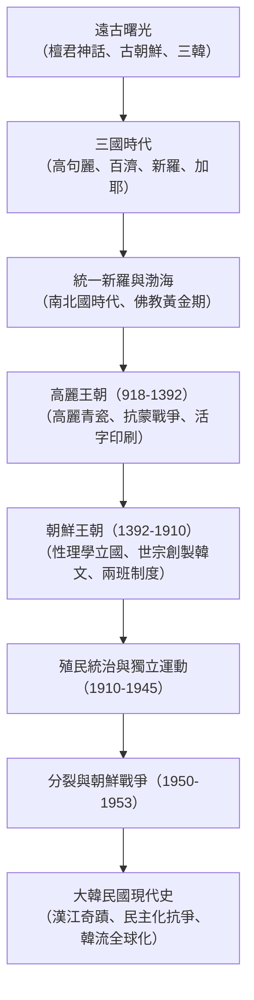

## 序論：半島的地緣宿命與不屈的民族韌性

朝鮮半島地處歐亞大陸東端，扼守大陸與海洋勢力的交匯十字路口。數千年來，這片土地飽受北方游牧民族、中原帝國及海島勢力的多重撞擊。

然而，半島歷史絕非單純受制於大國的被動敘事。各王朝與人民在危機中主動吸收中原文明精華（漢字、儒學、佛教、律令），開創出獨樹一幟的文明成就：舉世聞名的高麗青瓷、《高麗八萬大藏經》雕版、早於西方兩百餘年的金屬活字印刷術，以及世宗大王創製的科學表音文字——**諺文（韓文 / 訓民正音）**。

進入近現代，歷經淪為殖民地的苦難與朝鮮戰爭的焦土浩劫，大韓民國從廢墟中創造了令世人驚嘆的「漢江奇蹟」，更以流血犧牲換取了堅固的民主制度。今天，從半導體尖端科技到席捲全球的韓流文化（K-Culture），半島展現出震撼世界的強勁生命力。

## 第一章 半島黎明與古朝鮮的崛起
在忠清南道公州石壯里與全谷里遺址發現了阿修爾型手斧。新石器時代的梳目文土器與青銅時代的琵琶形銅劍見證了文明的萌發；半島集中了全球半數以上的古代巨石支石墓（高敞、和順、江華島世界遺產）。

《三國遺事》記載的**檀君神話**講述了天帝之子桓雄與熊女結合生下檀君，於公元前2333年定都平壤建立古朝鮮。戰國時期古朝鮮已擁有嚴明的「犯禁八條」。公元前108年漢武帝攻滅衛滿朝鮮設立漢四郡；南部農耕社會則發展出馬韓、辰韓、弁韓的**三韓**部落聯盟。

## 第二章 三國時代與加耶諸國
- **高句麗**：由朱蒙建立於險峻山地的剽悍騎馬民族政權。好太王與長壽王向南克漢城，向北威震滿洲，並在薩水大捷與安市城戰役中屢次擊潰隋唐數十萬遠征軍。
- **百濟**：立足漢江與西南平原，擁有高度發達的造船與航海技術，向中國南朝汲取文化並向古代日本（大和政權）傳授佛教、儒學與寺院營造技藝。
- **新羅**：發軔於慶州，依靠嚴苛的「骨品制」與文武兼備的青年精英組織「花郎道」，在真興王時期奪取漢江出海口。

## 第三章 統一新羅與高麗王朝
新羅通過羅唐同盟於660年滅百濟、668年滅高句麗，繼而通過羅唐戰爭逐退唐朝駐軍，於676年實現半島首次內發性統一。佛國寺、石窟庵釋迦牟尼佛及張保皋的海上貿易帝國彰顯了盛唐同期的輝煌。同期高句麗遺民大祚榮在北方建立**渤海國**，形成「南北國時代」。

918年王建建立**高麗王朝**（「Korea」詞源）。高麗確立科舉制，將佛教立為國教，燒造出溫潤如玉的高麗鑲嵌青瓷，並雕版完成八萬餘枚《高麗大藏經》。1234年發明金屬活字印刷術，在江華島堅持抵抗蒙古鐵騎長達三十年。

## 第四章 朝鮮王朝（李氏朝鮮）五百年
1392年，李成桂發動「威化島回軍」建立朝鮮王朝，定都漢陽（首爾），確立程朱理學為國策，形成兩班官僚體系。

第四代君主**世宗大王（1418-1450年在位）**開創黃金時代，設立集賢殿，發明測雨器、自擊漏，並於1443年親自創製兼具科學性與人道主義的表音文字——**訓民正音（韓文）**。16世紀末，豐臣秀吉發動壬辰倭亂，水軍統制使**李舜臣**將軍以龜甲船和卓越戰術切斷日軍補給線，與明朝援軍及民間義兵共同保衛了半島。

## 第五章 近代危機、殖民統治與國家分裂
19世紀末，面臨列強叩關，朝鮮爆發東學農民革命並引發甲午中日戰爭。1897年高宗宣布建立大韓帝國，但最終於1910年被日本強行吞併。在三十五年殖民壓迫下，三·一獨立運動與上海大韓民國臨時政府展現了不屈的獨立意志。

1945年光復後，半島因美蘇冷戰沿三八線分治。1950年爆發慘烈的**朝鮮戰爭**，造成數百萬死傷，停戰協定至今維持著非軍事區（DMZ）的武裝對峙。

## 第六章 漢江奇蹟、民主化與21世紀韓流
戰後極度貧困的韓國在朴正熙時代通過外向型重化工業戰略實現了**「漢江奇蹟」**。面對獨裁統治，民眾用鮮血換取民主：1980年光州民主化運動與1987年六月民主抗爭最終確立了總統直選制。

進入21世紀，克服1997年亞洲金融風暴後，韓國成為全球半導體、動力電池與汽車工業重鎮。以防彈少年團（BTS）、電影《寄生上流》以及諾貝爾文學獎得主韓江為代表的**K-Culture**風靡世界，譜寫了半島文明自我超越的輝煌篇章。
