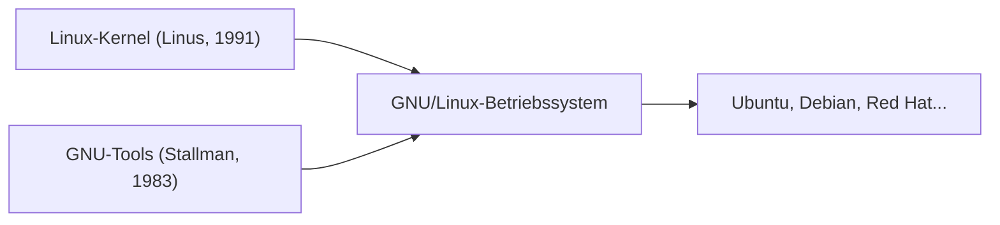

## 1. Linus Torvalds' Hobby
Im Jahr 1991 veröffentlichte der finnische Student Linus Torvalds einen UNIX-ähnlichen Betriebssystem-Kernel für PCs mit der Nachricht: „Es ist nur ein Hobby, nicht groß und professionell“.

## 2. Fusion mit dem GNU-Projekt
Durch die Kombination des Linux-Kernels mit verschiedenen Werkzeugen des „GNU-Projekts“, einem von Richard Stallman vorangetriebenen Projekt für freie Software, wurde das vollständige Betriebssystem „GNU/Linux“ fertiggestellt.

## 3. Infrastruktur zur Unterstützung des Internets
Durch die Verbreitung von Apache, MySQL und PHP (LAMP-Stack) wurde Linux als kostenloses und robustes Server-Betriebssystem zum De-facto-Standard für Webserver im Internet.

## 4. Als Grundlage von Android
Heute wird der Linux-Kernel auch als Grundlage für das Smartphone-Betriebssystem Android verwendet und ist damit das am weitesten verbreitete Betriebssystem in der Geschichte der Menschheit.

## Zusätzlicher Technik-Testteil 1

## Zusätzlicher Technik-Testteil 2

## Zusätzlicher Technik-Testteil 3

## Zusätzlicher Technik-Testteil 4

## Zusätzlicher Technik-Testteil 5

## Zusätzlicher Technik-Testteil 6

## Zusätzlicher Technik-Testteil 7

## Zusätzlicher Technik-Testteil 8

## Zusätzlicher Technik-Testteil 9

## Zusätzlicher Technik-Testteil 10

## Zusätzlicher Technik-Testteil 11

## Zusätzlicher Technik-Testteil 12

## Zusätzlicher Technik-Testteil 13

## Zusätzlicher Technik-Testteil 14

