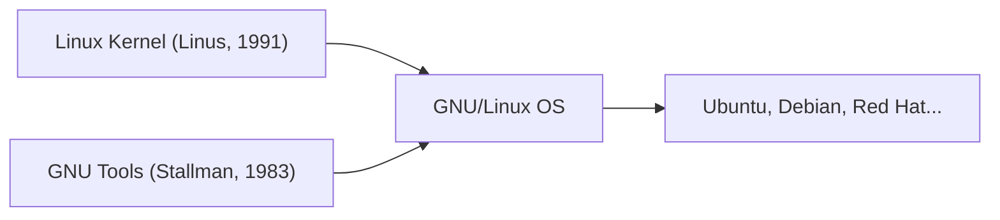

## 1. Linus Torvalds's Hobby
In 1991, Finnish student Linus Torvalds released a UNIX-like OS kernel for PCs with the message, "just a hobby, won't be big and professional."

## 2. Fusion with the GNU Project
By combining the Linux kernel with various tools from the "GNU Project," a free software initiative promoted by Richard Stallman, the complete OS "GNU/Linux" was completed.

## 3. Becoming the Infrastructure of the Internet
With the spread of Apache, MySQL, and PHP (LAMP stack), Linux became the de facto standard for Web servers on the Internet as a free and robust server OS.

## 4. As the Foundation of Android
Currently, the Linux kernel is also adopted as the foundation for the smartphone OS Android, making it the most widely used OS in human history.

