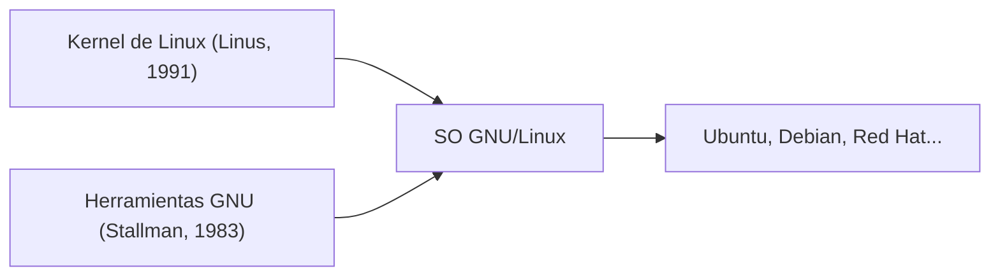

## 1. El pasatiempo de Linus Torvalds
En 1991, el estudiante finlandés Linus Torvalds publicó un kernel de sistema operativo tipo UNIX para PC con el mensaje: "Es solo un pasatiempo, no será nada grande ni profesional".

## 2. Fusión con el proyecto GNU
Al combinar las diversas herramientas del "Proyecto GNU" de software libre impulsado por Richard Stallman con el kernel de Linux, se completó el sistema operativo completo "GNU/Linux".

## 3. Hacia una infraestructura que respalda Internet
Con la popularización de Apache, MySQL y PHP (pila LAMP), Linux se convirtió en el estándar de facto para servidores web en Internet como un sistema operativo de servidor robusto y gratuito.

## 4. Como base de Android
En la actualidad, el kernel de Linux también se ha adoptado como base de Android, el sistema operativo para teléfonos inteligentes, convirtiéndose en el sistema operativo más extendido en la historia de la humanidad.

## Parte de verificación técnica adicional 1

## Parte de verificación técnica adicional 2

## Parte de verificación técnica adicional 3

## Parte de verificación técnica adicional 4

## Parte de verificación técnica adicional 5

## Parte de verificación técnica adicional 6

## Parte de verificación técnica adicional 7

## Parte de verificación técnica adicional 8

## Parte de verificación técnica adicional 9

## Parte de verificación técnica adicional 10

## Parte de verificación técnica adicional 11

## Parte de verificación técnica adicional 12

## Parte de verificación técnica adicional 13

## Parte de verificación técnica adicional 14

