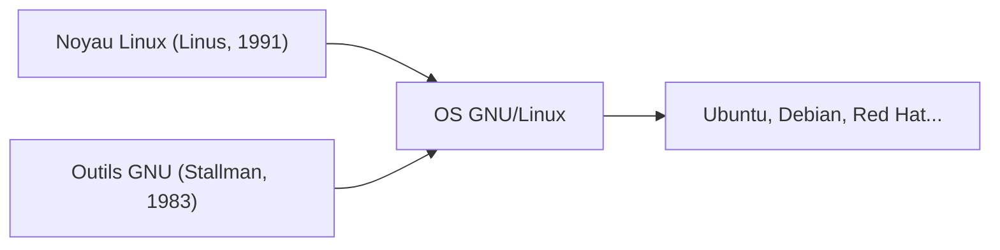

## 1. Le passe-temps de Linus Torvalds
En 1991, l'étudiant finlandais Linus Torvalds a publié un noyau de système d'exploitation de type UNIX pour PC, accompagné du message : « C'est juste un passe-temps, ce n'est pas professionnel. »

## 2. Fusion avec le projet GNU
En combinant les divers outils du « projet GNU », un projet de logiciel libre promu par Richard Stallman, avec le noyau Linux, le système d'exploitation complet « GNU/Linux » a été achevé.

## 3. Vers l'infrastructure qui soutient Internet
Avec la popularisation d'Apache, MySQL et PHP (la pile LAMP), Linux est devenu le standard de facto pour les serveurs Web sur Internet en tant que système d'exploitation serveur gratuit et robuste.

## 4. Comme base d'Android
Actuellement, le noyau Linux est également adopté comme base pour le système d'exploitation de smartphone Android, ce qui en fait le système d'exploitation le plus répandu dans l'histoire de l'humanité.

## Partie de vérification technique supplémentaire 1

## Partie de vérification technique supplémentaire 2

## Partie de vérification technique supplémentaire 3

## Partie de vérification technique supplémentaire 4

## Partie de vérification technique supplémentaire 5

## Partie de vérification technique supplémentaire 6

## Partie de vérification technique supplémentaire 7

## Partie de vérification technique supplémentaire 8

## Partie de vérification technique supplémentaire 9

## Partie de vérification technique supplémentaire 10

## Partie de vérification technique supplémentaire 11

## Partie de vérification technique supplémentaire 12

## Partie de vérification technique supplémentaire 13

## Partie de vérification technique supplémentaire 14

