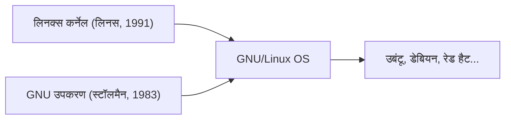

## 1. लिनस टोरवाल्ड्स का शौक
1991 में, फ़िनलैंड के एक छात्र लिनस टोरवाल्ड्स ने इस संदेश के साथ पीसी के लिए एक UNIX-जैसा OS कर्नेल जारी किया, "यह सिर्फ एक शौक है। पेशेवर स्तर का नहीं।"

## 2. GNU प्रोजेक्ट के साथ एकीकरण
रिचर्ड स्टॉलमैन द्वारा प्रचारित मुक्त सॉफ्टवेयर "GNU प्रोजेक्ट" के विभिन्न उपकरणों और लिनक्स कर्नेल को मिलाकर एक संपूर्ण OS "GNU/Linux" पूरा किया गया।

## 3. इंटरनेट का समर्थन करने वाले बुनियादी ढांचे की ओर
अपाचे, MySQL, और PHP (LAMP स्टैक) के प्रसार के साथ, लिनक्स इंटरनेट पर वेब सर्वर के लिए एक मुफ्त और मजबूत सर्वर OS के रूप में वास्तविक मानक बन गया।

## 4. एंड्रॉइड की नींव के रूप में
वर्तमान में, लिनक्स कर्नेल को स्मार्टफोन OS एंड्रॉइड की नींव के रूप में भी अपनाया गया है, जो इसे मानव इतिहास में सबसे व्यापक रूप से उपयोग किया जाने वाला OS बनाता है।

## अतिरिक्त तकनीकी सत्यापन भाग 1

## अतिरिक्त तकनीकी सत्यापन भाग 2

## अतिरिक्त तकनीकी सत्यापन भाग 3

## अतिरिक्त तकनीकी सत्यापन भाग 4

## अतिरिक्त तकनीकी सत्यापन भाग 5

## अतिरिक्त तकनीकी सत्यापन भाग 6

## अतिरिक्त तकनीकी सत्यापन भाग 7

## अतिरिक्त तकनीकी सत्यापन भाग 8

## अतिरिक्त तकनीकी सत्यापन भाग 9

## अतिरिक्त तकनीकी सत्यापन भाग 10

## अतिरिक्त तकनीकी सत्यापन भाग 11

## अतिरिक्त तकनीकी सत्यापन भाग 12

## अतिरिक्त तकनीकी सत्यापन भाग 13

## अतिरिक्त तकनीकी सत्यापन भाग 14

