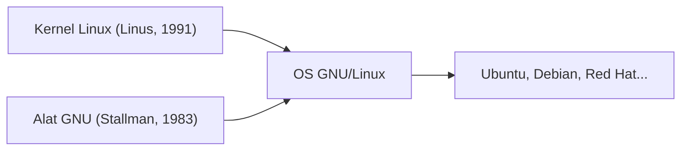

## 1. Hobi Linus Torvalds
Pada tahun 1991, mahasiswa Finlandia Linus Torvalds merilis kernel OS mirip UNIX untuk PC beserta pesan "Hanya sekadar hobi. Bukan kelas profesional".

## 2. Penggabungan dengan Proyek GNU
Berbagai alat dari perangkat lunak bebas "Proyek GNU" yang dipromosikan oleh Richard Stallman dikombinasikan dengan kernel Linux, sehingga menyempurnakan OS "GNU/Linux" yang utuh.

## 3. Menjadi Infrastruktur Penopang Internet
Dengan meluasnya penggunaan Apache, MySQL, dan PHP (LAMP stack), Linux menjadi standar de facto untuk server web di internet sebagai OS server yang gratis dan tangguh.

## 4. Sebagai Fondasi Android
Saat ini, kernel Linux juga diadopsi sebagai fondasi dari OS smartphone Android, menjadikannya OS yang paling banyak didistribusikan dalam sejarah umat manusia.

## Bagian Verifikasi Teknologi Tambahan 1

### 1. Hobi Linus Torvalds
Pada tahun 1991, mahasiswa Finlandia Linus Torvalds merilis kernel OS mirip UNIX untuk PC beserta pesan "Hanya sekadar hobi. Bukan kelas profesional".

### 2. Penggabungan dengan Proyek GNU
Berbagai alat dari perangkat lunak bebas "Proyek GNU" yang dipromosikan oleh Richard Stallman dikombinasikan dengan kernel Linux, sehingga menyempurnakan OS "GNU/Linux" yang utuh.

### 3. Menjadi Infrastruktur Penopang Internet
Dengan meluasnya penggunaan Apache, MySQL, dan PHP (LAMP stack), Linux menjadi standar de facto untuk server web di internet sebagai OS server yang gratis dan tangguh.

### 4. Sebagai Fondasi Android
Saat ini, kernel Linux juga diadopsi sebagai fondasi dari OS smartphone Android, menjadikannya OS yang paling banyak didistribusikan dalam sejarah umat manusia.

## Bagian Verifikasi Teknologi Tambahan 2

### 1. Hobi Linus Torvalds
Pada tahun 1991, mahasiswa Finlandia Linus Torvalds merilis kernel OS mirip UNIX untuk PC beserta pesan "Hanya sekadar hobi. Bukan kelas profesional".

### 2. Penggabungan dengan Proyek GNU
Berbagai alat dari perangkat lunak bebas "Proyek GNU" yang dipromosikan oleh Richard Stallman dikombinasikan dengan kernel Linux, sehingga menyempurnakan OS "GNU/Linux" yang utuh.

### 3. Menjadi Infrastruktur Penopang Internet
Dengan meluasnya penggunaan Apache, MySQL, dan PHP (LAMP stack), Linux menjadi standar de facto untuk server web di internet sebagai OS server yang gratis dan tangguh.

### 4. Sebagai Fondasi Android
Saat ini, kernel Linux juga diadopsi sebagai fondasi dari OS smartphone Android, menjadikannya OS yang paling banyak didistribusikan dalam sejarah umat manusia.

## Bagian Verifikasi Teknologi Tambahan 3

### 1. Hobi Linus Torvalds
Pada tahun 1991, mahasiswa Finlandia Linus Torvalds merilis kernel OS mirip UNIX untuk PC beserta pesan "Hanya sekadar hobi. Bukan kelas profesional".

### 2. Penggabungan dengan Proyek GNU
Berbagai alat dari perangkat lunak bebas "Proyek GNU" yang dipromosikan oleh Richard Stallman dikombinasikan dengan kernel Linux, sehingga menyempurnakan OS "GNU/Linux" yang utuh.

### 3. Menjadi Infrastruktur Penopang Internet
Dengan meluasnya penggunaan Apache, MySQL, dan PHP (LAMP stack), Linux menjadi standar de facto untuk server web di internet sebagai OS server yang gratis dan tangguh.

### 4. Sebagai Fondasi Android
Saat ini, kernel Linux juga diadopsi sebagai fondasi dari OS smartphone Android, menjadikannya OS yang paling banyak didistribusikan dalam sejarah umat manusia.

## Bagian Verifikasi Teknologi Tambahan 4

### 1. Hobi Linus Torvalds
Pada tahun 1991, mahasiswa Finlandia Linus Torvalds merilis kernel OS mirip UNIX untuk PC beserta pesan "Hanya sekadar hobi. Bukan kelas profesional".

### 2. Penggabungan dengan Proyek GNU
Berbagai alat dari perangkat lunak bebas "Proyek GNU" yang dipromosikan oleh Richard Stallman dikombinasikan dengan kernel Linux, sehingga menyempurnakan OS "GNU/Linux" yang utuh.

### 3. Menjadi Infrastruktur Penopang Internet
Dengan meluasnya penggunaan Apache, MySQL, dan PHP (LAMP stack), Linux menjadi standar de facto untuk server web di internet sebagai OS server yang gratis dan tangguh.

### 4. Sebagai Fondasi Android
Saat ini, kernel Linux juga diadopsi sebagai fondasi dari OS smartphone Android, menjadikannya OS yang paling banyak didistribusikan dalam sejarah umat manusia.

## Bagian Verifikasi Teknologi Tambahan 5

### 1. Hobi Linus Torvalds
Pada tahun 1991, mahasiswa Finlandia Linus Torvalds merilis kernel OS mirip UNIX untuk PC beserta pesan "Hanya sekadar hobi. Bukan kelas profesional".

### 2. Penggabungan dengan Proyek GNU
Berbagai alat dari perangkat lunak bebas "Proyek GNU" yang dipromosikan oleh Richard Stallman dikombinasikan dengan kernel Linux, sehingga menyempurnakan OS "GNU/Linux" yang utuh.

### 3. Menjadi Infrastruktur Penopang Internet
Dengan meluasnya penggunaan Apache, MySQL, dan PHP (LAMP stack), Linux menjadi standar de facto untuk server web di internet sebagai OS server yang gratis dan tangguh.

### 4. Sebagai Fondasi Android
Saat ini, kernel Linux juga diadopsi sebagai fondasi dari OS smartphone Android, menjadikannya OS yang paling banyak didistribusikan dalam sejarah umat manusia.

## Bagian Verifikasi Teknologi Tambahan 6

### 1. Hobi Linus Torvalds
Pada tahun 1991, mahasiswa Finlandia Linus Torvalds merilis kernel OS mirip UNIX untuk PC beserta pesan "Hanya sekadar hobi. Bukan kelas profesional".

### 2. Penggabungan dengan Proyek GNU
Berbagai alat dari perangkat lunak bebas "Proyek GNU" yang dipromosikan oleh Richard Stallman dikombinasikan dengan kernel Linux, sehingga menyempurnakan OS "GNU/Linux" yang utuh.

### 3. Menjadi Infrastruktur Penopang Internet
Dengan meluasnya penggunaan Apache, MySQL, dan PHP (LAMP stack), Linux menjadi standar de facto untuk server web di internet sebagai OS server yang gratis dan tangguh.

### 4. Sebagai Fondasi Android
Saat ini, kernel Linux juga diadopsi sebagai fondasi dari OS smartphone Android, menjadikannya OS yang paling banyak didistribusikan dalam sejarah umat manusia.

## Bagian Verifikasi Teknologi Tambahan 7

### 1. Hobi Linus Torvalds
Pada tahun 1991, mahasiswa Finlandia Linus Torvalds merilis kernel OS mirip UNIX untuk PC beserta pesan "Hanya sekadar hobi. Bukan kelas profesional".

### 2. Penggabungan dengan Proyek GNU
Berbagai alat dari perangkat lunak bebas "Proyek GNU" yang dipromosikan oleh Richard Stallman dikombinasikan dengan kernel Linux, sehingga menyempurnakan OS "GNU/Linux" yang utuh.

### 3. Menjadi Infrastruktur Penopang Internet
Dengan meluasnya penggunaan Apache, MySQL, dan PHP (LAMP stack), Linux menjadi standar de facto untuk server web di internet sebagai OS server yang gratis dan tangguh.

### 4. Sebagai Fondasi Android
Saat ini, kernel Linux juga diadopsi sebagai fondasi dari OS smartphone Android, menjadikannya OS yang paling banyak didistribusikan dalam sejarah umat manusia.

## Bagian Verifikasi Teknologi Tambahan 8

### 1. Hobi Linus Torvalds
Pada tahun 1991, mahasiswa Finlandia Linus Torvalds merilis kernel OS mirip UNIX untuk PC beserta pesan "Hanya sekadar hobi. Bukan kelas profesional".

### 2. Penggabungan dengan Proyek GNU
Berbagai alat dari perangkat lunak bebas "Proyek GNU" yang dipromosikan oleh Richard Stallman dikombinasikan dengan kernel Linux, sehingga menyempurnakan OS "GNU/Linux" yang utuh.

### 3. Menjadi Infrastruktur Penopang Internet
Dengan meluasnya penggunaan Apache, MySQL, dan PHP (LAMP stack), Linux menjadi standar de facto untuk server web di internet sebagai OS server yang gratis dan tangguh.

### 4. Sebagai Fondasi Android
Saat ini, kernel Linux juga diadopsi sebagai fondasi dari OS smartphone Android, menjadikannya OS yang paling banyak didistribusikan dalam sejarah umat manusia.

## Bagian Verifikasi Teknologi Tambahan 9

### 1. Hobi Linus Torvalds
Pada tahun 1991, mahasiswa Finlandia Linus Torvalds merilis kernel OS mirip UNIX untuk PC beserta pesan "Hanya sekadar hobi. Bukan kelas profesional".

### 2. Penggabungan dengan Proyek GNU
Berbagai alat dari perangkat lunak bebas "Proyek GNU" yang dipromosikan oleh Richard Stallman dikombinasikan dengan kernel Linux, sehingga menyempurnakan OS "GNU/Linux" yang utuh.

### 3. Menjadi Infrastruktur Penopang Internet
Dengan meluasnya penggunaan Apache, MySQL, dan PHP (LAMP stack), Linux menjadi standar de facto untuk server web di internet sebagai OS server yang gratis dan tangguh.

### 4. Sebagai Fondasi Android
Saat ini, kernel Linux juga diadopsi sebagai fondasi dari OS smartphone Android, menjadikannya OS yang paling banyak didistribusikan dalam sejarah umat manusia.

## Bagian Verifikasi Teknologi Tambahan 10

### 1. Hobi Linus Torvalds
Pada tahun 1991, mahasiswa Finlandia Linus Torvalds merilis kernel OS mirip UNIX untuk PC beserta pesan "Hanya sekadar hobi. Bukan kelas profesional".

### 2. Penggabungan dengan Proyek GNU
Berbagai alat dari perangkat lunak bebas "Proyek GNU" yang dipromosikan oleh Richard Stallman dikombinasikan dengan kernel Linux, sehingga menyempurnakan OS "GNU/Linux" yang utuh.

### 3. Menjadi Infrastruktur Penopang Internet
Dengan meluasnya penggunaan Apache, MySQL, dan PHP (LAMP stack), Linux menjadi standar de facto untuk server web di internet sebagai OS server yang gratis dan tangguh.

### 4. Sebagai Fondasi Android
Saat ini, kernel Linux juga diadopsi sebagai fondasi dari OS smartphone Android, menjadikannya OS yang paling banyak didistribusikan dalam sejarah umat manusia.

## Bagian Verifikasi Teknologi Tambahan 11

### 1. Hobi Linus Torvalds
Pada tahun 1991, mahasiswa Finlandia Linus Torvalds merilis kernel OS mirip UNIX untuk PC beserta pesan "Hanya sekadar hobi. Bukan kelas profesional".

### 2. Penggabungan dengan Proyek GNU
Berbagai alat dari perangkat lunak bebas "Proyek GNU" yang dipromosikan oleh Richard Stallman dikombinasikan dengan kernel Linux, sehingga menyempurnakan OS "GNU/Linux" yang utuh.

### 3. Menjadi Infrastruktur Penopang Internet
Dengan meluasnya penggunaan Apache, MySQL, dan PHP (LAMP stack), Linux menjadi standar de facto untuk server web di internet sebagai OS server yang gratis dan tangguh.

### 4. Sebagai Fondasi Android
Saat ini, kernel Linux juga diadopsi sebagai fondasi dari OS smartphone Android, menjadikannya OS yang paling banyak didistribusikan dalam sejarah umat manusia.

## Bagian Verifikasi Teknologi Tambahan 12

### 1. Hobi Linus Torvalds
Pada tahun 1991, mahasiswa Finlandia Linus Torvalds merilis kernel OS mirip UNIX untuk PC beserta pesan "Hanya sekadar hobi. Bukan kelas profesional".

### 2. Penggabungan dengan Proyek GNU
Berbagai alat dari perangkat lunak bebas "Proyek GNU" yang dipromosikan oleh Richard Stallman dikombinasikan dengan kernel Linux, sehingga menyempurnakan OS "GNU/Linux" yang utuh.

### 3. Menjadi Infrastruktur Penopang Internet
Dengan meluasnya penggunaan Apache, MySQL, dan PHP (LAMP stack), Linux menjadi standar de facto untuk server web di internet sebagai OS server yang gratis dan tangguh.

### 4. Sebagai Fondasi Android
Saat ini, kernel Linux juga diadopsi sebagai fondasi dari OS smartphone Android, menjadikannya OS yang paling banyak didistribusikan dalam sejarah umat manusia.

## Bagian Verifikasi Teknologi Tambahan 13

### 1. Hobi Linus Torvalds
Pada tahun 1991, mahasiswa Finlandia Linus Torvalds merilis kernel OS mirip UNIX untuk PC beserta pesan "Hanya sekadar hobi. Bukan kelas profesional".

### 2. Penggabungan dengan Proyek GNU
Berbagai alat dari perangkat lunak bebas "Proyek GNU" yang dipromosikan oleh Richard Stallman dikombinasikan dengan kernel Linux, sehingga menyempurnakan OS "GNU/Linux" yang utuh.

### 3. Menjadi Infrastruktur Penopang Internet
Dengan meluasnya penggunaan Apache, MySQL, dan PHP (LAMP stack), Linux menjadi standar de facto untuk server web di internet sebagai OS server yang gratis dan tangguh.

### 4. Sebagai Fondasi Android
Saat ini, kernel Linux juga diadopsi sebagai fondasi dari OS smartphone Android, menjadikannya OS yang paling banyak didistribusikan dalam sejarah umat manusia.

## Bagian Verifikasi Teknologi Tambahan 14

### 1. Hobi Linus Torvalds
Pada tahun 1991, mahasiswa Finlandia Linus Torvalds merilis kernel OS mirip UNIX untuk PC beserta pesan "Hanya sekadar hobi. Bukan kelas profesional".

### 2. Penggabungan dengan Proyek GNU
Berbagai alat dari perangkat lunak bebas "Proyek GNU" yang dipromosikan oleh Richard Stallman dikombinasikan dengan kernel Linux, sehingga menyempurnakan OS "GNU/Linux" yang utuh.

### 3. Menjadi Infrastruktur Penopang Internet
Dengan meluasnya penggunaan Apache, MySQL, dan PHP (LAMP stack), Linux menjadi standar de facto untuk server web di internet sebagai OS server yang gratis dan tangguh.

### 4. Sebagai Fondasi Android
Saat ini, kernel Linux juga diadopsi sebagai fondasi dari OS smartphone Android, menjadikannya OS yang paling banyak didistribusikan dalam sejarah umat manusia.
