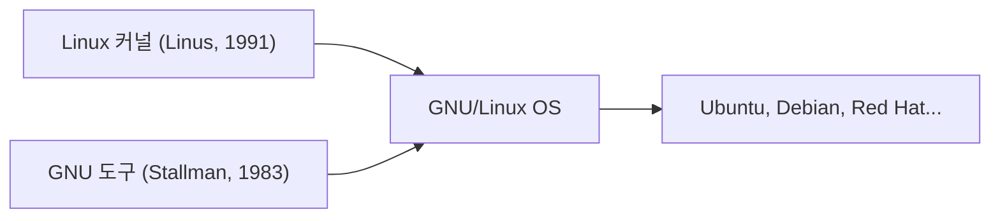

## 1. 리누스 토발즈의 취미
1991년, 핀란드의 학생 리누스 토발즈가 "단지 취미일 뿐이야. 전문가 수준은 아니야"라는 메시지와 함께, PC용 UNIX 계열 OS 커널을 공개했습니다.

## 2. GNU 프로젝트와의 융합
리처드 스톨먼이 추진하던 자유 소프트웨어인 "GNU 프로젝트"의 각종 도구와, Linux 커널이 결합함으로써, 완전한 OS "GNU/Linux"가 완성되었습니다.

## 3. 인터넷을 지탱하는 인프라로
Apache나 MySQL, PHP(LAMP 스택)의 보급으로 인해, Linux는 무료이고 견고한 서버 OS로서, 인터넷상의 Web 서버의 사실상 표준이 되었습니다.

## 4. Android의 기반으로서
현재, Linux 커널은 스마트폰 OS인 Android의 기반으로도 채택되어 있으며, 인류 역사상 가장 널리 보급된 OS가 되었습니다.

## 추가 기술 검증 파트 1

## 추가 기술 검증 파트 2

## 추가 기술 검증 파트 3

## 추가 기술 검증 파트 4

## 추가 기술 검증 파트 5

## 추가 기술 검증 파트 6

## 추가 기술 검증 파트 7

## 추가 기술 검증 파트 8

## 추가 기술 검증 파트 9

## 추가 기술 검증 파트 10

## 추가 기술 검증 파트 11

## 추가 기술 검증 파트 12

## 추가 기술 검증 파트 13

## 추가 기술 검증 파트 14

