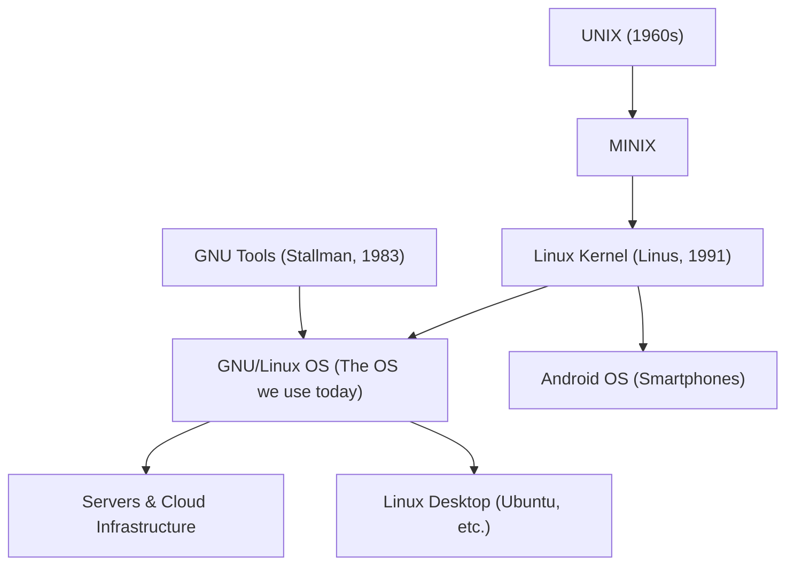

## 1. 導入：現代社会を支える不可視の巨人

私たちが日々利用しているインターネット上のウェブサービス、手元のスマートフォン（Android）、さらには最新のスーパーコンピューターから家電製品、自動車の制御システムに至るまで、ありとあらゆる場所に潜み、稼働し続けているOSがあります。それが「Linux（リナックス）」です。

Linuxは、特定の企業が莫大な資金を投じて開発したクローズドなソフトウェアではありません。一人のフィンランド人学生の「趣味」から始まり、インターネットを通じて世界中のハッカー（優れたプログラマー）たちが協力し合いながら作り上げた、人類の共有財産とも言えるオープンソースソフトウェアの結晶です。

この記事では、Linuxがどのようにして誕生し、なぜここまで世界を席巻するに至ったのか、その歴史とオープンソース革命の軌跡を詳しく辿っていきます。

## 2. 黎明期：UNIXとGNUプロジェクト

Linuxの誕生を語る上で欠かせないのが、「UNIX（ユニックス）」と「GNU（グヌー）プロジェクト」という二つの大きな潮流です。

### UNIXの誕生と商業化
1960年代後半、AT&Tのベル研究所で開発されたUNIXは、シンプルで洗練された設計思想を持ち、大学や研究機関を中心に広く普及しました。当初、UNIXのソースコードは比較的緩い条件で大学等に提供されていましたが、1980年代に入るとAT&TはUNIXの商業化を推し進め、ライセンス条件を厳格化しました。これにより、研究者やプログラマーたちが自由にソースコードを読んだり、改変して共有したりすることが困難になっていきました。

### リチャード・ストールマンとGNUプロジェクト
この状況に危機感を抱き、激しく反発したのが、MIT（マサチューセッツ工科大学）のプログラマー、リチャード・ストールマン（Richard Stallman）です。「ソフトウェアは共有されるべきであり、自由に改変・再配布できるべきである」という「フリーソフトウェア」の理念を掲げたストールマンは、1983年にUNIX互換の完全なフリーOSを作るための「GNUプロジェクト」を立ち上げました。

1980年代後半にかけて、GNUプロジェクトはコンパイラ（GCC）、エディタ（Emacs）、シェル（Bash）など、OSを構成するために必要な多くの重要なツールキットを開発・公開していきました。しかし、OSの中核となる「カーネル（Hurdと呼ばれる）」の開発だけは難航し、長らく完成しないまま月日が流れていました。「体（ツール）は完成しているのに、心臓（カーネル）がない」――これが、1990年代初頭のGNUプロジェクトの状況でした。

## 3. 1991年：一人の学生の「趣味」からの始まり

1991年、フィンランドのヘルシンキ大学の学生だったリーナス・トーバルズ（Linus Torvalds）は、自身の新しいIntel 386搭載パソコンで動くOSに不満を抱いていました。当時、教育用として広く使われていた「MINIX（ミニックス）」というUNIXライクなOSがありましたが、機能に制限が多く、改変の自由も限られていました。

そこでリーナスは、「自分のPCで快適に動く、MINIXライクな端末エミュレータ（のちのOSカーネル）」を自作し始めます。1991年8月25日、彼はインターネット上のニュースグループ（comp.os.minix）に次のような伝説的なメッセージを投稿しました。

> 「みなさん、こんにちは。私は386(486) AT互換機用のフリーなオペレーティングシステムを開発しています（ただの趣味です。GNUのようなプロ級の巨大なものではありません）。4月頃から作り始めて、そろそろ形になりつつあります。MINIXの好きなところ、嫌いなところについての意見を聞かせてください…」

この「単なる趣味」として始まったプロジェクトこそが、後に世界を覆い尽くすLinuxカーネルの産声でした。リーナスは初期バージョン（0.01）のソースコードを公開し、世界中のプログラマーにフィードバックを求めました。

## 4. GNU/Linuxの誕生：パズルのピースが組み合わさる

リーナスが公開したLinuxカーネルは、驚くべきスピードで進化していきました。インターネットを通じて世界中のプログラマーがソースコードを読み、バグを修正し、新しいデバイスドライバや機能を追加してリーナスに送り返す（パッチを送る）という、前代未聞の開発スタイルが自然発生的に形成されたのです。

そして、ここで歴史的な融合が起こります。リーナスが開発した「カーネル」の上で、ストールマンのGNUプロジェクトが開発していた「コンパイラやシェルなどのツール群」が完璧に動作したのです。

GNUプロジェクトには「心臓（カーネル）」がなく、リーナスには「体（周辺ツール）」がありませんでした。この両者が組み合わさることで、実用的な完全なフリーOSがついに誕生しました。厳密には、私たちが普段「Linux」と呼んでいるOSは「GNU/Linux」と呼称すべきものですが、一般的には一括りに「Linux」として定着しています。

## 5. オープンソースと伽藍とバザール

Linuxの開発スタイルは、当時のソフトウェア工学の常識を覆すものでした。従来、高品質なソフトウェアを作るためには、少数の選ばれた専門家が中央集権的に計画し、時間をかけて開発する「伽藍（がらん：壮大な大聖堂）」のようなアプローチが必須だと考えられていました（商用OSやWindows、そしてGNUのHurdカーネルもこれに近い手法でした）。

しかしLinuxは、誰でも参加できるオープンな市場のような「バザール」方式で開発されました。「早めにリリースし、頻繁にリリースする」「目玉の数さえ十分なら、どんなバグも深刻ではない（リーヌスの法則）」という哲学のもと、世界中に散らばる無数のボランティアが非中央集権的に開発を進めました。

この驚異的な開発モデルを分析し、「伽藍とバザール（The Cathedral and the Bazaar）」というエッセイにまとめたのがエリック・レイモンドです。このエッセイは、「オープンソース」という言葉と概念を世に広め、後のソフトウェア産業全体に絶大な影響を与えました。Netscape社が自社のブラウザのソースコードを公開（後のMozilla、Firefoxへ繋がる）するきっかけとなったのも、このエッセイとLinuxの成功でした。

## 6. インターネットの爆発的普及とLAMPスタック

1990年代後半から2000年代にかけて、インターネットが爆発的に普及する「ドットコム・バブル」が到来します。無数のスタートアップ企業がWebサービスを立ち上げる中、サーバー構築のためのインフラとしてLinuxが熱狂的に支持されました。

その最大の理由は「LAMP（ランプ）」と呼ばれるソフトウェアスタックの存在です。

- **L**inux（OS）
- **A**pache（Webサーバー）
- **M**ySQL（データベース）
- **P**HP / Perl / Python（プログラミング言語）

これらはすべてフリーでオープンソースでした。高額なUNIXサーバーやWindows NTサーバーのライセンス料を払うことなく、普通のPCサーバーにLAMPをインストールするだけで、堅牢で高性能なWebサービスを低コストで構築できたのです。GoogleやAmazon、Facebookといった現在の巨大IT企業も、その成長の初期段階においてLinuxとオープンソース技術に大きく依存し、インフラを構築しました。

企業はLinuxを利用するだけでなく、自社のエンジニアにLinuxカーネルの改善を命じ、その成果をコミュニティに還元（パッチを送信）するようになりました。IBM、Intel、Red Hatなどの巨大テクノロジー企業がLinuxに巨額の投資を行い、個人の趣味の延長だったLinuxは、名実ともにエンタープライズ（企業向け）市場の覇者となっていきました。

## 7. スマートフォンとクラウド、そして未来へ

2000年代後半以降、Linuxはサーバーの枠を越えてさらに活躍の場を広げます。

最も象徴的なのが、Googleが主導して開発したスマートフォンOS「Android」です。Androidの中核（カーネル）にはLinuxが採用されており、現在世界で稼働している何十億台ものスマートフォンが、実質的にLinux上で動いていることになります。

さらに、現代のITインフラの主流であるAWS（Amazon Web Services）などの「クラウドコンピューティング」環境において、稼働している仮想マシンの大半はLinuxです。Dockerや[Kubernetes](/p/kubernetes-k8s-architecture-pod-service-ingress/)といった現代のコンテナ技術やクラウドネイティブ技術も、Linuxのカーネル機能（cgroupsやnamespaceなど）を基盤として成り立っています。

また、世界最速のスーパーコンピューターのランキング（TOP500）において、現在ランクインしているシステムの100%がLinuxを採用しています。

## 8. まとめ：コミュニティの勝利

1991年、一人の学生が「プロ級じゃない」と謙遜しながら公開した小さなプログラムは、30年以上の時を経て、人類のデジタル社会を根底から支える最も重要なインフラストラクチャへと成長しました。

Linuxの成功は、優れたコードの勝利であると同時に、「オープンソース」という協調と共有のモデルが、独占的なクローズド開発を凌駕できることを証明した歴史的な出来事です。リーナス・トーバルズのリーダーシップと、世界中の数え切れないほどの開発者たちの情熱と貢献によって紡がれてきたLinuxの歴史は、これからも技術の最前線と共に更新され続けていくことでしょう。
