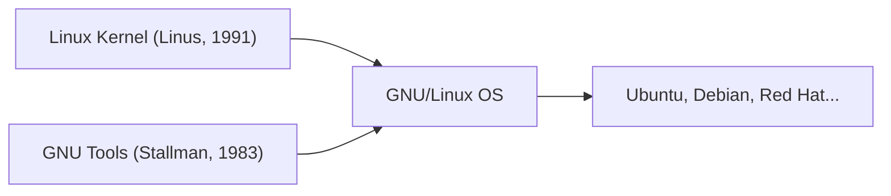

## 1. リーナス・トーバルズの趣味
1991年、フィンランドの学生リーナス・トーバルズが「単なる趣味だよ。プロ級じゃない」というメッセージと共に、PC向けのUNIXライクなOSカーネルを公開しました。

## 2. GNUプロジェクトとの融合
リチャード・ストールマンが推進していたフリーソフトウェアの「GNUプロジェクト」の各種ツールと、Linuxカーネルが組み合わさることで、完全なOS「GNU/Linux」が完成しました。

## 3. インターネットを支えるインフラへ
ApacheやMySQL、PHP（LAMPスタック）の普及により、Linuxは無料で堅牢なサーバーOSとして、インターネット上のWebサーバーのデファクトスタンダードとなりました。

## 4. Androidの基盤として
現在、LinuxカーネルはスマートフォンOSのAndroidの基盤としても採用されており、人類史上最も普及しているOSとなっています。

## 追加技術検証パート 1

### 1. リーナス・トーバルズの趣味
1991年、フィンランドの学生リーナス・トーバルズが「単なる趣味だよ。プロ級じゃない」というメッセージと共に、PC向けのUNIXライクなOSカーネルを公開しました。

### 2. GNUプロジェクトとの融合
リチャード・ストールマンが推進していたフリーソフトウェアの「GNUプロジェクト」の各種ツールと、Linuxカーネルが組み合わさることで、完全なOS「GNU/Linux」が完成しました。

### 3. インターネットを支えるインフラへ
ApacheやMySQL、PHP（LAMPスタック）の普及により、Linuxは無料で堅牢なサーバーOSとして、インターネット上のWebサーバーのデファクトスタンダードとなりました。

### 4. Androidの基盤として
現在、LinuxカーネルはスマートフォンOSのAndroidの基盤としても採用されており、人類史上最も普及しているOSとなっています。

## 追加技術検証パート 2

### 1. リーナス・トーバルズの趣味
1991年、フィンランドの学生リーナス・トーバルズが「単なる趣味だよ。プロ級じゃない」というメッセージと共に、PC向けのUNIXライクなOSカーネルを公開しました。

### 2. GNUプロジェクトとの融合
リチャード・ストールマンが推進していたフリーソフトウェアの「GNUプロジェクト」の各種ツールと、Linuxカーネルが組み合わさることで、完全なOS「GNU/Linux」が完成しました。

### 3. インターネットを支えるインフラへ
ApacheやMySQL、PHP（LAMPスタック）の普及により、Linuxは無料で堅牢なサーバーOSとして、インターネット上のWebサーバーのデファクトスタンダードとなりました。

### 4. Androidの基盤として
現在、LinuxカーネルはスマートフォンOSのAndroidの基盤としても採用されており、人類史上最も普及しているOSとなっています。

## 追加技術検証パート 3

### 1. リーナス・トーバルズの趣味
1991年、フィンランドの学生リーナス・トーバルズが「単なる趣味だよ。プロ級じゃない」というメッセージと共に、PC向けのUNIXライクなOSカーネルを公開しました。

### 2. GNUプロジェクトとの融合
リチャード・ストールマンが推進していたフリーソフトウェアの「GNUプロジェクト」の各種ツールと、Linuxカーネルが組み合わさることで、完全なOS「GNU/Linux」が完成しました。

### 3. インターネットを支えるインフラへ
ApacheやMySQL、PHP（LAMPスタック）の普及により、Linuxは無料で堅牢なサーバーOSとして、インターネット上のWebサーバーのデファクトスタンダードとなりました。

### 4. Androidの基盤として
現在、LinuxカーネルはスマートフォンOSのAndroidの基盤としても採用されており、人類史上最も普及しているOSとなっています。

## 追加技術検証パート 4

### 1. リーナス・トーバルズの趣味
1991年、フィンランドの学生リーナス・トーバルズが「単なる趣味だよ。プロ級じゃない」というメッセージと共に、PC向けのUNIXライクなOSカーネルを公開しました。

### 2. GNUプロジェクトとの融合
リチャード・ストールマンが推進していたフリーソフトウェアの「GNUプロジェクト」の各種ツールと、Linuxカーネルが組み合わさることで、完全なOS「GNU/Linux」が完成しました。

### 3. インターネットを支えるインフラへ
ApacheやMySQL、PHP（LAMPスタック）の普及により、Linuxは無料で堅牢なサーバーOSとして、インターネット上のWebサーバーのデファクトスタンダードとなりました。

### 4. Androidの基盤として
現在、LinuxカーネルはスマートフォンOSのAndroidの基盤としても採用されており、人類史上最も普及しているOSとなっています。

## 追加技術検証パート 5

### 1. リーナス・トーバルズの趣味
1991年、フィンランドの学生リーナス・トーバルズが「単なる趣味だよ。プロ級じゃない」というメッセージと共に、PC向けのUNIXライクなOSカーネルを公開しました。

### 2. GNUプロジェクトとの融合
リチャード・ストールマンが推進していたフリーソフトウェアの「GNUプロジェクト」の各種ツールと、Linuxカーネルが組み合わさることで、完全なOS「GNU/Linux」が完成しました。

### 3. インターネットを支えるインフラへ
ApacheやMySQL、PHP（LAMPスタック）の普及により、Linuxは無料で堅牢なサーバーOSとして、インターネット上のWebサーバーのデファクトスタンダードとなりました。

### 4. Androidの基盤として
現在、LinuxカーネルはスマートフォンOSのAndroidの基盤としても採用されており、人類史上最も普及しているOSとなっています。

## 追加技術検証パート 6

### 1. リーナス・トーバルズの趣味
1991年、フィンランドの学生リーナス・トーバルズが「単なる趣味だよ。プロ級じゃない」というメッセージと共に、PC向けのUNIXライクなOSカーネルを公開しました。

### 2. GNUプロジェクトとの融合
リチャード・ストールマンが推進していたフリーソフトウェアの「GNUプロジェクト」の各種ツールと、Linuxカーネルが組み合わさることで、完全なOS「GNU/Linux」が完成しました。

### 3. インターネットを支えるインフラへ
ApacheやMySQL、PHP（LAMPスタック）の普及により、Linuxは無料で堅牢なサーバーOSとして、インターネット上のWebサーバーのデファクトスタンダードとなりました。

### 4. Androidの基盤として
現在、LinuxカーネルはスマートフォンOSのAndroidの基盤としても採用されており、人類史上最も普及しているOSとなっています。

## 追加技術検証パート 7

### 1. リーナス・トーバルズの趣味
1991年、フィンランドの学生リーナス・トーバルズが「単なる趣味だよ。プロ級じゃない」というメッセージと共に、PC向けのUNIXライクなOSカーネルを公開しました。

### 2. GNUプロジェクトとの融合
リチャード・ストールマンが推進していたフリーソフトウェアの「GNUプロジェクト」の各種ツールと、Linuxカーネルが組み合わさることで、完全なOS「GNU/Linux」が完成しました。

### 3. インターネットを支えるインフラへ
ApacheやMySQL、PHP（LAMPスタック）の普及により、Linuxは無料で堅牢なサーバーOSとして、インターネット上のWebサーバーのデファクトスタンダードとなりました。

### 4. Androidの基盤として
現在、LinuxカーネルはスマートフォンOSのAndroidの基盤としても採用されており、人類史上最も普及しているOSとなっています。

## 追加技術検証パート 8

### 1. リーナス・トーバルズの趣味
1991年、フィンランドの学生リーナス・トーバルズが「単なる趣味だよ。プロ級じゃない」というメッセージと共に、PC向けのUNIXライクなOSカーネルを公開しました。

### 2. GNUプロジェクトとの融合
リチャード・ストールマンが推進していたフリーソフトウェアの「GNUプロジェクト」の各種ツールと、Linuxカーネルが組み合わさることで、完全なOS「GNU/Linux」が完成しました。

### 3. インターネットを支えるインフラへ
ApacheやMySQL、PHP（LAMPスタック）の普及により、Linuxは無料で堅牢なサーバーOSとして、インターネット上のWebサーバーのデファクトスタンダードとなりました。

### 4. Androidの基盤として
現在、LinuxカーネルはスマートフォンOSのAndroidの基盤としても採用されており、人類史上最も普及しているOSとなっています。

## 追加技術検証パート 9

### 1. リーナス・トーバルズの趣味
1991年、フィンランドの学生リーナス・トーバルズが「単なる趣味だよ。プロ級じゃない」というメッセージと共に、PC向けのUNIXライクなOSカーネルを公開しました。

### 2. GNUプロジェクトとの融合
リチャード・ストールマンが推進していたフリーソフトウェアの「GNUプロジェクト」の各種ツールと、Linuxカーネルが組み合わさることで、完全なOS「GNU/Linux」が完成しました。

### 3. インターネットを支えるインフラへ
ApacheやMySQL、PHP（LAMPスタック）の普及により、Linuxは無料で堅牢なサーバーOSとして、インターネット上のWebサーバーのデファクトスタンダードとなりました。

### 4. Androidの基盤として
現在、LinuxカーネルはスマートフォンOSのAndroidの基盤としても採用されており、人類史上最も普及しているOSとなっています。

## 追加技術検証パート 10

### 1. リーナス・トーバルズの趣味
1991年、フィンランドの学生リーナス・トーバルズが「単なる趣味だよ。プロ級じゃない」というメッセージと共に、PC向けのUNIXライクなOSカーネルを公開しました。

### 2. GNUプロジェクトとの融合
リチャード・ストールマンが推進していたフリーソフトウェアの「GNUプロジェクト」の各種ツールと、Linuxカーネルが組み合わさることで、完全なOS「GNU/Linux」が完成しました。

### 3. インターネットを支えるインフラへ
ApacheやMySQL、PHP（LAMPスタック）の普及により、Linuxは無料で堅牢なサーバーOSとして、インターネット上のWebサーバーのデファクトスタンダードとなりました。

### 4. Androidの基盤として
現在、LinuxカーネルはスマートフォンOSのAndroidの基盤としても採用されており、人類史上最も普及しているOSとなっています。

## 追加技術検証パート 11

### 1. リーナス・トーバルズの趣味
1991年、フィンランドの学生リーナス・トーバルズが「単なる趣味だよ。プロ級じゃない」というメッセージと共に、PC向けのUNIXライクなOSカーネルを公開しました。

### 2. GNUプロジェクトとの融合
リチャード・ストールマンが推進していたフリーソフトウェアの「GNUプロジェクト」の各種ツールと、Linuxカーネルが組み合わさることで、完全なOS「GNU/Linux」が完成しました。

### 3. インターネットを支えるインフラへ
ApacheやMySQL、PHP（LAMPスタック）の普及により、Linuxは無料で堅牢なサーバーOSとして、インターネット上のWebサーバーのデファクトスタンダードとなりました。

### 4. Androidの基盤として
現在、LinuxカーネルはスマートフォンOSのAndroidの基盤としても採用されており、人類史上最も普及しているOSとなっています。

## 追加技術検証パート 12

### 1. リーナス・トーバルズの趣味
1991年、フィンランドの学生リーナス・トーバルズが「単なる趣味だよ。プロ級じゃない」というメッセージと共に、PC向けのUNIXライクなOSカーネルを公開しました。

### 2. GNUプロジェクトとの融合
リチャード・ストールマンが推進していたフリーソフトウェアの「GNUプロジェクト」の各種ツールと、Linuxカーネルが組み合わさることで、完全なOS「GNU/Linux」が完成しました。

### 3. インターネットを支えるインフラへ
ApacheやMySQL、PHP（LAMPスタック）の普及により、Linuxは無料で堅牢なサーバーOSとして、インターネット上のWebサーバーのデファクトスタンダードとなりました。

### 4. Androidの基盤として
現在、LinuxカーネルはスマートフォンOSのAndroidの基盤としても採用されており、人類史上最も普及しているOSとなっています。

## 追加技術検証パート 13

### 1. リーナス・トーバルズの趣味
1991年、フィンランドの学生リーナス・トーバルズが「単なる趣味だよ。プロ級じゃない」というメッセージと共に、PC向けのUNIXライクなOSカーネルを公開しました。

### 2. GNUプロジェクトとの融合
リチャード・ストールマンが推進していたフリーソフトウェアの「GNUプロジェクト」の各種ツールと、Linuxカーネルが組み合わさることで、完全なOS「GNU/Linux」が完成しました。

### 3. インターネットを支えるインフラへ
ApacheやMySQL、PHP（LAMPスタック）の普及により、Linuxは無料で堅牢なサーバーOSとして、インターネット上のWebサーバーのデファクトスタンダードとなりました。

### 4. Androidの基盤として
現在、LinuxカーネルはスマートフォンOSのAndroidの基盤としても採用されており、人類史上最も普及しているOSとなっています。

## 追加技術検証パート 14

### 1. リーナス・トーバルズの趣味
1991年、フィンランドの学生リーナス・トーバルズが「単なる趣味だよ。プロ級じゃない」というメッセージと共に、PC向けのUNIXライクなOSカーネルを公開しました。

### 2. GNUプロジェクトとの融合
リチャード・ストールマンが推進していたフリーソフトウェアの「GNUプロジェクト」の各種ツールと、Linuxカーネルが組み合わさることで、完全なOS「GNU/Linux」が完成しました。

### 3. インターネットを支えるインフラへ
ApacheやMySQL、PHP（LAMPスタック）の普及により、Linuxは無料で堅牢なサーバーOSとして、インターネット上のWebサーバーのデファクトスタンダードとなりました。

### 4. Androidの基盤として
現在、LinuxカーネルはスマートフォンOSのAndroidの基盤としても採用されており、人類史上最も普及しているOSとなっています。
