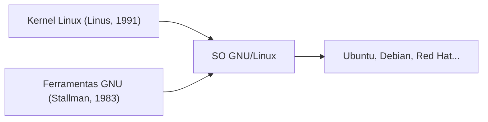

```mermaid
graph LR
    Kernel["Kernel Linux (Linus, 1991)"] --> OS["SO GNU/Linux"]
    GNU["Ferramentas GNU (Stallman, 1983)"] --> OS
    OS --> Distro["Ubuntu, Debian, Red Hat..."]
```

## 1. O Hobby de Linus Torvalds
Em 1991, o estudante finlandês Linus Torvalds lançou um kernel de sistema operacional do tipo UNIX para PCs com a mensagem: "É apenas um hobby. Não será grande e profissional."

## 2. Integração com o Projeto GNU
Ao combinar as várias ferramentas do "Projeto GNU" de software livre, promovido por Richard Stallman, com o kernel Linux, um sistema operacional completo "GNU/Linux" foi concluído.

## 3. Para a Infraestrutura que Sustenta a Internet
Com a difusão do Apache, MySQL e PHP (pilha LAMP), o Linux tornou-se o padrão de fato para servidores web na Internet como um SO de servidor gratuito e robusto.

## 4. Como a Base do Android
Atualmente, o kernel do Linux também é adotado como a base do Android, o SO de smartphone, tornando-se o sistema operacional mais utilizado na história da humanidade.

## Parte 1 da Verificação Técnica Adicional

### 1. O Hobby de Linus Torvalds
Em 1991, o estudante finlandês Linus Torvalds lançou um kernel de sistema operacional do tipo UNIX para PCs com a mensagem: "É apenas um hobby. Não será grande e profissional."

### 2. Integração com o Projeto GNU
Ao combinar as várias ferramentas do "Projeto GNU" de software livre, promovido por Richard Stallman, com o kernel Linux, um sistema operacional completo "GNU/Linux" foi concluído.

### 3. Para a Infraestrutura que Sustenta a Internet
Com a difusão do Apache, MySQL e PHP (pilha LAMP), o Linux tornou-se o padrão de fato para servidores web na Internet como um SO de servidor gratuito e robusto.

### 4. Como a Base do Android
Atualmente, o kernel do Linux também é adotado como a base do Android, o SO de smartphone, tornando-se o sistema operacional mais utilizado na história da humanidade.

## Parte 2 da Verificação Técnica Adicional

### 1. O Hobby de Linus Torvalds
Em 1991, o estudante finlandês Linus Torvalds lançou um kernel de sistema operacional do tipo UNIX para PCs com a mensagem: "É apenas um hobby. Não será grande e profissional."

### 2. Integração com o Projeto GNU
Ao combinar as várias ferramentas do "Projeto GNU" de software livre, promovido por Richard Stallman, com o kernel Linux, um sistema operacional completo "GNU/Linux" foi concluído.

### 3. Para a Infraestrutura que Sustenta a Internet
Com a difusão do Apache, MySQL e PHP (pilha LAMP), o Linux tornou-se o padrão de fato para servidores web na Internet como um SO de servidor gratuito e robusto.

### 4. Como a Base do Android
Atualmente, o kernel do Linux também é adotado como a base do Android, o SO de smartphone, tornando-se o sistema operacional mais utilizado na história da humanidade.

## Parte 3 da Verificação Técnica Adicional

### 1. O Hobby de Linus Torvalds
Em 1991, o estudante finlandês Linus Torvalds lançou um kernel de sistema operacional do tipo UNIX para PCs com a mensagem: "É apenas um hobby. Não será grande e profissional."

### 2. Integração com o Projeto GNU
Ao combinar as várias ferramentas do "Projeto GNU" de software livre, promovido por Richard Stallman, com o kernel Linux, um sistema operacional completo "GNU/Linux" foi concluído.

### 3. Para a Infraestrutura que Sustenta a Internet
Com a difusão do Apache, MySQL e PHP (pilha LAMP), o Linux tornou-se o padrão de fato para servidores web na Internet como um SO de servidor gratuito e robusto.

### 4. Como a Base do Android
Atualmente, o kernel do Linux também é adotado como a base do Android, o SO de smartphone, tornando-se o sistema operacional mais utilizado na história da humanidade.

## Parte 4 da Verificação Técnica Adicional

### 1. O Hobby de Linus Torvalds
Em 1991, o estudante finlandês Linus Torvalds lançou um kernel de sistema operacional do tipo UNIX para PCs com a mensagem: "É apenas um hobby. Não será grande e profissional."

### 2. Integração com o Projeto GNU
Ao combinar as várias ferramentas do "Projeto GNU" de software livre, promovido por Richard Stallman, com o kernel Linux, um sistema operacional completo "GNU/Linux" foi concluído.

### 3. Para a Infraestrutura que Sustenta a Internet
Com a difusão do Apache, MySQL e PHP (pilha LAMP), o Linux tornou-se o padrão de fato para servidores web na Internet como um SO de servidor gratuito e robusto.

### 4. Como a Base do Android
Atualmente, o kernel do Linux também é adotado como a base do Android, o SO de smartphone, tornando-se o sistema operacional mais utilizado na história da humanidade.

## Parte 5 da Verificação Técnica Adicional

### 1. O Hobby de Linus Torvalds
Em 1991, o estudante finlandês Linus Torvalds lançou um kernel de sistema operacional do tipo UNIX para PCs com a mensagem: "É apenas um hobby. Não será grande e profissional."

### 2. Integração com o Projeto GNU
Ao combinar as várias ferramentas do "Projeto GNU" de software livre, promovido por Richard Stallman, com o kernel Linux, um sistema operacional completo "GNU/Linux" foi concluído.

### 3. Para a Infraestrutura que Sustenta a Internet
Com a difusão do Apache, MySQL e PHP (pilha LAMP), o Linux tornou-se o padrão de fato para servidores web na Internet como um SO de servidor gratuito e robusto.

### 4. Como a Base do Android
Atualmente, o kernel do Linux também é adotado como a base do Android, o SO de smartphone, tornando-se o sistema operacional mais utilizado na história da humanidade.

## Parte 6 da Verificação Técnica Adicional

### 1. O Hobby de Linus Torvalds
Em 1991, o estudante finlandês Linus Torvalds lançou um kernel de sistema operacional do tipo UNIX para PCs com a mensagem: "É apenas um hobby. Não será grande e profissional."

### 2. Integração com o Projeto GNU
Ao combinar as várias ferramentas do "Projeto GNU" de software livre, promovido por Richard Stallman, com o kernel Linux, um sistema operacional completo "GNU/Linux" foi concluído.

### 3. Para a Infraestrutura que Sustenta a Internet
Com a difusão do Apache, MySQL e PHP (pilha LAMP), o Linux tornou-se o padrão de fato para servidores web na Internet como um SO de servidor gratuito e robusto.

### 4. Como a Base do Android
Atualmente, o kernel do Linux também é adotado como a base do Android, o SO de smartphone, tornando-se o sistema operacional mais utilizado na história da humanidade.

## Parte 7 da Verificação Técnica Adicional

### 1. O Hobby de Linus Torvalds
Em 1991, o estudante finlandês Linus Torvalds lançou um kernel de sistema operacional do tipo UNIX para PCs com a mensagem: "É apenas um hobby. Não será grande e profissional."

### 2. Integração com o Projeto GNU
Ao combinar as várias ferramentas do "Projeto GNU" de software livre, promovido por Richard Stallman, com o kernel Linux, um sistema operacional completo "GNU/Linux" foi concluído.

### 3. Para a Infraestrutura que Sustenta a Internet
Com a difusão do Apache, MySQL e PHP (pilha LAMP), o Linux tornou-se o padrão de fato para servidores web na Internet como um SO de servidor gratuito e robusto.

### 4. Como a Base do Android
Atualmente, o kernel do Linux também é adotado como a base do Android, o SO de smartphone, tornando-se o sistema operacional mais utilizado na história da humanidade.

## Parte 8 da Verificação Técnica Adicional

### 1. O Hobby de Linus Torvalds
Em 1991, o estudante finlandês Linus Torvalds lançou um kernel de sistema operacional do tipo UNIX para PCs com a mensagem: "É apenas um hobby. Não será grande e profissional."

### 2. Integração com o Projeto GNU
Ao combinar as várias ferramentas do "Projeto GNU" de software livre, promovido por Richard Stallman, com o kernel Linux, um sistema operacional completo "GNU/Linux" foi concluído.

### 3. Para a Infraestrutura que Sustenta a Internet
Com a difusão do Apache, MySQL e PHP (pilha LAMP), o Linux tornou-se o padrão de fato para servidores web na Internet como um SO de servidor gratuito e robusto.

### 4. Como a Base do Android
Atualmente, o kernel do Linux também é adotado como a base do Android, o SO de smartphone, tornando-se o sistema operacional mais utilizado na história da humanidade.

## Parte 9 da Verificação Técnica Adicional

### 1. O Hobby de Linus Torvalds
Em 1991, o estudante finlandês Linus Torvalds lançou um kernel de sistema operacional do tipo UNIX para PCs com a mensagem: "É apenas um hobby. Não será grande e profissional."

### 2. Integração com o Projeto GNU
Ao combinar as várias ferramentas do "Projeto GNU" de software livre, promovido por Richard Stallman, com o kernel Linux, um sistema operacional completo "GNU/Linux" foi concluído.

### 3. Para a Infraestrutura que Sustenta a Internet
Com a difusão do Apache, MySQL e PHP (pilha LAMP), o Linux tornou-se o padrão de fato para servidores web na Internet como um SO de servidor gratuito e robusto.

### 4. Como a Base do Android
Atualmente, o kernel do Linux também é adotado como a base do Android, o SO de smartphone, tornando-se o sistema operacional mais utilizado na história da humanidade.

## Parte 10 da Verificação Técnica Adicional

### 1. O Hobby de Linus Torvalds
Em 1991, o estudante finlandês Linus Torvalds lançou um kernel de sistema operacional do tipo UNIX para PCs com a mensagem: "É apenas um hobby. Não será grande e profissional."

### 2. Integração com o Projeto GNU
Ao combinar as várias ferramentas do "Projeto GNU" de software livre, promovido por Richard Stallman, com o kernel Linux, um sistema operacional completo "GNU/Linux" foi concluído.

### 3. Para a Infraestrutura que Sustenta a Internet
Com a difusão do Apache, MySQL e PHP (pilha LAMP), o Linux tornou-se o padrão de fato para servidores web na Internet como um SO de servidor gratuito e robusto.

### 4. Como a Base do Android
Atualmente, o kernel do Linux também é adotado como a base do Android, o SO de smartphone, tornando-se o sistema operacional mais utilizado na história da humanidade.

## Parte 11 da Verificação Técnica Adicional

### 1. O Hobby de Linus Torvalds
Em 1991, o estudante finlandês Linus Torvalds lançou um kernel de sistema operacional do tipo UNIX para PCs com a mensagem: "É apenas um hobby. Não será grande e profissional."

### 2. Integração com o Projeto GNU
Ao combinar as várias ferramentas do "Projeto GNU" de software livre, promovido por Richard Stallman, com o kernel Linux, um sistema operacional completo "GNU/Linux" foi concluído.

### 3. Para a Infraestrutura que Sustenta a Internet
Com a difusão do Apache, MySQL e PHP (pilha LAMP), o Linux tornou-se o padrão de fato para servidores web na Internet como um SO de servidor gratuito e robusto.

### 4. Como a Base do Android
Atualmente, o kernel do Linux também é adotado como a base do Android, o SO de smartphone, tornando-se o sistema operacional mais utilizado na história da humanidade.

## Parte 12 da Verificação Técnica Adicional

### 1. O Hobby de Linus Torvalds
Em 1991, o estudante finlandês Linus Torvalds lançou um kernel de sistema operacional do tipo UNIX para PCs com a mensagem: "É apenas um hobby. Não será grande e profissional."

### 2. Integração com o Projeto GNU
Ao combinar as várias ferramentas do "Projeto GNU" de software livre, promovido por Richard Stallman, com o kernel Linux, um sistema operacional completo "GNU/Linux" foi concluído.

### 3. Para a Infraestrutura que Sustenta a Internet
Com a difusão do Apache, MySQL e PHP (pilha LAMP), o Linux tornou-se o padrão de fato para servidores web na Internet como um SO de servidor gratuito e robusto.

### 4. Como a Base do Android
Atualmente, o kernel do Linux também é adotado como a base do Android, o SO de smartphone, tornando-se o sistema operacional mais utilizado na história da humanidade.

## Parte 13 da Verificação Técnica Adicional

### 1. O Hobby de Linus Torvalds
Em 1991, o estudante finlandês Linus Torvalds lançou um kernel de sistema operacional do tipo UNIX para PCs com a mensagem: "É apenas um hobby. Não será grande e profissional."

### 2. Integração com o Projeto GNU
Ao combinar as várias ferramentas do "Projeto GNU" de software livre, promovido por Richard Stallman, com o kernel Linux, um sistema operacional completo "GNU/Linux" foi concluído.

### 3. Para a Infraestrutura que Sustenta a Internet
Com a difusão do Apache, MySQL e PHP (pilha LAMP), o Linux tornou-se o padrão de fato para servidores web na Internet como um SO de servidor gratuito e robusto.

### 4. Como a Base do Android
Atualmente, o kernel do Linux também é adotado como a base do Android, o SO de smartphone, tornando-se o sistema operacional mais utilizado na história da humanidade.

## Parte 14 da Verificação Técnica Adicional

### 1. O Hobby de Linus Torvalds
Em 1991, o estudante finlandês Linus Torvalds lançou um kernel de sistema operacional do tipo UNIX para PCs com a mensagem: "É apenas um hobby. Não será grande e profissional."

### 2. Integração com o Projeto GNU
Ao combinar as várias ferramentas do "Projeto GNU" de software livre, promovido por Richard Stallman, com o kernel Linux, um sistema operacional completo "GNU/Linux" foi concluído.

### 3. Para a Infraestrutura que Sustenta a Internet
Com a difusão do Apache, MySQL e PHP (pilha LAMP), o Linux tornou-se o padrão de fato para servidores web na Internet como um SO de servidor gratuito e robusto.

### 4. Como a Base do Android
Atualmente, o kernel do Linux também é adotado como a base do Android, o SO de smartphone, tornando-se o sistema operacional mais utilizado na história da humanidade.
