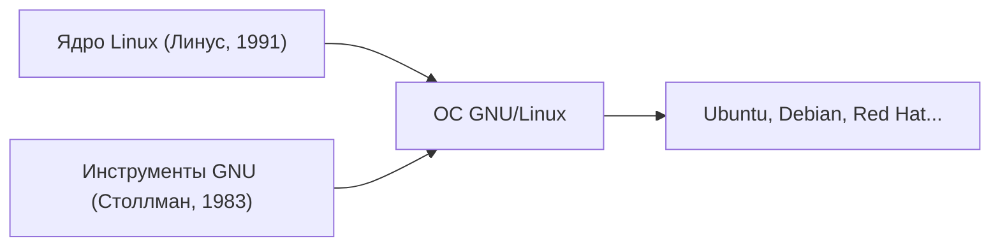

## 1. Хобби Линуса Торвальдса
В 1991 году финский студент Линус Торвальдс выпустил UNIX-подобное ядро ОС для ПК с сообщением: «Это просто хобби, ничего профессионального».

## 2. Слияние с проектом GNU
Различные инструменты бесплатного программного обеспечения «Проекта GNU», продвигаемого Ричардом Столлманом, в сочетании с ядром Linux привели к созданию полноценной ОС «GNU/Linux».

## 3. В инфраструктуру, поддерживающую Интернет
Благодаря распространению Apache, MySQL и PHP (стек LAMP), Linux стал стандартом де-факто для веб-серверов в Интернете как бесплатная и надежная серверная ОС.

## 4. В качестве основы для Android
В настоящее время ядро Linux также используется в качестве основы для операционной системы смартфонов Android, что делает её самой распространенной ОС в истории человечества.

## Дополнительная техническая проверка, часть 1

### 1. Хобби Линуса Торвальдса
В 1991 году финский студент Линус Торвальдс выпустил UNIX-подобное ядро ОС для ПК с сообщением: «Это просто хобби, ничего профессионального».

### 2. Слияние с проектом GNU
Различные инструменты бесплатного программного обеспечения «Проекта GNU», продвигаемого Ричардом Столлманом, в сочетании с ядром Linux привели к созданию полноценной ОС «GNU/Linux».

### 3. В инфраструктуру, поддерживающую Интернет
Благодаря распространению Apache, MySQL и PHP (стек LAMP), Linux стал стандартом де-факто для веб-серверов в Интернете как бесплатная и надежная серверная ОС.

### 4. В качестве основы для Android
В настоящее время ядро Linux также используется в качестве основы для операционной системы смартфонов Android, что делает её самой распространенной ОС в истории человечества.

## Дополнительная техническая проверка, часть 2

### 1. Хобби Линуса Торвальдса
В 1991 году финский студент Линус Торвальдс выпустил UNIX-подобное ядро ОС для ПК с сообщением: «Это просто хобби, ничего профессионального».

### 2. Слияние с проектом GNU
Различные инструменты бесплатного программного обеспечения «Проекта GNU», продвигаемого Ричардом Столлманом, в сочетании с ядром Linux привели к созданию полноценной ОС «GNU/Linux».

### 3. В инфраструктуру, поддерживающую Интернет
Благодаря распространению Apache, MySQL и PHP (стек LAMP), Linux стал стандартом де-факто для веб-серверов в Интернете как бесплатная и надежная серверная ОС.

### 4. В качестве основы для Android
В настоящее время ядро Linux также используется в качестве основы для операционной системы смартфонов Android, что делает её самой распространенной ОС в истории человечества.

## Дополнительная техническая проверка, часть 3

### 1. Хобби Линуса Торвальдса
В 1991 году финский студент Линус Торвальдс выпустил UNIX-подобное ядро ОС для ПК с сообщением: «Это просто хобби, ничего профессионального».

### 2. Слияние с проектом GNU
Различные инструменты бесплатного программного обеспечения «Проекта GNU», продвигаемого Ричардом Столлманом, в сочетании с ядром Linux привели к созданию полноценной ОС «GNU/Linux».

### 3. В инфраструктуру, поддерживающую Интернет
Благодаря распространению Apache, MySQL и PHP (стек LAMP), Linux стал стандартом де-факто для веб-серверов в Интернете как бесплатная и надежная серверная ОС.

### 4. В качестве основы для Android
В настоящее время ядро Linux также используется в качестве основы для операционной системы смартфонов Android, что делает её самой распространенной ОС в истории человечества.

## Дополнительная техническая проверка, часть 4

### 1. Хобби Линуса Торвальдса
В 1991 году финский студент Линус Торвальдс выпустил UNIX-подобное ядро ОС для ПК с сообщением: «Это просто хобби, ничего профессионального».

### 2. Слияние с проектом GNU
Различные инструменты бесплатного программного обеспечения «Проекта GNU», продвигаемого Ричардом Столлманом, в сочетании с ядром Linux привели к созданию полноценной ОС «GNU/Linux».

### 3. В инфраструктуру, поддерживающую Интернет
Благодаря распространению Apache, MySQL и PHP (стек LAMP), Linux стал стандартом де-факто для веб-серверов в Интернете как бесплатная и надежная серверная ОС.

### 4. В качестве основы для Android
В настоящее время ядро Linux также используется в качестве основы для операционной системы смартфонов Android, что делает её самой распространенной ОС в истории человечества.

## Дополнительная техническая проверка, часть 5

### 1. Хобби Линуса Торвальдса
В 1991 году финский студент Линус Торвальдс выпустил UNIX-подобное ядро ОС для ПК с сообщением: «Это просто хобби, ничего профессионального».

### 2. Слияние с проектом GNU
Различные инструменты бесплатного программного обеспечения «Проекта GNU», продвигаемого Ричардом Столлманом, в сочетании с ядром Linux привели к созданию полноценной ОС «GNU/Linux».

### 3. В инфраструктуру, поддерживающую Интернет
Благодаря распространению Apache, MySQL и PHP (стек LAMP), Linux стал стандартом де-факто для веб-серверов в Интернете как бесплатная и надежная серверная ОС.

### 4. В качестве основы для Android
В настоящее время ядро Linux также используется в качестве основы для операционной системы смартфонов Android, что делает её самой распространенной ОС в истории человечества.

## Дополнительная техническая проверка, часть 6

### 1. Хобби Линуса Торвальдса
В 1991 году финский студент Линус Торвальдс выпустил UNIX-подобное ядро ОС для ПК с сообщением: «Это просто хобби, ничего профессионального».

### 2. Слияние с проектом GNU
Различные инструменты бесплатного программного обеспечения «Проекта GNU», продвигаемого Ричардом Столлманом, в сочетании с ядром Linux привели к созданию полноценной ОС «GNU/Linux».

### 3. В инфраструктуру, поддерживающую Интернет
Благодаря распространению Apache, MySQL и PHP (стек LAMP), Linux стал стандартом де-факто для веб-серверов в Интернете как бесплатная и надежная серверная ОС.

### 4. В качестве основы для Android
В настоящее время ядро Linux также используется в качестве основы для операционной системы смартфонов Android, что делает её самой распространенной ОС в истории человечества.

## Дополнительная техническая проверка, часть 7

### 1. Хобби Линуса Торвальдса
В 1991 году финский студент Линус Торвальдс выпустил UNIX-подобное ядро ОС для ПК с сообщением: «Это просто хобби, ничего профессионального».

### 2. Слияние с проектом GNU
Различные инструменты бесплатного программного обеспечения «Проекта GNU», продвигаемого Ричардом Столлманом, в сочетании с ядром Linux привели к созданию полноценной ОС «GNU/Linux».

### 3. В инфраструктуру, поддерживающую Интернет
Благодаря распространению Apache, MySQL и PHP (стек LAMP), Linux стал стандартом де-факто для веб-серверов в Интернете как бесплатная и надежная серверная ОС.

### 4. В качестве основы для Android
В настоящее время ядро Linux также используется в качестве основы для операционной системы смартфонов Android, что делает её самой распространенной ОС в истории человечества.

## Дополнительная техническая проверка, часть 8

### 1. Хобби Линуса Торвальдса
В 1991 году финский студент Линус Торвальдс выпустил UNIX-подобное ядро ОС для ПК с сообщением: «Это просто хобби, ничего профессионального».

### 2. Слияние с проектом GNU
Различные инструменты бесплатного программного обеспечения «Проекта GNU», продвигаемого Ричардом Столлманом, в сочетании с ядром Linux привели к созданию полноценной ОС «GNU/Linux».

### 3. В инфраструктуру, поддерживающую Интернет
Благодаря распространению Apache, MySQL и PHP (стек LAMP), Linux стал стандартом де-факто для веб-серверов в Интернете как бесплатная и надежная серверная ОС.

### 4. В качестве основы для Android
В настоящее время ядро Linux также используется в качестве основы для операционной системы смартфонов Android, что делает её самой распространенной ОС в истории человечества.

## Дополнительная техническая проверка, часть 9

### 1. Хобби Линуса Торвальдса
В 1991 году финский студент Линус Торвальдс выпустил UNIX-подобное ядро ОС для ПК с сообщением: «Это просто хобби, ничего профессионального».

### 2. Слияние с проектом GNU
Различные инструменты бесплатного программного обеспечения «Проекта GNU», продвигаемого Ричардом Столлманом, в сочетании с ядром Linux привели к созданию полноценной ОС «GNU/Linux».

### 3. В инфраструктуру, поддерживающую Интернет
Благодаря распространению Apache, MySQL и PHP (стек LAMP), Linux стал стандартом де-факто для веб-серверов в Интернете как бесплатная и надежная серверная ОС.

### 4. В качестве основы для Android
В настоящее время ядро Linux также используется в качестве основы для операционной системы смартфонов Android, что делает её самой распространенной ОС в истории человечества.

## Дополнительная техническая проверка, часть 10

### 1. Хобби Линуса Торвальдса
В 1991 году финский студент Линус Торвальдс выпустил UNIX-подобное ядро ОС для ПК с сообщением: «Это просто хобби, ничего профессионального».

### 2. Слияние с проектом GNU
Различные инструменты бесплатного программного обеспечения «Проекта GNU», продвигаемого Ричардом Столлманом, в сочетании с ядром Linux привели к созданию полноценной ОС «GNU/Linux».

### 3. В инфраструктуру, поддерживающую Интернет
Благодаря распространению Apache, MySQL и PHP (стек LAMP), Linux стал стандартом де-факто для веб-серверов в Интернете как бесплатная и надежная серверная ОС.

### 4. В качестве основы для Android
В настоящее время ядро Linux также используется в качестве основы для операционной системы смартфонов Android, что делает её самой распространенной ОС в истории человечества.

## Дополнительная техническая проверка, часть 11

### 1. Хобби Линуса Торвальдса
В 1991 году финский студент Линус Торвальдс выпустил UNIX-подобное ядро ОС для ПК с сообщением: «Это просто хобби, ничего профессионального».

### 2. Слияние с проектом GNU
Различные инструменты бесплатного программного обеспечения «Проекта GNU», продвигаемого Ричардом Столлманом, в сочетании с ядром Linux привели к созданию полноценной ОС «GNU/Linux».

### 3. В инфраструктуру, поддерживающую Интернет
Благодаря распространению Apache, MySQL и PHP (стек LAMP), Linux стал стандартом де-факто для веб-серверов в Интернете как бесплатная и надежная серверная ОС.

### 4. В качестве основы для Android
В настоящее время ядро Linux также используется в качестве основы для операционной системы смартфонов Android, что делает её самой распространенной ОС в истории человечества.

## Дополнительная техническая проверка, часть 12

### 1. Хобби Линуса Торвальдса
В 1991 году финский студент Линус Торвальдс выпустил UNIX-подобное ядро ОС для ПК с сообщением: «Это просто хобби, ничего профессионального».

### 2. Слияние с проектом GNU
Различные инструменты бесплатного программного обеспечения «Проекта GNU», продвигаемого Ричардом Столлманом, в сочетании с ядром Linux привели к созданию полноценной ОС «GNU/Linux».

### 3. В инфраструктуру, поддерживающую Интернет
Благодаря распространению Apache, MySQL и PHP (стек LAMP), Linux стал стандартом де-факто для веб-серверов в Интернете как бесплатная и надежная серверная ОС.

### 4. В качестве основы для Android
В настоящее время ядро Linux также используется в качестве основы для операционной системы смартфонов Android, что делает её самой распространенной ОС в истории человечества.

## Дополнительная техническая проверка, часть 13

### 1. Хобби Линуса Торвальдса
В 1991 году финский студент Линус Торвальдс выпустил UNIX-подобное ядро ОС для ПК с сообщением: «Это просто хобби, ничего профессионального».

### 2. Слияние с проектом GNU
Различные инструменты бесплатного программного обеспечения «Проекта GNU», продвигаемого Ричардом Столлманом, в сочетании с ядром Linux привели к созданию полноценной ОС «GNU/Linux».

### 3. В инфраструктуру, поддерживающую Интернет
Благодаря распространению Apache, MySQL и PHP (стек LAMP), Linux стал стандартом де-факто для веб-серверов в Интернете как бесплатная и надежная серверная ОС.

### 4. В качестве основы для Android
В настоящее время ядро Linux также используется в качестве основы для операционной системы смартфонов Android, что делает её самой распространенной ОС в истории человечества.

## Дополнительная техническая проверка, часть 14

### 1. Хобби Линуса Торвальдса
В 1991 году финский студент Линус Торвальдс выпустил UNIX-подобное ядро ОС для ПК с сообщением: «Это просто хобби, ничего профессионального».

### 2. Слияние с проектом GNU
Различные инструменты бесплатного программного обеспечения «Проекта GNU», продвигаемого Ричардом Столлманом, в сочетании с ядром Linux привели к созданию полноценной ОС «GNU/Linux».

### 3. В инфраструктуру, поддерживающую Интернет
Благодаря распространению Apache, MySQL и PHP (стек LAMP), Linux стал стандартом де-факто для веб-серверов в Интернете как бесплатная и надежная серверная ОС.

### 4. В качестве основы для Android
В настоящее время ядро Linux также используется в качестве основы для операционной системы смартфонов Android, что делает её самой распространенной ОС в истории человечества.
