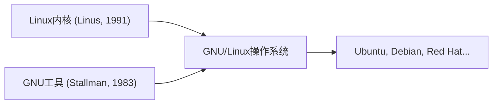

## 1. 林纳斯·托瓦兹的爱好
1991年，芬兰学生林纳斯·托瓦兹发布了面向PC的类UNIX操作系统内核，并附带了一条留言：“只是个爱好而已。不是专业级别的”。

## 2. 与GNU项目的融合
理查德·斯托曼所推进的自由软件“GNU项目”的各种工具，与Linux内核结合在一起，完成了完整的操作系统“GNU/Linux”。

## 3. 支撑互联网的基础设施
随着Apache、MySQL、PHP（LAMP技术栈）的普及，Linux作为免费且坚固的服务器操作系统，成为了互联网上Web服务器的事实标准。

## 4. 作为Android的基础
如今，Linux内核也被采用作为智能手机操作系统Android的基础，成为了人类历史上最普及的操作系统。

## 附加技术验证部分 1

### 1. 林纳斯·托瓦兹的爱好
1991年，芬兰学生林纳斯·托瓦兹发布了面向PC的类UNIX操作系统内核，并附带了一条留言：“只是个爱好而已。不是专业级别的”。

### 2. 与GNU项目的融合
理查德·斯托曼所推进的自由软件“GNU项目”的各种工具，与Linux内核结合在一起，完成了完整的操作系统“GNU/Linux”。

### 3. 支撑互联网的基础设施
随着Apache、MySQL、PHP（LAMP技术栈）的普及，Linux作为免费且坚固的服务器操作系统，成为了互联网上Web服务器的事实标准。

### 4. 作为Android的基础
如今，Linux内核也被采用作为智能手机操作系统Android的基础，成为了人类历史上最普及的操作系统。

## 附加技术验证部分 2

### 1. 林纳斯·托瓦兹的爱好
1991年，芬兰学生林纳斯·托瓦兹发布了面向PC的类UNIX操作系统内核，并附带了一条留言：“只是个爱好而已。不是专业级别的”。

### 2. 与GNU项目的融合
理查德·斯托曼所推进的自由软件“GNU项目”的各种工具，与Linux内核结合在一起，完成了完整的操作系统“GNU/Linux”。

### 3. 支撑互联网的基础设施
随着Apache、MySQL、PHP（LAMP技术栈）的普及，Linux作为免费且坚固的服务器操作系统，成为了互联网上Web服务器的事实标准。

### 4. 作为Android的基础
如今，Linux内核也被采用作为智能手机操作系统Android的基础，成为了人类历史上最普及的操作系统。

## 附加技术验证部分 3

### 1. 林纳斯·托瓦兹的爱好
1991年，芬兰学生林纳斯·托瓦兹发布了面向PC的类UNIX操作系统内核，并附带了一条留言：“只是个爱好而已。不是专业级别的”。

### 2. 与GNU项目的融合
理查德·斯托曼所推进的自由软件“GNU项目”的各种工具，与Linux内核结合在一起，完成了完整的操作系统“GNU/Linux”。

### 3. 支撑互联网的基础设施
随着Apache、MySQL、PHP（LAMP技术栈）的普及，Linux作为免费且坚固的服务器操作系统，成为了互联网上Web服务器的事实标准。

### 4. 作为Android的基础
如今，Linux内核也被采用作为智能手机操作系统Android的基础，成为了人类历史上最普及的操作系统。

## 附加技术验证部分 4

### 1. 林纳斯·托瓦兹的爱好
1991年，芬兰学生林纳斯·托瓦兹发布了面向PC的类UNIX操作系统内核，并附带了一条留言：“只是个爱好而已。不是专业级别的”。

### 2. 与GNU项目的融合
理查德·斯托曼所推进的自由软件“GNU项目”的各种工具，与Linux内核结合在一起，完成了完整的操作系统“GNU/Linux”。

### 3. 支撑互联网的基础设施
随着Apache、MySQL、PHP（LAMP技术栈）的普及，Linux作为免费且坚固的服务器操作系统，成为了互联网上Web服务器的事实标准。

### 4. 作为Android的基础
如今，Linux内核也被采用作为智能手机操作系统Android的基础，成为了人类历史上最普及的操作系统。

## 附加技术验证部分 5

### 1. 林纳斯·托瓦兹的爱好
1991年，芬兰学生林纳斯·托瓦兹发布了面向PC的类UNIX操作系统内核，并附带了一条留言：“只是个爱好而已。不是专业级别的”。

### 2. 与GNU项目的融合
理查德·斯托曼所推进的自由软件“GNU项目”的各种工具，与Linux内核结合在一起，完成了完整的操作系统“GNU/Linux”。

### 3. 支撑互联网的基础设施
随着Apache、MySQL、PHP（LAMP技术栈）的普及，Linux作为免费且坚固的服务器操作系统，成为了互联网上Web服务器的事实标准。

### 4. 作为Android的基础
如今，Linux内核也被采用作为智能手机操作系统Android的基础，成为了人类历史上最普及的操作系统。

## 附加技术验证部分 6

### 1. 林纳斯·托瓦兹的爱好
1991年，芬兰学生林纳斯·托瓦兹发布了面向PC的类UNIX操作系统内核，并附带了一条留言：“只是个爱好而已。不是专业级别的”。

### 2. 与GNU项目的融合
理查德·斯托曼所推进的自由软件“GNU项目”的各种工具，与Linux内核结合在一起，完成了完整的操作系统“GNU/Linux”。

### 3. 支撑互联网的基础设施
随着Apache、MySQL、PHP（LAMP技术栈）的普及，Linux作为免费且坚固的服务器操作系统，成为了互联网上Web服务器的事实标准。

### 4. 作为Android的基础
如今，Linux内核也被采用作为智能手机操作系统Android的基础，成为了人类历史上最普及的操作系统。

## 附加技术验证部分 7

### 1. 林纳斯·托瓦兹的爱好
1991年，芬兰学生林纳斯·托瓦兹发布了面向PC的类UNIX操作系统内核，并附带了一条留言：“只是个爱好而已。不是专业级别的”。

### 2. 与GNU项目的融合
理查德·斯托曼所推进的自由软件“GNU项目”的各种工具，与Linux内核结合在一起，完成了完整的操作系统“GNU/Linux”。

### 3. 支撑互联网的基础设施
随着Apache、MySQL、PHP（LAMP技术栈）的普及，Linux作为免费且坚固的服务器操作系统，成为了互联网上Web服务器的事实标准。

### 4. 作为Android的基础
如今，Linux内核也被采用作为智能手机操作系统Android的基础，成为了人类历史上最普及的操作系统。

## 附加技术验证部分 8

### 1. 林纳斯·托瓦兹的爱好
1991年，芬兰学生林纳斯·托瓦兹发布了面向PC的类UNIX操作系统内核，并附带了一条留言：“只是个爱好而已。不是专业级别的”。

### 2. 与GNU项目的融合
理查德·斯托曼所推进的自由软件“GNU项目”的各种工具，与Linux内核结合在一起，完成了完整的操作系统“GNU/Linux”。

### 3. 支撑互联网的基础设施
随着Apache、MySQL、PHP（LAMP技术栈）的普及，Linux作为免费且坚固的服务器操作系统，成为了互联网上Web服务器的事实标准。

### 4. 作为Android的基础
如今，Linux内核也被采用作为智能手机操作系统Android的基础，成为了人类历史上最普及的操作系统。

## 附加技术验证部分 9

### 1. 林纳斯·托瓦兹的爱好
1991年，芬兰学生林纳斯·托瓦兹发布了面向PC的类UNIX操作系统内核，并附带了一条留言：“只是个爱好而已。不是专业级别的”。

### 2. 与GNU项目的融合
理查德·斯托曼所推进的自由软件“GNU项目”的各种工具，与Linux内核结合在一起，完成了完整的操作系统“GNU/Linux”。

### 3. 支撑互联网的基础设施
随着Apache、MySQL、PHP（LAMP技术栈）的普及，Linux作为免费且坚固的服务器操作系统，成为了互联网上Web服务器的事实标准。

### 4. 作为Android的基础
如今，Linux内核也被采用作为智能手机操作系统Android的基础，成为了人类历史上最普及的操作系统。

## 附加技术验证部分 10

### 1. 林纳斯·托瓦兹的爱好
1991年，芬兰学生林纳斯·托瓦兹发布了面向PC的类UNIX操作系统内核，并附带了一条留言：“只是个爱好而已。不是专业级别的”。

### 2. 与GNU项目的融合
理查德·斯托曼所推进的自由软件“GNU项目”的各种工具，与Linux内核结合在一起，完成了完整的操作系统“GNU/Linux”。

### 3. 支撑互联网的基础设施
随着Apache、MySQL、PHP（LAMP技术栈）的普及，Linux作为免费且坚固的服务器操作系统，成为了互联网上Web服务器的事实标准。

### 4. 作为Android的基础
如今，Linux内核也被采用作为智能手机操作系统Android的基础，成为了人类历史上最普及的操作系统。

## 附加技术验证部分 11

### 1. 林纳斯·托瓦兹的爱好
1991年，芬兰学生林纳斯·托瓦兹发布了面向PC的类UNIX操作系统内核，并附带了一条留言：“只是个爱好而已。不是专业级别的”。

### 2. 与GNU项目的融合
理查德·斯托曼所推进的自由软件“GNU项目”的各种工具，与Linux内核结合在一起，完成了完整的操作系统“GNU/Linux”。

### 3. 支撑互联网的基础设施
随着Apache、MySQL、PHP（LAMP技术栈）的普及，Linux作为免费且坚固的服务器操作系统，成为了互联网上Web服务器的事实标准。

### 4. 作为Android的基础
如今，Linux内核也被采用作为智能手机操作系统Android的基础，成为了人类历史上最普及的操作系统。

## 附加技术验证部分 12

### 1. 林纳斯·托瓦兹的爱好
1991年，芬兰学生林纳斯·托瓦兹发布了面向PC的类UNIX操作系统内核，并附带了一条留言：“只是个爱好而已。不是专业级别的”。

### 2. 与GNU项目的融合
理查德·斯托曼所推进的自由软件“GNU项目”的各种工具，与Linux内核结合在一起，完成了完整的操作系统“GNU/Linux”。

### 3. 支撑互联网的基础设施
随着Apache、MySQL、PHP（LAMP技术栈）的普及，Linux作为免费且坚固的服务器操作系统，成为了互联网上Web服务器的事实标准。

### 4. 作为Android的基础
如今，Linux内核也被采用作为智能手机操作系统Android的基础，成为了人类历史上最普及的操作系统。

## 附加技术验证部分 13

### 1. 林纳斯·托瓦兹的爱好
1991年，芬兰学生林纳斯·托瓦兹发布了面向PC的类UNIX操作系统内核，并附带了一条留言：“只是个爱好而已。不是专业级别的”。

### 2. 与GNU项目的融合
理查德·斯托曼所推进的自由软件“GNU项目”的各种工具，与Linux内核结合在一起，完成了完整的操作系统“GNU/Linux”。

### 3. 支撑互联网的基础设施
随着Apache、MySQL、PHP（LAMP技术栈）的普及，Linux作为免费且坚固的服务器操作系统，成为了互联网上Web服务器的事实标准。

### 4. 作为Android的基础
如今，Linux内核也被采用作为智能手机操作系统Android的基础，成为了人类历史上最普及的操作系统。

## 附加技术验证部分 14

### 1. 林纳斯·托瓦兹的爱好
1991年，芬兰学生林纳斯·托瓦兹发布了面向PC的类UNIX操作系统内核，并附带了一条留言：“只是个爱好而已。不是专业级别的”。

### 2. 与GNU项目的融合
理查德·斯托曼所推进的自由软件“GNU项目”的各种工具，与Linux内核结合在一起，完成了完整的操作系统“GNU/Linux”。

### 3. 支撑互联网的基础设施
随着Apache、MySQL、PHP（LAMP技术栈）的普及，Linux作为免费且坚固的服务器操作系统，成为了互联网上Web服务器的事实标准。

### 4. 作为Android的基础
如今，Linux内核也被采用作为智能手机操作系统Android的基础，成为了人类历史上最普及的操作系统。
