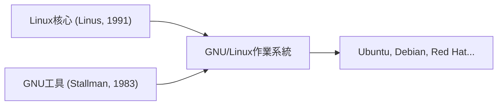

## 1. 林納斯·托瓦茲的興趣
1991年，芬蘭學生林納斯·托瓦茲帶著「這只是一個興趣。並非專業的」這樣的訊息，發布了適用於個人電腦的類UNIX作業系統核心。

## 2. 與GNU計畫的融合
理查·斯托曼推動的自由軟體「GNU計畫」的各種工具與Linux核心結合，完成了一個完整的作業系統「GNU/Linux」。

## 3. 成為支撐網際網路的基礎設施
隨著Apache、MySQL、PHP（LAMP堆疊）的普及，Linux作為免費且穩固的伺服器作業系統，成為了網際網路上Web伺服器的事實標準。

## 4. 作為Android的基礎
現在，Linux核心也被採用為智慧型手機作業系統Android的基礎，成為人類歷史上最普及的作業系統。

## 追加技術驗證部分 1

### 1. 林納斯·托瓦茲的興趣
1991年，芬蘭學生林納斯·托瓦茲帶著「這只是一個興趣。並非專業的」這樣的訊息，發布了適用於個人電腦的類UNIX作業系統核心。

### 2. 與GNU計畫的融合
理查·斯托曼推動的自由軟體「GNU計畫」的各種工具與Linux核心結合，完成了一個完整的作業系統「GNU/Linux」。

### 3. 成為支撐網際網路的基礎設施
隨著Apache、MySQL、PHP（LAMP堆疊）的普及，Linux作為免費且穩固的伺服器作業系統，成為了網際網路上Web伺服器的事實標準。

### 4. 作為Android的基礎
現在，Linux核心也被採用為智慧型手機作業系統Android的基礎，成為人類歷史上最普及的作業系統。

## 追加技術驗證部分 2

### 1. 林納斯·托瓦茲的興趣
1991年，芬蘭學生林納斯·托瓦茲帶著「這只是一個興趣。並非專業的」這樣的訊息，發布了適用於個人電腦的類UNIX作業系統核心。

### 2. 與GNU計畫的融合
理查·斯托曼推動的自由軟體「GNU計畫」的各種工具與Linux核心結合，完成了一個完整的作業系統「GNU/Linux」。

### 3. 成為支撐網際網路的基礎設施
隨著Apache、MySQL、PHP（LAMP堆疊）的普及，Linux作為免費且穩固的伺服器作業系統，成為了網際網路上Web伺服器的事實標準。

### 4. 作為Android的基礎
現在，Linux核心也被採用為智慧型手機作業系統Android的基礎，成為人類歷史上最普及的作業系統。

## 追加技術驗證部分 3

### 1. 林納斯·托瓦茲的興趣
1991年，芬蘭學生林納斯·托瓦茲帶著「這只是一個興趣。並非專業的」這樣的訊息，發布了適用於個人電腦的類UNIX作業系統核心。

### 2. 與GNU計畫的融合
理查·斯托曼推動的自由軟體「GNU計畫」的各種工具與Linux核心結合，完成了一個完整的作業系統「GNU/Linux」。

### 3. 成為支撐網際網路的基礎設施
隨著Apache、MySQL、PHP（LAMP堆疊）的普及，Linux作為免費且穩固的伺服器作業系統，成為了網際網路上Web伺服器的事實標準。

### 4. 作為Android的基礎
現在，Linux核心也被採用為智慧型手機作業系統Android的基礎，成為人類歷史上最普及的作業系統。

## 追加技術驗證部分 4

### 1. 林納斯·托瓦茲的興趣
1991年，芬蘭學生林納斯·托瓦茲帶著「這只是一個興趣。並非專業的」這樣的訊息，發布了適用於個人電腦的類UNIX作業系統核心。

### 2. 與GNU計畫的融合
理查·斯托曼推動的自由軟體「GNU計畫」的各種工具與Linux核心結合，完成了一個完整的作業系統「GNU/Linux」。

### 3. 成為支撐網際網路的基礎設施
隨著Apache、MySQL、PHP（LAMP堆疊）的普及，Linux作為免費且穩固的伺服器作業系統，成為了網際網路上Web伺服器的事實標準。

### 4. 作為Android的基礎
現在，Linux核心也被採用為智慧型手機作業系統Android的基礎，成為人類歷史上最普及的作業系統。

## 追加技術驗證部分 5

### 1. 林納斯·托瓦茲的興趣
1991年，芬蘭學生林納斯·托瓦茲帶著「這只是一個興趣。並非專業的」這樣的訊息，發布了適用於個人電腦的類UNIX作業系統核心。

### 2. 與GNU計畫的融合
理查·斯托曼推動的自由軟體「GNU計畫」的各種工具與Linux核心結合，完成了一個完整的作業系統「GNU/Linux」。

### 3. 成為支撐網際網路的基礎設施
隨著Apache、MySQL、PHP（LAMP堆疊）的普及，Linux作為免費且穩固的伺服器作業系統，成為了網際網路上Web伺服器的事實標準。

### 4. 作為Android的基礎
現在，Linux核心也被採用為智慧型手機作業系統Android的基礎，成為人類歷史上最普及的作業系統。

## 追加技術驗證部分 6

### 1. 林納斯·托瓦茲的興趣
1991年，芬蘭學生林納斯·托瓦茲帶著「這只是一個興趣。並非專業的」這樣的訊息，發布了適用於個人電腦的類UNIX作業系統核心。

### 2. 與GNU計畫的融合
理查·斯托曼推動的自由軟體「GNU計畫」的各種工具與Linux核心結合，完成了一個完整的作業系統「GNU/Linux」。

### 3. 成為支撐網際網路的基礎設施
隨著Apache、MySQL、PHP（LAMP堆疊）的普及，Linux作為免費且穩固的伺服器作業系統，成為了網際網路上Web伺服器的事實標準。

### 4. 作為Android的基礎
現在，Linux核心也被採用為智慧型手機作業系統Android的基礎，成為人類歷史上最普及的作業系統。

## 追加技術驗證部分 7

### 1. 林納斯·托瓦茲的興趣
1991年，芬蘭學生林納斯·托瓦茲帶著「這只是一個興趣。並非專業的」這樣的訊息，發布了適用於個人電腦的類UNIX作業系統核心。

### 2. 與GNU計畫的融合
理查·斯托曼推動的自由軟體「GNU計畫」的各種工具與Linux核心結合，完成了一個完整的作業系統「GNU/Linux」。

### 3. 成為支撐網際網路的基礎設施
隨著Apache、MySQL、PHP（LAMP堆疊）的普及，Linux作為免費且穩固的伺服器作業系統，成為了網際網路上Web伺服器的事實標準。

### 4. 作為Android的基礎
現在，Linux核心也被採用為智慧型手機作業系統Android的基礎，成為人類歷史上最普及的作業系統。

## 追加技術驗證部分 8

### 1. 林納斯·托瓦茲的興趣
1991年，芬蘭學生林納斯·托瓦茲帶著「這只是一個興趣。並非專業的」這樣的訊息，發布了適用於個人電腦的類UNIX作業系統核心。

### 2. 與GNU計畫的融合
理查·斯托曼推動的自由軟體「GNU計畫」的各種工具與Linux核心結合，完成了一個完整的作業系統「GNU/Linux」。

### 3. 成為支撐網際網路的基礎設施
隨著Apache、MySQL、PHP（LAMP堆疊）的普及，Linux作為免費且穩固的伺服器作業系統，成為了網際網路上Web伺服器的事實標準。

### 4. 作為Android的基礎
現在，Linux核心也被採用為智慧型手機作業系統Android的基礎，成為人類歷史上最普及的作業系統。

## 追加技術驗證部分 9

### 1. 林納斯·托瓦茲的興趣
1991年，芬蘭學生林納斯·托瓦茲帶著「這只是一個興趣。並非專業的」這樣的訊息，發布了適用於個人電腦的類UNIX作業系統核心。

### 2. 與GNU計畫的融合
理查·斯托曼推動的自由軟體「GNU計畫」的各種工具與Linux核心結合，完成了一個完整的作業系統「GNU/Linux」。

### 3. 成為支撐網際網路的基礎設施
隨著Apache、MySQL、PHP（LAMP堆疊）的普及，Linux作為免費且穩固的伺服器作業系統，成為了網際網路上Web伺服器的事實標準。

### 4. 作為Android的基礎
現在，Linux核心也被採用為智慧型手機作業系統Android的基礎，成為人類歷史上最普及的作業系統。

## 追加技術驗證部分 10

### 1. 林納斯·托瓦茲的興趣
1991年，芬蘭學生林納斯·托瓦茲帶著「這只是一個興趣。並非專業的」這樣的訊息，發布了適用於個人電腦的類UNIX作業系統核心。

### 2. 與GNU計畫的融合
理查·斯托曼推動的自由軟體「GNU計畫」的各種工具與Linux核心結合，完成了一個完整的作業系統「GNU/Linux」。

### 3. 成為支撐網際網路的基礎設施
隨著Apache、MySQL、PHP（LAMP堆疊）的普及，Linux作為免費且穩固的伺服器作業系統，成為了網際網路上Web伺服器的事實標準。

### 4. 作為Android的基礎
現在，Linux核心也被採用為智慧型手機作業系統Android的基礎，成為人類歷史上最普及的作業系統。

## 追加技術驗證部分 11

### 1. 林納斯·托瓦茲的興趣
1991年，芬蘭學生林納斯·托瓦茲帶著「這只是一個興趣。並非專業的」這樣的訊息，發布了適用於個人電腦的類UNIX作業系統核心。

### 2. 與GNU計畫的融合
理查·斯托曼推動的自由軟體「GNU計畫」的各種工具與Linux核心結合，完成了一個完整的作業系統「GNU/Linux」。

### 3. 成為支撐網際網路的基礎設施
隨著Apache、MySQL、PHP（LAMP堆疊）的普及，Linux作為免費且穩固的伺服器作業系統，成為了網際網路上Web伺服器的事實標準。

### 4. 作為Android的基礎
現在，Linux核心也被採用為智慧型手機作業系統Android的基礎，成為人類歷史上最普及的作業系統。

## 追加技術驗證部分 12

### 1. 林納斯·托瓦茲的興趣
1991年，芬蘭學生林納斯·托瓦茲帶著「這只是一個興趣。並非專業的」這樣的訊息，發布了適用於個人電腦的類UNIX作業系統核心。

### 2. 與GNU計畫的融合
理查·斯托曼推動的自由軟體「GNU計畫」的各種工具與Linux核心結合，完成了一個完整的作業系統「GNU/Linux」。

### 3. 成為支撐網際網路的基礎設施
隨著Apache、MySQL、PHP（LAMP堆疊）的普及，Linux作為免費且穩固的伺服器作業系統，成為了網際網路上Web伺服器的事實標準。

### 4. 作為Android的基礎
現在，Linux核心也被採用為智慧型手機作業系統Android的基礎，成為人類歷史上最普及的作業系統。

## 追加技術驗證部分 13

### 1. 林納斯·托瓦茲的興趣
1991年，芬蘭學生林納斯·托瓦茲帶著「這只是一個興趣。並非專業的」這樣的訊息，發布了適用於個人電腦的類UNIX作業系統核心。

### 2. 與GNU計畫的融合
理查·斯托曼推動的自由軟體「GNU計畫」的各種工具與Linux核心結合，完成了一個完整的作業系統「GNU/Linux」。

### 3. 成為支撐網際網路的基礎設施
隨著Apache、MySQL、PHP（LAMP堆疊）的普及，Linux作為免費且穩固的伺服器作業系統，成為了網際網路上Web伺服器的事實標準。

### 4. 作為Android的基礎
現在，Linux核心也被採用為智慧型手機作業系統Android的基礎，成為人類歷史上最普及的作業系統。

## 追加技術驗證部分 14

### 1. 林納斯·托瓦茲的興趣
1991年，芬蘭學生林納斯·托瓦茲帶著「這只是一個興趣。並非專業的」這樣的訊息，發布了適用於個人電腦的類UNIX作業系統核心。

### 2. 與GNU計畫的融合
理查·斯托曼推動的自由軟體「GNU計畫」的各種工具與Linux核心結合，完成了一個完整的作業系統「GNU/Linux」。

### 3. 成為支撐網際網路的基礎設施
隨著Apache、MySQL、PHP（LAMP堆疊）的普及，Linux作為免費且穩固的伺服器作業系統，成為了網際網路上Web伺服器的事實標準。

### 4. 作為Android的基礎
現在，Linux核心也被採用為智慧型手機作業系統Android的基礎，成為人類歷史上最普及的作業系統。
