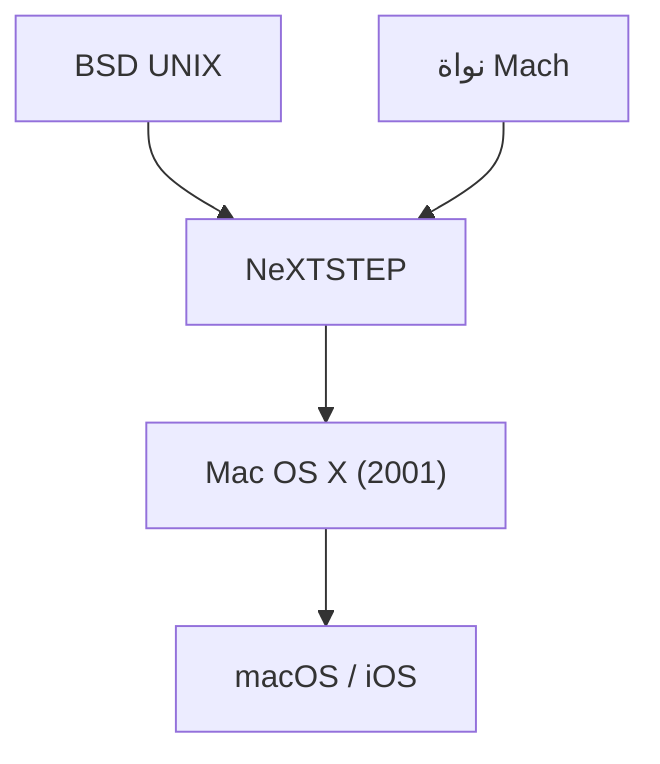

## 1. حدود نظام Mac OS الكلاسيكي
منذ ظهور جهاز Macintosh في عام 1984، كانت أنظمة تشغيل Apple (من System 1 إلى Mac OS 9) مبتكرة، لكنها افتقرت إلى حماية الذاكرة وتعدد المهام الوقائي، مما جعلها تعاني من مشاكل في الاستقرار.

## 2. سلالة NeXTSTEP
كان نظام "NeXTSTEP" الخاص بشركة NeXT التي أسسها ستيف جوبز يعتمد على نواة Mach القوية ونظام BSD UNIX. في عام 1997، استحوذت Apple على شركة NeXT، وجعلت من سلالة UNIX هذه أساسًا للجيل القادم من نظام Mac OS.

## 3. ولادة Mac OS X
كان نظام Mac OS X الذي تم إصداره في عام 2001 عبارة عن نظام تشغيل هجين، حيث تعمل خلف واجهة Aqua الرسومية الجميلة بنية UNIX صلبة (نواة Darwin).

## 4. من UNIX إلى أنظمة تشغيل الأجهزة المحمولة
تم تحسين التقنيات الأساسية لنظام macOS لاحقًا لتصبح "iOS" لأجهزة iPhone، مما أدى إلى بناء نظام بيئي قوي يشكل الأساس لجميع أجهزة Apple.

## جزء التحقق الفني الإضافي 1

### 1. حدود نظام Mac OS الكلاسيكي
منذ ظهور جهاز Macintosh في عام 1984، كانت أنظمة تشغيل Apple (من System 1 إلى Mac OS 9) مبتكرة، لكنها افتقرت إلى حماية الذاكرة وتعدد المهام الوقائي، مما جعلها تعاني من مشاكل في الاستقرار.

### 2. سلالة NeXTSTEP
كان نظام "NeXTSTEP" الخاص بشركة NeXT التي أسسها ستيف جوبز يعتمد على نواة Mach القوية ونظام BSD UNIX. في عام 1997، استحوذت Apple على شركة NeXT، وجعلت من سلالة UNIX هذه أساسًا للجيل القادم من نظام Mac OS.

### 3. ولادة Mac OS X
كان نظام Mac OS X الذي تم إصداره في عام 2001 عبارة عن نظام تشغيل هجين، حيث تعمل خلف واجهة Aqua الرسومية الجميلة بنية UNIX صلبة (نواة Darwin).

### 4. من UNIX إلى أنظمة تشغيل الأجهزة المحمولة
تم تحسين التقنيات الأساسية لنظام macOS لاحقًا لتصبح "iOS" لأجهزة iPhone، مما أدى إلى بناء نظام بيئي قوي يشكل الأساس لجميع أجهزة Apple.

## جزء التحقق الفني الإضافي 2

### 1. حدود نظام Mac OS الكلاسيكي
منذ ظهور جهاز Macintosh في عام 1984، كانت أنظمة تشغيل Apple (من System 1 إلى Mac OS 9) مبتكرة، لكنها افتقرت إلى حماية الذاكرة وتعدد المهام الوقائي، مما جعلها تعاني من مشاكل في الاستقرار.

### 2. سلالة NeXTSTEP
كان نظام "NeXTSTEP" الخاص بشركة NeXT التي أسسها ستيف جوبز يعتمد على نواة Mach القوية ونظام BSD UNIX. في عام 1997، استحوذت Apple على شركة NeXT، وجعلت من سلالة UNIX هذه أساسًا للجيل القادم من نظام Mac OS.

### 3. ولادة Mac OS X
كان نظام Mac OS X الذي تم إصداره في عام 2001 عبارة عن نظام تشغيل هجين، حيث تعمل خلف واجهة Aqua الرسومية الجميلة بنية UNIX صلبة (نواة Darwin).

### 4. من UNIX إلى أنظمة تشغيل الأجهزة المحمولة
تم تحسين التقنيات الأساسية لنظام macOS لاحقًا لتصبح "iOS" لأجهزة iPhone، مما أدى إلى بناء نظام بيئي قوي يشكل الأساس لجميع أجهزة Apple.

## جزء التحقق الفني الإضافي 3

### 1. حدود نظام Mac OS الكلاسيكي
منذ ظهور جهاز Macintosh في عام 1984، كانت أنظمة تشغيل Apple (من System 1 إلى Mac OS 9) مبتكرة، لكنها افتقرت إلى حماية الذاكرة وتعدد المهام الوقائي، مما جعلها تعاني من مشاكل في الاستقرار.

### 2. سلالة NeXTSTEP
كان نظام "NeXTSTEP" الخاص بشركة NeXT التي أسسها ستيف جوبز يعتمد على نواة Mach القوية ونظام BSD UNIX. في عام 1997، استحوذت Apple على شركة NeXT، وجعلت من سلالة UNIX هذه أساسًا للجيل القادم من نظام Mac OS.

### 3. ولادة Mac OS X
كان نظام Mac OS X الذي تم إصداره في عام 2001 عبارة عن نظام تشغيل هجين، حيث تعمل خلف واجهة Aqua الرسومية الجميلة بنية UNIX صلبة (نواة Darwin).

### 4. من UNIX إلى أنظمة تشغيل الأجهزة المحمولة
تم تحسين التقنيات الأساسية لنظام macOS لاحقًا لتصبح "iOS" لأجهزة iPhone، مما أدى إلى بناء نظام بيئي قوي يشكل الأساس لجميع أجهزة Apple.

## جزء التحقق الفني الإضافي 4

### 1. حدود نظام Mac OS الكلاسيكي
منذ ظهور جهاز Macintosh في عام 1984، كانت أنظمة تشغيل Apple (من System 1 إلى Mac OS 9) مبتكرة، لكنها افتقرت إلى حماية الذاكرة وتعدد المهام الوقائي، مما جعلها تعاني من مشاكل في الاستقرار.

### 2. سلالة NeXTSTEP
كان نظام "NeXTSTEP" الخاص بشركة NeXT التي أسسها ستيف جوبز يعتمد على نواة Mach القوية ونظام BSD UNIX. في عام 1997، استحوذت Apple على شركة NeXT، وجعلت من سلالة UNIX هذه أساسًا للجيل القادم من نظام Mac OS.

### 3. ولادة Mac OS X
كان نظام Mac OS X الذي تم إصداره في عام 2001 عبارة عن نظام تشغيل هجين، حيث تعمل خلف واجهة Aqua الرسومية الجميلة بنية UNIX صلبة (نواة Darwin).

### 4. من UNIX إلى أنظمة تشغيل الأجهزة المحمولة
تم تحسين التقنيات الأساسية لنظام macOS لاحقًا لتصبح "iOS" لأجهزة iPhone، مما أدى إلى بناء نظام بيئي قوي يشكل الأساس لجميع أجهزة Apple.

## جزء التحقق الفني الإضافي 5

### 1. حدود نظام Mac OS الكلاسيكي
منذ ظهور جهاز Macintosh في عام 1984، كانت أنظمة تشغيل Apple (من System 1 إلى Mac OS 9) مبتكرة، لكنها افتقرت إلى حماية الذاكرة وتعدد المهام الوقائي، مما جعلها تعاني من مشاكل في الاستقرار.

### 2. سلالة NeXTSTEP
كان نظام "NeXTSTEP" الخاص بشركة NeXT التي أسسها ستيف جوبز يعتمد على نواة Mach القوية ونظام BSD UNIX. في عام 1997، استحوذت Apple على شركة NeXT، وجعلت من سلالة UNIX هذه أساسًا للجيل القادم من نظام Mac OS.

### 3. ولادة Mac OS X
كان نظام Mac OS X الذي تم إصداره في عام 2001 عبارة عن نظام تشغيل هجين، حيث تعمل خلف واجهة Aqua الرسومية الجميلة بنية UNIX صلبة (نواة Darwin).

### 4. من UNIX إلى أنظمة تشغيل الأجهزة المحمولة
تم تحسين التقنيات الأساسية لنظام macOS لاحقًا لتصبح "iOS" لأجهزة iPhone، مما أدى إلى بناء نظام بيئي قوي يشكل الأساس لجميع أجهزة Apple.

## جزء التحقق الفني الإضافي 6

### 1. حدود نظام Mac OS الكلاسيكي
منذ ظهور جهاز Macintosh في عام 1984، كانت أنظمة تشغيل Apple (من System 1 إلى Mac OS 9) مبتكرة، لكنها افتقرت إلى حماية الذاكرة وتعدد المهام الوقائي، مما جعلها تعاني من مشاكل في الاستقرار.

### 2. سلالة NeXTSTEP
كان نظام "NeXTSTEP" الخاص بشركة NeXT التي أسسها ستيف جوبز يعتمد على نواة Mach القوية ونظام BSD UNIX. في عام 1997، استحوذت Apple على شركة NeXT، وجعلت من سلالة UNIX هذه أساسًا للجيل القادم من نظام Mac OS.

### 3. ولادة Mac OS X
كان نظام Mac OS X الذي تم إصداره في عام 2001 عبارة عن نظام تشغيل هجين، حيث تعمل خلف واجهة Aqua الرسومية الجميلة بنية UNIX صلبة (نواة Darwin).

### 4. من UNIX إلى أنظمة تشغيل الأجهزة المحمولة
تم تحسين التقنيات الأساسية لنظام macOS لاحقًا لتصبح "iOS" لأجهزة iPhone، مما أدى إلى بناء نظام بيئي قوي يشكل الأساس لجميع أجهزة Apple.

## جزء التحقق الفني الإضافي 7

### 1. حدود نظام Mac OS الكلاسيكي
منذ ظهور جهاز Macintosh في عام 1984، كانت أنظمة تشغيل Apple (من System 1 إلى Mac OS 9) مبتكرة، لكنها افتقرت إلى حماية الذاكرة وتعدد المهام الوقائي، مما جعلها تعاني من مشاكل في الاستقرار.

### 2. سلالة NeXTSTEP
كان نظام "NeXTSTEP" الخاص بشركة NeXT التي أسسها ستيف جوبز يعتمد على نواة Mach القوية ونظام BSD UNIX. في عام 1997، استحوذت Apple على شركة NeXT، وجعلت من سلالة UNIX هذه أساسًا للجيل القادم من نظام Mac OS.

### 3. ولادة Mac OS X
كان نظام Mac OS X الذي تم إصداره في عام 2001 عبارة عن نظام تشغيل هجين، حيث تعمل خلف واجهة Aqua الرسومية الجميلة بنية UNIX صلبة (نواة Darwin).

### 4. من UNIX إلى أنظمة تشغيل الأجهزة المحمولة
تم تحسين التقنيات الأساسية لنظام macOS لاحقًا لتصبح "iOS" لأجهزة iPhone، مما أدى إلى بناء نظام بيئي قوي يشكل الأساس لجميع أجهزة Apple.

## جزء التحقق الفني الإضافي 8

### 1. حدود نظام Mac OS الكلاسيكي
منذ ظهور جهاز Macintosh في عام 1984، كانت أنظمة تشغيل Apple (من System 1 إلى Mac OS 9) مبتكرة، لكنها افتقرت إلى حماية الذاكرة وتعدد المهام الوقائي، مما جعلها تعاني من مشاكل في الاستقرار.

### 2. سلالة NeXTSTEP
كان نظام "NeXTSTEP" الخاص بشركة NeXT التي أسسها ستيف جوبز يعتمد على نواة Mach القوية ونظام BSD UNIX. في عام 1997، استحوذت Apple على شركة NeXT، وجعلت من سلالة UNIX هذه أساسًا للجيل القادم من نظام Mac OS.

### 3. ولادة Mac OS X
كان نظام Mac OS X الذي تم إصداره في عام 2001 عبارة عن نظام تشغيل هجين، حيث تعمل خلف واجهة Aqua الرسومية الجميلة بنية UNIX صلبة (نواة Darwin).

### 4. من UNIX إلى أنظمة تشغيل الأجهزة المحمولة
تم تحسين التقنيات الأساسية لنظام macOS لاحقًا لتصبح "iOS" لأجهزة iPhone، مما أدى إلى بناء نظام بيئي قوي يشكل الأساس لجميع أجهزة Apple.

## جزء التحقق الفني الإضافي 9

### 1. حدود نظام Mac OS الكلاسيكي
منذ ظهور جهاز Macintosh في عام 1984، كانت أنظمة تشغيل Apple (من System 1 إلى Mac OS 9) مبتكرة، لكنها افتقرت إلى حماية الذاكرة وتعدد المهام الوقائي، مما جعلها تعاني من مشاكل في الاستقرار.

### 2. سلالة NeXTSTEP
كان نظام "NeXTSTEP" الخاص بشركة NeXT التي أسسها ستيف جوبز يعتمد على نواة Mach القوية ونظام BSD UNIX. في عام 1997، استحوذت Apple على شركة NeXT، وجعلت من سلالة UNIX هذه أساسًا للجيل القادم من نظام Mac OS.

### 3. ولادة Mac OS X
كان نظام Mac OS X الذي تم إصداره في عام 2001 عبارة عن نظام تشغيل هجين، حيث تعمل خلف واجهة Aqua الرسومية الجميلة بنية UNIX صلبة (نواة Darwin).

### 4. من UNIX إلى أنظمة تشغيل الأجهزة المحمولة
تم تحسين التقنيات الأساسية لنظام macOS لاحقًا لتصبح "iOS" لأجهزة iPhone، مما أدى إلى بناء نظام بيئي قوي يشكل الأساس لجميع أجهزة Apple.

## جزء التحقق الفني الإضافي 10

### 1. حدود نظام Mac OS الكلاسيكي
منذ ظهور جهاز Macintosh في عام 1984، كانت أنظمة تشغيل Apple (من System 1 إلى Mac OS 9) مبتكرة، لكنها افتقرت إلى حماية الذاكرة وتعدد المهام الوقائي، مما جعلها تعاني من مشاكل في الاستقرار.

### 2. سلالة NeXTSTEP
كان نظام "NeXTSTEP" الخاص بشركة NeXT التي أسسها ستيف جوبز يعتمد على نواة Mach القوية ونظام BSD UNIX. في عام 1997، استحوذت Apple على شركة NeXT، وجعلت من سلالة UNIX هذه أساسًا للجيل القادم من نظام Mac OS.

### 3. ولادة Mac OS X
كان نظام Mac OS X الذي تم إصداره في عام 2001 عبارة عن نظام تشغيل هجين، حيث تعمل خلف واجهة Aqua الرسومية الجميلة بنية UNIX صلبة (نواة Darwin).

### 4. من UNIX إلى أنظمة تشغيل الأجهزة المحمولة
تم تحسين التقنيات الأساسية لنظام macOS لاحقًا لتصبح "iOS" لأجهزة iPhone، مما أدى إلى بناء نظام بيئي قوي يشكل الأساس لجميع أجهزة Apple.

## جزء التحقق الفني الإضافي 11

### 1. حدود نظام Mac OS الكلاسيكي
منذ ظهور جهاز Macintosh في عام 1984، كانت أنظمة تشغيل Apple (من System 1 إلى Mac OS 9) مبتكرة، لكنها افتقرت إلى حماية الذاكرة وتعدد المهام الوقائي، مما جعلها تعاني من مشاكل في الاستقرار.

### 2. سلالة NeXTSTEP
كان نظام "NeXTSTEP" الخاص بشركة NeXT التي أسسها ستيف جوبز يعتمد على نواة Mach القوية ونظام BSD UNIX. في عام 1997، استحوذت Apple على شركة NeXT، وجعلت من سلالة UNIX هذه أساسًا للجيل القادم من نظام Mac OS.

### 3. ولادة Mac OS X
كان نظام Mac OS X الذي تم إصداره في عام 2001 عبارة عن نظام تشغيل هجين، حيث تعمل خلف واجهة Aqua الرسومية الجميلة بنية UNIX صلبة (نواة Darwin).

### 4. من UNIX إلى أنظمة تشغيل الأجهزة المحمولة
تم تحسين التقنيات الأساسية لنظام macOS لاحقًا لتصبح "iOS" لأجهزة iPhone، مما أدى إلى بناء نظام بيئي قوي يشكل الأساس لجميع أجهزة Apple.

## جزء التحقق الفني الإضافي 12

### 1. حدود نظام Mac OS الكلاسيكي
منذ ظهور جهاز Macintosh في عام 1984، كانت أنظمة تشغيل Apple (من System 1 إلى Mac OS 9) مبتكرة، لكنها افتقرت إلى حماية الذاكرة وتعدد المهام الوقائي، مما جعلها تعاني من مشاكل في الاستقرار.

### 2. سلالة NeXTSTEP
كان نظام "NeXTSTEP" الخاص بشركة NeXT التي أسسها ستيف جوبز يعتمد على نواة Mach القوية ونظام BSD UNIX. في عام 1997، استحوذت Apple على شركة NeXT، وجعلت من سلالة UNIX هذه أساسًا للجيل القادم من نظام Mac OS.

### 3. ولادة Mac OS X
كان نظام Mac OS X الذي تم إصداره في عام 2001 عبارة عن نظام تشغيل هجين، حيث تعمل خلف واجهة Aqua الرسومية الجميلة بنية UNIX صلبة (نواة Darwin).

### 4. من UNIX إلى أنظمة تشغيل الأجهزة المحمولة
تم تحسين التقنيات الأساسية لنظام macOS لاحقًا لتصبح "iOS" لأجهزة iPhone، مما أدى إلى بناء نظام بيئي قوي يشكل الأساس لجميع أجهزة Apple.

## جزء التحقق الفني الإضافي 13

### 1. حدود نظام Mac OS الكلاسيكي
منذ ظهور جهاز Macintosh في عام 1984، كانت أنظمة تشغيل Apple (من System 1 إلى Mac OS 9) مبتكرة، لكنها افتقرت إلى حماية الذاكرة وتعدد المهام الوقائي، مما جعلها تعاني من مشاكل في الاستقرار.

### 2. سلالة NeXTSTEP
كان نظام "NeXTSTEP" الخاص بشركة NeXT التي أسسها ستيف جوبز يعتمد على نواة Mach القوية ونظام BSD UNIX. في عام 1997، استحوذت Apple على شركة NeXT، وجعلت من سلالة UNIX هذه أساسًا للجيل القادم من نظام Mac OS.

### 3. ولادة Mac OS X
كان نظام Mac OS X الذي تم إصداره في عام 2001 عبارة عن نظام تشغيل هجين، حيث تعمل خلف واجهة Aqua الرسومية الجميلة بنية UNIX صلبة (نواة Darwin).

### 4. من UNIX إلى أنظمة تشغيل الأجهزة المحمولة
تم تحسين التقنيات الأساسية لنظام macOS لاحقًا لتصبح "iOS" لأجهزة iPhone، مما أدى إلى بناء نظام بيئي قوي يشكل الأساس لجميع أجهزة Apple.

## جزء التحقق الفني الإضافي 14

### 1. حدود نظام Mac OS الكلاسيكي
منذ ظهور جهاز Macintosh في عام 1984، كانت أنظمة تشغيل Apple (من System 1 إلى Mac OS 9) مبتكرة، لكنها افتقرت إلى حماية الذاكرة وتعدد المهام الوقائي، مما جعلها تعاني من مشاكل في الاستقرار.

### 2. سلالة NeXTSTEP
كان نظام "NeXTSTEP" الخاص بشركة NeXT التي أسسها ستيف جوبز يعتمد على نواة Mach القوية ونظام BSD UNIX. في عام 1997، استحوذت Apple على شركة NeXT، وجعلت من سلالة UNIX هذه أساسًا للجيل القادم من نظام Mac OS.

### 3. ولادة Mac OS X
كان نظام Mac OS X الذي تم إصداره في عام 2001 عبارة عن نظام تشغيل هجين، حيث تعمل خلف واجهة Aqua الرسومية الجميلة بنية UNIX صلبة (نواة Darwin).

### 4. من UNIX إلى أنظمة تشغيل الأجهزة المحمولة
تم تحسين التقنيات الأساسية لنظام macOS لاحقًا لتصبح "iOS" لأجهزة iPhone، مما أدى إلى بناء نظام بيئي قوي يشكل الأساس لجميع أجهزة Apple.
