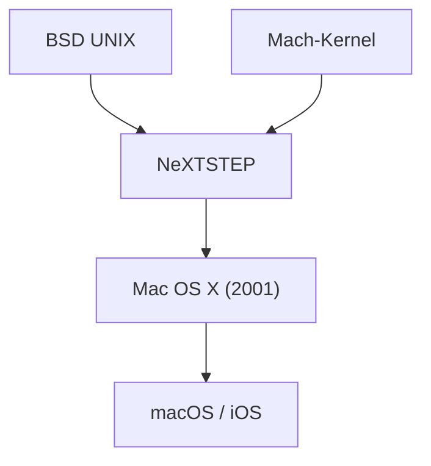

## 1. Die Grenzen des klassischen Mac OS
Seit der Einführung des Macintosh im Jahr 1984 waren die Betriebssysteme von Apple (System 1 bis Mac OS 9) zwar innovativ, verfügten jedoch weder über Speicherschutz noch über präemptives Multitasking und hatten daher mit Stabilitätsproblemen zu kämpfen.

## 2. Der Stammbaum von NeXTSTEP
Das von Jobs gegründete Betriebssystem „NeXTSTEP“ von NeXT basierte auf dem leistungsstarken Mach-Kernel und BSD UNIX. 1997 kaufte Apple NeXT und machte diesen UNIX-Stammbaum zur Grundlage für das Mac OS der nächsten Generation.

## 3. Die Geburt von Mac OS X
Das 2001 veröffentlichte Mac OS X war ein hybrides Betriebssystem, bei dem ein robustes UNIX (Darwin-Kernel) hinter der schönen GUI der Aqua-Benutzeroberfläche lief.

## 4. Von UNIX zum mobilen Betriebssystem
Die Kerntechnologie von macOS wurde später für das „iOS“ des iPhone optimiert und bildete ein starkes Ökosystem, das als Fundament für alle Apple-Geräte dient.

## Zusätzlicher technischer Validierungsteil 1

### 1. Die Grenzen des klassischen Mac OS
Seit der Einführung des Macintosh im Jahr 1984 waren die Betriebssysteme von Apple (System 1 bis Mac OS 9) zwar innovativ, verfügten jedoch weder über Speicherschutz noch über präemptives Multitasking und hatten daher mit Stabilitätsproblemen zu kämpfen.

### 2. Der Stammbaum von NeXTSTEP
Das von Jobs gegründete Betriebssystem „NeXTSTEP“ von NeXT basierte auf dem leistungsstarken Mach-Kernel und BSD UNIX. 1997 kaufte Apple NeXT und machte diesen UNIX-Stammbaum zur Grundlage für das Mac OS der nächsten Generation.

### 3. Die Geburt von Mac OS X
Das 2001 veröffentlichte Mac OS X war ein hybrides Betriebssystem, bei dem ein robustes UNIX (Darwin-Kernel) hinter der schönen GUI der Aqua-Benutzeroberfläche lief.

### 4. Von UNIX zum mobilen Betriebssystem
Die Kerntechnologie von macOS wurde später für das „iOS“ des iPhone optimiert und bildete ein starkes Ökosystem, das als Fundament für alle Apple-Geräte dient.

## Zusätzlicher technischer Validierungsteil 2

### 1. Die Grenzen des klassischen Mac OS
Seit der Einführung des Macintosh im Jahr 1984 waren die Betriebssysteme von Apple (System 1 bis Mac OS 9) zwar innovativ, verfügten jedoch weder über Speicherschutz noch über präemptives Multitasking und hatten daher mit Stabilitätsproblemen zu kämpfen.

### 2. Der Stammbaum von NeXTSTEP
Das von Jobs gegründete Betriebssystem „NeXTSTEP“ von NeXT basierte auf dem leistungsstarken Mach-Kernel und BSD UNIX. 1997 kaufte Apple NeXT und machte diesen UNIX-Stammbaum zur Grundlage für das Mac OS der nächsten Generation.

### 3. Die Geburt von Mac OS X
Das 2001 veröffentlichte Mac OS X war ein hybrides Betriebssystem, bei dem ein robustes UNIX (Darwin-Kernel) hinter der schönen GUI der Aqua-Benutzeroberfläche lief.

### 4. Von UNIX zum mobilen Betriebssystem
Die Kerntechnologie von macOS wurde später für das „iOS“ des iPhone optimiert und bildete ein starkes Ökosystem, das als Fundament für alle Apple-Geräte dient.

## Zusätzlicher technischer Validierungsteil 3

### 1. Die Grenzen des klassischen Mac OS
Seit der Einführung des Macintosh im Jahr 1984 waren die Betriebssysteme von Apple (System 1 bis Mac OS 9) zwar innovativ, verfügten jedoch weder über Speicherschutz noch über präemptives Multitasking und hatten daher mit Stabilitätsproblemen zu kämpfen.

### 2. Der Stammbaum von NeXTSTEP
Das von Jobs gegründete Betriebssystem „NeXTSTEP“ von NeXT basierte auf dem leistungsstarken Mach-Kernel und BSD UNIX. 1997 kaufte Apple NeXT und machte diesen UNIX-Stammbaum zur Grundlage für das Mac OS der nächsten Generation.

### 3. Die Geburt von Mac OS X
Das 2001 veröffentlichte Mac OS X war ein hybrides Betriebssystem, bei dem ein robustes UNIX (Darwin-Kernel) hinter der schönen GUI der Aqua-Benutzeroberfläche lief.

### 4. Von UNIX zum mobilen Betriebssystem
Die Kerntechnologie von macOS wurde später für das „iOS“ des iPhone optimiert und bildete ein starkes Ökosystem, das als Fundament für alle Apple-Geräte dient.

## Zusätzlicher technischer Validierungsteil 4

### 1. Die Grenzen des klassischen Mac OS
Seit der Einführung des Macintosh im Jahr 1984 waren die Betriebssysteme von Apple (System 1 bis Mac OS 9) zwar innovativ, verfügten jedoch weder über Speicherschutz noch über präemptives Multitasking und hatten daher mit Stabilitätsproblemen zu kämpfen.

### 2. Der Stammbaum von NeXTSTEP
Das von Jobs gegründete Betriebssystem „NeXTSTEP“ von NeXT basierte auf dem leistungsstarken Mach-Kernel und BSD UNIX. 1997 kaufte Apple NeXT und machte diesen UNIX-Stammbaum zur Grundlage für das Mac OS der nächsten Generation.

### 3. Die Geburt von Mac OS X
Das 2001 veröffentlichte Mac OS X war ein hybrides Betriebssystem, bei dem ein robustes UNIX (Darwin-Kernel) hinter der schönen GUI der Aqua-Benutzeroberfläche lief.

### 4. Von UNIX zum mobilen Betriebssystem
Die Kerntechnologie von macOS wurde später für das „iOS“ des iPhone optimiert und bildete ein starkes Ökosystem, das als Fundament für alle Apple-Geräte dient.

## Zusätzlicher technischer Validierungsteil 5

### 1. Die Grenzen des klassischen Mac OS
Seit der Einführung des Macintosh im Jahr 1984 waren die Betriebssysteme von Apple (System 1 bis Mac OS 9) zwar innovativ, verfügten jedoch weder über Speicherschutz noch über präemptives Multitasking und hatten daher mit Stabilitätsproblemen zu kämpfen.

### 2. Der Stammbaum von NeXTSTEP
Das von Jobs gegründete Betriebssystem „NeXTSTEP“ von NeXT basierte auf dem leistungsstarken Mach-Kernel und BSD UNIX. 1997 kaufte Apple NeXT und machte diesen UNIX-Stammbaum zur Grundlage für das Mac OS der nächsten Generation.

### 3. Die Geburt von Mac OS X
Das 2001 veröffentlichte Mac OS X war ein hybrides Betriebssystem, bei dem ein robustes UNIX (Darwin-Kernel) hinter der schönen GUI der Aqua-Benutzeroberfläche lief.

### 4. Von UNIX zum mobilen Betriebssystem
Die Kerntechnologie von macOS wurde später für das „iOS“ des iPhone optimiert und bildete ein starkes Ökosystem, das als Fundament für alle Apple-Geräte dient.

## Zusätzlicher technischer Validierungsteil 6

### 1. Die Grenzen des klassischen Mac OS
Seit der Einführung des Macintosh im Jahr 1984 waren die Betriebssysteme von Apple (System 1 bis Mac OS 9) zwar innovativ, verfügten jedoch weder über Speicherschutz noch über präemptives Multitasking und hatten daher mit Stabilitätsproblemen zu kämpfen.

### 2. Der Stammbaum von NeXTSTEP
Das von Jobs gegründete Betriebssystem „NeXTSTEP“ von NeXT basierte auf dem leistungsstarken Mach-Kernel und BSD UNIX. 1997 kaufte Apple NeXT und machte diesen UNIX-Stammbaum zur Grundlage für das Mac OS der nächsten Generation.

### 3. Die Geburt von Mac OS X
Das 2001 veröffentlichte Mac OS X war ein hybrides Betriebssystem, bei dem ein robustes UNIX (Darwin-Kernel) hinter der schönen GUI der Aqua-Benutzeroberfläche lief.

### 4. Von UNIX zum mobilen Betriebssystem
Die Kerntechnologie von macOS wurde später für das „iOS“ des iPhone optimiert und bildete ein starkes Ökosystem, das als Fundament für alle Apple-Geräte dient.

## Zusätzlicher technischer Validierungsteil 7

### 1. Die Grenzen des klassischen Mac OS
Seit der Einführung des Macintosh im Jahr 1984 waren die Betriebssysteme von Apple (System 1 bis Mac OS 9) zwar innovativ, verfügten jedoch weder über Speicherschutz noch über präemptives Multitasking und hatten daher mit Stabilitätsproblemen zu kämpfen.

### 2. Der Stammbaum von NeXTSTEP
Das von Jobs gegründete Betriebssystem „NeXTSTEP“ von NeXT basierte auf dem leistungsstarken Mach-Kernel und BSD UNIX. 1997 kaufte Apple NeXT und machte diesen UNIX-Stammbaum zur Grundlage für das Mac OS der nächsten Generation.

### 3. Die Geburt von Mac OS X
Das 2001 veröffentlichte Mac OS X war ein hybrides Betriebssystem, bei dem ein robustes UNIX (Darwin-Kernel) hinter der schönen GUI der Aqua-Benutzeroberfläche lief.

### 4. Von UNIX zum mobilen Betriebssystem
Die Kerntechnologie von macOS wurde später für das „iOS“ des iPhone optimiert und bildete ein starkes Ökosystem, das als Fundament für alle Apple-Geräte dient.

## Zusätzlicher technischer Validierungsteil 8

### 1. Die Grenzen des klassischen Mac OS
Seit der Einführung des Macintosh im Jahr 1984 waren die Betriebssysteme von Apple (System 1 bis Mac OS 9) zwar innovativ, verfügten jedoch weder über Speicherschutz noch über präemptives Multitasking und hatten daher mit Stabilitätsproblemen zu kämpfen.

### 2. Der Stammbaum von NeXTSTEP
Das von Jobs gegründete Betriebssystem „NeXTSTEP“ von NeXT basierte auf dem leistungsstarken Mach-Kernel und BSD UNIX. 1997 kaufte Apple NeXT und machte diesen UNIX-Stammbaum zur Grundlage für das Mac OS der nächsten Generation.

### 3. Die Geburt von Mac OS X
Das 2001 veröffentlichte Mac OS X war ein hybrides Betriebssystem, bei dem ein robustes UNIX (Darwin-Kernel) hinter der schönen GUI der Aqua-Benutzeroberfläche lief.

### 4. Von UNIX zum mobilen Betriebssystem
Die Kerntechnologie von macOS wurde später für das „iOS“ des iPhone optimiert und bildete ein starkes Ökosystem, das als Fundament für alle Apple-Geräte dient.

## Zusätzlicher technischer Validierungsteil 9

### 1. Die Grenzen des klassischen Mac OS
Seit der Einführung des Macintosh im Jahr 1984 waren die Betriebssysteme von Apple (System 1 bis Mac OS 9) zwar innovativ, verfügten jedoch weder über Speicherschutz noch über präemptives Multitasking und hatten daher mit Stabilitätsproblemen zu kämpfen.

### 2. Der Stammbaum von NeXTSTEP
Das von Jobs gegründete Betriebssystem „NeXTSTEP“ von NeXT basierte auf dem leistungsstarken Mach-Kernel und BSD UNIX. 1997 kaufte Apple NeXT und machte diesen UNIX-Stammbaum zur Grundlage für das Mac OS der nächsten Generation.

### 3. Die Geburt von Mac OS X
Das 2001 veröffentlichte Mac OS X war ein hybrides Betriebssystem, bei dem ein robustes UNIX (Darwin-Kernel) hinter der schönen GUI der Aqua-Benutzeroberfläche lief.

### 4. Von UNIX zum mobilen Betriebssystem
Die Kerntechnologie von macOS wurde später für das „iOS“ des iPhone optimiert und bildete ein starkes Ökosystem, das als Fundament für alle Apple-Geräte dient.

## Zusätzlicher technischer Validierungsteil 10

### 1. Die Grenzen des klassischen Mac OS
Seit der Einführung des Macintosh im Jahr 1984 waren die Betriebssysteme von Apple (System 1 bis Mac OS 9) zwar innovativ, verfügten jedoch weder über Speicherschutz noch über präemptives Multitasking und hatten daher mit Stabilitätsproblemen zu kämpfen.

### 2. Der Stammbaum von NeXTSTEP
Das von Jobs gegründete Betriebssystem „NeXTSTEP“ von NeXT basierte auf dem leistungsstarken Mach-Kernel und BSD UNIX. 1997 kaufte Apple NeXT und machte diesen UNIX-Stammbaum zur Grundlage für das Mac OS der nächsten Generation.

### 3. Die Geburt von Mac OS X
Das 2001 veröffentlichte Mac OS X war ein hybrides Betriebssystem, bei dem ein robustes UNIX (Darwin-Kernel) hinter der schönen GUI der Aqua-Benutzeroberfläche lief.

### 4. Von UNIX zum mobilen Betriebssystem
Die Kerntechnologie von macOS wurde später für das „iOS“ des iPhone optimiert und bildete ein starkes Ökosystem, das als Fundament für alle Apple-Geräte dient.

## Zusätzlicher technischer Validierungsteil 11

### 1. Die Grenzen des klassischen Mac OS
Seit der Einführung des Macintosh im Jahr 1984 waren die Betriebssysteme von Apple (System 1 bis Mac OS 9) zwar innovativ, verfügten jedoch weder über Speicherschutz noch über präemptives Multitasking und hatten daher mit Stabilitätsproblemen zu kämpfen.

### 2. Der Stammbaum von NeXTSTEP
Das von Jobs gegründete Betriebssystem „NeXTSTEP“ von NeXT basierte auf dem leistungsstarken Mach-Kernel und BSD UNIX. 1997 kaufte Apple NeXT und machte diesen UNIX-Stammbaum zur Grundlage für das Mac OS der nächsten Generation.

### 3. Die Geburt von Mac OS X
Das 2001 veröffentlichte Mac OS X war ein hybrides Betriebssystem, bei dem ein robustes UNIX (Darwin-Kernel) hinter der schönen GUI der Aqua-Benutzeroberfläche lief.

### 4. Von UNIX zum mobilen Betriebssystem
Die Kerntechnologie von macOS wurde später für das „iOS“ des iPhone optimiert und bildete ein starkes Ökosystem, das als Fundament für alle Apple-Geräte dient.

## Zusätzlicher technischer Validierungsteil 12

### 1. Die Grenzen des klassischen Mac OS
Seit der Einführung des Macintosh im Jahr 1984 waren die Betriebssysteme von Apple (System 1 bis Mac OS 9) zwar innovativ, verfügten jedoch weder über Speicherschutz noch über präemptives Multitasking und hatten daher mit Stabilitätsproblemen zu kämpfen.

### 2. Der Stammbaum von NeXTSTEP
Das von Jobs gegründete Betriebssystem „NeXTSTEP“ von NeXT basierte auf dem leistungsstarken Mach-Kernel und BSD UNIX. 1997 kaufte Apple NeXT und machte diesen UNIX-Stammbaum zur Grundlage für das Mac OS der nächsten Generation.

### 3. Die Geburt von Mac OS X
Das 2001 veröffentlichte Mac OS X war ein hybrides Betriebssystem, bei dem ein robustes UNIX (Darwin-Kernel) hinter der schönen GUI der Aqua-Benutzeroberfläche lief.

### 4. Von UNIX zum mobilen Betriebssystem
Die Kerntechnologie von macOS wurde später für das „iOS“ des iPhone optimiert und bildete ein starkes Ökosystem, das als Fundament für alle Apple-Geräte dient.

## Zusätzlicher technischer Validierungsteil 13

### 1. Die Grenzen des klassischen Mac OS
Seit der Einführung des Macintosh im Jahr 1984 waren die Betriebssysteme von Apple (System 1 bis Mac OS 9) zwar innovativ, verfügten jedoch weder über Speicherschutz noch über präemptives Multitasking und hatten daher mit Stabilitätsproblemen zu kämpfen.

### 2. Der Stammbaum von NeXTSTEP
Das von Jobs gegründete Betriebssystem „NeXTSTEP“ von NeXT basierte auf dem leistungsstarken Mach-Kernel und BSD UNIX. 1997 kaufte Apple NeXT und machte diesen UNIX-Stammbaum zur Grundlage für das Mac OS der nächsten Generation.

### 3. Die Geburt von Mac OS X
Das 2001 veröffentlichte Mac OS X war ein hybrides Betriebssystem, bei dem ein robustes UNIX (Darwin-Kernel) hinter der schönen GUI der Aqua-Benutzeroberfläche lief.

### 4. Von UNIX zum mobilen Betriebssystem
Die Kerntechnologie von macOS wurde später für das „iOS“ des iPhone optimiert und bildete ein starkes Ökosystem, das als Fundament für alle Apple-Geräte dient.

## Zusätzlicher technischer Validierungsteil 14

### 1. Die Grenzen des klassischen Mac OS
Seit der Einführung des Macintosh im Jahr 1984 waren die Betriebssysteme von Apple (System 1 bis Mac OS 9) zwar innovativ, verfügten jedoch weder über Speicherschutz noch über präemptives Multitasking und hatten daher mit Stabilitätsproblemen zu kämpfen.

### 2. Der Stammbaum von NeXTSTEP
Das von Jobs gegründete Betriebssystem „NeXTSTEP“ von NeXT basierte auf dem leistungsstarken Mach-Kernel und BSD UNIX. 1997 kaufte Apple NeXT und machte diesen UNIX-Stammbaum zur Grundlage für das Mac OS der nächsten Generation.

### 3. Die Geburt von Mac OS X
Das 2001 veröffentlichte Mac OS X war ein hybrides Betriebssystem, bei dem ein robustes UNIX (Darwin-Kernel) hinter der schönen GUI der Aqua-Benutzeroberfläche lief.

### 4. Von UNIX zum mobilen Betriebssystem
Die Kerntechnologie von macOS wurde später für das „iOS“ des iPhone optimiert und bildete ein starkes Ökosystem, das als Fundament für alle Apple-Geräte dient.
