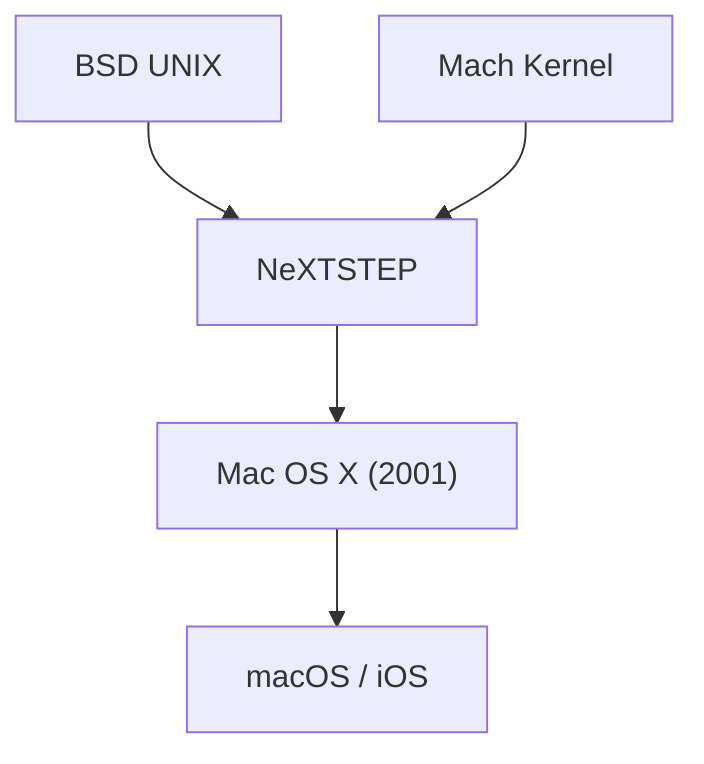

## 1. Limitations of Classic Mac OS
Since the introduction of the Macintosh in 1984, Apple's OS (System 1 to Mac OS 9) was innovative, but it lacked memory protection and preemptive multitasking, and had stability issues.

## 2. The Bloodline of NeXTSTEP
The OS "NeXTSTEP" of NeXT, founded by Jobs, was based on the powerful Mach kernel and BSD UNIX. In 1997, Apple acquired NeXT and used this UNIX bloodline as the foundation for the next-generation Mac OS.

## 3. Birth of Mac OS X
Released in 2001, Mac OS X was a hybrid OS where a robust UNIX (Darwin kernel) ran behind a beautiful GUI called the Aqua interface.

## 4. From UNIX to Mobile OS
The core technology of macOS was later optimized for the iPhone's "iOS", building a robust ecosystem that became the foundation for all of Apple's devices.

## Additional Technology Verification Part 1

### 1. Limitations of Classic Mac OS
Since the introduction of the Macintosh in 1984, Apple's OS (System 1 to Mac OS 9) was innovative, but it lacked memory protection and preemptive multitasking, and had stability issues.

### 2. The Bloodline of NeXTSTEP
The OS "NeXTSTEP" of NeXT, founded by Jobs, was based on the powerful Mach kernel and BSD UNIX. In 1997, Apple acquired NeXT and used this UNIX bloodline as the foundation for the next-generation Mac OS.

### 3. Birth of Mac OS X
Released in 2001, Mac OS X was a hybrid OS where a robust UNIX (Darwin kernel) ran behind a beautiful GUI called the Aqua interface.

### 4. From UNIX to Mobile OS
The core technology of macOS was later optimized for the iPhone's "iOS", building a robust ecosystem that became the foundation for all of Apple's devices.

## Additional Technology Verification Part 2

### 1. Limitations of Classic Mac OS
Since the introduction of the Macintosh in 1984, Apple's OS (System 1 to Mac OS 9) was innovative, but it lacked memory protection and preemptive multitasking, and had stability issues.

### 2. The Bloodline of NeXTSTEP
The OS "NeXTSTEP" of NeXT, founded by Jobs, was based on the powerful Mach kernel and BSD UNIX. In 1997, Apple acquired NeXT and used this UNIX bloodline as the foundation for the next-generation Mac OS.

### 3. Birth of Mac OS X
Released in 2001, Mac OS X was a hybrid OS where a robust UNIX (Darwin kernel) ran behind a beautiful GUI called the Aqua interface.

### 4. From UNIX to Mobile OS
The core technology of macOS was later optimized for the iPhone's "iOS", building a robust ecosystem that became the foundation for all of Apple's devices.

## Additional Technology Verification Part 3

### 1. Limitations of Classic Mac OS
Since the introduction of the Macintosh in 1984, Apple's OS (System 1 to Mac OS 9) was innovative, but it lacked memory protection and preemptive multitasking, and had stability issues.

### 2. The Bloodline of NeXTSTEP
The OS "NeXTSTEP" of NeXT, founded by Jobs, was based on the powerful Mach kernel and BSD UNIX. In 1997, Apple acquired NeXT and used this UNIX bloodline as the foundation for the next-generation Mac OS.

### 3. Birth of Mac OS X
Released in 2001, Mac OS X was a hybrid OS where a robust UNIX (Darwin kernel) ran behind a beautiful GUI called the Aqua interface.

### 4. From UNIX to Mobile OS
The core technology of macOS was later optimized for the iPhone's "iOS", building a robust ecosystem that became the foundation for all of Apple's devices.

## Additional Technology Verification Part 4

### 1. Limitations of Classic Mac OS
Since the introduction of the Macintosh in 1984, Apple's OS (System 1 to Mac OS 9) was innovative, but it lacked memory protection and preemptive multitasking, and had stability issues.

### 2. The Bloodline of NeXTSTEP
The OS "NeXTSTEP" of NeXT, founded by Jobs, was based on the powerful Mach kernel and BSD UNIX. In 1997, Apple acquired NeXT and used this UNIX bloodline as the foundation for the next-generation Mac OS.

### 3. Birth of Mac OS X
Released in 2001, Mac OS X was a hybrid OS where a robust UNIX (Darwin kernel) ran behind a beautiful GUI called the Aqua interface.

### 4. From UNIX to Mobile OS
The core technology of macOS was later optimized for the iPhone's "iOS", building a robust ecosystem that became the foundation for all of Apple's devices.

## Additional Technology Verification Part 5

### 1. Limitations of Classic Mac OS
Since the introduction of the Macintosh in 1984, Apple's OS (System 1 to Mac OS 9) was innovative, but it lacked memory protection and preemptive multitasking, and had stability issues.

### 2. The Bloodline of NeXTSTEP
The OS "NeXTSTEP" of NeXT, founded by Jobs, was based on the powerful Mach kernel and BSD UNIX. In 1997, Apple acquired NeXT and used this UNIX bloodline as the foundation for the next-generation Mac OS.

### 3. Birth of Mac OS X
Released in 2001, Mac OS X was a hybrid OS where a robust UNIX (Darwin kernel) ran behind a beautiful GUI called the Aqua interface.

### 4. From UNIX to Mobile OS
The core technology of macOS was later optimized for the iPhone's "iOS", building a robust ecosystem that became the foundation for all of Apple's devices.

## Additional Technology Verification Part 6

### 1. Limitations of Classic Mac OS
Since the introduction of the Macintosh in 1984, Apple's OS (System 1 to Mac OS 9) was innovative, but it lacked memory protection and preemptive multitasking, and had stability issues.

### 2. The Bloodline of NeXTSTEP
The OS "NeXTSTEP" of NeXT, founded by Jobs, was based on the powerful Mach kernel and BSD UNIX. In 1997, Apple acquired NeXT and used this UNIX bloodline as the foundation for the next-generation Mac OS.

### 3. Birth of Mac OS X
Released in 2001, Mac OS X was a hybrid OS where a robust UNIX (Darwin kernel) ran behind a beautiful GUI called the Aqua interface.

### 4. From UNIX to Mobile OS
The core technology of macOS was later optimized for the iPhone's "iOS", building a robust ecosystem that became the foundation for all of Apple's devices.

## Additional Technology Verification Part 7

### 1. Limitations of Classic Mac OS
Since the introduction of the Macintosh in 1984, Apple's OS (System 1 to Mac OS 9) was innovative, but it lacked memory protection and preemptive multitasking, and had stability issues.

### 2. The Bloodline of NeXTSTEP
The OS "NeXTSTEP" of NeXT, founded by Jobs, was based on the powerful Mach kernel and BSD UNIX. In 1997, Apple acquired NeXT and used this UNIX bloodline as the foundation for the next-generation Mac OS.

### 3. Birth of Mac OS X
Released in 2001, Mac OS X was a hybrid OS where a robust UNIX (Darwin kernel) ran behind a beautiful GUI called the Aqua interface.

### 4. From UNIX to Mobile OS
The core technology of macOS was later optimized for the iPhone's "iOS", building a robust ecosystem that became the foundation for all of Apple's devices.

## Additional Technology Verification Part 8

### 1. Limitations of Classic Mac OS
Since the introduction of the Macintosh in 1984, Apple's OS (System 1 to Mac OS 9) was innovative, but it lacked memory protection and preemptive multitasking, and had stability issues.

### 2. The Bloodline of NeXTSTEP
The OS "NeXTSTEP" of NeXT, founded by Jobs, was based on the powerful Mach kernel and BSD UNIX. In 1997, Apple acquired NeXT and used this UNIX bloodline as the foundation for the next-generation Mac OS.

### 3. Birth of Mac OS X
Released in 2001, Mac OS X was a hybrid OS where a robust UNIX (Darwin kernel) ran behind a beautiful GUI called the Aqua interface.

### 4. From UNIX to Mobile OS
The core technology of macOS was later optimized for the iPhone's "iOS", building a robust ecosystem that became the foundation for all of Apple's devices.

## Additional Technology Verification Part 9

### 1. Limitations of Classic Mac OS
Since the introduction of the Macintosh in 1984, Apple's OS (System 1 to Mac OS 9) was innovative, but it lacked memory protection and preemptive multitasking, and had stability issues.

### 2. The Bloodline of NeXTSTEP
The OS "NeXTSTEP" of NeXT, founded by Jobs, was based on the powerful Mach kernel and BSD UNIX. In 1997, Apple acquired NeXT and used this UNIX bloodline as the foundation for the next-generation Mac OS.

### 3. Birth of Mac OS X
Released in 2001, Mac OS X was a hybrid OS where a robust UNIX (Darwin kernel) ran behind a beautiful GUI called the Aqua interface.

### 4. From UNIX to Mobile OS
The core technology of macOS was later optimized for the iPhone's "iOS", building a robust ecosystem that became the foundation for all of Apple's devices.

## Additional Technology Verification Part 10

### 1. Limitations of Classic Mac OS
Since the introduction of the Macintosh in 1984, Apple's OS (System 1 to Mac OS 9) was innovative, but it lacked memory protection and preemptive multitasking, and had stability issues.

### 2. The Bloodline of NeXTSTEP
The OS "NeXTSTEP" of NeXT, founded by Jobs, was based on the powerful Mach kernel and BSD UNIX. In 1997, Apple acquired NeXT and used this UNIX bloodline as the foundation for the next-generation Mac OS.

### 3. Birth of Mac OS X
Released in 2001, Mac OS X was a hybrid OS where a robust UNIX (Darwin kernel) ran behind a beautiful GUI called the Aqua interface.

### 4. From UNIX to Mobile OS
The core technology of macOS was later optimized for the iPhone's "iOS", building a robust ecosystem that became the foundation for all of Apple's devices.

## Additional Technology Verification Part 11

### 1. Limitations of Classic Mac OS
Since the introduction of the Macintosh in 1984, Apple's OS (System 1 to Mac OS 9) was innovative, but it lacked memory protection and preemptive multitasking, and had stability issues.

### 2. The Bloodline of NeXTSTEP
The OS "NeXTSTEP" of NeXT, founded by Jobs, was based on the powerful Mach kernel and BSD UNIX. In 1997, Apple acquired NeXT and used this UNIX bloodline as the foundation for the next-generation Mac OS.

### 3. Birth of Mac OS X
Released in 2001, Mac OS X was a hybrid OS where a robust UNIX (Darwin kernel) ran behind a beautiful GUI called the Aqua interface.

### 4. From UNIX to Mobile OS
The core technology of macOS was later optimized for the iPhone's "iOS", building a robust ecosystem that became the foundation for all of Apple's devices.

## Additional Technology Verification Part 12

### 1. Limitations of Classic Mac OS
Since the introduction of the Macintosh in 1984, Apple's OS (System 1 to Mac OS 9) was innovative, but it lacked memory protection and preemptive multitasking, and had stability issues.

### 2. The Bloodline of NeXTSTEP
The OS "NeXTSTEP" of NeXT, founded by Jobs, was based on the powerful Mach kernel and BSD UNIX. In 1997, Apple acquired NeXT and used this UNIX bloodline as the foundation for the next-generation Mac OS.

### 3. Birth of Mac OS X
Released in 2001, Mac OS X was a hybrid OS where a robust UNIX (Darwin kernel) ran behind a beautiful GUI called the Aqua interface.

### 4. From UNIX to Mobile OS
The core technology of macOS was later optimized for the iPhone's "iOS", building a robust ecosystem that became the foundation for all of Apple's devices.

## Additional Technology Verification Part 13

### 1. Limitations of Classic Mac OS
Since the introduction of the Macintosh in 1984, Apple's OS (System 1 to Mac OS 9) was innovative, but it lacked memory protection and preemptive multitasking, and had stability issues.

### 2. The Bloodline of NeXTSTEP
The OS "NeXTSTEP" of NeXT, founded by Jobs, was based on the powerful Mach kernel and BSD UNIX. In 1997, Apple acquired NeXT and used this UNIX bloodline as the foundation for the next-generation Mac OS.

### 3. Birth of Mac OS X
Released in 2001, Mac OS X was a hybrid OS where a robust UNIX (Darwin kernel) ran behind a beautiful GUI called the Aqua interface.

### 4. From UNIX to Mobile OS
The core technology of macOS was later optimized for the iPhone's "iOS", building a robust ecosystem that became the foundation for all of Apple's devices.

## Additional Technology Verification Part 14

### 1. Limitations of Classic Mac OS
Since the introduction of the Macintosh in 1984, Apple's OS (System 1 to Mac OS 9) was innovative, but it lacked memory protection and preemptive multitasking, and had stability issues.

### 2. The Bloodline of NeXTSTEP
The OS "NeXTSTEP" of NeXT, founded by Jobs, was based on the powerful Mach kernel and BSD UNIX. In 1997, Apple acquired NeXT and used this UNIX bloodline as the foundation for the next-generation Mac OS.

### 3. Birth of Mac OS X
Released in 2001, Mac OS X was a hybrid OS where a robust UNIX (Darwin kernel) ran behind a beautiful GUI called the Aqua interface.

### 4. From UNIX to Mobile OS
The core technology of macOS was later optimized for the iPhone's "iOS", building a robust ecosystem that became the foundation for all of Apple's devices.
