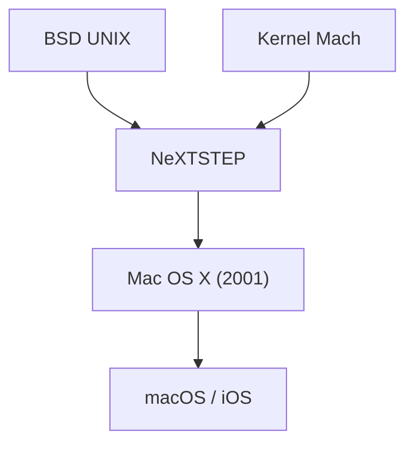

## 1. Los límites del Mac OS clásico
Desde la aparición del Macintosh en 1984, los sistemas operativos de Apple (System 1 a Mac OS 9) fueron innovadores, pero no tenían protección de memoria ni multitarea preventiva, y tenían problemas de estabilidad.

## 2. El linaje de NeXTSTEP
El SO "NeXTSTEP" de la compañía NeXT, fundada por Jobs, estaba basado en el potente kernel Mach y BSD UNIX. En 1997, Apple adquirió NeXT y tomó este linaje UNIX como base para el Mac OS de próxima generación.

## 3. El nacimiento de Mac OS X
Lanzado en 2001, Mac OS X fue un SO híbrido donde un UNIX robusto (kernel Darwin) se ejecutaba detrás de una hermosa GUI llamada interfaz Aqua.

## 4. De UNIX al SO móvil
La tecnología central de macOS fue posteriormente optimizada para "iOS" del iPhone, construyendo un ecosistema sólido que se convertiría en la base de todos los dispositivos de Apple.

## Parte de verificación técnica adicional 1

## Parte de verificación técnica adicional 2

## Parte de verificación técnica adicional 3

## Parte de verificación técnica adicional 4

## Parte de verificación técnica adicional 5

## Parte de verificación técnica adicional 6

## Parte de verificación técnica adicional 7

## Parte de verificación técnica adicional 8

## Parte de verificación técnica adicional 9

## Parte de verificación técnica adicional 10

## Parte de verificación técnica adicional 11

## Parte de verificación técnica adicional 12

## Parte de verificación técnica adicional 13

## Parte de verificación técnica adicional 14

