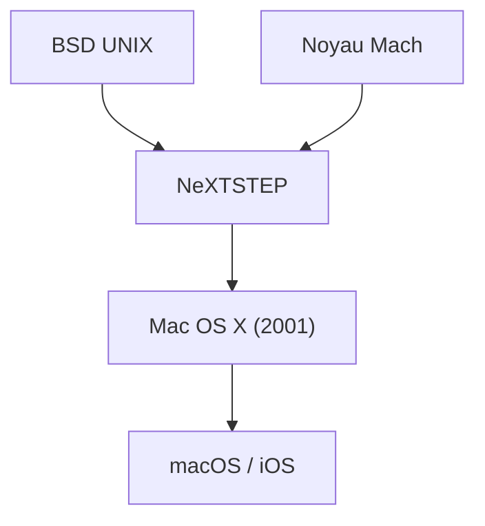

## 1. Les limites du Mac OS classique
Depuis l'introduction du Macintosh en 1984, les OS d'Apple (de System 1 à Mac OS 9) étaient innovants, mais ils ne disposaient pas de protection mémoire ni de multitâche préemptif, et présentaient des problèmes de stabilité.

## 2. La lignée de NeXTSTEP
Le système d'exploitation "NeXTSTEP" de la société NeXT, fondée par Steve Jobs, était basé sur un puissant noyau Mach et sur BSD UNIX. En 1997, Apple a racheté NeXT et a fait de cette lignée UNIX le fondement de son Mac OS de nouvelle génération.

## 3. La naissance de Mac OS X
Sorti en 2001, Mac OS X était un système d'exploitation hybride dans lequel un UNIX robuste (le noyau Darwin) fonctionnait derrière une belle interface graphique appelée Aqua.

## 4. D'UNIX à l'OS mobile
La technologie de base de macOS a ensuite été optimisée pour "iOS" sur l'iPhone, construisant un écosystème solide qui constitue la base de tous les appareils Apple.

## Partie de vérification technique supplémentaire 1

### 1. Les limites du Mac OS classique
Depuis l'introduction du Macintosh en 1984, les OS d'Apple (de System 1 à Mac OS 9) étaient innovants, mais ils ne disposaient pas de protection mémoire ni de multitâche préemptif, et présentaient des problèmes de stabilité.

### 2. La lignée de NeXTSTEP
Le système d'exploitation "NeXTSTEP" de la société NeXT, fondée par Steve Jobs, était basé sur un puissant noyau Mach et sur BSD UNIX. En 1997, Apple a racheté NeXT et a fait de cette lignée UNIX le fondement de son Mac OS de nouvelle génération.

### 3. La naissance de Mac OS X
Sorti en 2001, Mac OS X était un système d'exploitation hybride dans lequel un UNIX robuste (le noyau Darwin) fonctionnait derrière une belle interface graphique appelée Aqua.

### 4. D'UNIX à l'OS mobile
La technologie de base de macOS a ensuite été optimisée pour "iOS" sur l'iPhone, construisant un écosystème solide qui constitue la base de tous les appareils Apple.

## Partie de vérification technique supplémentaire 2

### 1. Les limites du Mac OS classique
Depuis l'introduction du Macintosh en 1984, les OS d'Apple (de System 1 à Mac OS 9) étaient innovants, mais ils ne disposaient pas de protection mémoire ni de multitâche préemptif, et présentaient des problèmes de stabilité.

### 2. La lignée de NeXTSTEP
Le système d'exploitation "NeXTSTEP" de la société NeXT, fondée par Steve Jobs, était basé sur un puissant noyau Mach et sur BSD UNIX. En 1997, Apple a racheté NeXT et a fait de cette lignée UNIX le fondement de son Mac OS de nouvelle génération.

### 3. La naissance de Mac OS X
Sorti en 2001, Mac OS X était un système d'exploitation hybride dans lequel un UNIX robuste (le noyau Darwin) fonctionnait derrière une belle interface graphique appelée Aqua.

### 4. D'UNIX à l'OS mobile
La technologie de base de macOS a ensuite été optimisée pour "iOS" sur l'iPhone, construisant un écosystème solide qui constitue la base de tous les appareils Apple.

## Partie de vérification technique supplémentaire 3

### 1. Les limites du Mac OS classique
Depuis l'introduction du Macintosh en 1984, les OS d'Apple (de System 1 à Mac OS 9) étaient innovants, mais ils ne disposaient pas de protection mémoire ni de multitâche préemptif, et présentaient des problèmes de stabilité.

### 2. La lignée de NeXTSTEP
Le système d'exploitation "NeXTSTEP" de la société NeXT, fondée par Steve Jobs, était basé sur un puissant noyau Mach et sur BSD UNIX. En 1997, Apple a racheté NeXT et a fait de cette lignée UNIX le fondement de son Mac OS de nouvelle génération.

### 3. La naissance de Mac OS X
Sorti en 2001, Mac OS X était un système d'exploitation hybride dans lequel un UNIX robuste (le noyau Darwin) fonctionnait derrière une belle interface graphique appelée Aqua.

### 4. D'UNIX à l'OS mobile
La technologie de base de macOS a ensuite été optimisée pour "iOS" sur l'iPhone, construisant un écosystème solide qui constitue la base de tous les appareils Apple.

## Partie de vérification technique supplémentaire 4

### 1. Les limites du Mac OS classique
Depuis l'introduction du Macintosh en 1984, les OS d'Apple (de System 1 à Mac OS 9) étaient innovants, mais ils ne disposaient pas de protection mémoire ni de multitâche préemptif, et présentaient des problèmes de stabilité.

### 2. La lignée de NeXTSTEP
Le système d'exploitation "NeXTSTEP" de la société NeXT, fondée par Steve Jobs, était basé sur un puissant noyau Mach et sur BSD UNIX. En 1997, Apple a racheté NeXT et a fait de cette lignée UNIX le fondement de son Mac OS de nouvelle génération.

### 3. La naissance de Mac OS X
Sorti en 2001, Mac OS X était un système d'exploitation hybride dans lequel un UNIX robuste (le noyau Darwin) fonctionnait derrière une belle interface graphique appelée Aqua.

### 4. D'UNIX à l'OS mobile
La technologie de base de macOS a ensuite été optimisée pour "iOS" sur l'iPhone, construisant un écosystème solide qui constitue la base de tous les appareils Apple.

## Partie de vérification technique supplémentaire 5

### 1. Les limites du Mac OS classique
Depuis l'introduction du Macintosh en 1984, les OS d'Apple (de System 1 à Mac OS 9) étaient innovants, mais ils ne disposaient pas de protection mémoire ni de multitâche préemptif, et présentaient des problèmes de stabilité.

### 2. La lignée de NeXTSTEP
Le système d'exploitation "NeXTSTEP" de la société NeXT, fondée par Steve Jobs, était basé sur un puissant noyau Mach et sur BSD UNIX. En 1997, Apple a racheté NeXT et a fait de cette lignée UNIX le fondement de son Mac OS de nouvelle génération.

### 3. La naissance de Mac OS X
Sorti en 2001, Mac OS X était un système d'exploitation hybride dans lequel un UNIX robuste (le noyau Darwin) fonctionnait derrière une belle interface graphique appelée Aqua.

### 4. D'UNIX à l'OS mobile
La technologie de base de macOS a ensuite été optimisée pour "iOS" sur l'iPhone, construisant un écosystème solide qui constitue la base de tous les appareils Apple.

## Partie de vérification technique supplémentaire 6

### 1. Les limites du Mac OS classique
Depuis l'introduction du Macintosh en 1984, les OS d'Apple (de System 1 à Mac OS 9) étaient innovants, mais ils ne disposaient pas de protection mémoire ni de multitâche préemptif, et présentaient des problèmes de stabilité.

### 2. La lignée de NeXTSTEP
Le système d'exploitation "NeXTSTEP" de la société NeXT, fondée par Steve Jobs, était basé sur un puissant noyau Mach et sur BSD UNIX. En 1997, Apple a racheté NeXT et a fait de cette lignée UNIX le fondement de son Mac OS de nouvelle génération.

### 3. La naissance de Mac OS X
Sorti en 2001, Mac OS X était un système d'exploitation hybride dans lequel un UNIX robuste (le noyau Darwin) fonctionnait derrière une belle interface graphique appelée Aqua.

### 4. D'UNIX à l'OS mobile
La technologie de base de macOS a ensuite été optimisée pour "iOS" sur l'iPhone, construisant un écosystème solide qui constitue la base de tous les appareils Apple.

## Partie de vérification technique supplémentaire 7

### 1. Les limites du Mac OS classique
Depuis l'introduction du Macintosh en 1984, les OS d'Apple (de System 1 à Mac OS 9) étaient innovants, mais ils ne disposaient pas de protection mémoire ni de multitâche préemptif, et présentaient des problèmes de stabilité.

### 2. La lignée de NeXTSTEP
Le système d'exploitation "NeXTSTEP" de la société NeXT, fondée par Steve Jobs, était basé sur un puissant noyau Mach et sur BSD UNIX. En 1997, Apple a racheté NeXT et a fait de cette lignée UNIX le fondement de son Mac OS de nouvelle génération.

### 3. La naissance de Mac OS X
Sorti en 2001, Mac OS X était un système d'exploitation hybride dans lequel un UNIX robuste (le noyau Darwin) fonctionnait derrière une belle interface graphique appelée Aqua.

### 4. D'UNIX à l'OS mobile
La technologie de base de macOS a ensuite été optimisée pour "iOS" sur l'iPhone, construisant un écosystème solide qui constitue la base de tous les appareils Apple.

## Partie de vérification technique supplémentaire 8

### 1. Les limites du Mac OS classique
Depuis l'introduction du Macintosh en 1984, les OS d'Apple (de System 1 à Mac OS 9) étaient innovants, mais ils ne disposaient pas de protection mémoire ni de multitâche préemptif, et présentaient des problèmes de stabilité.

### 2. La lignée de NeXTSTEP
Le système d'exploitation "NeXTSTEP" de la société NeXT, fondée par Steve Jobs, était basé sur un puissant noyau Mach et sur BSD UNIX. En 1997, Apple a racheté NeXT et a fait de cette lignée UNIX le fondement de son Mac OS de nouvelle génération.

### 3. La naissance de Mac OS X
Sorti en 2001, Mac OS X était un système d'exploitation hybride dans lequel un UNIX robuste (le noyau Darwin) fonctionnait derrière une belle interface graphique appelée Aqua.

### 4. D'UNIX à l'OS mobile
La technologie de base de macOS a ensuite été optimisée pour "iOS" sur l'iPhone, construisant un écosystème solide qui constitue la base de tous les appareils Apple.

## Partie de vérification technique supplémentaire 9

### 1. Les limites du Mac OS classique
Depuis l'introduction du Macintosh en 1984, les OS d'Apple (de System 1 à Mac OS 9) étaient innovants, mais ils ne disposaient pas de protection mémoire ni de multitâche préemptif, et présentaient des problèmes de stabilité.

### 2. La lignée de NeXTSTEP
Le système d'exploitation "NeXTSTEP" de la société NeXT, fondée par Steve Jobs, était basé sur un puissant noyau Mach et sur BSD UNIX. En 1997, Apple a racheté NeXT et a fait de cette lignée UNIX le fondement de son Mac OS de nouvelle génération.

### 3. La naissance de Mac OS X
Sorti en 2001, Mac OS X était un système d'exploitation hybride dans lequel un UNIX robuste (le noyau Darwin) fonctionnait derrière une belle interface graphique appelée Aqua.

### 4. D'UNIX à l'OS mobile
La technologie de base de macOS a ensuite été optimisée pour "iOS" sur l'iPhone, construisant un écosystème solide qui constitue la base de tous les appareils Apple.

## Partie de vérification technique supplémentaire 10

### 1. Les limites du Mac OS classique
Depuis l'introduction du Macintosh en 1984, les OS d'Apple (de System 1 à Mac OS 9) étaient innovants, mais ils ne disposaient pas de protection mémoire ni de multitâche préemptif, et présentaient des problèmes de stabilité.

### 2. La lignée de NeXTSTEP
Le système d'exploitation "NeXTSTEP" de la société NeXT, fondée par Steve Jobs, était basé sur un puissant noyau Mach et sur BSD UNIX. En 1997, Apple a racheté NeXT et a fait de cette lignée UNIX le fondement de son Mac OS de nouvelle génération.

### 3. La naissance de Mac OS X
Sorti en 2001, Mac OS X était un système d'exploitation hybride dans lequel un UNIX robuste (le noyau Darwin) fonctionnait derrière une belle interface graphique appelée Aqua.

### 4. D'UNIX à l'OS mobile
La technologie de base de macOS a ensuite été optimisée pour "iOS" sur l'iPhone, construisant un écosystème solide qui constitue la base de tous les appareils Apple.

## Partie de vérification technique supplémentaire 11

### 1. Les limites du Mac OS classique
Depuis l'introduction du Macintosh en 1984, les OS d'Apple (de System 1 à Mac OS 9) étaient innovants, mais ils ne disposaient pas de protection mémoire ni de multitâche préemptif, et présentaient des problèmes de stabilité.

### 2. La lignée de NeXTSTEP
Le système d'exploitation "NeXTSTEP" de la société NeXT, fondée par Steve Jobs, était basé sur un puissant noyau Mach et sur BSD UNIX. En 1997, Apple a racheté NeXT et a fait de cette lignée UNIX le fondement de son Mac OS de nouvelle génération.

### 3. La naissance de Mac OS X
Sorti en 2001, Mac OS X était un système d'exploitation hybride dans lequel un UNIX robuste (le noyau Darwin) fonctionnait derrière une belle interface graphique appelée Aqua.

### 4. D'UNIX à l'OS mobile
La technologie de base de macOS a ensuite été optimisée pour "iOS" sur l'iPhone, construisant un écosystème solide qui constitue la base de tous les appareils Apple.

## Partie de vérification technique supplémentaire 12

### 1. Les limites du Mac OS classique
Depuis l'introduction du Macintosh en 1984, les OS d'Apple (de System 1 à Mac OS 9) étaient innovants, mais ils ne disposaient pas de protection mémoire ni de multitâche préemptif, et présentaient des problèmes de stabilité.

### 2. La lignée de NeXTSTEP
Le système d'exploitation "NeXTSTEP" de la société NeXT, fondée par Steve Jobs, était basé sur un puissant noyau Mach et sur BSD UNIX. En 1997, Apple a racheté NeXT et a fait de cette lignée UNIX le fondement de son Mac OS de nouvelle génération.

### 3. La naissance de Mac OS X
Sorti en 2001, Mac OS X était un système d'exploitation hybride dans lequel un UNIX robuste (le noyau Darwin) fonctionnait derrière une belle interface graphique appelée Aqua.

### 4. D'UNIX à l'OS mobile
La technologie de base de macOS a ensuite été optimisée pour "iOS" sur l'iPhone, construisant un écosystème solide qui constitue la base de tous les appareils Apple.

## Partie de vérification technique supplémentaire 13

### 1. Les limites du Mac OS classique
Depuis l'introduction du Macintosh en 1984, les OS d'Apple (de System 1 à Mac OS 9) étaient innovants, mais ils ne disposaient pas de protection mémoire ni de multitâche préemptif, et présentaient des problèmes de stabilité.

### 2. La lignée de NeXTSTEP
Le système d'exploitation "NeXTSTEP" de la société NeXT, fondée par Steve Jobs, était basé sur un puissant noyau Mach et sur BSD UNIX. En 1997, Apple a racheté NeXT et a fait de cette lignée UNIX le fondement de son Mac OS de nouvelle génération.

### 3. La naissance de Mac OS X
Sorti en 2001, Mac OS X était un système d'exploitation hybride dans lequel un UNIX robuste (le noyau Darwin) fonctionnait derrière une belle interface graphique appelée Aqua.

### 4. D'UNIX à l'OS mobile
La technologie de base de macOS a ensuite été optimisée pour "iOS" sur l'iPhone, construisant un écosystème solide qui constitue la base de tous les appareils Apple.

## Partie de vérification technique supplémentaire 14

### 1. Les limites du Mac OS classique
Depuis l'introduction du Macintosh en 1984, les OS d'Apple (de System 1 à Mac OS 9) étaient innovants, mais ils ne disposaient pas de protection mémoire ni de multitâche préemptif, et présentaient des problèmes de stabilité.

### 2. La lignée de NeXTSTEP
Le système d'exploitation "NeXTSTEP" de la société NeXT, fondée par Steve Jobs, était basé sur un puissant noyau Mach et sur BSD UNIX. En 1997, Apple a racheté NeXT et a fait de cette lignée UNIX le fondement de son Mac OS de nouvelle génération.

### 3. La naissance de Mac OS X
Sorti en 2001, Mac OS X était un système d'exploitation hybride dans lequel un UNIX robuste (le noyau Darwin) fonctionnait derrière une belle interface graphique appelée Aqua.

### 4. D'UNIX à l'OS mobile
La technologie de base de macOS a ensuite été optimisée pour "iOS" sur l'iPhone, construisant un écosystème solide qui constitue la base de tous les appareils Apple.
