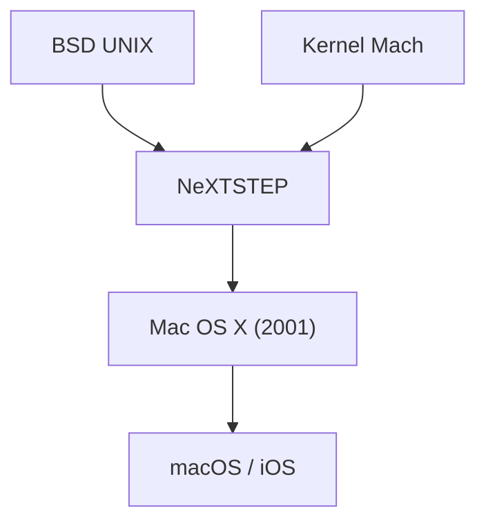

## 1. Keterbatasan Mac OS Klasik
Sejak kemunculan Macintosh pada tahun 1984, OS Apple (System 1 hingga Mac OS 9) memang inovatif, namun tidak memiliki perlindungan memori dan preemptive multitasking, sehingga memiliki masalah stabilitas.

## 2. Garis Keturunan NeXTSTEP
OS "NeXTSTEP" dari perusahaan NeXT yang didirikan oleh Jobs, berbasis pada kernel Mach yang kuat dan BSD UNIX. Pada tahun 1997, Apple mengakuisisi NeXT dan menjadikan garis keturunan UNIX ini sebagai fondasi untuk Mac OS generasi berikutnya.

## 3. Kelahiran Mac OS X
Dirilis pada tahun 2001, Mac OS X adalah OS hibrida di mana UNIX yang tangguh (kernel Darwin) berjalan di balik GUI yang indah yaitu antarmuka Aqua.

## 4. Dari UNIX ke OS Seluler
Teknologi inti macOS kemudian dioptimalkan menjadi "iOS" untuk iPhone, membangun ekosistem yang kuat yang menjadi fondasi bagi semua perangkat Apple.

## Bagian Verifikasi Teknologi Tambahan 1

## Bagian Verifikasi Teknologi Tambahan 2

## Bagian Verifikasi Teknologi Tambahan 3

## Bagian Verifikasi Teknologi Tambahan 4

## Bagian Verifikasi Teknologi Tambahan 5

## Bagian Verifikasi Teknologi Tambahan 6

## Bagian Verifikasi Teknologi Tambahan 7

## Bagian Verifikasi Teknologi Tambahan 8

## Bagian Verifikasi Teknologi Tambahan 9

## Bagian Verifikasi Teknologi Tambahan 10

## Bagian Verifikasi Teknologi Tambahan 11

## Bagian Verifikasi Teknologi Tambahan 12

## Bagian Verifikasi Teknologi Tambahan 13

## Bagian Verifikasi Teknologi Tambahan 14

