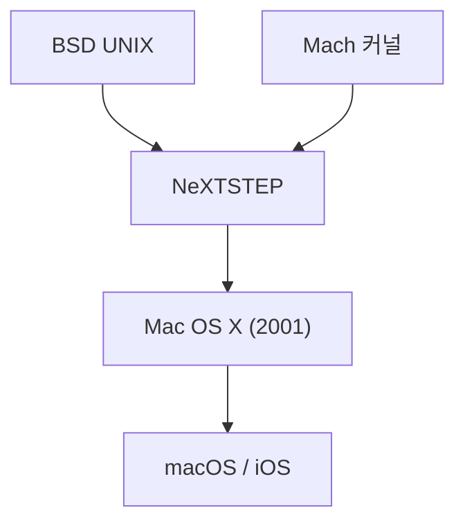

## 1. 클래식 Mac OS의 한계
1984년 Macintosh 등장 이후, Apple의 OS(System 1 ~ Mac OS 9)는 혁신적이었지만, 메모리 보호나 선점형 멀티태스킹을 갖추지 못해 안정성에 과제를 안고 있었습니다.

## 2. NeXTSTEP의 혈통
잡스가 설립한 NeXT사의 OS "NeXTSTEP"은 강력한 Mach 커널과 BSD UNIX를 기반으로 하고 있었습니다. 1997년, Apple은 NeXT를 인수하고, 이 UNIX의 혈통을 차세대 Mac OS의 기반으로 삼습니다.

## 3. Mac OS X의 탄생
2001년에 출시된 Mac OS X는 Aqua 인터페이스라는 아름다운 GUI 이면에서 견고한 UNIX(Darwin 커널)가 동작하는 하이브리드 OS였습니다.

## 4. UNIX에서 모바일 OS로
macOS의 핵심 기술은 이후 iPhone의 "iOS"로 최적화되어, Apple의 모든 기기 기반이 되는 강력한 에코시스템을 구축했습니다.

## 추가 기술 검증 파트 1

## 추가 기술 검증 파트 2

## 추가 기술 검증 파트 3

## 추가 기술 검증 파트 4

## 추가 기술 검증 파트 5

## 추가 기술 검증 파트 6

## 추가 기술 검증 파트 7

## 추가 기술 검증 파트 8

## 추가 기술 검증 파트 9

## 추가 기술 검증 파트 10

## 추가 기술 검증 파트 11

## 추가 기술 검증 파트 12

## 추가 기술 검증 파트 13

## 추가 기술 검증 파트 14

