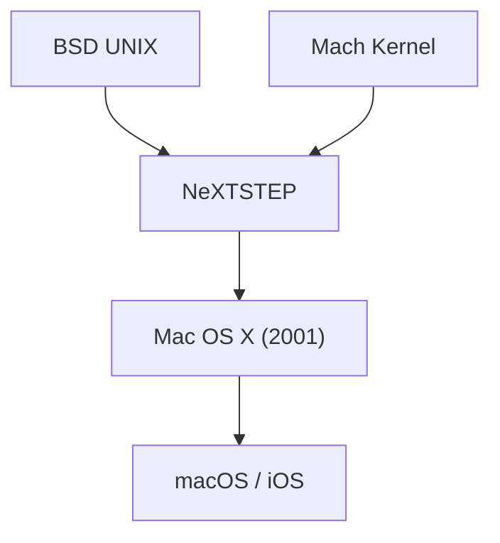

## 1. クラシックMac OSの限界
1984年のMacintosh登場以来、AppleのOS（System 1 〜 Mac OS 9）は革新的でしたが、メモリ保護やプリエンプティブ・マルチタスクを持たず、安定性に課題を抱えていました。

## 2. NeXTSTEPの血統
ジョブズが立ち上げたNeXT社のOS「NeXTSTEP」は、強力なMachカーネルとBSD UNIXをベースにしていました。1997年、AppleはNeXTを買収し、このUNIXの血統を次世代Mac OSの基盤とします。

## 3. Mac OS Xの誕生
2001年にリリースされたMac OS Xは、Aquaインターフェースという美しいGUIの裏で、堅牢なUNIX（Darwinカーネル）が動くというハイブリッドOSでした。

## 4. UNIXからモバイルOSへ
macOSのコア技術はその後、iPhoneの「iOS」へと最適化され、Appleの全てのデバイスの基盤となる強固なエコシステムを築きました。

## 追加技術検証パート 1

### 1. クラシックMac OSの限界
1984年のMacintosh登場以来、AppleのOS（System 1 〜 Mac OS 9）は革新的でしたが、メモリ保護やプリエンプティブ・マルチタスクを持たず、安定性に課題を抱えていました。

### 2. NeXTSTEPの血統
ジョブズが立ち上げたNeXT社のOS「NeXTSTEP」は、強力なMachカーネルとBSD UNIXをベースにしていました。1997年、AppleはNeXTを買収し、このUNIXの血統を次世代Mac OSの基盤とします。

### 3. Mac OS Xの誕生
2001年にリリースされたMac OS Xは、Aquaインターフェースという美しいGUIの裏で、堅牢なUNIX（Darwinカーネル）が動くというハイブリッドOSでした。

### 4. UNIXからモバイルOSへ
macOSのコア技術はその後、iPhoneの「iOS」へと最適化され、Appleの全てのデバイスの基盤となる強固なエコシステムを築きました。

## 追加技術検証パート 2

### 1. クラシックMac OSの限界
1984年のMacintosh登場以来、AppleのOS（System 1 〜 Mac OS 9）は革新的でしたが、メモリ保護やプリエンプティブ・マルチタスクを持たず、安定性に課題を抱えていました。

### 2. NeXTSTEPの血統
ジョブズが立ち上げたNeXT社のOS「NeXTSTEP」は、強力なMachカーネルとBSD UNIXをベースにしていました。1997年、AppleはNeXTを買収し、このUNIXの血統を次世代Mac OSの基盤とします。

### 3. Mac OS Xの誕生
2001年にリリースされたMac OS Xは、Aquaインターフェースという美しいGUIの裏で、堅牢なUNIX（Darwinカーネル）が動くというハイブリッドOSでした。

### 4. UNIXからモバイルOSへ
macOSのコア技術はその後、iPhoneの「iOS」へと最適化され、Appleの全てのデバイスの基盤となる強固なエコシステムを築きました。

## 追加技術検証パート 3

### 1. クラシックMac OSの限界
1984年のMacintosh登場以来、AppleのOS（System 1 〜 Mac OS 9）は革新的でしたが、メモリ保護やプリエンプティブ・マルチタスクを持たず、安定性に課題を抱えていました。

### 2. NeXTSTEPの血統
ジョブズが立ち上げたNeXT社のOS「NeXTSTEP」は、強力なMachカーネルとBSD UNIXをベースにしていました。1997年、AppleはNeXTを買収し、このUNIXの血統を次世代Mac OSの基盤とします。

### 3. Mac OS Xの誕生
2001年にリリースされたMac OS Xは、Aquaインターフェースという美しいGUIの裏で、堅牢なUNIX（Darwinカーネル）が動くというハイブリッドOSでした。

### 4. UNIXからモバイルOSへ
macOSのコア技術はその後、iPhoneの「iOS」へと最適化され、Appleの全てのデバイスの基盤となる強固なエコシステムを築きました。

## 追加技術検証パート 4

### 1. クラシックMac OSの限界
1984年のMacintosh登場以来、AppleのOS（System 1 〜 Mac OS 9）は革新的でしたが、メモリ保護やプリエンプティブ・マルチタスクを持たず、安定性に課題を抱えていました。

### 2. NeXTSTEPの血統
ジョブズが立ち上げたNeXT社のOS「NeXTSTEP」は、強力なMachカーネルとBSD UNIXをベースにしていました。1997年、AppleはNeXTを買収し、このUNIXの血統を次世代Mac OSの基盤とします。

### 3. Mac OS Xの誕生
2001年にリリースされたMac OS Xは、Aquaインターフェースという美しいGUIの裏で、堅牢なUNIX（Darwinカーネル）が動くというハイブリッドOSでした。

### 4. UNIXからモバイルOSへ
macOSのコア技術はその後、iPhoneの「iOS」へと最適化され、Appleの全てのデバイスの基盤となる強固なエコシステムを築きました。

## 追加技術検証パート 5

### 1. クラシックMac OSの限界
1984年のMacintosh登場以来、AppleのOS（System 1 〜 Mac OS 9）は革新的でしたが、メモリ保護やプリエンプティブ・マルチタスクを持たず、安定性に課題を抱えていました。

### 2. NeXTSTEPの血統
ジョブズが立ち上げたNeXT社のOS「NeXTSTEP」は、強力なMachカーネルとBSD UNIXをベースにしていました。1997年、AppleはNeXTを買収し、このUNIXの血統を次世代Mac OSの基盤とします。

### 3. Mac OS Xの誕生
2001年にリリースされたMac OS Xは、Aquaインターフェースという美しいGUIの裏で、堅牢なUNIX（Darwinカーネル）が動くというハイブリッドOSでした。

### 4. UNIXからモバイルOSへ
macOSのコア技術はその後、iPhoneの「iOS」へと最適化され、Appleの全てのデバイスの基盤となる強固なエコシステムを築きました。

## 追加技術検証パート 6

### 1. クラシックMac OSの限界
1984年のMacintosh登場以来、AppleのOS（System 1 〜 Mac OS 9）は革新的でしたが、メモリ保護やプリエンプティブ・マルチタスクを持たず、安定性に課題を抱えていました。

### 2. NeXTSTEPの血統
ジョブズが立ち上げたNeXT社のOS「NeXTSTEP」は、強力なMachカーネルとBSD UNIXをベースにしていました。1997年、AppleはNeXTを買収し、このUNIXの血統を次世代Mac OSの基盤とします。

### 3. Mac OS Xの誕生
2001年にリリースされたMac OS Xは、Aquaインターフェースという美しいGUIの裏で、堅牢なUNIX（Darwinカーネル）が動くというハイブリッドOSでした。

### 4. UNIXからモバイルOSへ
macOSのコア技術はその後、iPhoneの「iOS」へと最適化され、Appleの全てのデバイスの基盤となる強固なエコシステムを築きました。

## 追加技術検証パート 7

### 1. クラシックMac OSの限界
1984年のMacintosh登場以来、AppleのOS（System 1 〜 Mac OS 9）は革新的でしたが、メモリ保護やプリエンプティブ・マルチタスクを持たず、安定性に課題を抱えていました。

### 2. NeXTSTEPの血統
ジョブズが立ち上げたNeXT社のOS「NeXTSTEP」は、強力なMachカーネルとBSD UNIXをベースにしていました。1997年、AppleはNeXTを買収し、このUNIXの血統を次世代Mac OSの基盤とします。

### 3. Mac OS Xの誕生
2001年にリリースされたMac OS Xは、Aquaインターフェースという美しいGUIの裏で、堅牢なUNIX（Darwinカーネル）が動くというハイブリッドOSでした。

### 4. UNIXからモバイルOSへ
macOSのコア技術はその後、iPhoneの「iOS」へと最適化され、Appleの全てのデバイスの基盤となる強固なエコシステムを築きました。

## 追加技術検証パート 8

### 1. クラシックMac OSの限界
1984年のMacintosh登場以来、AppleのOS（System 1 〜 Mac OS 9）は革新的でしたが、メモリ保護やプリエンプティブ・マルチタスクを持たず、安定性に課題を抱えていました。

### 2. NeXTSTEPの血統
ジョブズが立ち上げたNeXT社のOS「NeXTSTEP」は、強力なMachカーネルとBSD UNIXをベースにしていました。1997年、AppleはNeXTを買収し、このUNIXの血統を次世代Mac OSの基盤とします。

### 3. Mac OS Xの誕生
2001年にリリースされたMac OS Xは、Aquaインターフェースという美しいGUIの裏で、堅牢なUNIX（Darwinカーネル）が動くというハイブリッドOSでした。

### 4. UNIXからモバイルOSへ
macOSのコア技術はその後、iPhoneの「iOS」へと最適化され、Appleの全てのデバイスの基盤となる強固なエコシステムを築きました。

## 追加技術検証パート 9

### 1. クラシックMac OSの限界
1984年のMacintosh登場以来、AppleのOS（System 1 〜 Mac OS 9）は革新的でしたが、メモリ保護やプリエンプティブ・マルチタスクを持たず、安定性に課題を抱えていました。

### 2. NeXTSTEPの血統
ジョブズが立ち上げたNeXT社のOS「NeXTSTEP」は、強力なMachカーネルとBSD UNIXをベースにしていました。1997年、AppleはNeXTを買収し、このUNIXの血統を次世代Mac OSの基盤とします。

### 3. Mac OS Xの誕生
2001年にリリースされたMac OS Xは、Aquaインターフェースという美しいGUIの裏で、堅牢なUNIX（Darwinカーネル）が動くというハイブリッドOSでした。

### 4. UNIXからモバイルOSへ
macOSのコア技術はその後、iPhoneの「iOS」へと最適化され、Appleの全てのデバイスの基盤となる強固なエコシステムを築きました。

## 追加技術検証パート 10

### 1. クラシックMac OSの限界
1984年のMacintosh登場以来、AppleのOS（System 1 〜 Mac OS 9）は革新的でしたが、メモリ保護やプリエンプティブ・マルチタスクを持たず、安定性に課題を抱えていました。

### 2. NeXTSTEPの血統
ジョブズが立ち上げたNeXT社のOS「NeXTSTEP」は、強力なMachカーネルとBSD UNIXをベースにしていました。1997年、AppleはNeXTを買収し、このUNIXの血統を次世代Mac OSの基盤とします。

### 3. Mac OS Xの誕生
2001年にリリースされたMac OS Xは、Aquaインターフェースという美しいGUIの裏で、堅牢なUNIX（Darwinカーネル）が動くというハイブリッドOSでした。

### 4. UNIXからモバイルOSへ
macOSのコア技術はその後、iPhoneの「iOS」へと最適化され、Appleの全てのデバイスの基盤となる強固なエコシステムを築きました。

## 追加技術検証パート 11

### 1. クラシックMac OSの限界
1984年のMacintosh登場以来、AppleのOS（System 1 〜 Mac OS 9）は革新的でしたが、メモリ保護やプリエンプティブ・マルチタスクを持たず、安定性に課題を抱えていました。

### 2. NeXTSTEPの血統
ジョブズが立ち上げたNeXT社のOS「NeXTSTEP」は、強力なMachカーネルとBSD UNIXをベースにしていました。1997年、AppleはNeXTを買収し、このUNIXの血統を次世代Mac OSの基盤とします。

### 3. Mac OS Xの誕生
2001年にリリースされたMac OS Xは、Aquaインターフェースという美しいGUIの裏で、堅牢なUNIX（Darwinカーネル）が動くというハイブリッドOSでした。

### 4. UNIXからモバイルOSへ
macOSのコア技術はその後、iPhoneの「iOS」へと最適化され、Appleの全てのデバイスの基盤となる強固なエコシステムを築きました。

## 追加技術検証パート 12

### 1. クラシックMac OSの限界
1984年のMacintosh登場以来、AppleのOS（System 1 〜 Mac OS 9）は革新的でしたが、メモリ保護やプリエンプティブ・マルチタスクを持たず、安定性に課題を抱えていました。

### 2. NeXTSTEPの血統
ジョブズが立ち上げたNeXT社のOS「NeXTSTEP」は、強力なMachカーネルとBSD UNIXをベースにしていました。1997年、AppleはNeXTを買収し、このUNIXの血統を次世代Mac OSの基盤とします。

### 3. Mac OS Xの誕生
2001年にリリースされたMac OS Xは、Aquaインターフェースという美しいGUIの裏で、堅牢なUNIX（Darwinカーネル）が動くというハイブリッドOSでした。

### 4. UNIXからモバイルOSへ
macOSのコア技術はその後、iPhoneの「iOS」へと最適化され、Appleの全てのデバイスの基盤となる強固なエコシステムを築きました。

## 追加技術検証パート 13

### 1. クラシックMac OSの限界
1984年のMacintosh登場以来、AppleのOS（System 1 〜 Mac OS 9）は革新的でしたが、メモリ保護やプリエンプティブ・マルチタスクを持たず、安定性に課題を抱えていました。

### 2. NeXTSTEPの血統
ジョブズが立ち上げたNeXT社のOS「NeXTSTEP」は、強力なMachカーネルとBSD UNIXをベースにしていました。1997年、AppleはNeXTを買収し、このUNIXの血統を次世代Mac OSの基盤とします。

### 3. Mac OS Xの誕生
2001年にリリースされたMac OS Xは、Aquaインターフェースという美しいGUIの裏で、堅牢なUNIX（Darwinカーネル）が動くというハイブリッドOSでした。

### 4. UNIXからモバイルOSへ
macOSのコア技術はその後、iPhoneの「iOS」へと最適化され、Appleの全てのデバイスの基盤となる強固なエコシステムを築きました。

## 追加技術検証パート 14

### 1. クラシックMac OSの限界
1984年のMacintosh登場以来、AppleのOS（System 1 〜 Mac OS 9）は革新的でしたが、メモリ保護やプリエンプティブ・マルチタスクを持たず、安定性に課題を抱えていました。

### 2. NeXTSTEPの血統
ジョブズが立ち上げたNeXT社のOS「NeXTSTEP」は、強力なMachカーネルとBSD UNIXをベースにしていました。1997年、AppleはNeXTを買収し、このUNIXの血統を次世代Mac OSの基盤とします。

### 3. Mac OS Xの誕生
2001年にリリースされたMac OS Xは、Aquaインターフェースという美しいGUIの裏で、堅牢なUNIX（Darwinカーネル）が動くというハイブリッドOSでした。

### 4. UNIXからモバイルOSへ
macOSのコア技術はその後、iPhoneの「iOS」へと最適化され、Appleの全てのデバイスの基盤となる強固なエコシステムを築きました。
