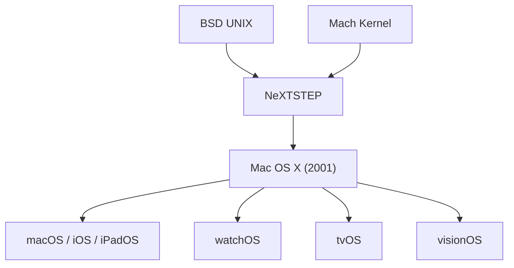

# OSの歴史: macOSの系譜 (NeXTSTEPからUNIXの血統へ)

私たちが日々当たり前のように使っているMacのオペレーティングシステム「macOS」。洗練された美しいユーザーインターフェースと、直感的な操作性を誇るこのOSの背後には、コンピュータ史における壮大なドラマと、非常に強固で学術的なUNIXの血統が隠されています。本記事では、1984年の初代Macintosh登場から、NeXT社の買収による[スティーブ・ジョブズ](/p/biography-steve-jobs/)の帰還、そしてApple Silicon時代に至るまでの、macOSの深く数奇な歴史を詳細に紐解いていきます。

## 1. クラシックMac OSの光と影 (1984 - 2001)

### GUIの夜明けとSystem 1
1984年、Appleは初代Macintoshを発表しました。それまでのコンピュータは、キーボードで黒い画面に文字（コマンド）を打ち込む「CUI（キャラクターユーザーインターフェース）」が主流でした。しかし、Macintoshに搭載された「System 1」は、マウスを使って画面上のアイコンやウィンドウを操作する「GUI（グラフィカルユーザーインターフェース）」を一般家庭に持ち込み、パーソナルコンピュータの歴史に革命を起こしました。

### 構造的な限界の露呈
System 1から始まり、Mac OS 9へと進化していったこの時代のOSは、現在「クラシックMac OS」と呼ばれています。これらは非常に使いやすく革新的でしたが、時代が進みコンピュータに求められる処理が高度化するにつれて、アーキテクチャの根本的な弱点が露呈し始めました。

最大の問題は**「プリエンプティブ・マルチタスク」**と**「メモリ保護」**の欠如でした。当時のMac OSは「協調的マルチタスク」を採用しており、各アプリケーションが自発的にCPUの制御をOSに返還する必要がありました。もし一つのアプリケーションが行儀悪くCPUを占有したり、バグでフリーズしたりすると、システム全体が道連れになってフリーズ（爆弾マークが表示されるシステムクラッシュ）してしまったのです。

Appleはこの問題を解決するため、次世代OS「Copland（コープランド）」の開発に着手しましたが、プロジェクトは迷走を極め、最終的に開発は頓挫してしまいました。Appleは自社で次世代OSをゼロから開発することを諦め、外部からOS技術を調達するという苦渋の決断を下します。

## 2. 外部OSの模索と運命の出会い

次世代OSの基盤を求めたAppleは、複数の候補を検討しました。その中で最終候補に残ったのが、元Appleのジャン＝ルイ・ガセー率いるBe社の「BeOS」と、Appleを追放された[スティーブ・ジョブズ](/p/biography-steve-jobs/)が立ち上げたNeXT社の「NeXTSTEP」でした。

### BeOS vs NeXTSTEP
BeOSはマルチメディア処理に優れ、非常に先進的な設計を持っていました。一時はBeOSの採用が確実視されていましたが、買収額を巡って交渉が決裂します。
そこに急浮上したのがNeXTSTEPです。1996年末、当時のApple CEOであるギル・アメリオは、NeXT社を4億2900万ドルで買収することを発表。これにより、次世代Mac OSの基盤技術を獲得すると同時に、スティーブ・ジョブズがAppleへと劇的な帰還を果たすことになりました。

## 3. NeXTSTEPとUNIXの血統

NeXTSTEPは、技術的に非常に高度なOSでした。このOSこそが、現在のmacOSの直接的な祖先となります。

### MachカーネルとBSD UNIXの融合
NeXTSTEPの中核には、カーネギーメロン大学で開発されたマイクロカーネル**「Mach（マーク）」**と、カリフォルニア大学バークレー校で開発されたUNIXベースのOS**「4.3BSD」**が採用されていました。

*   **Machカーネル:** ハードウェアの制御やメモリ管理など、OSの最も低レベルな基本機能を提供する非常に洗練されたマイクロカーネルです。
*   **BSD UNIX:** 安定したファイルシステムやネットワーク機能、そして完全なプリエンプティブ・マルチタスクとメモリ保護機能を提供します。

これにより、一つのアプリケーションがクラッシュしてもOS全体が巻き込まれることはなくなり、ネットワークや複数タスクの同時処理も極めて安定して行えるようになりました。現在のmacOSがターミナルを開けば本格的なUNIXコマンドが使えるのは、この確固たるBSD UNIXの血統を受け継いでいるからです。

### オブジェクト指向とCocoaの源流
NeXTSTEPのもう一つの大きな特徴は、開発言語に「Objective-C」を全面的に採用したことでした。これにより、非常に効率的にソフトウェアを開発できるオブジェクト指向のフレームワークが整備されました。このフレームワークは後に「OpenStep」と呼ばれ、現在のmacOSにおける「Cocoa（ココア）」APIの直接の源流となっています。（Objective-Cのクラス名に `NSString` や `NSArray` のように「NS」という接頭辞が付いているのは、**N**eXT**S**TEPの名残です）。

## 4. Mac OS Xの誕生と進化 (2001 - 2011)

NeXTの技術を手に入れたAppleは、クラシックMac OSとの互換性を保ちながらUNIXベースの次世代OSへの移行という、極めて困難なプロジェクトを立ち上げます。

### Mac OS X 10.0 Cheetah (2001年)
2001年3月、ついに「Mac OS X 10.0 Cheetah」がリリースされました。「Aqua（アクア）」と呼ばれる半透明で水滴のような美しいインターフェースと、UNIXの堅牢性を併せ持つ革新的なOSでした。最初は動作が遅く対応ソフトも少なかったものの、ここからAppleの快進撃が始まります。

### 移行を支えた技術
古いMac用ソフトを動かすための「Classic環境」や、既存のコードを比較的簡単に移植できる「Carbon（カーボン）」APIを用意することで、Appleはユーザーと開発者を新しいUNIXベースのプラットフォームへと徐々に誘導していきました。

### Intel移行という大手術 (Tiger / Leopard時代)
Mac OS Xは順調に進化を続け、10.4 Tiger (2005年) では、長年採用してきたPowerPCプロセッサからIntel製プロセッサへの移行という巨大なアーキテクチャ変更を成し遂げました。この時、OSの基盤がMach/BSDというポータビリティの高い設計であったことが、スムーズな移行を可能にした大きな要因でした。続く10.5 Leopard、10.6 Snow LeopardではOSの64ビット化やマルチコアCPUへの最適化（Grand Central Dispatch）が進み、システムの下回りが大幅に強化されました。

## 5. モバイル時代への逆輸入 (OS X 時代)

2007年、Appleは初代iPhoneを発表します。このiPhoneを動かしていた「iPhone OS (のちのiOS)」は、実はMac OS Xのコア技術（Darwin）をモバイル向けに極限までスリム化したものでした。つまり、iPhoneの中身もまたUNIXだったのです。

### iOSからのフィードバック
iOSが大成功を収めると、AppleはそのエッセンスをMacに逆輸入し始めます。2011年の「Mac OS X 10.7 Lion」からは、Launchpad（アプリの一覧画面）や自然なスクロールなど、iPhoneやiPadで馴染みのある操作感が導入されました。翌年の10.8 Mountain Lionからは名称が単に「OS X」となり、リリースサイクルも年次（毎年アップデート）へと変更されました。

## 6. 「macOS」への改称とApple Silicon (現代)

### 再びmacOSへ
2016年の「macOS Sierra (10.12)」にて、iOS、watchOS、tvOSといった他のApple製OSとの命名規則を統一するため、OS Xは「macOS」へと名称を変更しました。Siriの導入やiCloudによるデバイス間のシームレスな連携（Continuity）が強化され、Appleエコシステムの中核としての役割を強めていきました。

### macOS Big Sur と Apple Siliconの衝撃
2020年、「macOS Big Sur (11.0)」の発表とともに、AppleはIntelプロセッサから自社設計の「Apple Silicon (M1チップなど)」への移行という、歴史上3度目となるプロセッサの変更を発表しました。
Big Surでは、OSのバージョン番号が長らく続いた「10」から「11」へと上がり、デザインもiOSと親和性の高いモダンなものへと刷新されました。

Apple Siliconへの移行は驚異的なパフォーマンス向上と電力効率の改善をもたらしました。また、「Rosetta 2」という極めて優秀な翻訳レイヤーにより、Intel向けのアプリもそのまま高速に動作させることに成功しています。現在に至るまで、Apple SiliconとmacOSの緊密な統合は、Macにかつてない競争力をもたらしています。

## 結び: UNIXの魂とAppleのデザイン

現在のmacOSは、表面上は親しみやすく誰でも簡単に使えるデザインを持っていますが、その奥深くには何十年もの学術的な研究と実運用に耐えてきたUNIXの強靭なコア（Darwin）が脈々と息づいています。

「技術をユーザーから隠し、魔法のように見せる」というAppleの哲学は、この堅牢なシステムの上でこそ実現可能でした。NeXTの買収という歴史の転換点がなければ、現在のMacの繁栄、さらにはiPhoneをはじめとするApple帝国全体の基盤となるエコシステムすら存在しなかったかもしれません。

ターミナルを開き `uname -a` と打ち込めば「Darwin」という文字列が返ってきます。それは、macOSが歩んできた数奇で偉大な歴史の証なのです。
