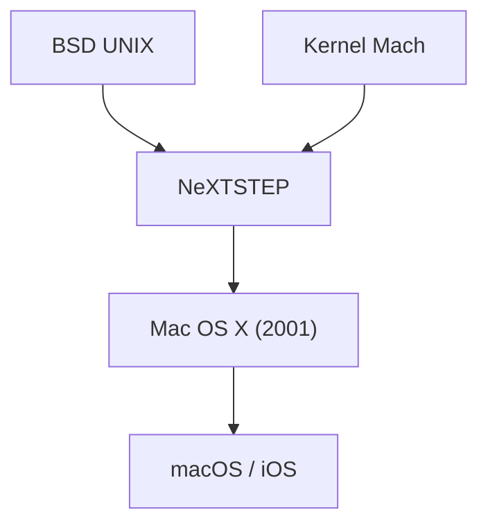

## 1. Os limites do Mac OS Clássico
Desde o lançamento do Macintosh em 1984, os sistemas operacionais da Apple (System 1 ao Mac OS 9) eram inovadores, mas não possuíam proteção de memória e multitarefa preemptiva, enfrentando problemas de estabilidade.

## 2. A linhagem do NeXTSTEP
O sistema operacional "NeXTSTEP" da empresa NeXT, fundada por Jobs, baseava-se no poderoso kernel Mach e no BSD UNIX. Em 1997, a Apple adquiriu a NeXT e usou essa linhagem UNIX como base para a próxima geração do Mac OS.

## 3. O nascimento do Mac OS X
Lançado em 2001, o Mac OS X era um sistema operacional híbrido em que um UNIX robusto (kernel Darwin) rodava por trás de uma bela GUI chamada de interface Aqua.

## 4. Do UNIX para o OS móvel
As tecnologias principais do macOS foram posteriormente otimizadas para o "iOS" do iPhone, construindo um ecossistema sólido que se tornou a base de todos os dispositivos da Apple.

## Parte adicional de verificação técnica 1

## Parte adicional de verificação técnica 2

## Parte adicional de verificação técnica 3

## Parte adicional de verificação técnica 4

## Parte adicional de verificação técnica 5

## Parte adicional de verificação técnica 6

## Parte adicional de verificação técnica 7

## Parte adicional de verificação técnica 8

## Parte adicional de verificação técnica 9

## Parte adicional de verificação técnica 10

## Parte adicional de verificação técnica 11

## Parte adicional de verificação técnica 12

## Parte adicional de verificação técnica 13

## Parte adicional de verificação técnica 14

