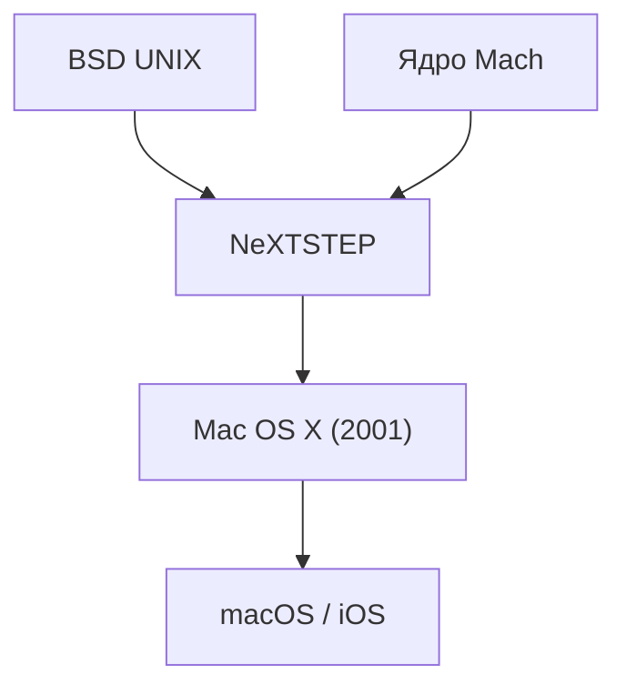

## 1. Пределы классической Mac OS
С момента появления Macintosh в 1984 году ОС Apple (с System 1 по Mac OS 9) были инновационными, но не имели защиты памяти и вытесняющей многозадачности, что создавало проблемы со стабильностью.

## 2. Наследие NeXTSTEP
ОС "NeXTSTEP" компании NeXT, основанной Джобсом, базировалась на мощном ядре Mach и BSD UNIX. В 1997 году Apple приобрела NeXT и сделала эту родословную UNIX основой для своей Mac OS следующего поколения.

## 3. Рождение Mac OS X
Выпущенная в 2001 году Mac OS X была гибридной ОС: за красивым графическим интерфейсом Aqua скрывалась надежная UNIX-система (ядро Darwin).

## 4. От UNIX к мобильным ОС
Базовая технология macOS впоследствии была оптимизирована для "iOS" iPhone, создав прочную экосистему, ставшую фундаментом для всех устройств Apple.

## Дополнительная техническая проверка, часть 1

## Дополнительная техническая проверка, часть 2

## Дополнительная техническая проверка, часть 3

## Дополнительная техническая проверка, часть 4

## Дополнительная техническая проверка, часть 5

## Дополнительная техническая проверка, часть 6

## Дополнительная техническая проверка, часть 7

## Дополнительная техническая проверка, часть 8

## Дополнительная техническая проверка, часть 9

## Дополнительная техническая проверка, часть 10

## Дополнительная техническая проверка, часть 11

## Дополнительная техническая проверка, часть 12

## Дополнительная техническая проверка, часть 13

## Дополнительная техническая проверка, часть 14

