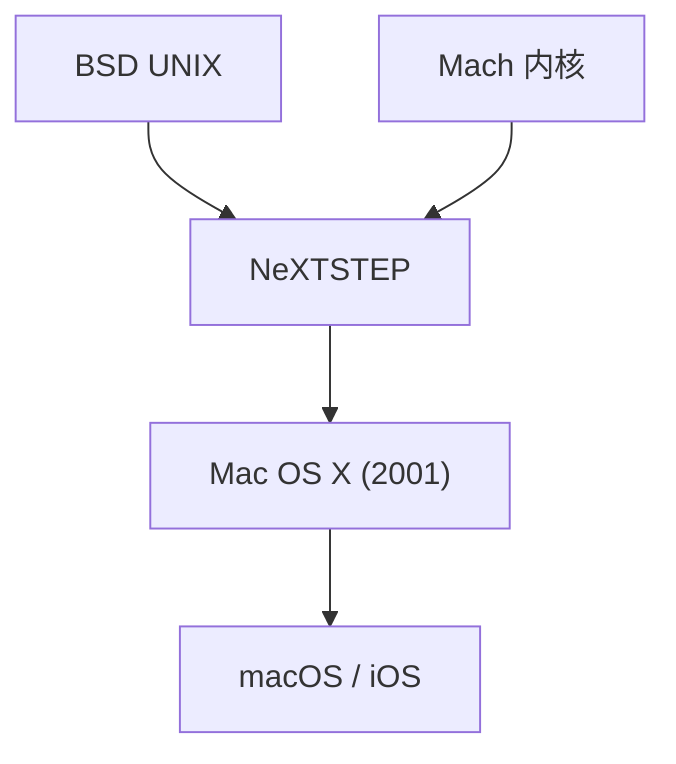

## 1. 经典 Mac OS 的局限性
自 1984 年 Macintosh 问世以来，Apple 的操作系统（System 1 到 Mac OS 9）虽然具有创新性，但缺乏内存保护和抢占式多任务处理，在稳定性方面存在问题。

## 2. NeXTSTEP 的血统
乔布斯创立的 NeXT 公司的操作系统“NeXTSTEP”基于强大的 Mach 内核和 BSD UNIX。1997 年，Apple 收购了 NeXT，并将这一 UNIX 血统作为下一代 Mac OS 的基础。

## 3. Mac OS X 的诞生
2001 年发布的 Mac OS X 是一款混合操作系统，在名为 Aqua 的优美图形用户界面（GUI）背后，运行着坚如磐石的 UNIX（Darwin 内核）。

## 4. 从 UNIX 到移动操作系统
macOS 的核心技术随后被优化为 iPhone 的“iOS”，建立了一个强大的生态系统，成为所有 Apple 设备的基础。

## 附加技术验证部分 1

## 附加技术验证部分 2

## 附加技术验证部分 3

## 附加技术验证部分 4

## 附加技术验证部分 5

## 附加技术验证部分 6

## 附加技术验证部分 7

## 附加技术验证部分 8

## 附加技术验证部分 9

## 附加技术验证部分 10

## 附加技术验证部分 11

## 附加技术验证部分 12

## 附加技术验证部分 13

## 附加技术验证部分 14

