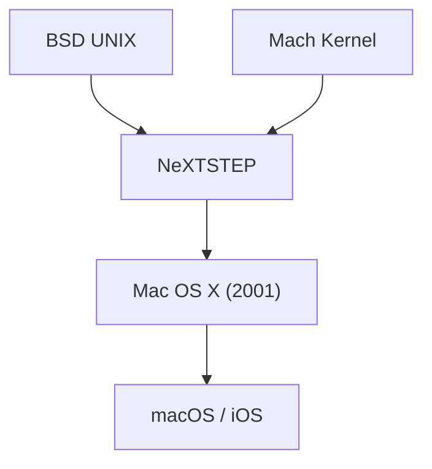

## 1. 經典Mac OS的極限
自1984年Macintosh登場以來，Apple的作業系統（System 1 到 Mac OS 9）雖然具備創新性，但缺乏記憶體保護與搶占式多工處理功能，因此在穩定性方面存在著課題。

## 2. NeXTSTEP的血統
由賈伯斯創立的NeXT公司所開發的作業系統「NeXTSTEP」，是以強大的Mach核心與BSD UNIX為基礎。1997年，Apple收購了NeXT，並將這個UNIX的血統作為次世代Mac OS的基盤。

## 3. Mac OS X的誕生
2001年發布的Mac OS X，是一款在名為Aqua介面的美麗GUI背後，運行著堅固的UNIX（Darwin核心）的混合型作業系統。

## 4. 從UNIX到行動裝置OS
macOS的核心技術隨後被最佳化為iPhone的「iOS」，並構築了成為Apple所有裝置基盤的堅固生態系統。

## 附加技術驗證部分 1

## 附加技術驗證部分 2

## 附加技術驗證部分 3

## 附加技術驗證部分 4

## 附加技術驗證部分 5

## 附加技術驗證部分 6

### 1. 經典Mac OS的極限
自1984年Macintosh登場以來，Apple的作業系統（System 1 到 Mac OS 9）雖然具備創新性，但缺乏記憶體保護與搶占式多工處理功能，存在著課題。

## 附加技術驗證部分 7

## 附加技術驗證部分 8

## 附加技術驗證部分 9

## 附加技術驗證部分 10

## 附加技術驗證部分 11

## 附加技術驗證部分 12

## 附加技術驗證部分 13

## 附加技術驗證部分 14

