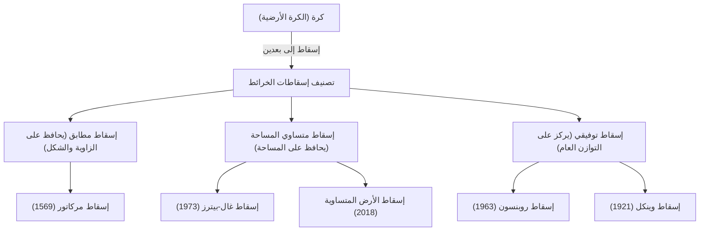

خريطة العالم التي نراها بشكل يومي. من الخرائط الرقمية المعروضة على شاشات الهواتف الذكية إلى الملصقات الكبيرة المعلقة على جدران الفصول الدراسية، تتجذر الخرائط بعمق في حياتنا. ومع ذلك، هل فكرت يومًا في حقيقة أن خريطة العالم المرسومة على سطح مستو ليست في الواقع «صورة دقيقة للأرض»؟

الأرض لها شكل قريب من كرة ثلاثية الأبعاد (بتعبير أدق، مجسم بيضاوي دوراني)، لكن معظم الخرائط التي نستخدمها عبارة عن مستويات ثنائية الأبعاد. في هذا الفعل المتمثل في «نشر سطح ثلاثي الأبعاد إلى بعدين»، هناك مفارقة رياضية خطيرة لا يمكن تجنبها. في هذا المقال، سنكشف التاريخ الخفي والصراعات حول كيف أدرك البشر وعبروا عن المساحة الشاسعة للأرض على سطح مستو، من إسقاط مركاتور الذي قاد عصر الاستكشاف، إلى إسقاط بيترز الذي أثار تموجات سياسية، وأخيراً إلى إسقاط الأرض المتساوية الحديث.

## 1. المعضلة الرياضية في رسم كرة على سطح مستو

عند الحديث عن تاريخ إسقاطات الخرائط، فإن أول شيء يجب فهمه هو الفرضية الرياضية الكبرى التي أثبتها «كارل فريدريش غاوس». استنتج عالم الرياضيات العظيم في القرن التاسع عشر، غاوس، نظرية هندسية تفاضلية تسمى «النظرية الرائعة» (Theorema Egregium). ووفقًا لهذه النظرية، فإن الانحناء الغاوسي للسطح له خاصية عدم التغير حتى لو تم ثني هذا السطح.

الانحناء الغاوسي لسطح كروي مثل الأرض موجب، لكن الانحناء الغاوسي للمستوى هو صفر. لذلك، من المستحيل رياضيًا تعيين أسطح ذات انحناءات غاوسية مختلفة على بعضها البعض دون تمدد أو انكماش أو تمزق. إنه نفس المبدأ الذي يمنعك من تقشير برتقالة وتمديد قشرتها إلى مستطيل مسطح واحد دون وجود فجوات.

بسبب هذه المعضلة الرياضية، لا توجد خريطة عالم يمكنها الحفاظ بدقة على جميع العناصر الأربعة التالية في نفس الوقت:

1. **المساحة** (المساحة المتساوية): ما إذا كان يتم الحفاظ على نسبة مساحة الأرض والبحر الفعلية.
2. **الزاوية/الشكل** (التطابق): ما إذا كان يتم الحفاظ على معالم التضاريس الفعلية وزاوية الخطوط المتقاطعة.
3. **المسافة** (المسافة المتساوية): ما إذا كان يتم الحفاظ على نسبة المسافة من نقطة معينة.
4. **الاتجاه** (السمت المتساوي): ما إذا كان يتم الحفاظ على الاتجاه من نقطة معينة بشكل صحيح.

الشيء الوحيد الذي يلبي كل هذه الشروط هو «الكرة الأرضية». عند إنشاء خريطة مسطحة، يُجبر صانعو الخرائط على «التسوية»، حيث يضحون بشيء ويعطون الأولوية لشيء آخر لتحقيق هدفهم. يمكن القول إن هذا الاختيار هو تاريخ إسقاطات الخرائط نفسه.

## 2. الابتكار الذي دعم عصر الاستكشاف: إسقاط مركاتور

بالنسبة لنا نحن المعاصرين، فإن خريطة العالم الأكثر دراية هي ربما «إسقاط مركاتور». نُشرت هذه الخريطة في عام 1569 من قبل الجغرافي جيراردوس مركاتور من فلاندرز (بلجيكا الحالية)، وكانت اختراعًا رائدًا غيّر تاريخ البشرية بشكل كبير.

كانت أوروبا في ذلك الوقت في خضم «عصر الاستكشاف»، حيث كانوا ينطلقون نحو قارات ومحيطات غير معروفة. ومع ذلك، لم تكن هناك معالم فوق المحيط الشاسع، وكان البحارة دائمًا عرضة لخطر الضياع. ما كانوا يسعون إليه هو «خريطة بحرية يمكن أن تصل بهم بالتأكيد إلى وجهتهم».

أكبر ميزة لإسقاط مركاتور هي «التطابق». تتقاطع خطوط الطول وخطوط العرض دائمًا في زوايا قائمة، والخط المستقيم الذي يربط بين أي نقطتين (خط الاتجاه الثابت) يتطابق مع الاتجاه الفعلي الذي تشير إليه البوصلة. وبعبارة أخرى، يمكن للبحارة الوصول إلى وجهتهم بالتأكيد عن طريق ربط نقطة الانطلاق والوجهة بخط مستقيم على الخريطة، وقياس الزاوية (الاتجاه) بين ذلك الخط وخط الطول، والتقدم مع الحفاظ على البوصلة عند تلك الزاوية.

كانت هذه الخريطة الوظيفية والمبتكرة حقًا أداة سحرية للملاحين. ومع ذلك، وراء هذه الراحة تكمن تضحية ضخمة. كانت تلك هي «التشوه الشديد في المساحة».
في إسقاط مركاتور، كلما ارتفع خط العرض، زاد التوسع في كلا الاتجاهين الشرقي-الغربي والشمالي-الجنوبي، بحيث كلما اقتربت من القطبين، يتم رسمها بحجم أكبر بكثير من مساحتها الفعلية.

على سبيل المثال، عند النظر إليها على إسقاط مركاتور، تبدو جرينلاند بحجم قارة إفريقيا تقريبًا، أو ربما أكبر. ومع ذلك، عند مقارنة المساحات الفعلية، فإن قارة إفريقيا أكبر بحوالي 14 مرة من جرينلاند. وبالمثل، فإن دول خطوط العرض العليا مثل روسيا وكندا يتم إبرازها كمناطق شاسعة تتجاوز مساحتها الفعلية.

كان مركاتور نفسه يقصد أن تكون هذه الخريطة بدقة «للملاحة». ومع ذلك، نظرًا لجمال مظهرها المستقيم والأنيق، أصبحت تستخدم على نطاق واسع للخرائط العامة للجمهور والتعليم المدرسي بخلاف الملاحة، ونتيجة لذلك، أدت إلى تشويه «الإدراك المكاني للعالم» لدى الناس لعدة قرون.

## 3. إسقاط السياسة والأيديولوجيا: جدل إسقاط بيترز

مع دخول القرن العشرين، بدأت الانتقادات في التصاعد ضد الاستخدام المستمر الشائع لإسقاط مركاتور. في الخلفية، لم يكن الأمر مجرد السعي وراء الدقة الجغرافية، بل كانت هناك أيديولوجيات سياسية واجتماعية متشابكة بعمق.

في عام 1973، انتقد المؤرخ الألماني أرنو بيترز بشدة قائلاً: «إن إسقاط مركاتور يرسم بشكل غير عادل الدول المتقدمة المتمركزة في أوروبا (الواقعة في خطوط العرض العليا في نصف الكرة الشمالي) بحجم كبير، ويجعل المناطق القريبة من خط الاستواء حيث توجد العديد من الدول النامية (مثل إفريقيا وأمريكا الجنوبية وجنوب شرق آسيا) تبدو صغيرة. هذا مظهر من مظاهر التفوق الأبيض الاستعماري».

وما أعلنه على نطاق واسع على أنه «خريطة عالم أكثر مساواة وصحة» كان «إسقاط بيترز» (رسمياً إسقاط غال-بيترز). تخصصت هذه الخريطة في كونها «إسقاطاً متساوي المساحة»، أي أنها تعكس بدقة نسبة المساحة الفعلية في جميع مناطق العالم.

عند النظر إلى إسقاط بيترز، تظهر صورة تختلف بشكل كبير عن العالم الذي اعتدنا عليه. تُرسم أوروبا صغيرة جدًا، وعلى العكس من ذلك، تظهر قارة إفريقيا وقارة أمريكا الجنوبية طويلتين عموديًا، ويبرز حجمهما الهائل. أصبح هذا سلاحًا بصريًا قويًا لدول العالم الثالث لتأكيد وجودها الخاص بشكل مبرر. دعمت منظمة اليونسكو (منظمة الأمم المتحدة للتربية والعلم والثقافة) والعديد من المنظمات غير الحكومية الدولية واعتمدت هذه الخريطة من منظور الإنصاف.

ومع ذلك، كان هناك رد فعل قوي من خبراء رسم الخرائط. ولجعل المساحة دقيقة، تشوه «شكل» (محيط) القارات بشكل مفرط في إسقاط بيترز. تبدو البلدان القريبة من خط الاستواء وكأنها ممتدة عموديًا، بينما تبدو مناطق خطوط العرض العليا وكأنها مسحوقة أفقيًا. نشأت خلافات حادة مثل: «الشكل غير طبيعي ولا يصلح للاستخدام العملي» و«ادعاءات بيترز ليست سوى دعاية سياسية».

كان «جدل إسقاط بيترز» هذا حدثًا تاريخيًا أبرز حقيقة أن الخرائط ليست مجرد تعبيرات عن المعلومات الجغرافية، بل هي وسائل إعلامية تشكل نظرة العالم وعلاقات القوة والأيديولوجيات السياسية للأشخاص الذين ينظرون إليها.

## 4. البحث عن نقطة تسوية بين الجمال والعملية: الإسقاط التوفيقي

«كذبة المساحة» لإسقاط مركاتور، و«تشوه الشكل» لإسقاط بيترز. نظرًا لأن كلاهما كان له عناصر متطرفة، بدأ صانعو الخرائط في استكشاف «خريطة طبيعية المظهر ومتوازنة بشكل أفضل، على الرغم من أن المساحة والشكل ليسا مثاليين». كانت هذه ولادة «الإسقاط التوفيقي».

الممثل النموذجي للإسقاط التوفيقي هو «إسقاط روبنسون» الذي أعلنه الجغرافي الأمريكي آرثر هـ. روبنسون في عام 1963. لم يشتق روبنسون الخريطة من صيغ رياضية، بل اتخذ من حدسه البصري والفني لكيفية ظهورها للعين البشرية كنقطة انطلاق. ومن خلال تكرار المحاكاة عدة مرات، وجد يدويًا نقطة تسوية لا يتشوه فيها شكل الأرض بشكل مفرط، ولا تنحرف نسبة المساحة كثيرًا، ثم قام لاحقًا بإسقاطها في إحداثيات رياضية.

يتميز إسقاط روبنسون بشكل بيضاوي جميل ومستدير بشكل عام، ويبدو طبيعيًا جدًا لأعيننا. في عام 1988، عندما اعتمدت الجمعية الجغرافية الوطنية الشهيرة إسقاط روبنسون كخريطة عالمية رسمية لها، أصبح أحد المعايير العالمية.

علاوة على ذلك، في وقت لاحق من عام 1998، انتقلت الجمعية الجغرافية الوطنية إلى «إسقاط وينكل» (إسقاط وينكل-تريبل). يتخذ هذا الإسقاط، الذي ابتكره أوزوالد وينكل، نهجًا لتقليل التشوهات الثلاثة للمساحة والزاوية والمسافة (تريبل تعني «ثلاثة» بالألمانية)، ويُعتبر أقل تشوهًا وأكثر توازنًا من إسقاط روبنسون. في العديد من الكتب المدرسية الحالية وخرائط العالم العامة، أصبحت الإسقاطات التوفيقية المشابهة لإسقاط وينكل هذا وإسقاط روبنسون هي السائدة.

## 5. التحديات الحديثة والتعبيرات الجديدة: أوتهاغراف وإسقاط الأرض المتساوية

حتى في القرن الحادي والعشرين، لا يتوقف تطور إسقاطات الخرائط. في العصر الحديث، حيث تتقدم المشكلات البيئية العالمية والعولمة، نحن مجبرون على إعادة تصور الأرض من منظور جديد.

إحدى هذه المحاولات هي «خريطة عالم أوتهاغراف» (Authagraph) التي ابتكرها المهندس المعماري الياباني هاجيمي ناروكاوا وآخرون. تستخدم هذه الخريطة تقنية أصلية تقسم سطح الأرض إلى 96 جزءًا متساويًا، وتعرضها على رباعي السطوح المنتظم، وتقطعها وتفتحها لتشكيل خريطة مسطحة مستطيلة. الميزة الكبرى هي أنه مع الحفاظ على نسبة المساحة، يمكن ترتيب الخرائط وتوصيلها بلا نهاية مع وجود أي جزء في المركز. وهي مناسبة للنظر إلى العالم من منظور عالمي بلا مركز، مثل شبكات الطرق البحرية والجوية، وتأثير تغير المناخ، وقد فازت بالجائزة الكبرى للتصميم الجيد (Good Design Grand Award) في عام 2016.

والإسقاط الجديد الذي حظي بأكبر قدر من الاهتمام في السنوات الأخيرة هو «إسقاط الأرض المتساوية» الذي أعلنه ثلاثة من صانعي الخرائط، بويان شافريتش وتوم باترسون وبيرنهارد جيني، في عام 2018.

إسقاط الأرض المتساوية هو «إسقاط متساوي المساحة (خريطة ذات مساحة صحيحة)» جديد تم تطويره للتغلب على «الانعدام الطبيعي الشديد للشكل» الذي كان يعاني منه إسقاط بيترز. كانوا يهدفون إلى خريطة ذات مظهر دائري مريح للعين مثل إسقاط روبنسون، بينما في الوقت نفسه تكون نسبة مساحة كل قارة وبلد دقيقة تمامًا.

كان أحد دوافع التطوير هو الإحساس القوي بالأزمة بأنه عند تصور بيانات عن تغير المناخ أو المشاكل البيئية، فإن عدم دقة المساحة سيكون مضللًا. على سبيل المثال، عند إظهار تأثيرات إزالة الغابات أو ارتفاع مستوى سطح البحر، يبالغ إسقاط مركاتور في تقدير تأثير خطوط العرض العليا. إن إسقاط الأرض المتساوية هو تصميم مبتكر يجمع بين الجمال والدقة العلمية، والذي لم يكن من الممكن تحقيقه إلا في العصر الحديث حيث أصبحت الحسابات المتقدمة ممكنة بفضل تطور تكنولوجيا الكمبيوتر. حاليًا، يتوسع اعتماده ليشمل خرائط البيانات المناخية لوكالة ناسا (الإدارة الوطنية للملاحة الجوية والفضاء الأمريكية) ومعهد جودارد لدراسات الفضاء (GISS).

## الخاتمة: الخريطة هي نظرة العالم نفسها

بالنظر إلى الوراء على تاريخ إسقاطات الخرائط، من إسقاط مركاتور إلى إسقاط الأرض المتساوية، يمكننا أن نرى أنه يعكس ليس فقط تطور تقنيات المسح والرياضيات، بل أيضًا الإرادة القوية لشعوب كل عصر فيما يتعلق بـ «كيف نريد أن نرى الأرض وكيف ينبغي أن نستخدمها».

التطابق الذي أنقذ حياة الملاحين ومكّن من التجارة على مستوى عالمي.
المساحة المتساوية التي أثارت تساؤلات حول قضايا الشمال والجنوب وعدم المساواة، وجلبت وجهات نظر متنوعة.
والتعبير الجديد الذي يسعى إلى الانسجام العام ويساهم في حل تحديات المجتمع الحديث المعقد.

إن خريطة العالم التي ننظر إليها ليست بأي حال من الأحوال «صورة حقيقية» مطلقة. إنها مجرد «تفسير» واحد ترجم فيه البشر الأرض الثلاثية الأبعاد اللامتناهية إلى بعدين وفقًا لأغراضهم وقيمهم الخاصة. في المرة القادمة التي تنظر فيها إلى خريطة العالم، يرجى التفكير في تاريخ التجربة والخطأ والصراعات لصانعي الخرائط على مدى مئات السنين المضمنة في تلك القطعة من الورق (أو الشاشة). إن كيفية إدراكنا للعالم تتشكل من خلال الخريطة التي نختارها.
