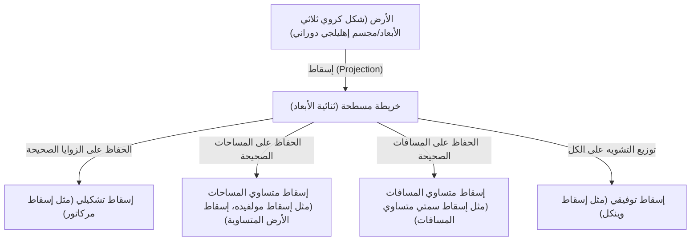
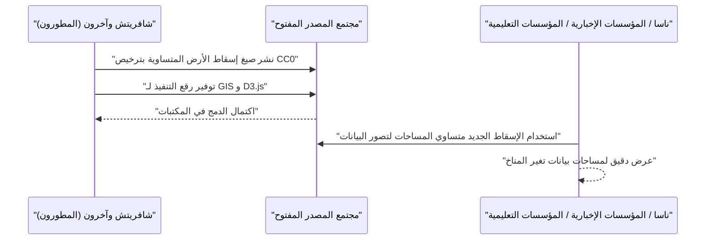

# مقدمة: المفارقة المطلقة لرسم شكل كروي على سطح مستو

منذ العصور القديمة، رسم البشر الخرائط لفهم وتسجيل العالم الذي يعيشون فيه. ومع ذلك، كان هناك دائمًا مفارقة هائلة واحدة: "من المستحيل رياضيًا بسط شكل كروي ثلاثي الأبعاد (الأرض) على سطح مستوٍ ثنائي الأبعاد (خريطة) دون تشويه". ويستند هذا إلى الحقيقة الرياضية التي أثبتها كارل فريدريش غاوس في "نظريته الرائعة (Theorema Egregium)"، بأنه لا يمكن رسم خريطة متساوية القياس بين الأسطح ذات الانحناءات المختلفة.

تمامًا كما يتمزق قشر البرتقال أو يتجعد عندما تحاول تسطيحه، فإن تسطيح الأرض إلى خريطة مسطحة ينتج عنه دائمًا نوع من "التشويه". إن تاريخ إسقاطات الخرائط (Map Projection) ليس سوى تاريخ من التسويات والاختيارات حول كيفية تعامل البشرية مع هذا "التشويه" الذي لا مفر منه، وما هي العناصر (المساحة، الزاوية، المسافة، الاتجاه) التي يجب التضحية بها وأيها يجب الحفاظ عليها.

في هذه المقالة، سنتعمق في تطور إسقاطات الخرائط بدءًا من ولادة إسقاط مركاتور في القرن السادس عشر وحتى أحدث إسقاط للأرض المتساوية (Equal Earth) في القرن الحادي والعشرين، مع الأخذ في الاعتبار الخلفيات الرياضية والتاريخية والاجتماعية.



## الفصل الأول: عصر الاكتشافات الكبرى وولادة إسقاط مركاتور

### 1.1 معاناة البحارة

خلال عصر الاكتشافات الكبرى من أواخر القرن الخامس عشر إلى القرن السادس عشر، أبحر البحارة الأوروبيون في بحار مجهولة. مع التوسع الدراماتيكي للعالم، مثل وصول كولومبوس إلى أمريكا وطواف ماجلان حول الأرض، زاد الطلب على الخرائط البحرية الدقيقة بشكل هائل.

كانت الخرائط البحرية في ذلك الوقت، والمعروفة باسم خرائط بورتولان، تعتمد على خطوط الاتجاه (خطوط البوصلة) المشعة من المركز. ومع ذلك، في الرحلات الطويلة، وخاصة الرحلات عبر المحيطات، أصبحت الأخطاء الناتجة عن كروية الأرض كبيرة بحيث لا يمكن تجاهلها. طالب البحارة بشدة بـ "خريطة تسمح لهم بالوصول إلى وجهتهم بمجرد الإبحار في خط مستقيم على طول اتجاه ثابت تشير إليه البوصلة (خط الاتجاه الثابت)".

### 1.2 ابتكار جيراردوس مركاتور

في عام 1569، استجاب الجغرافي الفلمنكي (بلجيكا الحالية) جيراردوس مركاتور (Gerardus Mercator) لنداءات البحارة الملحة من خلال نشر خريطة عالمية رائدة. هذا هو "إسقاط مركاتور".

أكبر ميزة لإسقاط مركاتور هي أن "الخط المستقيم الذي يربط بين أي نقطتين يمثل دائمًا اتجاه بوصلة ثابت (يتم تمثيل خطوط الاتجاه الثابت بخطوط مستقيمة)". سمح هذا للبحارة بمعرفة اتجاه البوصلة إلى وجهتهم ببساطة عن طريق وضع مسطرة على الخريطة ورسم خط مستقيم.

### 1.3 الأساس الرياضي لإسقاط مركاتور

يمكن اعتبار إسقاط مركاتور نوعًا من الإسقاط الأسطواني. تخيل لف أسطوانة حول خط استواء الأرض وإسقاط خريطة على الجزء الداخلي من الأسطوانة من مصدر ضوء في مركز الأرض. ومع ذلك، لم يكن مركاتور إسقاطًا بسيطًا، بل قام بتعديل التباعد بين خطوط العرض من خلال الحسابات الرياضية.

إذا كان خط الطول $\lambda$ وخط العرض $\phi$، والإحداثيات على الخريطة $(x, y)$، فإن صيغة إسقاط مركاتور تكون كما يلي (على افتراض أن الأرض كرة كاملة ونصف قطرها $R$).

$$ x = R(\lambda - \lambda_0) $$
$$ y = R \ln \left( \tan\left(\frac{\pi}{4} + \frac{\phi}{2}\right) \right) $$

هنا، $\lambda_0$ هو خط الطول المركزي المرجعي. وكما توضح هذه الصيغة، تزداد قيمة $y$ بشكل حاد في خطوط العرض العليا وتتباعد إلى ما لا نهاية ($\infty$) عند الأقطاب ($\phi = \pm \pi/2$).

فيما يلي مقتطف برمجي بسيط باستخدام بايثون لإجراء تحويل الإحداثيات لإسقاط مركاتور.

```python
import math

def latlon_to_mercator(lat, lon, R=6378137.0):
    """
    دالة لتحويل خطوط الطول والعرض إلى إحداثيات XY لإسقاط مركاتور (بالمتر)
    تُعادل حسابات EPSG:3857 (Web Mercator)
    """
    # تحويل خطوط الطول والعرض إلى راديان
    lat_rad = math.radians(lat)
    lon_rad = math.radians(lon)
    
    # حساب إحداثي X
    x = R * lon_rad
    
    # حساب إحداثي Y (الدالة العكسية لدالة غوديرمان)
    y = R * math.log(math.tan(math.pi / 4.0 + lat_rad / 2.0))
    
    return x, y

# مثال: حساب طوكيو (خط العرض 35.6812، خط الطول 139.7671)
x, y = latlon_to_mercator(35.6812, 139.7671)
print(f"Tokyo (Mercator): X={x:.2f}, Y={y:.2f}")
```

### 1.4 النور والظل في إسقاط مركاتور

نظرًا لأن إسقاط مركاتور يتمتع بـ "التشكل (الحفاظ على الزوايا بشكل صحيح)"، فإن الأشكال المحلية تتطابق مع الواقع. ومع ذلك، فإنه يعاني من عيب قاتل يتمثل في التشويه الشديد في "المساحة" كعوض عن ذلك. ونظرًا لأنه يتضخم في خطوط العرض العليا، تظهر جرينلاند تقريبًا بنفس حجم قارة إفريقيا، على الرغم من أن إفريقيا تبلغ مساحتها حوالي 14 ضعف مساحة جرينلاند.

سيؤدي هذا التشويه في المساحة لاحقًا إلى إثارة مشاكل سياسية واجتماعية. فبينما يتم المبالغة في تمثيل مناطق خطوط العرض العليا في نصف الكرة الشمالي، مثل أوروبا وأمريكا الشمالية، يتم تصوير البلدان النامية بالقرب من خط الاستواء بشكل أصغر، مما أدى إلى انتقادات بأنه "يغرس نظرة عالمية تتمحور حول أوروبا وأمريكا".

## الفصل الثاني: السعي وراء دقة المساحة: سلسلة الإسقاطات متساوية المساحات

ردًا على الانتقادات الموجهة لتشويه المساحة في إسقاط مركاتور، تم ابتكار العديد من "الإسقاطات متساوية المساحات" التي تحافظ على نسب المساحة الصحيحة.

### 2.1 إسقاط سانسون وإسقاط مولفيده

في القرن السابع عشر، أصبح "إسقاط سانسون (Sanson-Flamsteed projection)"، الذي استخدمه الفرنسي نيكولا سانسون وآخرون، شائعًا. هذا إسقاط متساوي المساحات حيث تكون خطوط العرض خطوطًا متوازية متساوية التباعد، وخطوط الطول عبارة عن منحنيات جيبية (منحنيات جيب الزاوية). على الرغم من وجود تشويه طفيف بالقرب من خط الطول المركزي، إلا أنه كان يعاني من عيب التشوه الشديد في الشكل في المناطق الطرفية (خاصة في خطوط العرض العليا).

وتم تحسين ذلك من قبل عالم الرياضيات الألماني كارل مولفيده في عام 1805 مع "إسقاط مولفيده (Mollweide projection)". يُدرج إسقاط مولفيده الأرض بأكملها في شكل إهليلجي واحد، مما يخفف من تشويه الشكل في خطوط العرض العليا مقارنة بإسقاط سانسون.

### 2.2 إسقاط جود هومولوسين (الإسقاط المتقطع)

في القرن العشرين، بُذلت جهود لتقليل تشويه الشكل بشكل أكبر مع الحفاظ على المساحات المتساوية. في عام 1923، نشر الجغرافي الأمريكي جون بول جود "إسقاط جود (إسقاط هومولوسين)".

اتخذ هذا الإسقاط نهجًا فريدًا يسمى "الإسقاط المتقطع"، حيث ربط إسقاط سانسون في مناطق خطوط العرض المنخفضة وإسقاط مولفيده في مناطق خطوط العرض العليا، ومزق الأجزاء المحيطية (أو القارية). سمح هذا برؤية شاملة للعالم بنسب مساحات صحيحة مع تقليل تشويه شكل كل قارة. ومع ذلك، نظرًا لأن المحيطات ممزقة، فقد كان من الصعب فهم الشكل المستمر للأرض بشكل بديهي.

## الفصل الثالث: الحرب الباردة والجدل حول إسقاط بيترز

تطورت إسقاطات الخرائط إلى ما هو أبعد من كونها مجرد مسألة رياضية أو جغرافية لتصبح نقاشًا كبيرًا شمل صراعات أيديولوجية، وهو ما لوحظ في الجدل حول "إسقاط بيترز (Peters projection)" في السبعينيات.

### 3.1 الإسقاط الأسطواني المتساوي المساحات لغال وادعاءات أرنو بيترز

في عام 1973، انتقد المؤرخ الألماني أرنو بيترز بشدة إسقاط مركاتور، مدعيًا أنه "خريطة متغطرسة ومركزية أوروبية تجعل العالم الثالث يبدو أصغر عن عمد"، ونشر "إسقاط بيترز" الخاص به. قام بالترويج له على نطاق واسع كـ "خريطة عالمية جديدة وعادلة حقًا تصور جميع الناس على قدم المساواة".

كان إسقاط بيترز إسقاطًا متساوي المساحات، ولم يقم بتكبير مناطق خطوط العرض العليا بشكل مفرط كما فعل إسقاط مركاتور. ونتيجة لذلك، دعمت وكالات الأمم المتحدة والعديد من المنظمات غير الحكومية والجماعات الدينية هذه الخريطة واعتمدتها على نطاق واسع كملصق تعليمي.

### 3.2 رد الفعل العنيف من مجتمع رسم الخرائط

ومع ذلك، واجه إعلان بيترز معارضة شديدة من رسامي الخرائط المحترفين. الأسباب كانت كالتالي:

1. **الاشتباه في الانتحال**: من الناحية الرياضية، كان إسقاط بيترز مطابقًا تمامًا لـ "الإسقاط الأسطواني المتساوي المساحات لغال" الذي نشره جيمس غال البريطاني في عام 1855. كان إسقاطًا معروفًا في مجتمع رسم الخرائط ولم يكن من اختراع بيترز الأصلي.
2. **تشويه شديد في الشكل**: نتيجة لاستخدام الإسقاط الأسطواني للحفاظ على المساحات المتساوية، تم تمديد مناطق خطوط العرض المنخفضة (إفريقيا وأمريكا الجنوبية) عموديًا بشكل متطرف، في حين تم سحق مناطق خطوط العرض العليا (أوروبا وكندا) أفقيًا، مما أدى إلى شكل غير جذاب للغاية.
3. **الاستخدام كدعاية**: اتهم رسامو الخرائط بيترز بتجاهل التنازلات الرياضية لإسقاطات الخرائط (الحفاظ على المساحة يشوه الشكل) والشيطنة غير العادلة لإسقاط مركاتور لنشر دعاية أيديولوجية.

أدى هذا الجدل إلى جعل العالم يدرك مرة أخرى أن الخريطة ليست مجرد نسخة موضوعية من الواقع، بل هي وسيلة لها تأثير قوي على النظرة العالمية والوعي السياسي لأولئك الذين ينظرون إليها.

## الفصل الرابع: فن التسوية: صعود الإسقاطات التوفيقية

إذا حاول المرء الحفاظ على كل من المساحة والشكل بشكل مثالي، فسيتم التضحية بالآخر بشكل كبير. لذلك، أصبحت "الإسقاطات التوفيقية (Compromise projection)"، التي تتخلى عن الدقة التامة للمساحات أو الزوايا سعيًا وراء "المظهر الطبيعي" و"تقليل التشويه الإجمالي"، هي الاتجاه السائد لخرائط العالم العامة في أواخر القرن العشرين.

### 4.1 إسقاط روبنسون

ابتكر رسام الخرائط الأمريكي آرثر إتش. روبنسون "إسقاط روبنسون (Robinson projection)" في عام 1963. وبدلاً من البدء بصيغة رياضية، اتخذ نهجًا فريدًا يتمثل في إعطاء الأولوية القصوى لـ "المظهر الجميل" وتحديد أطوال ومسافات خطوط العرض بشكل تجريبي.

أصبح هذا الإسقاط معترفًا به على نطاق واسع في جميع أنحاء العالم بعد أن اعتمدته الجمعية الجغرافية الوطنية كخريطة عالمية رسمية في عام 1988.

### 4.2 إسقاط وينكل الثلاثي

في وقت لاحق، في عام 1998، اعتمدت الجمعية الجغرافية الوطنية "إسقاط وينكل الثلاثي (Winkel Tripel projection)" ليحل محل إسقاط روبنسون. هذا الإسقاط، الذي ابتكره الألماني أوزوالد وينكل في عام 1921، هو المتوسط الحسابي لإسقاط أيتوف والإسقاط الأسطواني متساوي المسافات. كلمة "Tripel" تعني "ثلاثة" باللغة الألمانية، مما يشير إلى محاولة تقليل التشوهات الثلاثة: المساحة والزاوية والمسافة. حتى اليوم، يُستخدم كخريطة عالمية قياسية في العديد من الكتب المدرسية والأطالس.

## الفصل الخامس: تحديات جديدة في العصر الرقمي: ولادة إسقاط الأرض المتساوية

مع دخولنا القرن الحادي والعشرين، تغيرت طريقة تفاعلنا مع الخرائط بشكل كبير بسبب انتشار خدمات خرائط الويب مثل خرائط جوجل. ومن المفارقات أن هذه الخرائط على الويب تبنت مرة أخرى "إسقاط مركاتور (ويب مركاتور)" للسماح بعمليات التكبير والتصغير السلسة (تم تحسينه في السنوات الأخيرة للتبديل إلى نموذج كرة أرضية ثلاثي الأبعاد عند التصغير).

ومع ذلك، في المناقشات حول القضايا العالمية مثل تغير المناخ وعدم المساواة العالمية، تظل أهمية تصوير العالم بـ "نسب مساحات دقيقة" عالية، وكانت هناك حاجة إلى إسقاط جديد متساوي المساحات.

### 5.1 تحدي بويان شافريتش وآخرين

في عام 2018، نشر ثلاثة من رسامي الخرائط: بويان شافريتش (Bojan Šavrič) وتوم باترسون (Tom Patterson) وبرنهارد جيني (Bernhard Jenny)، إسقاطًا جديدًا تمامًا متساوي المساحات يسمى "إسقاط الأرض المتساوية (Equal Earth projection)".

كان هدفهم واضحًا.
"إنشاء خريطة عالمية لا تعاني من التشويه الشديد في الشكل كما في إسقاط بيترز، وتبدو طبيعية وجميلة مثل إسقاط روبنسون، ولديها دقة مساحية صارمة."

### 5.2 الابتكار الرياضي لإسقاط الأرض المتساوية

يشبه إسقاط الأرض المتساوية إلى حد كبير الخطوط العريضة لإسقاط روبنسون، ولكنه يستخدم متعددات حدود متقدمة لتحقيق دقة مساحية صارمة. صيغة الإسقاط هي كما يلي.

بافتراض أن خط العرض هو $\phi$ وخط الطول هو $\lambda$ (الفرق عن خط الطول المركزي)، ولتكن $ \theta $ الزاوية التي تحقق $ \sin \theta = \frac{\sqrt{3}}{2} \sin \phi $.

$$ x = \frac{2\sqrt{3} \lambda \cos \theta}{3 (9 A_4 \theta^8 + 7 A_3 \theta^6 + 3 A_2 \theta^2 + A_1)} $$
$$ y = A_4 \theta^9 + A_3 \theta^7 + A_2 \theta^3 + A_1 \theta $$

هنا، المعاملات هي كما يلي:
$ A_1 = 1.340264 $
$ A_2 = -0.081106 $
$ A_3 = 0.000893 $
$ A_4 = 0.003796 $

بفضل هذه الصيغة المعقدة، نجح إسقاط الأرض المتساوية في التعبير عن نسب المساحات الصحيحة مع الحفاظ على الأشكال الطبيعية للقارات، دون تمديد المنطقة الاستوائية أو سحق خطوط العرض العليا بشكل متطرف.

### 5.3 الانتشار كمصدر مفتوح

ما جعل إسقاط الأرض المتساوية رائدًا ليس تصميمه فحسب، بل منهجه في النشر أيضًا. أطلق المطورون صيغ هذا الإسقاط في المجال العام (CC0) وعملوا بسرعة لتنفيذه في برامج نظم المعلومات الجغرافية مفتوحة المصدر مثل QGIS ومكتبات تصور البيانات مثل D3.js.

نتيجة لذلك، سرعان ما تم قبوله من قبل العلماء ووسائل الإعلام في جميع أنحاء العالم، بما في ذلك اعتماده من قبل ناسا (الإدارة الوطنية للملاحة الجوية والفضاء) في خرائط شذوذ درجات الحرارة العالمية.



## الخلاصة: الخرائط تخلق العالم

إن تاريخ الإسقاطات من مركاتور إلى الأرض المتساوية هو أيضًا تاريخ من التغييرات الأيديولوجية حول "كيفية إدراك البشرية للعالم الذي نعيش فيه وكيف نريد إيصال ذلك".

خلال عصر الاكتشافات الكبرى، أُعطيت الأولوية القصوى لـ "الوصول بشكل موثوق إلى الوجهات" (التشكل)، وفي عصر الاستعمار، كانت الخرائط التي تُظهر اتساع أراضي الدولة مفضلة. وفي حقبة الحرب الباردة، أثارت الخرائط التي دعت إلى تصحيح الفجوة بين الشمال والجنوب الجدل، واليوم، أصبحت الخرائط التي يمكنها النظر بموضوعية إلى القضايا العالمية مثل تغير المناخ (الحفاظ على المساحات + الأشكال الطبيعية) مطلوبة.

**"الخريطة ليست مجرد مرآة تعكس العالم، بل هي أيضًا عدسة تخلق العالم."**

عندما ننظر إلى خريطة، يجب أن ندرك دائمًا ما هي التسويات الرياضية التي بنيت عليها وما هي النية وراء رسمها. يمكن القول إن إسقاط الأرض المتساوية هو أحد أحدث "العدسات" التي توضح كيف نحاول نحن في العصر الحديث إعادة النظر إلى العالم.
