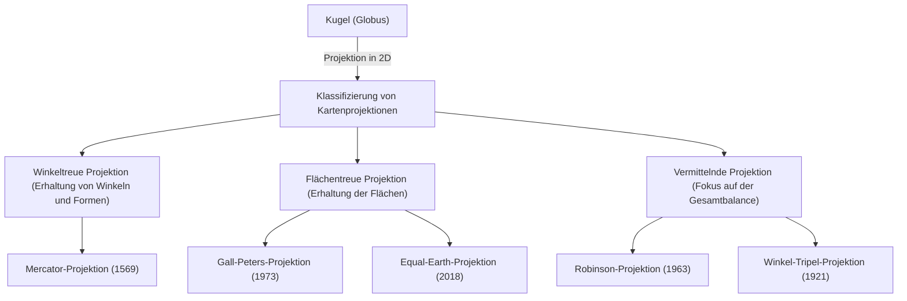

Die "Weltkarte", die wir täglich sehen. Von digitalen Karten auf Smartphone-Bildschirmen bis hin zu großen Postern an den Wänden von Klassenzimmern sind Karten tief in unserem Leben verwurzelt. Aber haben Sie schon einmal intensiv über die Tatsache nachgedacht, dass eine auf einer flachen Oberfläche gezeichnete Weltkarte in Wirklichkeit nicht die "genaue Form der Erde" ist?

Die Erde hat eine Form, die einer dreidimensionalen Kugel nahekommt (streng genommen ein Rotationsellipsoid), aber die meisten Karten, die wir verwenden, sind zweidimensionale Ebenen. Dieser Akt der "Entfaltung einer dreidimensionalen Oberfläche in zwei Dimensionen" birgt ein unvermeidliches und bedeutendes mathematisches Paradoxon. In diesem Artikel werden wir die verborgene Geschichte und die Konflikte darüber entwirren, wie die Menschheit den riesigen Raum der Erde verstanden und auf einer ebenen Fläche dargestellt hat, angefangen bei der Mercator-Projektion, die das Zeitalter der Entdeckungen vorantrieb, über die Peters-Projektion, die politische Wellen schlug, bis hin zur modernen Equal-Earth-Projektion.

## 1. Das mathematische Dilemma, eine Kugel auf einer Ebene zu zeichnen

Um über die Geschichte der Kartenprojektionen zu sprechen, müssen wir zunächst die grundlegende mathematische Prämisse verstehen, die von "Carl Friedrich Gauß" bewiesen wurde. Der große Mathematiker Gauß aus dem 19. Jahrhundert leitete einen Lehrsatz der Differentialgeometrie ab, der als "Theorema Egregium" (Hervorragender Satz) bezeichnet wird. Nach diesem Satz hat die Gaußsche Krümmung einer Fläche die Eigenschaft, dass sie sich nicht ändert, selbst wenn die Fläche gebogen wird.

Die Gaußsche Krümmung einer Kugel wie der Erde ist positiv, während die Gaußsche Krümmung einer Ebene null ist. Daher ist es mathematisch unmöglich, Flächen mit unterschiedlichen Gaußschen Krümmungen ohne Dehnung, Schrumpfung oder Risse aufeinander abzubilden. Es ist dasselbe Prinzip wie die Tatsache, dass man eine Mandarinenschale nicht schälen und nahtlos zu einem einzigen flachen Rechteck ausdehnen kann.

Aufgrund dieses mathematischen Dilemmas kann keine Weltkarte die folgenden vier Elemente gleichzeitig genau beibehalten:

1. **Fläche** (Flächentreue): Wird das tatsächliche Flächenverhältnis von Land und Meer beibehalten?
2. **Winkel/Form** (Winkeltreue): Werden die tatsächlichen Umrisse der Topografie und die Winkel sich schneidender Linien beibehalten?
3. **Entfernung** (Längentreue): Wird das Entfernungsverhältnis von einem bestimmten Punkt beibehalten?
4. **Richtung** (Richtungstreue): Wird die Richtung von einem bestimmten Punkt korrekt beibehalten?

Nur ein "Globus" erfüllt all diese Kriterien. Bei der Erstellung einer flachen Karte sind die Kartenmacher gezwungen, "Kompromisse" einzugehen, etwas zu opfern und etwas für ihren Zweck zu priorisieren. Man kann sagen, dass diese Wahl die Geschichte der Kartenprojektionen selbst ist.

## 2. Die Innovation, die das Zeitalter der Entdeckungen unterstützte: Die Mercator-Projektion

Wenn es um die Weltkarte geht, die uns heute am vertrautesten ist, ist es wahrscheinlich die "Mercator-Projektion". Diese Karte, die 1569 von dem flämischen (heute Belgien) Geographen Gerardus Mercator veröffentlicht wurde, war eine bahnbrechende Erfindung, die die Geschichte der Menschheit stark veränderte.

Europa befand sich damals mitten im "Zeitalter der Entdeckungen" und machte sich auf den Weg zu unbekannten Kontinenten und Ozeanen. Es gab jedoch keine Orientierungspunkte auf den weiten Meeren, und Seeleute waren ständig der Gefahr ausgesetzt, Schiffbruch zu erleiden. Was sie brauchten, war eine "Seekarte, die sie zuverlässig an ihr Ziel bringen konnte".

Das größte Merkmal der Mercator-Projektion ist ihre "Winkeltreue". Längengrade und Breitengrade schneiden sich immer im rechten Winkel, und eine gerade Linie (Loxodrome), die zwei beliebige Punkte verbindet, stimmt mit der tatsächlichen Richtung des Kompasses überein. Das bedeutete, dass Seeleute einfach den Start- und Zielort auf der Karte mit einer geraden Linie verbinden, den Winkel (die Richtung) zwischen dieser Linie und dem Längengrad messen und den Kompass auf diesem Winkel halten mussten, um ihr Ziel sicher zu erreichen.

Diese funktionale und bahnbrechende Karte war wirklich ein magisches Werkzeug für Navigatoren. Allerdings hatte diese Bequemlichkeit einen hohen Preis. Dies war die "extreme Verzerrung der Fläche".
Bei der Mercator-Projektion wird eine Region umso mehr sowohl von Ost nach West als auch von Nord nach Süd vergrößert, je höher der Breitengrad ist, so dass Regionen näher an den Polen weitaus größer gezeichnet werden als ihre tatsächliche Fläche.

Betrachtet man beispielsweise die Mercator-Projektion, erscheint Grönland etwa so groß wie der afrikanische Kontinent oder sogar größer. Vergleicht man jedoch die tatsächlichen Flächen, ist der afrikanische Kontinent etwa 14-mal so groß wie Grönland. In ähnlicher Weise werden Länder in hohen Breiten wie Russland und Kanada als Gebiete hervorgehoben, die viel größer sind als ihre tatsächliche Fläche.

Mercator selbst hatte beabsichtigt, dass diese Karte ausschließlich für die "Navigation" verwendet werden sollte. Aufgrund ihres geradlinigen und klaren Erscheinungsbildes wurde sie jedoch auch auf Karten für das allgemeine Publikum sowie in der Schulausbildung über die Navigation hinaus weit verbreitet übernommen und verzerrte infolgedessen die "räumliche Wahrnehmung der Welt" der Menschen für Jahrhunderte.

## 3. Die Projektion von Politik und Ideologie: Die Kontroverse um die Peters-Projektion

Zu Beginn des 20. Jahrhunderts wuchs die Kritik an der anhaltenden allgemeinen Verwendung der Mercator-Projektion. Der Hintergrund dafür war nicht nur das Streben nach rein geografischer Genauigkeit, sondern auch eine tief verflochtene politische und soziale Ideologie.

1973 übte der deutsche Historiker Arno Peters scharfe Kritik und erklärte: "Die Mercator-Projektion stellt die Industrieländer Europas (die in den hohen Breiten der nördlichen Hemisphäre liegen) ungerechtfertigt groß dar, während sie die Gebiete nahe dem Äquator, in denen es viele Entwicklungsländer gibt (wie Afrika, Südamerika und Südostasien), klein erscheinen lässt. Dies ist ein Ausdruck der kolonialistischen Vorherrschaft der Weißen."

Was er als "gleichere und korrektere Weltkarte" mit großem Aufwand ankündigte, war die "Peters-Projektion" (offiziell Gall-Peters-Projektion). Diese Karte war eine "flächentreue Projektion", die darauf spezialisiert war, das tatsächliche Flächenverhältnis in allen Regionen der Welt genau widerzuspiegeln.

Wenn man sich die Peters-Projektion ansieht, entsteht ein Bild, das sich sehr von der Welt unterscheidet, an die wir gewöhnt sind. Europa wird sehr klein gezeichnet, und umgekehrt sind die Kontinente Afrika und Südamerika vertikal lang, und ihre enorme Größe fällt auf. Dies wurde zu einer starken visuellen Waffe für die Länder der Dritten Welt, um ihre Präsenz rechtmäßig zu behaupten. Die UNESCO (Organisation der Vereinten Nationen für Erziehung, Wissenschaft und Kultur) und viele internationale NGOs unterstützten und übernahmen diese Karte aus Gründen der Fairness.

Es gab jedoch starken Widerstand von Experten der Kartografie. Um die Fläche genau zu machen, wurden die "Formen" (Umrisse) der Kontinente in der Peters-Projektion extrem verzerrt. Länder in der Nähe des Äquators erscheinen vertikal gestreckt, während Regionen in hohen Breiten horizontal gequetscht wirken. Es entbrannten heftige Debatten mit Argumenten wie "die Form ist unnatürlich und für den praktischen Gebrauch ungeeignet" und "Peters' Behauptungen sind nichts weiter als politische Propaganda".

Diese "Peters-Projektionskontroverse" war ein historisches Ereignis, das hervorhob, dass Karten nicht nur Ausdruck geografischer Informationen sind, sondern auch Medien, die das Weltbild, die Machtverhältnisse und die politischen Ideologien derjenigen prägen, die sie betrachten.

## 4. Auf der Suche nach einem Kompromiss zwischen Schönheit und Praktikabilität: Vermittelnde Projektionen

Die "Lüge der Fläche" der Mercator-Projektion und die "Verzerrung der Form" der Peters-Projektion. Da beide extreme Elemente aufwiesen, begannen Kartografen nach "einer Karte zu suchen, die weder in der Fläche noch in der Form perfekt ist, aber am natürlichsten und ausgewogensten aussieht". Dies war die Geburtsstunde der "vermittelnden Projektion".

Ein typisches Beispiel für eine vermittelnde Projektion ist die "Robinson-Projektion", die 1963 von dem amerikanischen Geographen Arthur H. Robinson veröffentlicht wurde. Robinson leitete die Karte nicht aus einer mathematischen Formel ab, sondern ging von der visuellen und künstlerischen Intuition aus, "wie sie dem menschlichen Auge erscheint". Durch wiederholte Simulationen suchte er manuell nach einem Kompromiss, bei dem die Formen der Landmassen nicht extrem verzerrt waren und das Flächenverhältnis nicht allzu weit abwich, und wandelte dies später in mathematische Koordinaten um.

Die Robinson-Projektion hat eine schöne, insgesamt abgerundete elliptische Form, die für unsere Augen sehr natürlich wirkt. Als 1988 die angesehene National Geographic Society die Robinson-Projektion als ihre offizielle Weltkarte übernahm, wurde sie zu einem der weltweiten Standards.

Noch später, im Jahr 1998, wechselte die National Geographic Society zur "Winkel-Projektion" (Winkel-Tripel-Projektion). Diese von Oswald Winkel entworfene Projektion verfolgt den Ansatz, drei Verzerrungen (Tripel bedeutet auf Deutsch "drei") – Fläche, Winkel und Entfernung – zu minimieren, und gilt als noch weniger verzerrt und ausgewogener als die Robinson-Projektion. Vermittelnde Projektionen ähnlich der Winkel- oder Robinson-Projektion sind heute in vielen Lehrbüchern und allgemeinen Weltkarten der Mainstream.

## 5. Moderne Herausforderungen und neue Ausdrucksformen: Authagraph und die Equal-Earth-Projektion

Auch im 21. Jahrhundert schreitet die Entwicklung der Kartenprojektionen weiter voran. In der heutigen Zeit, in der globale Umweltprobleme und Globalisierung voranschreiten, sind wir gezwungen, die Erde aus neuen Perspektiven neu zu betrachten.

Ein solcher Versuch ist die "Authagraph-Weltkarte", die von dem japanischen Architekten Hajime Narukawa und anderen erfunden wurde. Diese Karte verwendet eine originelle Methode, bei der die Erdoberfläche in 96 gleiche Teile geteilt, auf einen regelmäßigen Tetraeder projiziert und dann zu einer rechteckigen ebenen Karte entfaltet wird. Der größte Vorteil besteht darin, dass die Karte unendlich oft nebeneinandergelegt werden kann, unabhängig davon, welcher Teil im Zentrum steht, wobei das Flächenverhältnis erhalten bleibt. Sie eignet sich für die Betrachtung der Welt aus einer globalen Perspektive ohne Zentrum, wie z. B. bei Netzwerken von See- und Flugrouten und den Auswirkungen des Klimawandels, und wurde 2016 mit dem Good Design Grand Award ausgezeichnet.

Und die neue Projektion, die in den letzten Jahren am meisten Aufmerksamkeit erregt hat, ist die "Equal-Earth-Projektion", die 2018 von drei Kartografen – Bojan Šavrič, Tom Patterson und Bernhard Jenny – veröffentlicht wurde.

Die Equal-Earth-Projektion ist eine neue "flächentreue Projektion (eine Karte mit korrekter Fläche)", die entwickelt wurde, um die "extreme Unnatürlichkeit der Formen" zu überwinden, unter der die Peters-Projektion litt. Ihr Ziel war eine Karte, die ein augenfreundliches, abgerundetes Erscheinungsbild ähnlich der Robinson-Projektion aufweist und gleichzeitig sicherstellt, dass das Flächenverhältnis jedes Kontinents und Landes absolut korrekt ist.

Eines der Motive für die Entwicklung war ein starkes Gefühl der Krise, dass bei der Visualisierung von Daten zum Klimawandel und zu Umweltproblemen Missverständnisse entstehen können, wenn die Fläche nicht genau ist. Wenn man beispielsweise die Auswirkungen von Entwaldung oder des Anstiegs des Meeresspiegels zeigt, überschätzt die Mercator-Projektion die Auswirkungen in den hohen Breiten. Die Equal-Earth-Projektion ist ein innovatives Design, das Schönheit und wissenschaftliche Genauigkeit verbindet, was nur in der Neuzeit möglich wurde, in der die Entwicklung der Computertechnologie hochkomplexe Berechnungen ermöglicht hat. Derzeit wird sie zunehmend auf Klimadatenkarten von Organisationen wie der NASA (National Aeronautics and Space Administration) und GISS (Goddard Institute for Space Studies) eingesetzt.

## Fazit: Karten sind Weltanschauungen

Ein Blick auf die Geschichte der Kartenprojektionen, von der Mercator-Projektion bis zur Equal-Earth-Projektion, zeigt, dass sie nicht nur die Entwicklung von Vermessungstechniken und Mathematik widerspiegelt, sondern auch den starken Willen der Menschen in jeder Epoche darüber, "wie sie die Erde sehen wollen und wie sie genutzt werden sollte".

Winkeltreue, die das Leben von Seeleuten rettete und den globalen Handel ermöglichte.
Flächentreue, die Probleme des Nord-Süd-Gefälles und der Ungleichheit ansprach und verschiedene Perspektiven einbrachte.
Und neue Ausdrucksformen, die allgemeine Harmonie anstreben und zur Lösung von Problemen in unserer komplexen modernen Gesellschaft beitragen.

Die Weltkarte, die wir betrachten, ist keineswegs die absolute "wahre Form". Es ist eine von vielen "Interpretationen", durch die die Menschheit die unendlich weite dreidimensionale Erde auf der Grundlage ihrer eigenen Zwecke und Werte in zwei Dimensionen übersetzt hat. Wenn Sie das nächste Mal eine Weltkarte betrachten, sollten Sie über die Geschichte von Hunderten von Jahren an Versuchen, Irrtümern und Konflikten der Kartenmacher nachdenken, die in diesem einen Blatt Papier (oder auf diesem einen Bildschirm) steckt. Wie wir die Welt sehen, wird davon geprägt, welche Karte wir wählen.
