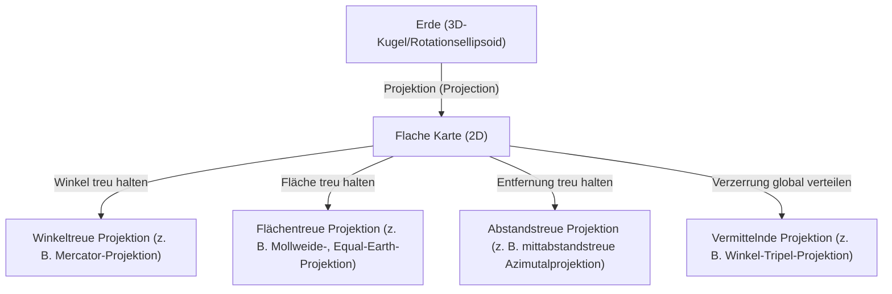
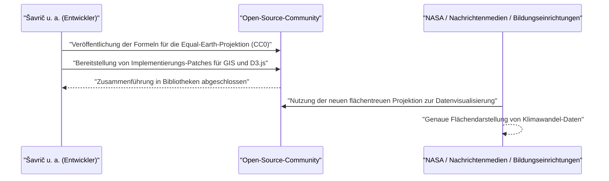

# Einleitung: Das ultimative Paradoxon, eine Sphäre auf einer Ebene darzustellen

Seit der Antike zeichnet die Menschheit Karten, um die Welt, in der sie lebt, zu verstehen und aufzuzeichnen. Dabei gab es jedoch immer ein gewaltiges Paradoxon: die Tatsache, dass "es mathematisch unmöglich ist, eine dreidimensionale Kugel (die Erde) verzerrungsfrei auf einer zweidimensionalen Ebene (einer Karte) abzuwickeln". Dies beruht auf einer mathematischen Wahrheit, die Carl Friedrich Gauß in seinem "Theorema Egregium" bewiesen hat: Flächen mit unterschiedlicher Krümmung können nicht längentreu aufeinander abgebildet werden.

Genauso wie eine Orangenschale beim Versuch, sie flach auszubreiten, unweigerlich reißt oder Falten wirft, entstehen auch beim Übertragen der Erde auf eine flache Karte immer irgendwelche "Verzerrungen". Die Geschichte der Kartenprojektion (Map Projection) ist nichts anderes als eine Geschichte von Kompromissen und Entscheidungen – wie die Menschheit mit dieser unvermeidlichen "Verzerrung" umgeht, welche Elemente (Fläche, Winkel, Entfernung, Richtung) sie opfert und welche sie beibehält.

Dieser Artikel befasst sich eingehend mit der Entwicklung von Kartenprojektionen, von der Entstehung der Mercator-Projektion im 16. Jahrhundert bis zur neuesten Equal-Earth-Projektion des 21. Jahrhunderts, unter Einbeziehung mathematischer, historischer und gesellschaftlicher Hintergründe.



## Kapitel 1: Das Zeitalter der Entdeckungen und die Geburt der Mercator-Projektion

### 1.1 Die Qualen der Seefahrer

Während des Zeitalters der Entdeckungen vom späten 15. bis zum 16. Jahrhundert stachen europäische Seefahrer in unbekannte Gewässer in See. Da sich die Welt durch Ereignisse wie Kolumbus' Ankunft in Amerika und Magellans Weltumseglung dramatisch vergrößerte, stieg die Nachfrage nach genauen Seekarten explosionsartig an.

Die damaligen Seekarten verließen sich auf sogenannte Portolankarten, auf denen man sich an radial vom Zentrum ausgehenden Richtungs- oder Kompasslinien orientierte. Bei langen Reisen, insbesondere bei der Überquerung von Ozeanen, wurden die Fehler aufgrund der Kugelgestalt der Erde jedoch zu groß, um sie zu ignorieren. Die Seefahrer verlangten dringend nach einer Karte, bei der man das Ziel erreichen konnte, indem man einfach geradeaus in eine vom Kompass angezeigte, konstante Richtung fuhr (Loxodrome).

### 1.2 Die Innovation von Gerardus Mercator

Im Jahr 1569 veröffentlichte der flämische (heutiges Belgien) Geograf Gerardus Mercator eine bahnbrechende Weltkarte, die diesem dringenden Wunsch der Seefahrer entsprach. Das war die "Mercator-Projektion".

Das wichtigste Merkmal der Mercator-Projektion ist, dass "eine gerade Linie zwischen zwei beliebigen Punkten immer eine konstante Kompassrichtung anzeigt (Loxodromen werden als gerade Linien dargestellt)". So konnten Seefahrer die Kompassrichtung zu ihrem Ziel einfach ermitteln, indem sie ein Lineal auf die Karte legten und eine gerade Linie zogen.

### 1.3 Die mathematische Grundlage der Mercator-Projektion

Die Mercator-Projektion kann als eine Art Zylinderprojektion betrachtet werden. Man kann sich vorstellen, dass ein Zylinder um den Äquator der Erde gewickelt ist und die Karte durch eine Lichtquelle im Erdmittelpunkt auf die Innenseite des Zylinders projiziert wird. Mercator verwendete jedoch keine einfache Projektion, sondern passte den Abstand der Breitengrade durch mathematische Berechnungen an.

Wenn der Längengrad $\lambda$, der Breitengrad $\phi$ und die Koordinaten auf der Karte $(x, y)$ sind, lautet die Projektionsformel der Mercator-Projektion wie folgt (wobei die Erde als perfekte Kugel mit dem Radius $R$ angenommen wird).

$$ x = R(\lambda - \lambda_0) $$
$$ y = R \ln \left( \tan\left(\frac{\pi}{4} + \frac{\phi}{2}\right) \right) $$

Hierbei ist $\lambda_0$ der Referenz-Mittelmeridian. Wie diese Gleichung zeigt, steigt der Wert von $y$ in höheren Breiten rapide an und divergiert an den Polen ($\phi = \pm \pi/2$) gegen Unendlich ($\infty$).

Das Folgende ist ein einfaches Code-Snippet zur Koordinatentransformation in der Mercator-Projektion mit Python.

```python
import math

def latlon_to_mercator(lat, lon, R=6378137.0):
    """
    Funktion zur Umrechnung von Breiten- und Längengrad in XY-Koordinaten (Meter) der Mercator-Projektion
    Entspricht der Berechnung von EPSG:3857 (Web Mercator)
    """
    # Breiten- und Längengrad in Bogenmaß umwandeln
    lat_rad = math.radians(lat)
    lon_rad = math.radians(lon)
    
    # X-Koordinate berechnen
    x = R * lon_rad
    
    # Y-Koordinate berechnen (Umkehrfunktion der Gudermannfunktion)
    y = R * math.log(math.tan(math.pi / 4.0 + lat_rad / 2.0))
    
    return x, y

# Beispiel: Berechnung für Tokio (Breitengrad 35.6812, Längengrad 139.7671)
x, y = latlon_to_mercator(35.6812, 139.7671)
print(f"Tokyo (Mercator): X={x:.2f}, Y={y:.2f}")
```

### 1.4 Licht und Schatten der Mercator-Projektion

Da die Mercator-Projektion "Winkeltreue" (die Winkel bleiben korrekt erhalten) aufweist, stimmen lokale Formen mit der Realität überein. Der Preis dafür ist jedoch der fatale Nachteil, dass die "Fläche" extrem verzerrt ist. Je höher der Breitengrad, desto größer die Vergrößerung. So wird Grönland etwa gleich groß dargestellt wie der afrikanische Kontinent, obwohl Afrika in Wirklichkeit etwa 14-mal so groß ist wie Grönland.

Diese Flächenverzerrung führte später zu politischen und gesellschaftlichen Problemen. Da hochgelegene Gebiete der Nordhalbkugel wie Europa und Nordamerika übertrieben groß dargestellt werden, während die Entwicklungsländer in der Nähe des Äquators klein gezeichnet werden, wurde die Kritik laut, dass dies eine "eurozentrische Weltsicht einprägt".

## Kapitel 2: Das Streben nach Flächengenauigkeit: Die Genealogie der flächentreuen Projektionen

Als Reaktion auf die Kritik an der Flächenverzerrung der Mercator-Projektion wurden viele "flächentreue Projektionen" entwickelt, bei denen das Flächenverhältnis korrekt erhalten bleibt.

### 2.1 Sinusoidal-Projektion und Mollweide-Projektion

Im 17. Jahrhundert verbreitete sich die von dem Franzosen Nicolas Sanson und anderen verwendete "Sinusoidal-Projektion (Sanson-Flamsteed-Projektion)". Dies ist eine flächentreue Projektion, bei der die Breitengrade äquidistante parallele Linien und die Längengrade Sinuskurven sind. Obwohl die Verzerrung in der Nähe des Mittelmeridians gering ist, hatte sie den Nachteil einer starken Formverzerrung in den Randgebieten (insbesondere in hohen Breiten).

Eine Verbesserung davon ist die "Mollweide-Projektion", die 1805 vom deutschen Mathematiker Carl Mollweide vorgestellt wurde. Die Mollweide-Projektion fasst die gesamte Erde in einer einzigen Ellipse zusammen und mildert die Formverzerrung in hohen Breiten im Vergleich zur Sinusoidal-Projektion.

### 2.2 Goodes Homolosine-Projektion (Unterbrochene Projektion)

Im 20. Jahrhundert wurden weitere Versuche unternommen, die Formverzerrung zu verringern und gleichzeitig die Flächentreue zu erhalten. Im Jahr 1923 veröffentlichte der amerikanische Geograf John Paul Goode die "Goode-Projektion (Homolosine-Projektion)".

Diese verwendete einen unkonventionellen Ansatz namens "unterbrochene Projektion", bei dem die Sinusoidal-Projektion für niedrige Breiten und die Mollweide-Projektion für hohe Breiten zusammengefügt wurden, und außerdem Teile des Ozeans (oder der Kontinente) eingeschnitten wurden. Dies ermöglichte es, die Formverzerrung der einzelnen Kontinente auf ein Minimum zu reduzieren und gleichzeitig die Welt mit den richtigen Flächenverhältnissen zu betrachten. Es war jedoch schwierig, die kontinuierliche Form der Erde intuitiv zu erfassen, da die Ozeane aufgerissen waren.

## Kapitel 3: Der Kalte Krieg und die Kontroverse um die Peters-Projektion

Dass Kartenprojektionen nicht nur eine Frage der Mathematik oder Geografie sind, sondern sich zu einer großen Kontroverse entwickelten, in die ideologische Konflikte verwickelt waren, zeigt der Aufruhr um die "Peters-Projektion" in den 1970er Jahren.

### 3.1 Die Gall-Peters-Projektion und die Behauptungen von Arno Peters

1973 kritisierte der deutsche Historiker Arno Peters heftig: "Die Mercator-Projektion ist eine arrogante eurozentrische Karte, die die Dritte Welt absichtlich klein erscheinen lässt", und veröffentlichte seine eigene "Peters-Projektion". Er bewarb sie stark als "eine wahrhaft faire, neue Weltkarte, die alle Völker gleich darstellt".

Die Peters-Projektion war eine flächentreue Projektion, sodass Gebiete in hohen Breiten nicht extrem vergrößert wurden wie bei der Mercator-Projektion. Aus diesem Grund unterstützten UN-Organisationen und viele NGOs sowie religiöse Gruppen diese Karte und verwendeten sie weithin als Aufklärungsposter.

### 3.2 Die heftige Reaktion der kartografischen Fachwelt

Professionelle Kartografen reagierten jedoch heftig auf diese Veröffentlichung von Peters. Die Gründe dafür sind wie folgt:

1. **Verdacht auf Plagiat**: Mathematisch gesehen war die Peters-Projektion exakt identisch mit der "Gallschen orthografischen Projektion", die 1855 vom Briten James Gall veröffentlicht wurde. Sie war in der Kartografie-Gemeinschaft bereits bekannt und kein Originalwerk von Peters.
2. **Extreme Formverzerrung**: Durch die Verwendung einer Zylinderprojektion zur Erhaltung der Flächentreue wurden niedrige Breiten (Afrika und Südamerika) vertikal extrem gestreckt und hohe Breiten (Europa und Kanada) horizontal zusammengepresst, was zu sehr unschönen Formen führte.
3. **Nutzung als Propaganda**: Kartografen warfen Peters vor, ideologische Propaganda zu betreiben, indem er den mathematischen Kompromiss der Kartenprojektion (die Wahrung der Fläche verzerrt die Form) ignorierte und die Mercator-Projektion ungerechtfertigt verteufelte.

Diese Kontroverse machte der Welt deutlich, dass Karten nicht nur objektive Abbildungen der Realität sind, sondern Medien, die das Weltbild und das politische Bewusstsein der Betrachtenden stark beeinflussen.

## Kapitel 4: Die Kunst des Kompromisses: Der Aufstieg der vermittelnden Projektionen

Wenn man versucht, Fläche oder Form perfekt zu erhalten, wird das jeweils andere extrem geopfert. Daher wurden in der zweiten Hälfte des 20. Jahrhunderts "vermittelnde Projektionen (Compromise projection)" zum Mainstream für allgemeine Weltkarten. Sie verwarfen die strikte Flächentreue oder Winkeltreue und strebten nach "natürlichem Aussehen" und "geringer Gesamtverzerrung".

### 4.1 Robinson-Projektion

Die "Robinson-Projektion", die 1963 vom amerikanischen Kartografen Arthur H. Robinson entwickelt wurde, ging nicht von einer mathematischen Formel aus. Stattdessen wählte er einen einzigartigen Ansatz: Er bestimmte die Länge und den Abstand der Breitenkreise empirisch, wobei er der "Ästhetik des Aussehens" höchste Priorität einräumte.

Diese Projektion erlangte weltweite Bekanntheit, nachdem die National Geographic Society sie 1988 als ihre offizielle Weltkarte angenommen hatte.

### 4.2 Winkel-Tripel-Projektion

Später, im Jahr 1998, ersetzte die National Geographic Society die Robinson-Projektion durch die "Winkel-Tripel-Projektion (Winkel Tripel projection)". Diese Projektion, die 1921 vom deutschen Kartografen Oswald Winkel entwickelt wurde, ist das arithmetische Mittel aus der Aitow-Projektion und der Plattkarte. "Tripel" ist das deutsche Wort für "dreifach" und zeigt an, dass man versuchte, drei Verzerrungen zu minimieren: Fläche, Winkel und Entfernung. Sie wird auch heute noch in vielen Lehrbüchern und Atlanten als Standard-Weltkarte verwendet.

## Kapitel 5: Neue Herausforderungen im digitalen Zeitalter: Die Geburt der Equal-Earth-Projektion

Mit Beginn des 21. Jahrhunderts veränderte sich unser Umgang mit Karten dramatisch, hauptsächlich durch die Verbreitung von Web-Kartendiensten wie Google Maps. Ironischerweise verwenden diese Webkarten wieder die "Mercator-Projektion (Web-Mercator)", um reibungslose Zoom-Vorgänge zu ermöglichen (in den letzten Jahren wurde dies verbessert, sodass beim Herauszoomen auf ein 3D-Globusmodell umgeschaltet wird).

Doch bei der Diskussion globaler Themen wie dem Klimawandel oder globaler Ungleichheit blieb die Notwendigkeit, die Welt mit "genauen Flächenverhältnissen" zu visualisieren, hoch, weshalb eine neue flächentreue Projektion gefordert wurde.

### 5.1 Die Herausforderung von Bojan Šavrič und anderen

Im Jahr 2018 veröffentlichten die drei Kartografen Bojan Šavrič, Tom Patterson und Bernhard Jenny eine völlig neue flächentreue Projektion, die "Equal-Earth-Projektion (Equal Earth projection)".

Ihr Ziel war klar:
"Eine Weltkarte zu erstellen, die keine extremen Formverzerrungen wie die Peters-Projektion aufweist, ein natürliches und schönes Aussehen wie die Robinson-Projektion hat und gleichzeitig strenge Flächentreue besitzt."

### 5.2 Die mathematische Innovation der Equal-Earth-Projektion

Die Equal-Earth-Projektion ähnelt in ihrem äußeren Erscheinungsbild sehr der Robinson-Projektion, erreicht aber durch komplexe Polynome eine strikte Flächentreue. Ihre Projektionsgleichungen lauten wie folgt:

Sei $\phi$ der Breitengrad, $\lambda$ der Längengrad (die Differenz zum Mittelmeridian) und $\theta$ ein Winkel, der $\sin \theta = \frac{\sqrt{3}}{2} \sin \phi$ erfüllt.

$$ x = \frac{2\sqrt{3} \lambda \cos \theta}{3 (9 A_4 \theta^8 + 7 A_3 \theta^6 + 3 A_2 \theta^2 + A_1)} $$
$$ y = A_4 \theta^9 + A_3 \theta^7 + A_2 \theta^3 + A_1 \theta $$

Hierbei sind die Koeffizienten wie folgt:
$ A_1 = 1.340264 $
$ A_2 = -0.081106 $
$ A_3 = 0.000893 $
$ A_4 = 0.003796 $

Dank dieser komplexen mathematischen Formeln gelang es der Equal-Earth-Projektion, die richtigen Flächenverhältnisse darzustellen und gleichzeitig die natürliche Form der Kontinente beizubehalten, ohne dass die Äquatorregionen gestreckt oder die hohen Breiten extrem zusammengequetscht werden.

### 5.3 Verbreitung als Open Source

Das Bahnbrechende an der Equal-Earth-Projektion war nicht nur ihr Design, sondern auch ihr Ansatz zur Verbreitung. Die Entwickler veröffentlichten die mathematischen Formeln dieser Projektion in der Public Domain (CC0) und setzten sich dafür ein, dass sie schnell in Open-Source-GIS-Software wie QGIS und Datenvisualisierungsbibliotheken wie D3.js implementiert wurde.

Infolgedessen wurde sie im Handumdrehen von Wissenschaftlern und Medien weltweit akzeptiert und beispielsweise in den Karten der globalen Temperaturanomalien der NASA (National Aeronautics and Space Administration) verwendet.



## Fazit: Karten erschaffen die Welt

Die Geschichte von der Mercator-Projektion bis zur Equal-Earth-Projektion ist auch die Geschichte der ideologischen Veränderungen der Menschheit und der Frage, "wie wir die Welt, in der wir leben, wahrnehmen und vermitteln wollen".

Im Zeitalter der Entdeckungen hatte "das sichere Erreichen des Ziels" oberste Priorität (Winkeltreue), während im Zeitalter der Kolonialherrschaft Karten bevorzugt wurden, die die Größe des eigenen Landes hervorhoben. In der Zeit des Kalten Krieges sorgten Karten, die eine Korrektur des Nord-Süd-Gefälles forderten, für Kontroversen, und heute besteht eine Nachfrage nach Karten (Flächentreue + natürliche Form), um globale Herausforderungen wie den Klimawandel objektiv zu betrachten.

**"Karten sind sowohl Spiegel, die die Welt reflektieren, als auch Linsen, die die Welt erschaffen."**

Wenn wir eine Karte betrachten, müssen wir uns immer bewusst sein, auf welchen mathematischen Kompromissen sie beruht und mit welchen Absichten sie gezeichnet wurde. Die Equal-Earth-Projektion ist eine der neuesten "Linsen", die uns zeigt, wie wir in der heutigen Zeit unsere Sicht auf die Welt überdenken wollen.
