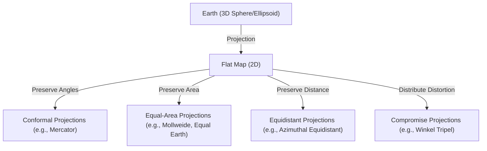
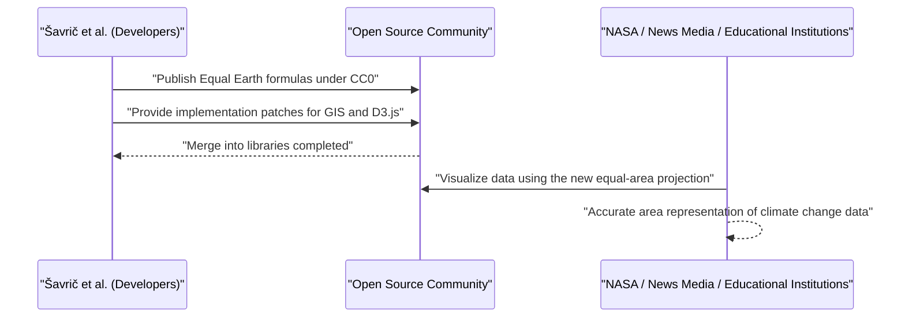

# Introduction: The Ultimate Paradox of Drawing a Sphere on a Plane

Since ancient times, humanity has drawn maps to understand and record the world in which we live. However, there has always been one massive paradox: the mathematical fact that "it is impossible to unfold a 3-dimensional sphere (the Earth) onto a 2-dimensional plane (a map) without distortion." This is based on a mathematical truth, as proven by Carl Friedrich Gauss in his "Theorema Egregium" (Remarkable Theorem), that surfaces with different curvatures cannot be mapped to each other isometrically.

Just as an orange peel will inevitably tear or wrinkle when you try to flatten it, some form of "distortion" is always introduced when turning the Earth into a flat map. The history of Map Projections is nothing less than a history of compromise and choices—how humanity has dealt with this inevitable "distortion," and which elements (area, angle, distance, direction) to sacrifice in order to preserve others.

In this article, we will delve deep into the evolution of map projections, from the birth of the Mercator projection in the 16th century to the latest Equal Earth projection of the 21st century, intertwining mathematical, historical, and social backgrounds.



## Chapter 1: The Age of Discovery and the Birth of the Mercator Projection

### 1.1 The Agony of Navigators

During the Age of Discovery from the late 15th to the 16th century, European navigators set out into uncharted waters. With Columbus reaching the Americas and Magellan circumnavigating the globe, the world was expanding dramatically, and the demand for accurate nautical charts exploded.

Nautical charts of the time were Portolan charts, which relied on rhumb lines (compass bearings) radiating from the center. However, during long voyages, especially those crossing oceans, the errors caused by the Earth being a sphere could no longer be ignored. Navigators strongly demanded a map where "they could reach their destination simply by moving straight along a constant compass bearing (a rhumb line)."

### 1.2 The Innovation of Gerardus Mercator

In 1569, Gerardus Mercator, a geographer from Flanders (modern-day Belgium), published a groundbreaking world map that answered the desperate pleas of these navigators. This was the "Mercator projection."

The greatest feature of the Mercator projection is that "a straight line connecting any two points always indicates a constant compass bearing (rhumb lines are represented as straight lines)." This allowed navigators to know the compass bearing to their destination simply by placing a ruler on the map and drawing a straight line.

### 1.3 The Mathematical Backing of the Mercator Projection

The Mercator projection can be seen as a type of cylindrical projection. Imagine wrapping a cylinder around the Earth's equator and projecting the map onto the inside of the cylinder using a light source from the center of the Earth. However, Mercator did not use a simple projection; he mathematically adjusted the spacing of the parallels.

Let longitude be $\lambda$, latitude be $\phi$, and the coordinates on the map be $(x, y)$. The projection formulas for the Mercator projection are as follows (assuming the Earth is a perfect sphere with radius $R$):

$$ x = R(\lambda - \lambda_0) $$
$$ y = R \ln \left( \tan\left(\frac{\pi}{4} + \frac{\phi}{2}\right) \right) $$

Here, $\lambda_0$ is the central meridian acting as the reference. As this formula shows, the higher the latitude, the more rapidly the value of $y$ increases, diverging to infinity ($\infty$) at the poles ($\phi = \pm \pi/2$).

Below is a simple Python code snippet that performs the coordinate conversion for the Mercator projection.

```python
import math

def latlon_to_mercator(lat, lon, R=6378137.0):
    """
    Function to convert latitude and longitude to Mercator XY coordinates (meters)
    Equivalent to the calculation for EPSG:3857 (Web Mercator)
    """
    # Convert latitude and longitude to radians
    lat_rad = math.radians(lat)
    lon_rad = math.radians(lon)
    
    # Calculate X coordinate
    x = R * lon_rad
    
    # Calculate Y coordinate (inverse Gudermannian function)
    y = R * math.log(math.tan(math.pi / 4.0 + lat_rad / 2.0))
    
    return x, y

# Example: Calculation for Tokyo (Latitude 35.6812, Longitude 139.7671)
x, y = latlon_to_mercator(35.6812, 139.7671)
print(f"Tokyo (Mercator): X={x:.2f}, Y={y:.2f}")
```

### 1.4 The Light and Shadow of the Mercator Projection

Because the Mercator projection has "conformality" (angles are preserved correctly), local shapes match reality. However, the trade-off is the fatal flaw that "area" is extremely distorted. The higher the latitude, the more it is enlarged, so Greenland is drawn about the same size as the African continent, even though in reality, Africa is about 14 times larger than Greenland.

This area distortion would later cause political and social issues. By over-representing high-latitude regions in the Northern Hemisphere such as Europe and North America, while drawing developing nations near the equator as small, it drew criticism for "instilling a Eurocentric worldview."

## Chapter 2: In Search of Area Accuracy: The Genealogy of Equal-Area Projections

In response to the criticism regarding the area distortion of the Mercator projection, many "equal-area projections" were devised, which preserve accurate area ratios.

### 2.1 The Sanson and Mollweide Projections

In the 17th century, the "Sanson-Flamsteed projection," utilized by the French cartographer Nicolas Sanson and others, became popular. This is an equal-area projection where parallels are equally spaced horizontal lines and meridians are drawn as sine curves. While distortion near the central meridian was minimal, it had the drawback of severe shape distortion at the edges (especially in high latitudes).

This was improved by the "Mollweide projection," published by the German mathematician Karl Mollweide in 1805. The Mollweide projection fits the entire Earth into a single ellipse, mitigating the shape distortion in high latitudes better than the Sanson projection.

### 2.2 Goode's Homolosine Projection (Interrupted Projection)

Entering the 20th century, attempts were made to further reduce shape distortion while maintaining equal area. In 1923, American geographer John Paul Goode published the "Goode projection" (Homolosine projection).

He took an eccentric approach called an "interrupted projection," stitching together the Sanson projection in low latitudes and the Mollweide projection in high latitudes, and further splitting the oceanic portions (or continental portions). This made it possible to overlook the world with correct area ratios while minimizing shape distortion for each continent. However, because the oceans are torn apart, it has the disadvantage of making it difficult to intuitively grasp the continuous nature of the Earth.

## Chapter 3: The Cold War and the Peters Projection Controversy

The debate over map projections escalated beyond mere mathematics or geography into a major controversy involving ideological conflict during the 1970s with the "Peters projection" uproar.

### 3.1 Gall's Orthographic Projection and Arno Peters' Claims

In 1973, German historian Arno Peters fiercely criticized the Mercator projection, saying, "The Mercator projection is an arrogant, Eurocentric map that intentionally makes the Third World look small," and released his own "Peters projection." He heavily promoted it as "a truly fair, new world map that depicts all people equally."

The Peters projection is an equal-area projection, and unlike the Mercator projection, high-latitude regions were not extremely enlarged. Therefore, UN agencies, many NGOs, religious organizations, and others supported this map and widely adopted it for educational posters.

### 3.2 Fierce Backlash from the Cartographic Community

However, professional cartographers fiercely pushed back against Peters' announcement. The reasons were as follows:

1. **Suspicions of Plagiarism**: Mathematically, the Peters projection was exactly the same as the "Gall orthographic projection" published by the British cartographer James Gall in 1855. It was already a known projection in the cartographic community and not Peters' original creation.
2. **Severe Shape Distortion**: As a result of using a cylindrical projection to maintain equal area, low-latitude regions (like Africa and South America) were stretched extremely vertically, while high-latitude regions (like Europe and Canada) looked as though they were squashed horizontally, resulting in very awkward shapes.
3. **Use as Propaganda**: Cartographers accused Peters of ignoring the mathematical trade-offs of map projections (preserving area distorts shape) and using ideological propaganda by unfairly villainizing the Mercator projection.

This controversy served to re-awaken the world to the fact that maps are not simply objective copies of reality, but media that strongly influence the worldviews and political consciousness of those who look at them.

## Chapter 4: The Art of Compromise: The Rise of Compromise Projections

If you try to perfectly preserve either area or shape, the other is extremely sacrificed. Therefore, "compromise projections," which abandon strict equal-area or conformal properties in favor of pursuing "natural appearance" and "minimal overall distortion," became the mainstream for general-purpose world maps in the late 20th century.

### 4.1 The Robinson Projection

Devised in 1963 by the American cartographer Arthur H. Robinson, the "Robinson projection" took a unique approach by not starting from a mathematical formula, but by prioritizing "aesthetic appearance" and determining the lengths and spacing of the parallels empirically.

This projection became widely recognized around the world when the National Geographic Society adopted it as their official world map in 1988.

### 4.2 The Winkel Tripel Projection

Later, in 1998, the National Geographic Society adopted the "Winkel Tripel projection" to replace the Robinson projection. Devised by the German Oswald Winkel in 1921, this projection is the arithmetic mean of the Aitoff projection and the equirectangular projection. "Tripel" means "three" in German, indicating that it sought to minimize three types of distortion: area, angle, and distance. Even today, it is used as the standard world map in many textbooks and atlases.

## Chapter 5: New Challenges in the Digital Age: The Birth of the Equal Earth Projection

Entering the 21st century, the way we interact with maps has changed dramatically. This is due to the spread of web mapping services, primarily Google Maps. Ironically, to facilitate smooth zoom operations, these web maps once again adopted the "Mercator projection" (Web Mercator)—though in recent years, this has been improved so that zooming out switches to a 3D globe model.

However, in discussions of global challenges such as climate change and global inequality, the importance of visualizing the world with "accurate area ratios" remains high, and a new equal-area projection was needed.

### 5.1 The Challenge of Bojan Šavrič and Colleagues

In 2018, three cartographers—Bojan Šavrič, Tom Patterson, and Bernhard Jenny—announced a completely new equal-area projection called the "Equal Earth projection."

Their goal was clear.
"To create a world map that lacks the severe shape distortions of the Peters projection, has a natural and beautiful appearance like the Robinson projection, and possesses strict equal-area properties."

### 5.2 The Mathematical Innovation of the Equal Earth Projection

The Equal Earth projection closely resembles the outer shape of the Robinson projection but uses advanced polynomials to achieve strict equal-area properties. The projection formula is as follows.

Let latitude be $\phi$, longitude be $\lambda$ (difference from the central meridian), and let $ \theta $ be the angle that satisfies $ \sin \theta = \frac{\sqrt{3}}{2} \sin \phi $.

$$ x = \frac{2\sqrt{3} \lambda \cos \theta}{3 (9 A_4 \theta^8 + 7 A_3 \theta^6 + 3 A_2 \theta^2 + A_1)} $$
$$ y = A_4 \theta^9 + A_3 \theta^7 + A_2 \theta^3 + A_1 \theta $$

Here, the coefficients are as follows:
$ A_1 = 1.340264 $
$ A_2 = -0.081106 $
$ A_3 = 0.000893 $
$ A_4 = 0.003796 $

Through these complex mathematical formulas, the Equal Earth projection successfully represents accurate area ratios while naturally preserving the shapes of the continents, without stretching near the equator or extremely squashing high latitudes.

### 5.3 Adoption as Open Source

What made the Equal Earth projection groundbreaking was not just its design, but its approach to dissemination. The developers released the mathematical formulas of this projection into the public domain (CC0) and worked quickly to have it implemented in open-source GIS software like QGIS, as well as data visualization libraries like D3.js.

As a result, it was embraced by scientists and media around the world in the blink of an eye, being adopted for maps such as the global temperature anomaly maps by NASA.



## Conclusion: Maps Create the World

The history from the Mercator projection to the Equal Earth projection is also a history of the ideological transitions in how humanity "wants to perceive and convey the world we live in."

During the Age of Discovery, "reaching a destination reliably" was prioritized (conformality), while during the era of colonial rule, maps that showed off the vastness of one's own country were favored. Then, during the Cold War, maps advocating for the correction of the North-South divide caused controversy, and today, maps for viewing global challenges like climate change flatly (equal-area + natural shape) are demanded.

**"A map is a mirror reflecting the world, and at the same time, a lens that creates the world."**

When we look at a map, we must always be aware of what mathematical compromises it is built upon and with what intentions it was drawn. The Equal Earth projection can be said to be one of the newest "lenses" showing how we in the modern era are trying to re-examine the world.
