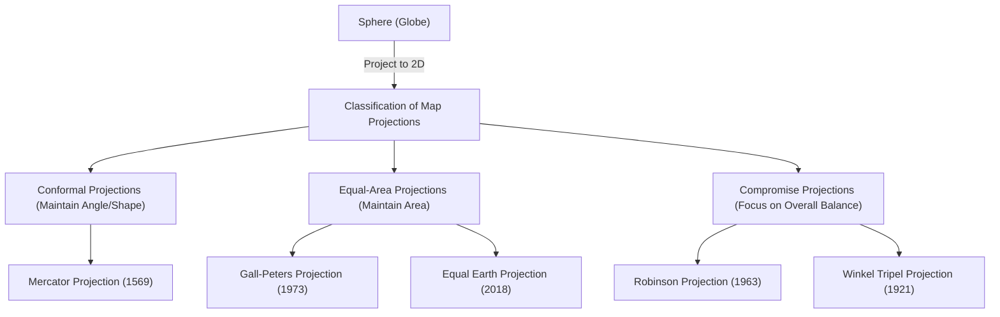

The "world map" we see on a daily basis. From digital maps displayed on smartphone screens to large posters put up on classroom walls, maps are deeply rooted in our lives. However, have you ever thought deeply about the fact that the world map drawn on a flat surface is actually not the "accurate appearance of the Earth"?

The Earth has a shape close to a three-dimensional sphere (strictly speaking, an ellipsoid of revolution), but most of the maps we use are two-dimensional flat surfaces. There is an unavoidable and significant mathematical paradox in this act of "unfolding a three-dimensional surface into two dimensions." In this article, from the Mercator projection that drove the Age of Discovery, to the Peters projection that caused political ripples, and to the modern Equal Earth projection, we will unravel the unknown history and conflicts of how humanity has perceived the massive space of the Earth and expressed it on a flat surface.

## 1. The Mathematical Dilemma of Drawing a Sphere on a Flat Surface

When talking about the history of map projections, what must first be understood is the major mathematical premise proven by "[Carl Friedrich Gauss](/en/p/gauss/)." The great 19th-century mathematician Gauss derived a theorem in differential geometry known as the "Theorema Egregium (Remarkable Theorem)." According to this theorem, the Gaussian curvature of a surface possesses the property that it does not change even if the surface is bent.

The Gaussian curvature of a sphere like the Earth is positive, but the Gaussian curvature of a plane is zero. Therefore, it is mathematically impossible to map surfaces with different Gaussian curvatures onto each other without stretching, shrinking, or tearing. It is the exact same principle as not being able to peel an orange and stretch the peel out perfectly flat into a rectangle without any gaps.

Due to this mathematical dilemma, no matter what kind of world map it is, it is impossible to accurately maintain all four of the following elements at the same time.

1. **Area** (Equivalence): Is the ratio of actual land and ocean areas preserved?
2. **Angle and Shape** (Conformality): Are the actual outlines of the terrain and the angles of intersecting lines preserved?
3. **Distance** (Equidistance): Is the ratio of distance from specific points preserved?
4. **Direction** (Azimuthal property): Is the direction from specific points maintained correctly?

The only thing that satisfies all of these is a "globe." When creating a flat map, mapmakers are forced to "compromise" by sacrificing something and prioritizing something else for their purpose. This choice can be said to be the very history of map projections itself.

## 2. The Innovation that Supported the Age of Discovery: The Mercator Projection

The world map most familiar to us today is likely the "Mercator projection." Published in 1569 by the Flemish (modern-day Belgium) geographer Gerardus Mercator, this map was a revolutionary invention that significantly changed the course of human history.

Europe at the time was right in the middle of the "Age of Discovery," venturing out into unknown continents and oceans. However, with no landmarks on the vast oceans, sailors were constantly side-by-side with the risk of distress. What they sought was a "nautical chart that could reliably get them to their destination."

The greatest feature of the Mercator projection is its "conformality." Meridians and parallels always intersect at right angles, and a straight line connecting any two points (rhumb line) matches the actual direction indicated by a compass. In other words, as long as sailors connected their departure point and destination with a straight line on the map, measured the angle (bearing) between that line and the meridian, and kept their compass at that angle while advancing, they could reliably reach their destination.

This functional and revolutionary map was truly a magical tool for navigators. However, behind this convenience lay a massive sacrifice. This was the "extreme distortion of area."
In the Mercator projection, as the latitude gets higher, it is magnified both east-west and north-south, so the closer it gets to the poles, the vastly larger it is drawn than its actual area.

For example, when viewed on a Mercator projection, Greenland appears to be as large as, or even larger than, the continent of Africa. However, comparing their actual areas, the continent of Africa is about 14 times larger than Greenland. Similarly, high-latitude countries like Russia and Canada are emphasized as vastly larger territories than their actual areas.

Mercator himself intended this map strictly "for navigation." However, due to the beauty of its straightforward and clean appearance, it came to be widely adopted for general public maps and school education outside of navigation, and as a result, it distorted people's "spatial cognition of the world" over several centuries.

## 3. The Projection of Politics and Ideology: The Peters Projection Controversy

Entering the 20th century, criticism began to mount against the continued general use of the Mercator projection. Behind this lay not merely the pursuit of geographical accuracy, but also deeply intertwined political and social ideologies.

In 1973, the German historian Arno Peters harshly criticized it, saying, "The Mercator projection unfairly draws developed countries centered in Europe (located at high latitudes in the Northern Hemisphere) large, and makes areas near the equator where there are many developing countries (such as Africa, South America, and Southeast Asia) look small. This is a manifestation of colonialist white supremacy."

And what he grandly announced as a "more equal and correct world map" was the "Peters projection (officially the Gall-Peters projection)." This map was an "equal-area projection," meaning it specialized in accurately reflecting the actual area ratios in all regions of the world.

Looking at the Peters projection reveals an appearance vastly different from the world we are accustomed to. Europe is drawn very small, and conversely, the continents of Africa and South America are vertically elongated, making their immensity stand out. This became a powerful visual weapon for Third World countries to legitimately assert their presence. UNESCO (United Nations Educational, Scientific and Cultural Organization) and many international NGOs supported and adopted this map from the standpoint of fairness.

However, strong opposition arose from cartography experts. In order to make the areas accurate, the "shapes (outlines)" of the continents were extremely distorted in the Peters projection. Countries near the equator appear stretched vertically, and high-latitude regions appear crushed horizontally. Fierce controversies erupted, such as "the shapes are unnatural and not fit for practical use" and "Peters' claims are nothing but political propaganda."

This "Peters projection controversy" was a historical event that highlighted that maps are not merely representations of geographic information, but media that shape the worldviews, power dynamics, and political ideologies of the people who view them.

## 4. Searching for a Compromise Between Beauty and Practicality: Compromise Projections

The "lie of area" of the Mercator projection and the "distortion of shape" of the Peters projection. Since both had extreme elements, cartographers began to seek a map where "neither area nor shape is perfect, but which has the most natural and balanced appearance." This was the birth of "compromise projections."

A representative example of a compromise projection is the "Robinson projection," published in 1963 by the American geographer Arthur H. Robinson. Rather than deriving a map from mathematical formulas, Robinson took visual and artistic intuition of "how it looks to the human eye" as his starting point. He ran simulations many times, manually finding a compromise point where the shapes of the landmasses were not extremely distorted and the area ratios were not too wildly off, and later translated that into mathematical coordinates.

The Robinson projection has an overall rounded, beautiful elliptical shape, and appears very natural to our eyes. In 1988, the prominent National Geographic Society adopted the Robinson projection as its official world map, making it one of the global standards.

Furthermore, the National Geographic Society later shifted to the "Winkel Tripel projection" in 1998. This projection, devised by Oswald Winkel, takes the approach of minimizing the three distortions of area, angle, and distance (Tripel means "three" in German), and is evaluated as having even less distortion and being better balanced than the Robinson projection. In many current textbooks and general world maps, this Winkel Tripel projection and similar compromise projections are the mainstream.

## 5. Modern Challenges and New Expressions: AuthaGraph and the Equal Earth Projection

Even in the 21st century, the evolution of map projections has not stopped. In the modern era where global environmental issues and globalization are advancing, we are forced to re-examine the Earth from a new perspective.

One such attempt is the "AuthaGraph World Map" devised by Japanese architect Hajime Narukawa and others. This map uses an ingenious method of dividing the Earth's surface into 96 equal parts, projecting them onto a regular tetrahedron, and cutting it open into a rectangular 2D representation. The greatest advantage is that it can be infinitely tiled and connected with any part as the center, while maintaining the area ratio. It is suitable for looking out over the world from a decentralized global perspective, such as networks of sea and air routes or the impacts of climate change, and it won the Good Design Grand Award in 2016.

And the new projection method gathering the most attention in recent years is the "Equal Earth projection," announced in 2018 by three cartographers: Bojan Šavrič, Tom Patterson, and Bernhard Jenny.

The Equal Earth projection is a new "equal-area projection (a map with correct areas)" developed to overcome the "extreme unnaturalness of shape" that the Peters projection suffered from. They aimed for a map that has a visually pleasing rounded appearance similar to the Robinson projection, while simultaneously having completely accurate area ratios for each continent and country.

One of the motives for development was a strong sense of crisis that when visualizing climate change and environmental issue data, misleading impressions would be given if the areas were not accurate. For example, when showing the effects of deforestation or sea-level rise, the Mercator projection overestimates the impact in high latitudes. The Equal Earth projection is an innovative design combining beauty and scientific accuracy, realized precisely because we are in a modern era where advanced calculations have become possible through the development of computer technology. Currently, its adoption is expanding to the climate data maps of NASA (National Aeronautics and Space Administration) and GISS (Goddard Institute for Space Studies) as well.

## Conclusion: Maps are Worldviews Themselves

Looking back at the history of map projections from the Mercator projection to the Equal Earth projection, we can see that it reflects not only the development of surveying technology and mathematics, but also the strong will of the people in each era regarding "how they want to view the Earth and how they should use it."

Conformality, which saved the lives of navigators and enabled global trade.
Equivalence, which cast a stone at North-South issues and inequality, bringing diverse perspectives.
And new expressions seeking overall harmony and contributing to solving the complex issues of modern society.

The world map we are gazing at is by no means the absolute "true appearance." It is one "interpretation" where humans translated the three-dimensional Earth with infinite expanse into two dimensions according to their own purposes and values. The next time you gaze at a world map, please try to think about the centuries of trial and error and the history of conflict among mapmakers embedded in that single sheet of paper (or screen). How we perceive the world is shaped by which map we choose.
