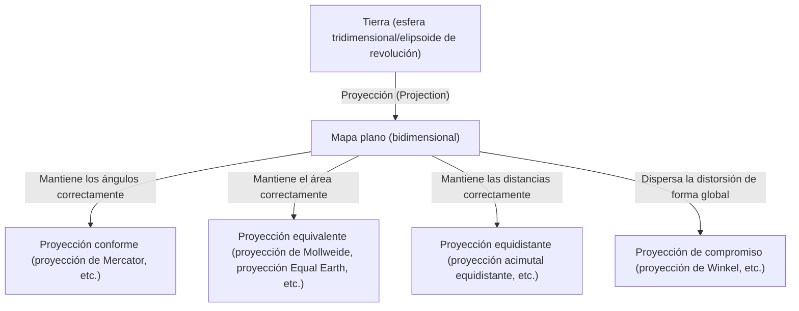
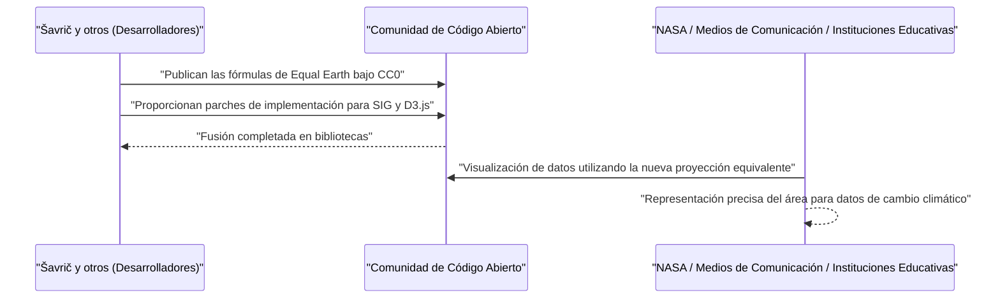

# Introducción: La paradoja definitiva de dibujar una esfera en un plano

Desde la antigüedad, la humanidad ha dibujado mapas para comprender y registrar el mundo en el que vivimos. Sin embargo, siempre ha existido una enorme paradoja. Es el hecho de que "es matemáticamente imposible desplegar una esfera tridimensional (la Tierra) en un plano bidimensional (un mapa) sin distorsión". Esto se basa en la verdad matemática demostrada por Carl Friedrich Gauss en su "Teorema Egregium" (Teorema notable), que establece que superficies con curvatura diferente no pueden mapearse isométricamente entre sí.

Así como inevitablemente se rasga o arruga cuando se intenta aplanar la cáscara de una mandarina, siempre se produce alguna "distorsión" al convertir la Tierra en un mapa plano. La historia de las proyecciones cartográficas (Map Projection) no es más que la historia de cómo la humanidad ha afrontado esta inevitable "distorsión", y es una historia de compromiso y elección sobre qué elementos (área, ángulo, distancia, dirección) sacrificar y cuáles preservar.

En este artículo, profundizaremos en la evolución de las proyecciones cartográficas, desde el nacimiento de la proyección de Mercator en el siglo XVI hasta la más reciente proyección Equal Earth del siglo XXI, mezclando antecedentes matemáticos, históricos y sociales.



## Capítulo 1: La era de los descubrimientos y el nacimiento de la proyección de Mercator

### 1.1 La angustia de los navegantes

Durante la era de los descubrimientos, desde finales del siglo XV hasta el siglo XVI, los navegantes europeos se aventuraron en mares desconocidos. Con la espectacular expansión del mundo, como la llegada de Colón a América y la circunnavegación de la Tierra por Magallanes, la demanda de cartas náuticas precisas se disparó.

Las cartas náuticas de la época, llamadas portulanos, se basaban en líneas de dirección (líneas de rumbo) trazadas radialmente desde un centro para navegar. Sin embargo, en viajes largos, especialmente en viajes transoceánicos, los errores debidos a que la Tierra es una esfera ya no podían ignorarse. Los navegantes demandaban encarecidamente "un mapa con el que se pudiera llegar al destino viajando en línea recta a lo largo de un rumbo de brújula constante (loxodrómica)".

### 1.2 La innovación de Gerardus Mercator

En 1569, el geógrafo flamenco (actual Bélgica) Gerardus Mercator publicó un mapa mundial revolucionario que respondía a este apremiante deseo de los navegantes. Esa es la "proyección de Mercator".

La característica más importante de la proyección de Mercator es que "una línea recta que conecta dos puntos arbitrarios siempre muestra un rumbo de brújula constante (las líneas loxodrómicas se representan como líneas rectas)". Gracias a esto, los navegantes podían conocer el rumbo de la brújula hasta su destino simplemente colocando una regla en el mapa y trazando una línea recta.

### 1.3 El respaldo matemático de la proyección de Mercator

La proyección de Mercator puede considerarse un tipo de proyección cilíndrica. Es la imagen de un cilindro envuelto alrededor del ecuador de la Tierra, con una fuente de luz desde el centro de la Tierra proyectando un mapa en el interior del cilindro. Sin embargo, Mercator no hizo una proyección simple, sino que ajustó el espaciado de los paralelos mediante cálculos matemáticos.

Siendo la longitud $\lambda$ y la latitud $\phi$, y las coordenadas en el mapa $(x, y)$, la fórmula de proyección de la proyección de Mercator es la siguiente (asumiendo que la Tierra es una esfera perfecta con radio $R$).

$$ x = R(\lambda - \lambda_0) $$
$$ y = R \ln \left( \tan\left(\frac{\pi}{4} + \frac{\phi}{2}\right) \right) $$

Aquí, $\lambda_0$ es el meridiano central de referencia. Como muestra esta ecuación, cuanto mayor es la latitud, más rápido aumenta el valor de $y$, y diverge al infinito ($\infty$) en los polos ($\phi = \pm \pi/2$).

A continuación se muestra un fragmento de código simple que utiliza Python para realizar la conversión de coordenadas de la proyección de Mercator.

```python
import math

def latlon_to_mercator(lat, lon, R=6378137.0):
    """
    Función para convertir latitud y longitud en coordenadas XY (metros) de la proyección de Mercator
    Equivale al cálculo de EPSG:3857 (Web Mercator)
    """
    # Convertir latitud y longitud a radianes
    lat_rad = math.radians(lat)
    lon_rad = math.radians(lon)
    
    # Cálculo de la coordenada X
    x = R * lon_rad
    
    # Cálculo de la coordenada Y (inversa de la función de Gudermann)
    y = R * math.log(math.tan(math.pi / 4.0 + lat_rad / 2.0))
    
    return x, y

# Ejemplo: Cálculo de Tokio (latitud 35.6812, longitud 139.7671)
x, y = latlon_to_mercator(35.6812, 139.7671)
print(f"Tokyo (Mercator): X={x:.2f}, Y={y:.2f}")
```

### 1.4 Luces y sombras de la proyección de Mercator

Dado que la proyección de Mercator tiene "conformidad (los ángulos se mantienen correctamente)", las formas locales coinciden con la realidad. Sin embargo, como compensación, adolece del defecto fatal de que el "área" se distorsiona extremadamente. Debido a que las latitudes altas se amplían, Groenlandia se dibuja casi del mismo tamaño que África, pero en realidad, África tiene aproximadamente 14 veces la superficie de Groenlandia.

Esta distorsión del área causaría posteriormente problemas políticos y sociales. Mientras que las regiones de latitudes altas del hemisferio norte, como Europa y América del Norte, se representan de forma exagerada, los países en desarrollo cerca del ecuador se dibujan más pequeños, lo que atrajo críticas de "inculcar una visión del mundo eurocéntrica".

## Capítulo 2: En busca de la exactitud del área: la genealogía de las proyecciones equivalentes

Debido a las críticas a la distorsión del área de la proyección de Mercator, se idearon muchas "proyecciones equivalentes" (proyecciones de igual área) en las que se mantiene correctamente la proporción de las áreas.

### 2.1 Proyección de Sanson y proyección de Mollweide

En el siglo XVII, se popularizó la "proyección de Sanson-Flamsteed", utilizada por el francés Nicolas Sanson y otros. Se trata de una proyección equivalente en la que los paralelos son líneas paralelas equidistantes y los meridianos se dibujan como curvas sinusoidales. Aunque había poca distorsión cerca del meridiano central, tenía la desventaja de una fuerte distorsión de la forma en la periferia (especialmente en las latitudes altas).

Esto fue mejorado por la "proyección de Mollweide", publicada en 1805 por el matemático alemán Karl Mollweide. La proyección de Mollweide encaja toda la Tierra en una sola elipse y mitiga la distorsión de la forma en las latitudes altas en comparación con la proyección de Sanson.

### 2.2 Proyección homolosena de Goode (proyección interrumpida)

Entrando al siglo XX, se hicieron intentos para reducir aún más la distorsión de la forma manteniendo la equivalencia. En 1923, el geógrafo estadounidense John Paul Goode publicó la "proyección de Goode (proyección homolosena)".

Esta adoptó un enfoque novedoso llamado "proyección interrumpida", que unía la proyección de Sanson en las bajas latitudes y la proyección de Mollweide en las altas latitudes, e interrumpía las partes del océano (o las partes de los continentes). Esto hizo posible tener una visión panorámica del mundo con las proporciones de área correctas, manteniendo al mínimo la distorsión de la forma de cada continente. Sin embargo, dado que los océanos están cortados, tenía el inconveniente de que era difícil captar intuitivamente la forma continua de la Tierra.

## Capítulo 3: La Guerra Fría y la controversia de la proyección de Peters

El alboroto en torno a la "proyección de Peters" en la década de 1970 fue cuando la proyección cartográfica se convirtió en algo más que una simple cuestión matemática o geográfica, y se transformó en una gran controversia que implicaba conflictos ideológicos.

### 3.1 Proyección cilíndrica equivalente de Gall y las afirmaciones de Arno Peters

En 1973, el historiador alemán Arno Peters criticó duramente que "la proyección de Mercator es un mapa arrogante del eurocentrismo y hace que el Tercer Mundo parezca pequeño intencionadamente", y publicó su propia "proyección de Peters". Promovió esto a gran escala como "un mapa mundial nuevo y verdaderamente justo que dibuja a todas las personas de forma igualitaria".

La proyección de Peters era una proyección equivalente y no ampliaba extremadamente las latitudes altas como la proyección de Mercator. Por lo tanto, las agencias de la ONU, muchas ONG y grupos religiosos apoyaron este mapa y lo adoptaron ampliamente como póster educativo.

### 3.2 Feroz reacción de la comunidad cartográfica

Sin embargo, los cartógrafos profesionales reaccionaron ferozmente a este anuncio de Peters. Las razones son las siguientes:

1. **Sospecha de plagio**: Matemáticamente, la proyección de Peters era exactamente igual que la "proyección cilíndrica equivalente de Gall" publicada por el británico James Gall en 1855. Era una proyección ya conocida en el mundo cartográfico, no era original de Peters.
2. **Severa distorsión de la forma**: Como resultado del uso de una proyección cilíndrica para mantener la equivalencia, las regiones de bajas latitudes (África y América del Sur) se alargaban extremadamente en sentido vertical, y las regiones de altas latitudes (Europa y Canadá) tenían una forma muy poco atractiva, como aplastadas horizontalmente.
3. **Uso como propaganda**: Los cartógrafos acusaron a Peters de hacer propaganda ideológica al ignorar el compromiso matemático de la proyección cartográfica (mantener el área distorsiona la forma) y vilipendiar injustamente la proyección de Mercator.

Esta controversia resultó en hacer que el mundo reafirmara que un mapa no es sólo una réplica objetiva de la realidad, sino un medio que influye fuertemente en la visión del mundo y la conciencia política de las personas que lo miran.

## Capítulo 4: El arte del compromiso: el auge de las proyecciones de compromiso

Si intentas mantener perfecta el área o la forma, la otra se sacrificará de forma extrema. Por lo tanto, la "proyección de compromiso" (Compromise projection), que abandona la estricta equivalencia y conformidad y persigue una "apariencia natural" y una "distorsión general baja", se convirtió en la corriente principal de los mapas del mundo para uso general en la segunda mitad del siglo XX.

### 4.1 Proyección de Robinson

La "proyección de Robinson", inventada por el cartógrafo estadounidense Arthur H. Robinson en 1963, no partió de fórmulas matemáticas, sino que adoptó un enfoque único para determinar empíricamente la longitud y el espaciado de los paralelos con la máxima prioridad de "que se viera hermoso".

Esta proyección fue ampliamente reconocida en todo el mundo cuando la National Geographic Society la adoptó como su mapa mundial oficial en 1988.

### 4.2 Proyección de Winkel Tripel

Posteriormente, en 1998, la National Geographic Society adoptó la "proyección de Winkel Tripel" en lugar de la proyección de Robinson. Inventada por el alemán Oswald Winkel en 1921, esta proyección es la media aritmética de la proyección de Aitoff y la proyección cilíndrica equidistante. "Tripel" significa "triple" en alemán, lo que indica que intentó minimizar las tres distorsiones de área, ángulo y distancia. Incluso hoy en día, se utiliza como mapa mundial estándar en muchos libros de texto y atlas.

## Capítulo 5: Nuevos desafíos en la era digital: el nacimiento de la proyección Equal Earth

En el siglo XXI, la forma en que interactuamos con los mapas ha cambiado drásticamente. Es la difusión de los servicios de mapas web, incluyendo Google Maps. Irónicamente, estos mapas web han adoptado de nuevo la "proyección de Mercator" (Web Mercator) para hacer que las operaciones de zoom sean fluidas (en los últimos años, se ha mejorado para cambiar a un modelo de globo terrestre en 3D al alejar el zoom).

Sin embargo, al discutir cuestiones a escala global, como el cambio climático y la desigualdad global, la importancia de visualizar el mundo con "proporciones de área precisas" sigue siendo alta, y se necesitaba una nueva proyección equivalente.

### 5.1 El desafío de Bojan Šavrič y otros

En 2018, tres cartógrafos, Bojan Šavrič, Tom Patterson y Bernhard Jenny, publicaron una proyección equivalente completamente nueva, la "proyección Equal Earth".

Su objetivo era claro:
"Crear un mapa del mundo que no tenga una distorsión severa de la forma como la proyección de Peters, que tenga un aspecto natural y hermoso como la proyección de Robinson, y que al mismo tiempo mantenga una estricta equivalencia".

### 5.2 Innovación matemática de la proyección Equal Earth

La proyección Equal Earth se asemeja mucho al contorno exterior de la proyección de Robinson, pero logra una estricta equivalencia mediante el uso de polinomios avanzados. Sus ecuaciones de proyección son las siguientes:

Sea la latitud $\phi$, la longitud $\lambda$ (diferencia con el meridiano central), y sea $ \theta $ el ángulo que satisface $ \sin \theta = \frac{\sqrt{3}}{2} \sin \phi $.

$$ x = \frac{2\sqrt{3} \lambda \cos \theta}{3 (9 A_4 \theta^8 + 7 A_3 \theta^6 + 3 A_2 \theta^2 + A_1)} $$
$$ y = A_4 \theta^9 + A_3 \theta^7 + A_2 \theta^3 + A_1 \theta $$

Aquí, los coeficientes son los siguientes:
$ A_1 = 1.340264 $
$ A_2 = -0.081106 $
$ A_3 = 0.000893 $
$ A_4 = 0.003796 $

Gracias a estas complejas fórmulas matemáticas, la proyección Equal Earth logró representar la proporción de área correcta manteniendo las formas naturales de los continentes, sin alargar la zona cercana al ecuador ni aplastar extremadamente las latitudes altas.

### 5.3 Difusión como código abierto

Lo que hizo revolucionaria a la proyección Equal Earth no fue sólo su diseño, sino su enfoque hacia la difusión. Los desarrolladores publicaron las fórmulas matemáticas de esta proyección en el dominio público (CC0) y trabajaron para que se implementaran rápidamente en software SIG de código abierto como QGIS, y en bibliotecas de visualización de datos como D3.js.

Como resultado, fue aceptada instantáneamente por científicos y medios de comunicación de todo el mundo, siendo adoptada, por ejemplo, en los mapas de anomalías de temperatura global de la NASA (Administración Nacional de Aeronáutica y del Espacio).



## Conclusión: Los mapas crean el mundo

La historia desde la proyección de Mercator hasta la proyección Equal Earth es también la historia de la evolución del pensamiento de la humanidad sobre "cómo queremos entender y comunicar el mundo en el que vivimos".

Durante la era de los descubrimientos, la máxima prioridad era "llegar al destino con certeza" (conformidad), y en la era del dominio colonial se preferían los mapas que mostraban la inmensidad del propio país. Durante la Guerra Fría, los mapas que apelaban a la corrección del problema Norte-Sur causaron controversia, y en la actualidad, se requieren mapas (equivalencia + forma natural) para tener una visión plana de los problemas globales como el cambio climático.

**"Los mapas son espejos que reflejan el mundo y, al mismo tiempo, lentes que crean el mundo"**.

Cuando miramos un mapa, siempre debemos ser conscientes de sobre qué tipo de compromisos matemáticos se construye y con qué intenciones se trazó. La proyección Equal Earth se puede decir que es una de las "lentes" más nuevas que nos muestra cómo los humanos modernos estamos intentando reevaluar el mundo.
