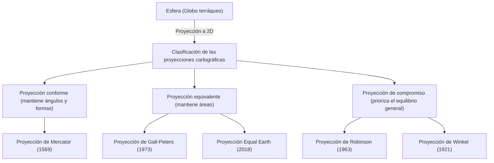

El "mapamundi" que vemos a diario. Desde los mapas digitales que aparecen en la pantalla de nuestros teléfonos inteligentes hasta los grandes pósteres colgados en las paredes de las aulas, los mapas están profundamente arraigados en nuestras vidas. Sin embargo, ¿has pensado alguna vez en el hecho de que un mapamundi dibujado en una superficie plana en realidad no es la "verdadera forma de la Tierra"?

La Tierra tiene una forma cercana a una esfera tridimensional (estrictamente hablando, un elipsoide de revolución), pero muchos de los mapas que utilizamos son planos bidimensionales. En el acto de "desplegar una superficie tridimensional en dos dimensiones", existe una paradoja matemática importante e inevitable. En este artículo, desentrañaremos la historia desconocida y los conflictos de cómo la humanidad ha percibido el enorme espacio que es la Tierra y cómo lo ha representado en un plano, desde la proyección de Mercator que impulsó la Era de los Descubrimientos, pasando por la proyección de Peters que causó un revuelo político, hasta la moderna proyección Equal Earth.

## 1. El dilema matemático de dibujar una esfera en un plano

Para hablar de la historia de las proyecciones cartográficas, la primera premisa matemática que hay que entender es la demostrada por "[Carl Friedrich Gauss](/es/p/gauss/)". En el siglo XIX, el gran matemático Gauss derivó un teorema de la geometría diferencial llamado "Teorema Egregium" (Teorema Destacable). Según este teorema, la curvatura gaussiana de una superficie tiene la propiedad de que no cambia incluso si la superficie se dobla.

La curvatura gaussiana de una superficie esférica como la Tierra es positiva, pero la de un plano es cero. Por tanto, es matemáticamente imposible cartografiar superficies con diferente curvatura gaussiana entre sí sin estirarlas, encogerlas o romperlas. Es el mismo principio por el que no se puede pelar una mandarina y estirar su cáscara en un solo rectángulo plano sin dejar huecos.

Debido a este dilema matemático, ningún mapamundi puede mantener los cuatro elementos siguientes de forma precisa y simultánea:

1. **Área** (Equivalencia): ¿Se mantiene la proporción del área real de la tierra y el mar?
2. **Ángulo/Forma** (Conformidad): ¿Se mantienen los contornos reales del terreno y los ángulos de las líneas que se cruzan?
3. **Distancia** (Equidistancia): ¿Se mantiene la proporción de las distancias desde un punto específico?
4. **Dirección** (Acimut): ¿Se mantiene correctamente la dirección desde un punto específico?

Lo único que cumple todo esto es un "globo terráqueo". Al crear mapas planos, los cartógrafos se ven obligados a hacer un "compromiso" en el que sacrifican algo y priorizan otra cosa por un propósito. Esta elección puede decirse que es la historia misma de las proyecciones cartográficas.

## 2. La innovación que sustentó la Era de los Descubrimientos: La proyección de Mercator

Para nosotros hoy en día, el mapamundi más familiar es probablemente la "proyección de Mercator". Presentado en 1569 por el geógrafo flamenco (de la actual Bélgica) Gerardus Mercator, este mapa fue un invento revolucionario que cambiaría en gran medida la historia de la humanidad.

En ese momento, Europa se encontraba en medio de la "Era de los Descubrimientos", aventurándose hacia continentes y océanos desconocidos. Sin embargo, en el vasto mar no había puntos de referencia, y los marineros siempre estaban expuestos al riesgo de naufragio. Lo que buscaban era "una carta de navegación que les permitiera llegar a su destino de manera segura".

La mayor característica de la proyección de Mercator es su "conformidad". Los meridianos y paralelos siempre se cruzan en ángulo recto, y una línea recta que conecta dos puntos cualesquiera (línea loxodrómica) coincide con la dirección que indica una brújula real. En otras palabras, un marinero solo tenía que conectar el punto de partida y el destino con una línea recta en el mapa, medir el ángulo (dirección) entre esa línea y el meridiano, y simplemente avanzar manteniendo la brújula en ese ángulo para llegar con seguridad a su destino.

Este mapa funcional e innovador era verdaderamente una herramienta mágica para los navegantes. Sin embargo, detrás de esta conveniencia había un enorme sacrificio. Ese es la "distorsión extrema del área".
En la proyección de Mercator, a medida que aumenta la latitud, el mapa se expande tanto de este a oeste como de norte a sur, de modo que cuanto más te acercas a los polos, las áreas se dibujan mucho más grandes que su tamaño real.

Por ejemplo, al mirarlo en la proyección de Mercator, Groenlandia parece tan grande o incluso más grande que el continente africano. Sin embargo, si comparamos las áreas reales, el continente africano es unas 14 veces más grande que Groenlandia. Del mismo modo, países de altas latitudes como Rusia y Canadá se exageran como territorios mucho más vastos que su área real.

El propio Mercator tenía la intención de que este mapa fuera estrictamente "para la navegación". Sin embargo, debido a la belleza limpia de su apariencia lineal, llegó a ser ampliamente adoptado para mapas de uso general distintos de la navegación y para la educación escolar, y como resultado terminó distorsionando la "cognición espacial del mundo" de las personas durante varios siglos.

## 3. La proyección de la política y la ideología: La controversia de la proyección de Peters

Al entrar en el siglo XX, comenzaron a aumentar las críticas por el uso general y continuo de la proyección de Mercator. Detrás de esto, no solo estaba la búsqueda de la precisión geográfica, sino que ideologías políticas y sociales estaban profundamente entrelazadas.

En 1973, el historiador alemán Arno Peters criticó duramente que "la proyección de Mercator representa de manera injustamente grande a los países desarrollados centrados en Europa (ubicados en altas latitudes del hemisferio norte), y hace que las regiones cercanas al ecuador, donde hay muchos países en desarrollo (África, América del Sur, el Sudeste Asiático, etc.), parezcan pequeñas. Esto es una manifestación del supremacismo blanco colonialista".

Y lo que él presentó a lo grande como un "mapamundi más igualitario y correcto" fue la "proyección de Peters (oficialmente la proyección de Gall-Peters)". Este mapa es una "proyección equivalente", es decir, se especializa en reflejar con precisión las proporciones reales de área en todas las regiones del mundo.

Al mirar la proyección de Peters, emerge una imagen muy diferente del mundo al que estamos acostumbrados. Europa se dibuja muy pequeña y, por el contrario, los continentes de África y América del Sur son largos verticalmente, destacando su inmensidad. Esto se convirtió en una poderosa arma visual para que los países del Tercer Mundo afirmaran legítimamente su presencia. La UNESCO (Organización de las Naciones Unidas para la Educación, la Ciencia y la Cultura) y muchas ONG internacionales apoyaron y adoptaron este mapa desde el punto de vista de la equidad.

Sin embargo, hubo una fuerte reacción por parte de los expertos en cartografía. Esto se debe a que, para que las áreas sean precisas, la proyección de Peters distorsiona drásticamente la "forma (contorno)" de los continentes. Los países cerca del ecuador parecen estirados verticalmente, mientras que las regiones de latitudes altas parecen aplastadas horizontalmente. Se desató un acalorado debate, con críticas de que "las formas son antinaturales y poco prácticas" y que "las afirmaciones de Peters no son más que propaganda política".

Esta "controversia de la proyección de Peters" fue un acontecimiento histórico que puso de relieve que los mapas no son solo representaciones de información geográfica, sino también medios que moldean la visión del mundo, las dinámicas de poder y la ideología política de las personas que los miran.

## 4. Buscando un punto intermedio entre belleza y practicidad: Las proyecciones de compromiso

La "mentira de las áreas" de la proyección de Mercator y la "distorsión de las formas" de la proyección de Peters. Debido a que ambas tenían elementos extremos, los cartógrafos comenzaron a buscar "un mapa que, aunque no fuera perfecto ni en área ni en forma, fuera visualmente el más natural y equilibrado". Así nacieron las "proyecciones de compromiso".

Un ejemplo representativo de las proyecciones de compromiso es la "proyección de Robinson", presentada en 1963 por el geógrafo estadounidense Arthur H. Robinson. Robinson no derivó el mapa a partir de fórmulas matemáticas, sino que partió de una intuición visual y artística de "cómo se ve a los ojos humanos". Repitió simulaciones muchas veces, buscando manualmente un compromiso donde la forma de la tierra no estuviera extremadamente distorsionada y la proporción del área tampoco estuviera tan equivocada, y luego tradujo esto a coordenadas matemáticas.

La proyección de Robinson tiene una hermosa forma elíptica redondeada en general, que resulta muy natural a nuestros ojos. En 1988, la prestigiosa National Geographic Society adoptó la proyección de Robinson como su mapamundi oficial, convirtiéndolo en uno de los estándares mundiales.

Además, la National Geographic Society hizo la transición a la "proyección de Winkel (proyección de Winkel Tripel)" en 1998. Ideada por Oswald Winkel, esta proyección adopta el enfoque de minimizar tres distorsiones (Tripel significa "tres" en alemán): área, ángulo y distancia, y se considera que tiene aún menos distorsión y está más equilibrada que la proyección de Robinson. En muchos de los libros de texto y mapamundis generales actuales, las proyecciones de compromiso similares a esta proyección de Winkel o a la proyección de Robinson son las predominantes.

## 5. Desafíos modernos y nuevas representaciones: AuthaGraph y la proyección Equal Earth

Incluso en el siglo XXI, la evolución de las proyecciones cartográficas no se detiene. En la era moderna de problemas ambientales globales y globalización creciente, nos vemos obligados a repensar nuestro planeta desde nuevas perspectivas.

Un intento de esto es el "Mapamundi AuthaGraph" ideado por el arquitecto japonés Hajime Narukawa y su equipo. Este mapa utiliza un método ingenioso para dividir la superficie de la Tierra en 96 regiones, proyectarla en un tetraedro regular y luego desplegarla en un plano rectangular. Su mayor ventaja es que el mapa se puede teselar o conectar infinitamente sin costuras, con cualquier punto como centro, manteniendo al mismo tiempo la proporción de las áreas. Es muy adecuado para observar el mundo desde una perspectiva global sin un centro, como las redes de rutas marítimas y aéreas, y el impacto del cambio climático, y ganó el Gran Premio del Good Design Award en 2016.

Y la nueva proyección que ha atraído más atención en los últimos años es la "proyección Equal Earth", presentada en 2018 por tres cartógrafos: Bojan Šavrič, Tom Patterson y Bernhard Jenny.

La proyección Equal Earth es una nueva "proyección equivalente (un mapa con áreas correctas)" desarrollada para superar la "extrema falta de naturalidad de las formas" que tenía la proyección de Peters. Su objetivo era crear un mapa que tuviera un aspecto redondeado agradable a la vista, como la proyección de Robinson, y que al mismo tiempo mantuviera proporciones de área completamente precisas para cada continente y país.

Uno de los motivos de su desarrollo fue una fuerte sensación de crisis: al visualizar datos sobre el cambio climático y los problemas medioambientales, si las áreas no son precisas, se pueden generar malentendidos. Por ejemplo, al mostrar el impacto de la deforestación o el aumento del nivel del mar, la proyección de Mercator sobreestimaría el impacto en las altas latitudes. La proyección Equal Earth es un diseño innovador que combina belleza y precisión científica, algo que solo se pudo lograr en la actualidad debido a los cálculos avanzados posibilitados por el desarrollo de la tecnología informática. En la actualidad, su adopción se está extendiendo a los mapas de datos climáticos de la NASA (Administración Nacional de Aeronáutica y el Espacio) y el GISS (Instituto Goddard de Estudios Espaciales).

## Conclusión: Los mapas son la visión del mundo en sí mismos

Al repasar la historia de las proyecciones cartográficas, desde la proyección de Mercator hasta la proyección Equal Earth, queda claro que reflejan no solo el desarrollo de las técnicas de topografía y las matemáticas, sino también la fuerte voluntad de la gente de cada época sobre "cómo quieren ver la Tierra y cómo deben utilizarla".

La conformidad que salvó la vida de los navegantes y posibilitó el comercio mundial.
La equivalencia que arrojó luz sobre el conflicto Norte-Sur y las desigualdades, aportando diversas perspectivas.
Y las nuevas representaciones que buscan la armonía general y contribuyen a resolver los complejos problemas de la sociedad moderna.

El mapamundi que observamos no es en absoluto una "imagen de la verdad" absoluta. Es simplemente una "interpretación" en la que los humanos han traducido la Tierra tridimensional de extensión infinita a dos dimensiones de acuerdo con sus propios propósitos y valores. La próxima vez que mires un mapamundi, reflexiona sobre la historia de ensayo y error y los conflictos de los cartógrafos durante cientos de años que están incrustados en esa hoja de papel (o pantalla). La forma en que percibimos el mundo está moldeada por el mapa que elegimos usar.
