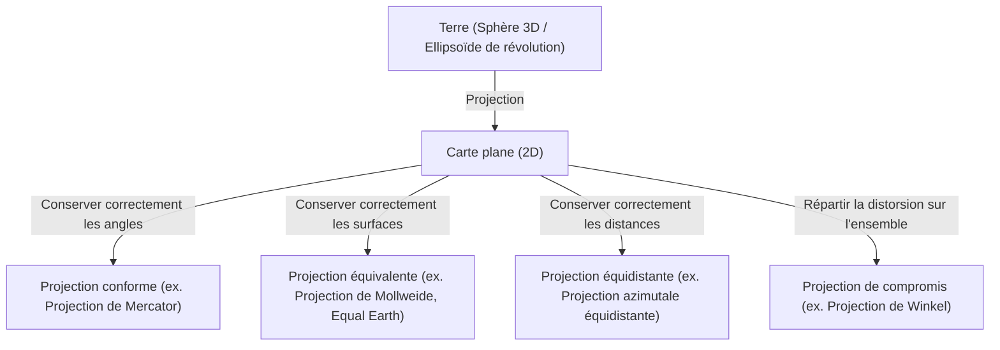
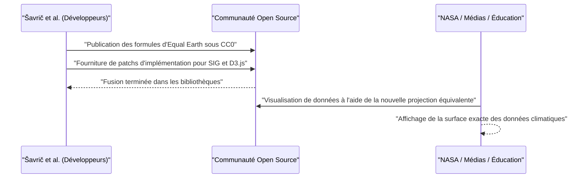

# Introduction : Le paradoxe ultime de dessiner une sphère sur un plan

Depuis les temps anciens, l'humanité a dessiné des cartes pour comprendre et documenter le monde dans lequel elle vit. Cependant, il a toujours existé un énorme paradoxe : le fait qu'« il est mathématiquement impossible de déployer une sphère tridimensionnelle (la Terre) sur un plan bidimensionnel (une carte) sans distorsion ». Cela repose sur une vérité mathématique prouvée par Carl Friedrich Gauss dans son "Theorema Egregium" (Théorème remarquable), selon laquelle il n'est pas possible de cartographier isométriquement des surfaces ayant des courbures différentes.

Tout comme essayer d'aplatir une peau d'orange provoque inévitablement des déchirures ou des plis, aplatir la Terre sur une carte entraîne toujours une certaine forme de « distorsion ». L'histoire des projections cartographiques (Map Projection) n'est autre que l'histoire de la façon dont l'humanité a fait face à cette « distorsion » inévitable, une histoire de compromis et de choix quant aux éléments (superficie, angle, distance, direction) à sacrifier et ceux à préserver.

Dans cet article, nous explorerons en profondeur l'évolution des projections cartographiques, de la naissance de la projection de Mercator au XVIe siècle jusqu'à la dernière projection Equal Earth du XXIe siècle, en intégrant les contextes mathématiques, historiques et sociaux.



## Chapitre 1 : L'ère des grandes découvertes et la naissance de la projection de Mercator

### 1.1 L'angoisse des navigateurs

Pendant l'ère des grandes découvertes, de la fin du XVe siècle au XVIe siècle, les navigateurs européens se sont aventurés sur des mers inconnues. Avec l'arrivée de Colomb en Amérique et le tour du monde de Magellan, le monde s'est considérablement étendu, provoquant une explosion de la demande de cartes marines précises.

Les cartes marines de l'époque s'appuyaient sur des lignes de direction radiales (lignes de rhumb) tracées à partir du centre, appelées portulans. Cependant, pour les voyages au long cours, en particulier la traversée des océans, l'erreur due à la sphéricité de la Terre ne pouvait plus être ignorée. Les navigateurs recherchaient ardemment une "carte permettant d'atteindre une destination en naviguant en ligne droite selon une direction constante indiquée par la boussole (loxodromie)".

### 1.2 L'innovation de Gerardus Mercator

En 1569, le géographe flamand (de l'actuelle Belgique) Gerardus Mercator a répondu aux vœux les plus chers des navigateurs en publiant une carte du monde révolutionnaire. Il s'agit de la "projection de Mercator".

La plus grande caractéristique de la projection de Mercator est que "toute ligne droite reliant deux points quelconques indique toujours une direction constante au compas (les loxodromies sont représentées par des lignes droites)". Ainsi, un navigateur n'avait qu'à placer une règle sur la carte et tracer une ligne droite pour connaître le cap à suivre sur la boussole jusqu'à sa destination.

### 1.3 Le fondement mathématique de la projection de Mercator

La projection de Mercator peut être considérée comme un type de projection cylindrique. Imaginez envelopper l'équateur terrestre d'un cylindre et projeter la carte à l'intérieur de ce cylindre à l'aide d'une source lumineuse placée au centre de la Terre. Cependant, Mercator n'a pas utilisé une simple projection, mais a ajusté l'espacement des parallèles par un calcul mathématique.

En posant la longitude $\lambda$, la latitude $\phi$ et les coordonnées sur la carte $(x, y)$, la formule de projection de Mercator est la suivante (en supposant que la Terre est une sphère parfaite de rayon $R$).

$$ x = R(\lambda - \lambda_0) $$
$$ y = R \ln \left( \tan\left(\frac{\pi}{4} + \frac{\phi}{2}\right) \right) $$

Où $\lambda_0$ est le méridien central de référence. Comme le montre cette équation, plus la latitude est élevée, plus la valeur de $y$ augmente rapidement, divergeant vers l'infini ($\infty$) aux pôles ($\phi = \pm \pi/2$).

Voici un extrait de code simple utilisant Python pour effectuer la transformation de coordonnées de la projection de Mercator.

```python
import math

def latlon_to_mercator(lat, lon, R=6378137.0):
    """
    Fonction pour convertir la latitude et la longitude en coordonnées XY de Mercator (en mètres)
    Correspond au calcul EPSG:3857 (Web Mercator)
    """
    # Convertir la latitude et la longitude en radians
    lat_rad = math.radians(lat)
    lon_rad = math.radians(lon)
    
    # Calcul de la coordonnée X
    x = R * lon_rad
    
    # Calcul de la coordonnée Y (fonction inverse de Gudermann)
    y = R * math.log(math.tan(math.pi / 4.0 + lat_rad / 2.0))
    
    return x, y

# Exemple : Calcul pour Tokyo (Latitude 35.6812, Longitude 139.7671)
x, y = latlon_to_mercator(35.6812, 139.7671)
print(f"Tokyo (Mercator): X={x:.2f}, Y={y:.2f}")
```

### 1.4 La lumière et l'ombre de la projection de Mercator

Puisque la projection de Mercator possède la propriété de "conformité (les angles sont conservés)", les formes locales correspondent à la réalité. Cependant, en contrepartie, elle souffre d'un défaut fatal : la "superficie" est extrêmement déformée. Les régions de haute latitude étant élargies, le Groenland est dessiné à peu près à la même taille que le continent africain, alors qu'en réalité l'Afrique fait environ 14 fois la taille du Groenland.

Cette distorsion des surfaces a fini par causer des problèmes politiques et sociaux. Les régions des hautes latitudes de l'hémisphère nord, telles que l'Europe et l'Amérique du Nord, étant surreprésentées, tandis que les pays en développement proches de l'équateur apparaissent plus petits, la projection a été critiquée pour "inculquer une vision du monde eurocentrique".

## Chapitre 2 : À la recherche de l'exactitude des surfaces : La généalogie des projections équivalentes

En raison des critiques sur la distorsion des surfaces de la projection de Mercator, de nombreuses "projections équivalentes" préservant correctement les rapports de superficie ont été conçues.

### 2.1 La projection de Sanson et la projection de Mollweide

Au XVIIe siècle, la "projection de Sanson-Flamsteed", utilisée par les Français, comme Nicolas Sanson, s'est répandue. Il s'agit d'une projection équivalente où les parallèles sont des droites équidistantes et les méridiens sont tracés sous forme de courbes sinusoïdales. Bien qu'il y ait peu de distorsion près du méridien central, elle présentait le défaut de déformer considérablement les formes dans les zones périphériques (surtout aux hautes latitudes).

Ceci a été amélioré par le mathématicien allemand Carl Mollweide, qui a présenté la "projection de Mollweide" en 1805. La projection de Mollweide englobe toute la Terre dans une seule ellipse et atténue la distorsion des formes aux hautes latitudes par rapport à la projection de Sanson.

### 2.2 La projection homolosine de Goode (Projection interrompue)

Au XXe siècle, de nouvelles tentatives ont été menées pour réduire davantage la distorsion des formes tout en conservant l'équivalence. En 1923, le géographe américain John Paul Goode a présenté la "projection de Goode (projection homolosine)".

Il a adopté une approche originale, la "projection interrompue", en combinant la projection de Sanson pour les basses latitudes et la projection de Mollweide pour les hautes latitudes, et en "déchirant" les parties océaniques (ou continentales). Cela a permis de minimiser la distorsion de la forme de chaque continent tout en offrant une vue globale du monde avec des rapports de surface corrects. Cependant, l'océan étant déchiré, il était difficile d'appréhender intuitivement la continuité de la Terre.

## Chapitre 3 : La guerre froide et la controverse de la projection de Peters

La controverse sur la "projection de Peters", dans les années 1970, est un cas où le choix de la projection cartographique ne s'est pas limité à un simple problème de mathématiques ou de géographie, mais s'est transformé en un grand débat impliquant des conflits idéologiques.

### 3.1 La projection cylindrique équivalente de Gall et les affirmations d'Arno Peters

En 1973, l'historien allemand Arno Peters a critiqué avec virulence la projection de Mercator, déclarant que "c'est une carte arrogante et eurocentrique qui réduit intentionnellement la taille du tiers monde", et a présenté sa propre "projection de Peters". Il a fait une large promotion de celle-ci en tant que "carte du monde véritablement équitable et nouvelle, représentant tous les peuples sur un pied d'égalité".

La projection de Peters étant une projection équivalente, les régions des hautes latitudes n'étaient pas extrêmement agrandies comme dans la projection de Mercator. De ce fait, les institutions de l'ONU, de nombreuses ONG et des groupes religieux l'ont soutenue et largement adoptée comme affiche de sensibilisation.

### 3.2 La vive opposition du milieu cartographique

Cependant, les cartographes professionnels se sont fermement opposés à cette annonce de Peters. Les raisons étaient les suivantes :

1. **Allégations de plagiat** : La projection de Peters était mathématiquement identique à la "projection cylindrique équivalente de Gall", présentée en 1855 par le Britannique James Gall. Il s'agissait d'une projection déjà connue dans le milieu cartographique, et non d'une création originale de Peters.
2. **Forte distorsion des formes** : Conséquence de l'utilisation d'une projection cylindrique pour préserver l'équivalence, les régions de basse latitude (comme l'Afrique et l'Amérique du Sud) étaient extrêmement étirées verticalement, tandis que les régions de haute latitude (comme l'Europe et le Canada) semblaient écrasées horizontalement, adoptant des formes très disgracieuses.
3. **Utilisation à des fins de propagande** : Les cartographes ont accusé Peters de faire de la propagande idéologique en ignorant les compromis mathématiques inhérents aux projections cartographiques (si l'on préserve la surface, la forme est déformée) et en diabolisant injustement la projection de Mercator.

Cette controverse a permis au monde entier de réaliser qu'une carte n'est pas seulement une copie objective de la réalité, mais aussi un média qui influence fortement la vision du monde et la conscience politique de ceux qui la regardent.

## Chapitre 4 : L'art du compromis : L'essor des projections de compromis

Si l'on cherche à préserver parfaitement l'une ou l'autre (superficie ou forme), l'autre est extrêmement sacrifiée. Ainsi, les "projections de compromis" (Compromise projection), qui abandonnent la stricte équivalence ou conformité au profit d'un "aspect naturel" et d'une "faible distorsion globale", sont devenues le courant dominant pour les cartes du monde grand public dans la seconde moitié du XXe siècle.

### 4.1 La projection de Robinson

Conçue en 1963 par le cartographe américain Arthur H. Robinson, la "projection de Robinson" a adopté une approche unique : au lieu de partir d'une formule mathématique, elle a priorisé "l'esthétique visuelle" en déterminant empiriquement la longueur et l'espacement des parallèles.

Cette projection a été largement reconnue dans le monde entier lorsque la National Geographic Society l'a adoptée comme carte du monde officielle en 1988.

### 4.2 La projection de Winkel-Tripel

Par la suite, la National Geographic Society a remplacé en 1998 la projection de Robinson par la "projection de Winkel-Tripel". Conçue en 1921 par l'Allemand Oswald Winkel, cette projection est la moyenne arithmétique de la projection d'Aïtoff et de la projection cylindrique équidistante. "Tripel" signifie "trois" en allemand, indiquant la volonté de minimiser les trois types de distorsions : la superficie, les angles et les distances. Aujourd'hui encore, elle est utilisée comme carte du monde standard dans de nombreux atlas et manuels scolaires.

## Chapitre 5 : Un nouveau défi à l'ère numérique : La naissance de la projection Equal Earth

Au XXIe siècle, notre rapport aux cartes a radicalement changé, avec la démocratisation des services de cartographie web comme Google Maps. Ironiquement, pour permettre un zoom fluide, ces cartes web utilisent à nouveau la "projection de Mercator" (Web Mercator) (bien que ces dernières années, des améliorations ont été apportées pour basculer vers un modèle de globe 3D lors d'un zoom arrière).

Toutefois, lors des débats sur des enjeux mondiaux tels que le changement climatique et les inégalités mondiales, il restait crucial de visualiser le monde avec des "rapports de surface corrects", ce qui a suscité le besoin d'une nouvelle projection équivalente.

### 5.1 Le défi de Bojan Šavrič et ses collègues

En 2018, trois cartographes, Bojan Šavrič, Tom Patterson et Bernhard Jenny, ont présenté une projection équivalente totalement nouvelle : la "projection Equal Earth" (Equal Earth projection).

Leur objectif était clair :
"Créer une carte du monde sans les distorsions de forme extrêmes de la projection de Peters, avec l'aspect naturel et esthétique de la projection de Robinson, tout en conservant une stricte équivalence."

### 5.2 L'innovation mathématique de la projection Equal Earth

La projection Equal Earth ressemble beaucoup à la forme extérieure de la projection de Robinson, mais elle atteint une stricte équivalence grâce à l'utilisation de polynômes avancés. Ses formules de projection sont les suivantes :

Soit $\phi$ la latitude, $\lambda$ la longitude (différence par rapport au méridien central), et $\theta$ l'angle satisfaisant $\sin \theta = \frac{\sqrt{3}}{2} \sin \phi$.

$$ x = \frac{2\sqrt{3} \lambda \cos \theta}{3 (9 A_4 \theta^8 + 7 A_3 \theta^6 + 3 A_2 \theta^2 + A_1)} $$
$$ y = A_4 \theta^9 + A_3 \theta^7 + A_2 \theta^3 + A_1 \theta $$

Les coefficients sont les suivants :
$ A_1 = 1.340264 $
$ A_2 = -0.081106 $
$ A_3 = 0.000893 $
$ A_4 = 0.003796 $

Grâce à ces formules complexes, la projection Equal Earth a réussi à représenter correctement les rapports de surface tout en préservant l'aspect naturel des continents, sans étirer l'équateur ni écraser excessivement les hautes latitudes.

### 5.3 L'adoption en tant que source ouverte (Open Source)

La projection Equal Earth était révolutionnaire non seulement par sa conception, mais aussi par son approche de diffusion. Les développeurs ont publié les formules mathématiques de cette projection dans le domaine public (CC0) et ont rapidement encouragé son intégration dans des logiciels SIG open source tels que QGIS, et des bibliothèques de visualisation de données comme D3.js.

En conséquence, elle a été adoptée dans des cartes d'anomalies de température mondiales de la NASA et a été instantanément acceptée par des scientifiques et des médias du monde entier.



## Conclusion : Les cartes façonnent le monde

L'histoire, de la projection de Mercator à la projection Equal Earth, est aussi celle de l'évolution de la pensée humaine sur la question : "Comment percevons-nous le monde dans lequel nous vivons et comment voulons-nous le transmettre ?"

À l'ère des grandes découvertes, la priorité absolue était d'"atteindre la destination à coup sûr" (conformité) ; à l'époque du colonialisme, les cartes exhibant l'immensité de sa propre nation étaient favorisées. Pendant la guerre froide, des cartes plaidant pour la correction des déséquilibres Nord-Sud ont fait débat, et aujourd'hui, pour aborder avec objectivité les défis mondiaux tels que le changement climatique, on recherche des cartes (équivalence + forme naturelle).

**« Une carte est à la fois un miroir reflétant le monde et une lentille qui le façonne. »**

Lorsque nous regardons une carte, nous devons toujours être conscients des compromis mathématiques sur lesquels elle repose et de l'intention avec laquelle elle a été dessinée. On peut dire que la projection Equal Earth est l'une des "lentilles" les plus récentes illustrant la manière dont nous, aujourd'hui, cherchons à reconsidérer le monde.
