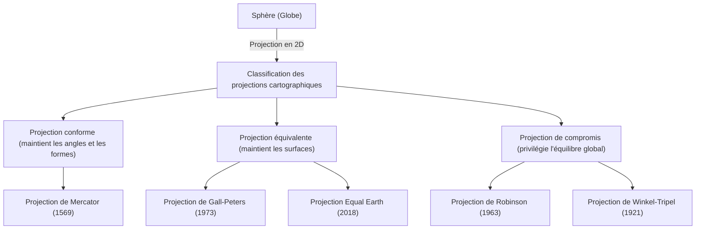

La « carte du monde » que nous voyons au quotidien. Des cartes numériques affichées sur les écrans de nos smartphones aux grandes affiches placardées sur les murs des salles de classe, les cartes sont profondément enracinées dans nos vies. Cependant, avez-vous déjà réfléchi au fait que la carte du monde dessinée sur un plan plat n'est pas réellement une « représentation exacte de la Terre » ?

Bien que la Terre ait une forme proche de celle d'une sphère tridimensionnelle (strictement parlant, un ellipsoïde de révolution), la plupart des cartes que nous utilisons sont des plans bidimensionnels. L'acte de « déployer une surface tridimensionnelle sur deux dimensions » s'accompagne d'un paradoxe mathématique majeur et inévitable. Dans cet article, nous explorerons l'histoire méconnue et les conflits liés à la manière dont l'humanité a perçu et représenté sur un plan l'immense espace qu'est la Terre, de la projection de Mercator qui a stimulé l'ère des grandes découvertes, à la projection de Peters qui a suscité des remous politiques, jusqu'à la projection moderne Equal Earth.

## 1. Le dilemme mathématique du dessin d'une sphère sur un plan

Pour parler de l'histoire des projections cartographiques, il faut d'abord comprendre la prémisse mathématique majeure démontrée par Carl Friedrich Gauss. Le grand mathématicien du 19ème siècle, Gauss, a dérivé un théorème de géométrie différentielle appelé « Theorema Egregium » (le théorème remarquable). Selon ce théorème, la courbure de Gauss d'une surface a la propriété de ne pas changer même si l'on plie cette surface.

La courbure de Gauss d'une surface sphérique comme la Terre est positive, tandis que la courbure de Gauss d'un plan est nulle. Par conséquent, il est mathématiquement impossible de cartographier sans étirement, contraction ou déchirure des surfaces ayant des courbures de Gauss différentes. C'est le même principe qui fait qu'il est impossible d'éplucher une mandarine et de l'étaler sans espace pour en faire un rectangle plat.

En raison de ce dilemme mathématique, aucune carte du monde ne peut préserver parfaitement et simultanément les quatre éléments suivants :

1. **Surface** (équivalence) : Les proportions des surfaces réelles des terres et des océans sont-elles maintenues ?
2. **Angle et forme** (conformité) : Les contours réels de la topographie et les angles des lignes qui se croisent sont-ils maintenus ?
3. **Distance** (équidistance) : Les proportions des distances depuis un point spécifique sont-elles maintenues ?
4. **Direction** (azimut) : La direction à partir d'un point spécifique est-elle correctement maintenue ?

Seul un « globe » peut satisfaire toutes ces exigences. Lors de la création d'une carte plane, le cartographe est contraint de faire des « compromis » en sacrifiant certaines choses et en en privilégiant d'autres en fonction de son objectif. Ce choix est l'essence même de l'histoire des projections cartographiques.

## 2. L'innovation qui a soutenu l'ère des grandes découvertes : la projection de Mercator

La carte du monde la plus familière pour nous aujourd'hui est probablement la « projection de Mercator ». Présentée en 1569 par le géographe flamand (l'actuelle Belgique) Gerardus Mercator, cette carte fut une invention révolutionnaire qui a profondément changé l'histoire de l'humanité.

L'Europe de l'époque était en pleine « ère des grandes découvertes », s'aventurant vers des continents et des océans inconnus. Cependant, sans points de repère sur les vastes étendues maritimes, les marins étaient constamment confrontés au risque de se perdre. Ce qu'ils recherchaient, c'était une « carte marine permettant d'atteindre la destination à coup sûr ».

La plus grande caractéristique de la projection de Mercator est sa « conformité ». Les méridiens et les parallèles se croisent toujours à angle droit, et une ligne droite reliant deux points quelconques (loxodromie) correspond à la direction réelle indiquée par la boussole. En d'autres termes, il suffisait aux marins de relier le point de départ et la destination par une ligne droite sur la carte, de mesurer l'angle (l'azimut) formé par cette ligne et le méridien, et de naviguer en maintenant la boussole à cet angle pour arriver avec certitude à destination.

Cette carte fonctionnelle et révolutionnaire était un outil presque magique pour les navigateurs. Cependant, cette commodité avait un coût énorme : une « distorsion extrême des surfaces ».
Dans la projection de Mercator, plus la latitude est élevée, plus l'échelle s'agrandit à la fois d'est en ouest et du nord au sud, de sorte qu'en s'approchant des pôles, les régions sont dessinées beaucoup plus grandes que leur surface réelle.

Par exemple, sur la projection de Mercator, le Groenland semble presque aussi grand, voire plus grand, que le continent africain. Cependant, si l'on compare les surfaces réelles, le continent africain est environ 14 fois plus grand que le Groenland. De même, les pays situés aux hautes latitudes comme la Russie ou le Canada sont exagérés pour apparaître comme des territoires immenses, dépassant largement leur superficie réelle.

Mercator lui-même avait prévu que cette carte soit strictement utilisée à des fins de « navigation ». Cependant, en raison de la beauté visuelle de ses lignes droites et épurées, elle a été largement adoptée pour des cartes destinées au grand public et pour l'enseignement scolaire, ce qui a fini par fausser la « perception spatiale du monde » des gens pendant plusieurs siècles.

## 3. La projection de la politique et de l'idéologie : la controverse de la projection de Peters

Au début du 20ème siècle, les critiques ont commencé à s'élever contre l'utilisation continue et généralisée de la projection de Mercator. En toile de fond de ces critiques, il n'y avait pas seulement la recherche de l'exactitude géographique, mais aussi des idéologies politiques et sociales profondément imbriquées.

En 1973, l'historien allemand Arno Peters a vivement critiqué la projection en ces termes : « La projection de Mercator dessine de manière disproportionnée les pays développés centrés sur l'Europe (situés aux hautes latitudes de l'hémisphère nord), et minimise les régions équatoriales où se trouvent de nombreux pays en développement (comme l'Afrique, l'Amérique du Sud et l'Asie du Sud-Est). C'est une manifestation de suprématie blanche colonialiste. »

En réponse, la carte qu'il a présentée avec grand bruit comme une « carte du monde plus égalitaire et correcte » était la « projection de Peters (officiellement projection de Gall-Peters) ». Cette carte est une « projection équivalente », c'est-à-dire spécifiquement conçue pour refléter avec précision les proportions réelles des surfaces de toutes les régions du monde.

En regardant la projection de Peters, une image bien différente du monde auquel nous sommes habitués apparaît. L'Europe est dessinée de manière très petite, tandis qu'à l'inverse, les continents africain et sud-américain sont étirés verticalement, mettant en évidence leur immensité. C'est devenu une arme visuelle puissante pour les pays du tiers monde afin d'affirmer légitimement leur présence. L'UNESCO (Organisation des Nations Unies pour l'éducation, la science et la culture) et de nombreuses ONG internationales ont soutenu et adopté cette carte d'un point de vue d'équité.

Cependant, cela a suscité une forte opposition de la part des experts en cartographie. Afin de rendre les surfaces exactes, la projection de Peters déformait de manière extrême la « forme (contour) » des continents. Les pays près de l'équateur semblent étirés verticalement, et les régions aux hautes latitudes semblent écrasées horizontalement. Une vive controverse a éclaté, arguant que « la forme n'est pas naturelle et ne supporte pas un usage pratique » et que « les affirmations de Peters ne sont que de la propagande politique ».

Cette « controverse de la projection de Peters » est un événement historique qui a mis en lumière le fait qu'une carte n'est pas seulement l'expression d'informations géographiques, mais aussi un média qui façonne la vision du monde, les rapports de force et l'idéologie politique de ceux qui la regardent.

## 4. À la recherche d'un compromis entre beauté et utilité : les projections de compromis

D'un côté, le « mensonge des surfaces » de la projection de Mercator, et de l'autre, la « déformation des formes » de la projection de Peters. Étant donné que chacune de ces projections possédait des éléments extrêmes, les cartographes ont commencé à chercher « une carte qui n'est ni parfaite en surface ni en forme, mais qui est visuellement la plus naturelle et bien équilibrée ». C'est ainsi que sont nées les « projections de compromis ».

Le représentant le plus célèbre des projections de compromis est la « projection de Robinson », présentée en 1963 par le géographe américain Arthur H. Robinson. Au lieu de dériver une carte à partir de formules mathématiques, Robinson est parti d'une intuition visuelle et artistique : « Comment cela apparaît-il à l'œil humain ? ». Après de multiples simulations, il a trouvé manuellement un point de compromis où la forme des terres n'est pas extrêmement déformée et où les proportions des surfaces ne sont pas trop faussées, avant d'appliquer des coordonnées mathématiques par la suite.

La projection de Robinson a une belle forme elliptique globale qui paraît très naturelle à nos yeux. En 1988, lorsque la célèbre National Geographic Society a adopté la projection de Robinson comme sa carte du monde officielle, elle est devenue l'un des standards mondiaux.

Par la suite, la National Geographic Society est passée à la « projection de Winkel (Winkel-Tripel) » en 1998. Cette projection, conçue par Oswald Winkel, adopte une approche visant à minimiser les distorsions de la surface, de l'angle et de la distance (Tripel signifiant « triple » en allemand), et est considérée comme ayant encore moins de distorsion et un meilleur équilibre que la projection de Robinson. Dans de nombreux manuels scolaires actuels et cartes du monde générales, ces projections de compromis telles que celles de Winkel et Robinson sont devenues majoritaires.

## 5. Défis modernes et nouvelles représentations : AuthaGraph et la projection Equal Earth

Même au 21ème siècle, l'évolution des projections cartographiques ne s'arrête pas. À l'ère des problèmes environnementaux mondiaux et de la mondialisation, nous sommes poussés à reconsidérer la Terre sous de nouvelles perspectives.

L'une de ces tentatives est la « carte du monde AuthaGraph », conçue par l'architecte japonais Hajime Narukawa et son équipe. Cette carte utilise une méthode originale consistant à diviser la surface de la Terre en 96 parties égales, à la projeter sur un tétraèdre régulier, puis à la déplier pour en faire un plan rectangulaire. Son principal avantage est que, tout en conservant les proportions des surfaces, il est possible de centrer la carte sur n'importe quel point, de la juxtaposer et de la relier à l'infini. Elle est idéale pour observer le monde d'un point de vue global et sans centre, qu'il s'agisse des réseaux maritimes ou aériens, ou de l'impact du changement climatique. Elle a d'ailleurs remporté le Grand Prix du Good Design Award en 2016.

La nouvelle projection qui a attiré le plus d'attention ces dernières années est la « projection Equal Earth », présentée en 2018 par les cartographes Bojan Šavrič, Tom Patterson et Bernhard Jenny.

La projection Equal Earth est une nouvelle « projection équivalente (carte où la surface est correcte) » développée pour surmonter le problème de la « forme extrêmement peu naturelle » dont souffrait la projection de Peters. Ils visaient à créer une carte qui ait un aspect doux et arrondi pour les yeux, similaire à la projection de Robinson, tout en offrant simultanément une précision parfaite des proportions des surfaces de chaque continent et pays.

L'une des motivations de ce développement était le sentiment de crise selon lequel lors de la visualisation de données sur le changement climatique et les problèmes environnementaux, si les surfaces ne sont pas exactes, cela peut induire en erreur. Par exemple, lorsqu'on illustre l'impact de la déforestation ou de l'élévation du niveau de la mer, la projection de Mercator surestime l'impact dans les hautes latitudes. La projection Equal Earth est un design innovant qui allie beauté et précision scientifique, rendu possible précisément parce que les ordinateurs modernes permettent des calculs complexes. Aujourd'hui, son adoption se généralise, notamment pour les cartes de données climatiques de la NASA (Administration nationale de l'aéronautique et de l'espace) et du GISS (Goddard Institute for Space Studies).

## Conclusion : la carte est une vision du monde en soi

De la projection de Mercator à la projection Equal Earth, en retraçant l'histoire des projections cartographiques, nous constatons que celles-ci reflètent non seulement le développement des techniques d'arpentage et des mathématiques, mais aussi la forte volonté des peuples de chaque époque concernant « comment nous voulons voir la Terre et comment nous devrions l'utiliser ».

La conformité, qui a sauvé la vie des marins et rendu possible le commerce mondial.
L'équivalence, qui a remis en question le clivage Nord-Sud et les inégalités, apportant diverses perspectives.
Et les nouvelles représentations, qui recherchent l'harmonie globale et contribuent à la résolution des problèmes complexes de la société moderne.

La carte du monde que nous regardons n'est en aucun cas une « vraie représentation » absolue. C'est l'une des « interprétations » par lesquelles les humains ont traduit la Terre tridimensionnelle, infiniment vaste, en deux dimensions en fonction de leurs propres objectifs et valeurs. La prochaine fois que vous regarderez une carte du monde, pensez à l'histoire d'essais, d'erreurs et de conflits des cartographes sur plusieurs centaines d'années qui se cache derrière cette feuille de papier (ou cet écran). La façon dont nous percevons le monde est façonnée par la carte que nous choisissons.
