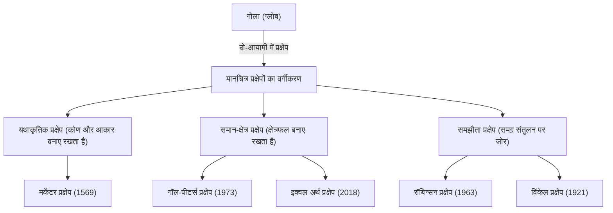

"विश्व मानचित्र" जिसे हम रोजाना देखते हैं। स्मार्टफोन की स्क्रीन पर प्रदर्शित डिजिटल मानचित्रों से लेकर कक्षाओं की दीवारों पर लगे बड़े पोस्टरों तक, मानचित्र हमारे जीवन में गहराई से रचे-बसे हैं। हालाँकि, क्या आपने कभी इस तथ्य के बारे में गहराई से सोचा है कि समतल सतह पर खींचा गया विश्व मानचित्र वास्तव में "पृथ्वी का सटीक रूप" नहीं है?

पृथ्वी एक त्रि-आयामी गोले (सख्ती से कहें तो, एक चपटा गोलाकार) के करीब है, लेकिन हमारे द्वारा उपयोग किए जाने वाले अधिकांश मानचित्र दो-आयामी समतल हैं। "त्रि-आयामी सतह को दो-आयामी सतह पर फैलाने" के इस कार्य में अपरिहार्य और महत्वपूर्ण गणितीय विरोधाभास मौजूद हैं। इस लेख में, हम अन्वेषण के युग का नेतृत्व करने वाले मर्केटर प्रक्षेप से लेकर राजनीतिक लहरें पैदा करने वाले पीटर्स प्रक्षेप और आधुनिक इक्वल अर्थ प्रक्षेप तक, मानवता ने पृथ्वी नामक विशाल अंतरिक्ष को कैसे समझा है और इसे एक समतल सतह पर कैसे व्यक्त किया है, इसके अज्ञात इतिहास और संघर्षों को उजागर करेंगे।

## 1. गोले को समतल पर खींचने की गणितीय दुविधा

मानचित्र प्रक्षेपों के इतिहास पर चर्चा करते समय समझने वाली पहली बात वह गणितीय आधार है जिसे "[कार्ल फ्रेडरिक गॉस](/hi/p/gauss/)" ने सिद्ध किया था। 19वीं सदी के महान गणितज्ञ गॉस ने अवकल ज्यामिति का एक प्रमेय निकाला जिसे "अद्भुत प्रमेय ([Theorema Egregium](/hi/p/theorema-egregium/))" कहा जाता है। इस प्रमेय के अनुसार, किसी वक्र सतह का गॉसियन वक्रता मुड़ने पर भी नहीं बदलती है।

पृथ्वी जैसी गोलाकार सतह की गॉसियन वक्रता धनात्मक होती है, जबकि एक समतल सतह की गॉसियन वक्रता शून्य होती है। इसलिए, बिना खींचे, सिकोड़े या फाड़े अलग-अलग गॉसियन वक्रता वाली सतहों को एक-दूसरे पर मैप करना गणितीय रूप से असंभव है। यह उसी सिद्धांत के समान है जिसके तहत आप संतरे को छीलकर उसे एक सपाट आयताकार टुकड़े में बिना किसी अंतराल के नहीं फैला सकते।

इस गणितीय दुविधा के कारण, कोई भी विश्व मानचित्र एक ही समय में निम्नलिखित 4 तत्वों को पूरी तरह से सटीक नहीं रख सकता है:

1. **क्षेत्रफल** (समान-क्षेत्र): क्या वास्तविक भूमि और समुद्र के क्षेत्रफल का अनुपात बना हुआ है
2. **कोण और आकार** (यथाकृतिक): क्या वास्तविक भूभाग की रूपरेखा और प्रतिच्छेद करने वाली रेखाओं का कोण बना हुआ है
3. **दूरी**: क्या किसी विशिष्ट बिंदु से दूरी का अनुपात बना हुआ है
4. **दिशा**: क्या किसी विशिष्ट बिंदु से दिशा सही बनी हुई है

इन सभी को संतुष्ट करने वाला एकमात्र विकल्प "ग्लोब" है। समतल मानचित्र बनाते समय, मानचित्र निर्माताओं को अपने उद्देश्य के लिए कुछ बलिदान करने और कुछ को प्राथमिकता देने का "समझौता" करने के लिए मजबूर होना पड़ता है। यह चुनाव ही मानचित्र प्रक्षेपों का इतिहास है।

## 2. अन्वेषण के युग का समर्थन करने वाला नवाचार: मर्केटर प्रक्षेप

आधुनिक समय में हमारे लिए सबसे परिचित विश्व मानचित्र शायद "मर्केटर प्रक्षेप" है। 1569 में फ़्लैंडर्स (वर्तमान बेल्जियम) के भूगोलवेत्ता जेरार्डस मर्केटर द्वारा प्रस्तुत किया गया यह मानचित्र एक क्रांतिकारी आविष्कार था जिसने मानव इतिहास को बदल दिया।

उस समय का यूरोप "अन्वेषण के युग" के बीच में था, जहाँ वे अज्ञात महाद्वीपों और महासागरों में उद्यम कर रहे थे। हालाँकि, विशाल महासागर पर कोई स्थलचिह्न नहीं थे, और नाविकों को हमेशा खो जाने का खतरा रहता था। उन्हें एक ऐसे "समुद्री चार्ट की आवश्यकता थी जो सुनिश्चित करे कि वे अपने गंतव्य तक पहुँच सकें।"

मर्केटर प्रक्षेप की सबसे बड़ी विशेषता इसकी "यथाकृतिकता" है। देशांतर और अक्षांश की रेखाएं हमेशा समकोण पर प्रतिच्छेद करती हैं, और किन्हीं दो बिंदुओं को जोड़ने वाली सीधी रेखा एक कम्पास द्वारा इंगित वास्तविक दिशा से मेल खाती है। दूसरे शब्दों में, यदि नाविक प्रस्थान बिंदु और गंतव्य को मानचित्र पर एक सीधी रेखा से जोड़ते हैं, उस रेखा और देशांतर द्वारा बनाए गए कोण (दिशा) को मापते हैं, और अपने कम्पास को उस कोण पर रखते हुए आगे बढ़ते हैं, तो वे निश्चित रूप से अपने गंतव्य पर पहुंचेंगे।

यह कार्यात्मक और क्रांतिकारी मानचित्र नाविकों के लिए एक जादुई उपकरण था। हालाँकि, इस सुविधा के पीछे एक बड़ी कीमत चुकानी पड़ी। वह थी "क्षेत्रफल की अत्यधिक विकृति।"

मर्केटर प्रक्षेप में, आप जितने उच्च अक्षांश पर जाते हैं, उतना ही यह पूर्व-पश्चिम और उत्तर-दक्षिण दोनों दिशाओं में फैलता है, इसलिए आप ध्रुवों के जितना करीब जाते हैं, चीजें अपने वास्तविक क्षेत्रफल से उतनी ही बड़ी दिखाई देती हैं।

उदाहरण के लिए, मर्केटर प्रक्षेप पर, ग्रीनलैंड अफ्रीका महाद्वीप के बराबर या उससे बड़ा दिखाई देता है। लेकिन जब आप वास्तविक क्षेत्रफलों की तुलना करते हैं, तो अफ्रीकी महाद्वीप ग्रीनलैंड से लगभग 14 गुना बड़ा है। इसी तरह, रूस और कनाडा जैसे उच्च अक्षांश वाले देशों को उनके वास्तविक क्षेत्रफल से कहीं अधिक विशाल क्षेत्रों के रूप में बल दिया जाता है।

स्वयं मर्केटर का इरादा यह था कि यह मानचित्र सख्ती से "नेविगेशन के लिए" था। हालाँकि, इसके सीधे और साफ रूप की सुंदरता के कारण, इसे नेविगेशन के अलावा सामान्य उपयोग वाले मानचित्रों और स्कूली शिक्षा में भी व्यापक रूप से अपनाया गया, जिसके परिणामस्वरूप सदियों तक लोगों के "विश्व की स्थानिक अनुभूति" को विकृत कर दिया गया।

## 3. राजनीति और विचारधारा का प्रक्षेप: पीटर्स प्रक्षेप विवाद

20वीं सदी की शुरुआत में, मर्केटर प्रक्षेप के निरंतर सामान्य उपयोग की आलोचना बढ़ने लगी। इसकी पृष्ठभूमि में केवल भौगोलिक सटीकता की खोज ही नहीं थी, बल्कि राजनीतिक और सामाजिक विचारधाराएं भी गहराई से जुड़ी थीं।

1973 में, जर्मन इतिहासकार अर्नो पीटर्स ने तीखी आलोचना करते हुए कहा: "मर्केटर प्रक्षेप अनुचित रूप से यूरोप-केंद्रित विकसित देशों (उत्तरी गोलार्ध के उच्च अक्षांशों में स्थित) को बड़ा दिखाता है, और भूमध्य रेखा (अफ्रीका, दक्षिण अमेरिका, दक्षिण पूर्व एशिया, आदि) के पास स्थित विकासशील देशों को छोटा दिखाता है, जहाँ कई विकासशील देश हैं। यह औपनिवेशिक श्वेत वर्चस्व का प्रकटीकरण है।"

और जिस मानचित्र की उन्होंने बड़े पैमाने पर "अधिक समान और सही विश्व मानचित्र" के रूप में घोषणा की, वह "पीटर्स प्रक्षेप" (आधिकारिक तौर पर गॉल-पीटर्स प्रक्षेप) था। यह मानचित्र एक "समान-क्षेत्र प्रक्षेप" था, जिसका अर्थ है कि यह दुनिया के सभी क्षेत्रों में वास्तविक क्षेत्रफल अनुपात को सटीक रूप से दर्शाने में माहिर था।

जब आप पीटर्स प्रक्षेप को देखते हैं, तो एक ऐसा रूप उभरता है जो उस दुनिया से बहुत अलग है जिसके हम अभ्यस्त हैं। यूरोप को बहुत छोटा खींचा गया है, जबकि इसके विपरीत, अफ्रीका और दक्षिण अमेरिका के महाद्वीप लंबवत रूप से लंबे हैं, और उनका विशाल आकार अलग दिखता है। यह तीसरी दुनिया के देशों के लिए अपनी उपस्थिति का उचित रूप से दावा करने के लिए एक शक्तिशाली दृश्य हथियार बन गया। यूनेस्को और कई अंतरराष्ट्रीय गैर सरकारी संगठनों ने निष्पक्षता के दृष्टिकोण से इस मानचित्र का समर्थन किया और इसे अपनाया।

हालाँकि, मानचित्रकला के विशेषज्ञों की ओर से कड़ी प्रतिक्रिया हुई। इसका कारण यह था कि क्षेत्रफल को सटीक बनाने के लिए, महाद्वीपों का "आकार (रूपरेखा)" पीटर्स प्रक्षेप में अत्यधिक विकृत हो गया था। भूमध्य रेखा के पास के देश लंबवत रूप से खिंचे हुए दिखते हैं, और उच्च अक्षांश वाले क्षेत्र क्षैतिज रूप से कुचले हुए दिखते हैं। "आकार अस्वाभाविक है और व्यावहारिक उपयोग के लिए अनुपयुक्त है," और "पीटर्स का दावा राजनीतिक प्रचार से ज्यादा कुछ नहीं है," जैसे भयंकर विवाद उत्पन्न हुए।

यह "पीटर्स प्रक्षेप विवाद" एक ऐतिहासिक घटना थी जिसने इस बात पर प्रकाश डाला कि मानचित्र केवल भौगोलिक जानकारी की अभिव्यक्ति नहीं हैं, बल्कि ऐसा मीडिया हैं जो उन्हें देखने वाले लोगों के विश्वदृष्टिकोण, शक्ति की गतिशीलता और राजनीतिक विचारधाराओं को आकार देते हैं।

## 4. सौंदर्य और व्यावहारिकता का समझौता ढूँढना: समझौता प्रक्षेप

मर्केटर प्रक्षेप का "क्षेत्रफल का झूठ" और पीटर्स प्रक्षेप का "आकार की विकृति"। क्योंकि दोनों के चरम तत्व थे, मानचित्रकारों ने "एक ऐसे मानचित्र की तलाश शुरू की जो क्षेत्रफल और आकार दोनों में परिपूर्ण न हो, लेकिन देखने में सबसे स्वाभाविक और संतुलित हो।" इसी से "समझौता प्रक्षेप" का जन्म हुआ।

समझौता प्रक्षेप का एक प्रमुख उदाहरण "रॉबिन्सन प्रक्षेप" है, जिसे 1963 में अमेरिकी भूगोलवेत्ता आर्थर एच. रॉबिन्सन द्वारा प्रस्तुत किया गया था। रॉबिन्सन ने गणितीय सूत्रों से मानचित्र प्राप्त करने के बजाय "यह मानव आँख को कैसा दिखता है" के दृश्य और कलात्मक अंतर्ज्ञान से शुरुआत की। उन्होंने कई सिमुलेशन किए और मैन्युअल रूप से एक ऐसा समझौता बिंदु खोजा जहाँ भूमि के आकार अत्यधिक विकृत न हों, और क्षेत्रफल का अनुपात भी बहुत अधिक गलत न हो, और फिर बाद में इसे गणितीय निर्देशांक में डाल दिया।

रॉबिन्सन प्रक्षेप का कुल मिलाकर एक सुंदर गोल अंडाकार आकार है और यह हमारी आँखों को बहुत स्वाभाविक लगता है। 1988 में, प्रसिद्ध नेशनल जियोग्राफिक सोसाइटी ने रॉबिन्सन प्रक्षेप को अपने आधिकारिक विश्व मानचित्र के रूप में अपनाया, जिससे यह वैश्विक मानकों में से एक बन गया।

इसके बाद, 1998 में, नेशनल ज्योग्राफिक सोसाइटी "विंकेल प्रक्षेप (विंकेल ट्राइपेल प्रक्षेप)" पर स्थानांतरित हो गई। ओसवाल्ड विंकेल द्वारा तैयार की गई यह प्रक्षेप विधि, क्षेत्रफल, कोण और दूरी की तीन विकृतियों को कम करने का दृष्टिकोण अपनाती है, और माना जाता है कि इसमें रॉबिन्सन प्रक्षेप की तुलना में और भी कम विकृति और बेहतर संतुलन है। कई मौजूदा पाठ्यपुस्तकों और सामान्य विश्व मानचित्रों में, विंकेल और रॉबिन्सन प्रक्षेप जैसी समझौता प्रक्षेप विधियाँ मुख्यधारा बन गई हैं।

## 5. आधुनिक चुनौतियाँ और नई अभिव्यक्तियाँ: ऑथाग्राफ और इक्वल अर्थ प्रक्षेप

21वीं सदी में प्रवेश करने के बाद भी मानचित्र प्रक्षेपों का विकास नहीं रुका है। आज की दुनिया में, जहाँ वैश्विक पर्यावरणीय समस्याएँ और वैश्वीकरण आगे बढ़ रहे हैं, हमें एक नए दृष्टिकोण से पृथ्वी का पुनर्मूल्यांकन करने के लिए मजबूर होना पड़ रहा है।

ऐसा ही एक प्रयास "ऑथाग्राफ विश्व मानचित्र" है, जिसे जापानी वास्तुकार हाजिमे नारुकावा और अन्य लोगों द्वारा तैयार किया गया था। यह मानचित्र पृथ्वी की सतह को 96 बराबर भागों में विभाजित करने, उन्हें एक नियमित चतुष्फलक पर प्रक्षेपित करने, और फिर उन्हें एक आयताकार समतल मानचित्र में खोलने की एक मूल विधि का उपयोग करता है। इसका सबसे बड़ा लाभ यह है कि क्षेत्रफल अनुपात को बनाए रखते हुए, मानचित्र को किसी भी हिस्से को केंद्र में रखकर असीम रूप से साथ-साथ जोड़ा जा सकता है। यह बिना किसी केंद्र के वैश्विक दृष्टिकोण से दुनिया को देखने के लिए उपयुक्त है, जैसे कि समुद्री और हवाई मार्ग नेटवर्क या जलवायु परिवर्तन के प्रभाव, और 2016 में इसने गुड डिज़ाइन ग्रैंड अवार्ड जीता।

और हाल के वर्षों में जिस नए प्रक्षेप ने सबसे अधिक ध्यान आकर्षित किया है, वह "इक्वल अर्थ प्रक्षेप" है, जिसे 2018 में तीन मानचित्र निर्माताओं: बोजन शावरिच, टॉम पैटरसन और बर्नहार्ड जेनी द्वारा घोषित किया गया था।

इक्वल अर्थ प्रक्षेप एक नया "समान-क्षेत्र प्रक्षेप" है जिसे पीटर्स प्रक्षेप में मौजूद "आकार की चरम अस्वाभाविकता" को दूर करने के लिए विकसित किया गया है। उनका उद्देश्य एक ऐसा मानचित्र बनाना था जिसका स्वरूप रॉबिन्सन प्रक्षेप की तरह आंखों को भाने वाला गोल हो, जबकि साथ ही प्रत्येक महाद्वीप और देश का क्षेत्रफल अनुपात पूरी तरह से सटीक हो।

इसके विकास की प्रेरणाओं में से एक यह मजबूत संकट बोध था कि जलवायु परिवर्तन और पर्यावरणीय समस्याओं के डेटा की कल्पना करते समय, यदि क्षेत्रफल सटीक नहीं है तो यह भ्रामक हो सकता है। उदाहरण के लिए, वनों की कटाई या समुद्र के स्तर में वृद्धि के प्रभावों को दिखाते समय, मर्केटर प्रक्षेप उच्च अक्षांशों में प्रभावों को बढ़ा-चढ़ाकर पेश करेगा। इक्वल अर्थ प्रक्षेप एक अभिनव डिज़ाइन है जो सुंदरता और वैज्ञानिक सटीकता को जोड़ता है, जिसे केवल आज ही साकार किया जा सका है क्योंकि कंप्यूटर प्रौद्योगिकी के विकास ने उन्नत गणनाओं को संभव बना दिया है। वर्तमान में, नासा और जीआईएसएस जलवायु डेटा मानचित्रों में इसका उपयोग तेजी से फैल रहा है।

## निष्कर्ष: मानचित्र स्वयं विश्वदृष्टिकोण है

मर्केटर प्रक्षेप से लेकर इक्वल अर्थ प्रक्षेप तक, मानचित्र प्रक्षेपों के इतिहास को देखते हुए, यह स्पष्ट हो जाता है कि यह केवल सर्वेक्षण तकनीक या गणित का विकास नहीं है, बल्कि यह प्रत्येक युग में लोगों की इस दृढ़ इच्छा को दर्शाता है कि "हम पृथ्वी को कैसे देखना चाहते हैं और इसका उपयोग कैसे करना चाहिए।"

यथाकृतिकता, जिसने नाविकों की जान बचाई और वैश्विक व्यापार को संभव बनाया।
समान-क्षेत्र, जिसने उत्तर-दक्षिण विभाजन और असमानता को चुनौती दी, और विविध दृष्टिकोण लाए।
और एक नई अभिव्यक्ति जो समग्र सद्भाव की तलाश करती है और आधुनिक समाज की जटिल समस्याओं को हल करने में योगदान देती है।

जिस विश्व मानचित्र को हम देख रहे हैं वह किसी भी तरह से परम "सत्य का रूप" नहीं है। यह एक "व्याख्या" है जिसमें मनुष्यों ने असीम विस्तार वाली त्रि-आयामी पृथ्वी का अपने उद्देश्यों और मूल्यों के अनुसार दो-आयामी समतलों में अनुवाद किया है। अगली बार जब आप दुनिया के नक्शे को देखें, तो कृपया उन सैकड़ों वर्षों के परीक्षण और त्रुटि और मानचित्र निर्माताओं के संघर्षों के इतिहास के बारे में सोचें जो कागज (या स्क्रीन) के उस एक टुकड़े में निहित हैं। हम दुनिया को कैसे समझते हैं, यह इस बात से आकार लेता है कि हम कौन सा नक्शा चुनते हैं।
