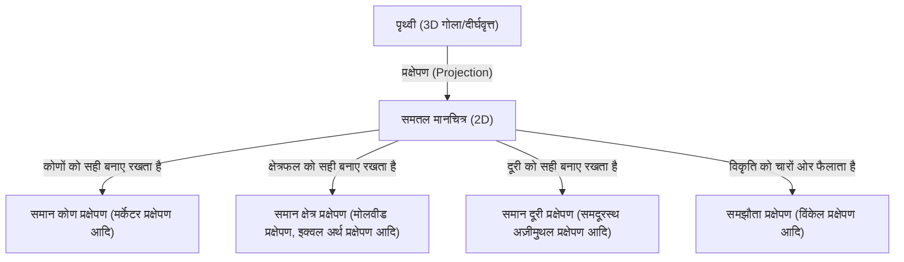
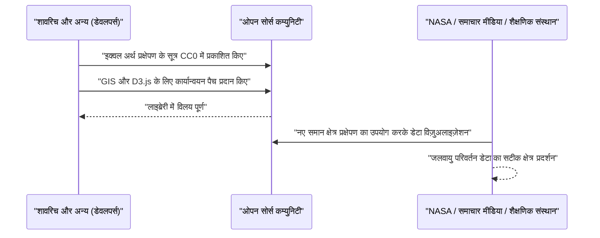

# परिचय: एक गोले को समतल पर खींचने का अंतिम विरोधाभास

प्राचीन काल से ही, मानव ने उस दुनिया को समझने और रिकॉर्ड करने के लिए मानचित्र बनाए हैं जिसमें वे रहते हैं। हालाँकि, वहाँ हमेशा एक विशाल विरोधाभास रहा है: यह तथ्य कि "बिना किसी विकृति के 3D गोले (पृथ्वी) को 2D समतल (मानचित्र) पर खोलना गणितीय रूप से असंभव है"। यह गणितीय सत्य पर आधारित है, जैसा कि कार्ल फ्रेडरिक गॉस ने अपने "थियोरेमा एग्रेजियम" (Theorema Egregium) में साबित किया था, कि अलग-अलग वक्रता वाली सतहों को एक-दूसरे पर सममितीय रूप से मैप नहीं किया जा सकता है।

संतरे के छिलके को समतल करने की कोशिश करने पर हमेशा दरारें या झुर्रियाँ पड़ती हैं, उसी तरह पृथ्वी को समतल मानचित्र में बदलते समय कुछ "विकृति" अपरिहार्य होती है। मानचित्र प्रक्षेपण (Map Projection) का इतिहास इस अपरिहार्य "विकृति" के साथ मानव के संघर्ष का इतिहास है, और यह चुनने और समझौता करने का इतिहास है कि किन तत्वों (क्षेत्रफल, कोण, दूरी, दिशा) का त्याग करना है और किन्हें संरक्षित करना है।

इस लेख में, हम 16वीं सदी के मर्केटर प्रक्षेपण के जन्म से लेकर 21वीं सदी के नवीनतम इक्वल अर्थ प्रक्षेपण तक मानचित्र प्रक्षेपण के विकास पर गहराई से विचार करेंगे, जिसमें गणितीय, ऐतिहासिक और सामाजिक संदर्भ शामिल होंगे।



## अध्याय 1: अन्वेषण का युग और मर्केटर प्रक्षेपण का जन्म

### 1.1 नाविकों की परेशानियां

15वीं सदी के अंत से 16वीं सदी तक अन्वेषण के युग के दौरान, यूरोपीय नाविक अज्ञात समुद्रों में निकल पड़े। कोलंबस का अमेरिका पहुंचना और मैगेलन का पृथ्वी की परिक्रमा करना, जैसे-जैसे दुनिया का नाटकीय रूप से विस्तार हुआ, सटीक समुद्री चार्ट की मांग में विस्फोट हुआ।

उस समय के समुद्री चार्ट, जिन्हें पोर्टोलान चार्ट कहा जाता था, केंद्र से निकलने वाली दिशा रेखाओं पर निर्भर थे। हालाँकि, लंबी यात्राओं में, विशेष रूप से महासागरों को पार करते समय, पृथ्वी के गोल होने के कारण होने वाली त्रुटियों को नजरअंदाज नहीं किया जा सकता था। नाविक दृढ़ता से ऐसा मानचित्र चाहते थे जहां "कम्पास द्वारा इंगित एक निश्चित दिशा (等角航路, loxodrome) में सीधे यात्रा करने से वे अपने गंतव्य तक पहुंच सकें।"

### 1.2 जेरार्डस मर्केटर का नवाचार

1569 में, फ्लैंडर्स (वर्तमान बेल्जियम) के भूगोलवेत्ता जेरार्डस मर्केटर (Gerardus Mercator) ने नाविकों की इस सख्त जरूरत को पूरा करने के लिए एक अभूतपूर्व विश्व मानचित्र प्रकाशित किया। यही "मर्केटर प्रक्षेपण" है।

मर्केटर प्रक्षेपण की सबसे बड़ी विशेषता यह है कि "किन्हीं दो बिंदुओं को जोड़ने वाली एक सीधी रेखा हमेशा एक निरंतर कम्पास दिशा दिखाती है (लॉक्सोड्रोम को सीधी रेखाओं के रूप में दर्शाया जाता है)।" इससे नाविक मानचित्र पर एक शासक रखकर और एक सीधी रेखा खींचकर गंतव्य के लिए कम्पास की दिशा जान सकते थे।

### 1.3 मर्केटर प्रक्षेपण का गणितीय आधार

मर्केटर प्रक्षेपण को एक प्रकार का बेलनाकार प्रक्षेपण माना जा सकता है। इसकी कल्पना पृथ्वी की भूमध्य रेखा के चारों ओर एक बेलन लपेटने और पृथ्वी के केंद्र से एक प्रकाश स्रोत द्वारा बेलन के अंदर मानचित्र को प्रक्षेपित करने के रूप में की जा सकती है। हालाँकि, मर्केटर ने केवल प्रक्षेपण नहीं किया, बल्कि अक्षांश रेखाओं के बीच की दूरी को गणितीय गणनाओं के माध्यम से समायोजित किया।

मान लीजिए कि देशांतर $\lambda$ है, अक्षांश $\phi$ है, और मानचित्र पर निर्देशांक $(x, y)$ हैं, तो मर्केटर प्रक्षेपण का प्रक्षेपण सूत्र इस प्रकार है (पृथ्वी को त्रिज्या $R$ के साथ एक पूर्ण गोला मानकर):

$$ x = R(\lambda - \lambda_0) $$
$$ y = R \ln \left( \tan\left(\frac{\pi}{4} + \frac{\phi}{2}\right) \right) $$

यहाँ, $\lambda_0$ संदर्भ केंद्रीय मध्याह्न रेखा है। जैसा कि यह समीकरण दिखाता है, अक्षांश जितना अधिक होता है, $y$ का मान उतनी ही तेजी से बढ़ता है, और ध्रुवों ($\phi = \pm \pi/2$) पर अनंत ($\infty$) हो जाता है।

नीचे पाइथन का उपयोग करके मर्केटर प्रक्षेपण निर्देशांक रूपांतरण करने के लिए एक सरल कोड स्निपेट दिया गया है।

```python
import math

def latlon_to_mercator(lat, lon, R=6378137.0):
    """
    अक्षांश और देशांतर को मर्केटर प्रक्षेपण XY निर्देशांक (मीटर) में बदलने का फंक्शन
    EPSG:3857 (Web Mercator) की गणना के समतुल्य
    """
    # अक्षांश और देशांतर को रेडियन में बदलें
    lat_rad = math.radians(lat)
    lon_rad = math.radians(lon)
    
    # X निर्देशांक की गणना
    x = R * lon_rad
    
    # Y निर्देशांक की गणना (गुडरमैनियन फलन का व्युत्क्रम)
    y = R * math.log(math.tan(math.pi / 4.0 + lat_rad / 2.0))
    
    return x, y

# उदाहरण: टोक्यो (अक्षांश 35.6812, देशांतर 139.7671) की गणना
x, y = latlon_to_mercator(35.6812, 139.7671)
print(f"Tokyo (Mercator): X={x:.2f}, Y={y:.2f}")
```

### 1.4 मर्केटर प्रक्षेपण के प्रकाश और छाया

चूँकि मर्केटर प्रक्षेपण में "समानकोणिकता (conformality)" (कोण सही ढंग से संरक्षित होते हैं) होती है, इसलिए स्थानीय आकार वास्तविकता से मेल खाते हैं। हालाँकि, इसकी कीमत पर, इसमें "क्षेत्रफल" के अत्यधिक विकृत होने की एक घातक खामी है। क्योंकि उच्च अक्षांशों को बड़ा किया जाता है, ग्रीनलैंड को अफ्रीका महाद्वीप के लगभग समान आकार में खींचा जाता है, लेकिन वास्तव में अफ्रीका महाद्वीप ग्रीनलैंड के क्षेत्रफल का लगभग 14 गुना है।

क्षेत्रफल में यह विकृति बाद में राजनीतिक और सामाजिक समस्याओं का कारण बनेगी। चूंकि उत्तरी गोलार्ध के उच्च अक्षांश क्षेत्रों, जैसे कि यूरोप और उत्तरी अमेरिका को अतिरंजित किया जाता है, जबकि भूमध्य रेखा के पास के विकासशील देशों को छोटा खींचा जाता है, इसलिए इसकी आलोचना यह कहकर की गई कि यह "पश्चिमी-केंद्रित विश्वदृष्टि को स्थापित करता है।"

## अध्याय 2: क्षेत्रफल की सटीकता की तलाश: समान क्षेत्र प्रक्षेपणों की वंशावली

मर्केटर प्रक्षेपण के क्षेत्र विकृतियों की आलोचनाओं के कारण, कई "समान क्षेत्र प्रक्षेपण" तैयार किए गए जो क्षेत्रफल अनुपात को सही ढंग से बनाए रखते हैं।

### 2.1 सैनसन प्रक्षेपण और मोलवीड प्रक्षेपण

17वीं शताब्दी में, फ्रांसीसी निकोलस सैनसन और अन्य लोगों द्वारा उपयोग किया गया "सैनसन-फ्लैमस्टीड प्रक्षेपण (Sanson-Flamsteed projection)" लोकप्रिय हो गया। यह एक समान क्षेत्र प्रक्षेपण है जहां अक्षांश रेखाएं समान दूरी वाली समानांतर रेखाएं हैं और देशांतर रेखाएं ज्या (sine) वक्रों के रूप में खींची जाती हैं। हालांकि केंद्रीय मध्याह्न रेखा के पास विकृति छोटी है, लेकिन परिधीय भागों (विशेष रूप से उच्च अक्षांश क्षेत्रों) में आकार की गंभीर विकृति का नुकसान था।

1805 में जर्मन गणितज्ञ कार्ल मोलवीड द्वारा प्रकाशित "मोलवीड प्रक्षेपण (Mollweide projection)", इसका एक उन्नत रूप था। मोलवीड प्रक्षेपण पूरी पृथ्वी को एक ही दीर्घवृत्त में फिट करता है, जिससे उच्च अक्षांश क्षेत्रों में आकार की विकृति सैनसन प्रक्षेपण की तुलना में कम हो जाती है।

### 2.2 गूडे का होमोलोसाइन प्रक्षेपण (खंडित प्रक्षेपण)

20वीं सदी की शुरुआत में, समान क्षेत्र संपत्ति को बनाए रखते हुए आकार की विकृति को और कम करने के प्रयास किए गए। 1923 में, अमेरिकी भूगोलवेत्ता जॉन पॉल गूडे ने "गूडे प्रक्षेपण (होमोलोसाइन प्रक्षेपण)" प्रकाशित किया।

इसने एक अपरंपरागत दृष्टिकोण अपनाया जिसे "खंडित प्रक्षेपण" कहा जाता है, जहां सैनसन प्रक्षेपण का उपयोग निम्न अक्षांश क्षेत्रों में और मोलवीड प्रक्षेपण का उपयोग उच्च अक्षांश क्षेत्रों में किया गया था, और फिर महासागर के हिस्सों (या महाद्वीपीय भागों) को विभाजित करके दर्शाया गया था। नतीजतन, प्रत्येक महाद्वीप के आकार की विकृति को कम करते हुए, सही क्षेत्र अनुपात के साथ दुनिया को देखना संभव हो गया। हालाँकि, चूंकि महासागरों को काट दिया गया था, इसलिए पृथ्वी के निरंतर स्वरूप को सहज रूप से समझना मुश्किल था।

## अध्याय 3: शीत युद्ध और पीटर्स प्रक्षेपण का विवाद

यह 1970 के दशक का "पीटर्स प्रक्षेपण (Peters projection)" विवाद था, जिसने मानचित्र प्रक्षेपण को केवल गणितीय या भौगोलिक मुद्दे से परे ले जाकर वैचारिक संघर्षों को शामिल करने वाली एक बड़ी बहस में बदल दिया।

### 3.1 गॉल का समान क्षेत्र बेलनाकार प्रक्षेपण और अर्नो पीटर्स के दावे

1973 में, जर्मन इतिहासकार अर्नो पीटर्स ने मर्केटर प्रक्षेपण की कड़ी आलोचना की, "मर्केटर प्रक्षेपण एक घमंडी यूरो-केंद्रित मानचित्र है जो जानबूझकर तीसरी दुनिया को छोटा दिखाता है," और अपना खुद का "पीटर्स प्रक्षेपण" प्रकाशित किया। उन्होंने इसे "एक सच्चे, निष्पक्ष और नए विश्व मानचित्र के रूप में जोर-शोर से प्रचारित किया जो सभी लोगों को समान रूप से चित्रित करता है।"

पीटर्स प्रक्षेपण एक समान क्षेत्र प्रक्षेपण है, और उच्च अक्षांशों को मर्केटर प्रक्षेपण की तरह अत्यधिक बड़ा नहीं किया जाता है। इसलिए, संयुक्त राष्ट्र की एजेंसियों, कई गैर सरकारी संगठनों और धार्मिक समूहों ने इस मानचित्र का समर्थन किया और इसे शैक्षिक पोस्टरों के रूप में व्यापक रूप से अपनाया।

### 3.2 मानचित्रकार समुदाय से भयंकर प्रतिक्रिया

हालाँकि, पेशेवर मानचित्रकारों ने पीटर्स की घोषणा पर तीखी प्रतिक्रिया व्यक्त की। इसके कारण निम्नलिखित थे:

1. **साहित्यिक चोरी का संदेह**: गणितीय रूप से, पीटर्स प्रक्षेपण 1855 में ब्रिटिश जेम्स गॉल द्वारा प्रकाशित "गॉल समान क्षेत्र बेलनाकार प्रक्षेपण" के बिल्कुल समान था। यह मानचित्रण समुदाय में एक ज्ञात प्रक्षेपण था और पीटर्स का मूल काम नहीं था।
2. **आकार की गंभीर विकृति**: समान क्षेत्र संपत्ति को बनाए रखने के लिए बेलनाकार प्रक्षेपण का उपयोग करने के परिणामस्वरूप, निम्न अक्षांश क्षेत्रों (अफ्रीका और दक्षिण अमेरिका) को लंबवत रूप से अत्यधिक खींचा गया था, और उच्च अक्षांश क्षेत्रों (यूरोप और कनाडा) को क्षैतिज रूप से कुचल दिया गया था, जिसके परिणामस्वरूप बहुत भद्दे आकार बने।
3. **प्रचार के रूप में उपयोग**: मानचित्रकारों ने पीटर्स पर आरोप लगाया कि उन्होंने मानचित्र प्रक्षेपण के गणितीय ट्रेड-ऑफ (क्षेत्रफल बनाए रखने से आकार विकृत होता है) को नजरअंदाज किया और वैचारिक प्रचार करने के लिए मर्केटर प्रक्षेपण को अनुचित तरीके से बदनाम किया।

इस विवाद के परिणामस्वरूप दुनिया भर में यह मान्यता फिर से स्थापित हुई कि मानचित्र केवल वस्तुनिष्ठ वास्तविकता की प्रतिकृति नहीं हैं, बल्कि एक ऐसा माध्यम हैं जो उन्हें देखने वाले लोगों के विश्वदृष्टि और राजनीतिक चेतना को दृढ़ता से प्रभावित करते हैं।

## अध्याय 4: समझौते की कला: समझौता प्रक्षेपण का उदय

यदि आप क्षेत्रफल या आकार, किसी एक को पूरी तरह से संरक्षित करने का प्रयास करते हैं, तो दूसरे का अत्यधिक बलिदान होता है। इसलिए, 20वीं सदी के उत्तरार्ध में सामान्य-प्रयोजन वाले विश्व मानचित्रों के लिए "समझौता प्रक्षेपण (Compromise projection)", जो सख्त समान क्षेत्र या समान कोण गुणों को त्यागता है और "प्राकृतिक रूप" और "कुल विकृति की कमी" को अपनाता है, मुख्यधारा बन गया।

### 4.1 रॉबिन्सन प्रक्षेपण

1963 में अमेरिकी मानचित्रकार आर्थर एच. रॉबिन्सन द्वारा तैयार किए गए "रॉबिन्सन प्रक्षेपण (Robinson projection)" ने गणितीय सूत्र से शुरू न करके, बल्कि अनुभवजन्य रूप से अक्षांशों की लंबाई और रिक्ति का निर्धारण करके "सुंदर रूप" को सर्वोच्च प्राथमिकता देने का एक अनूठा दृष्टिकोण अपनाया।

यह प्रक्षेपण 1988 में नेशनल जियोग्राफिक सोसाइटी द्वारा अपने आधिकारिक विश्व मानचित्र के रूप में अपनाए जाने के बाद दुनिया भर में व्यापक रूप से पहचाना जाने लगा।

### 4.2 विंकेल ट्राइपेल प्रक्षेपण

बाद में, 1998 में, नेशनल ज्योग्राफिक सोसाइटी ने रॉबिन्सन प्रक्षेपण की जगह "विंकेल ट्राइपेल प्रक्षेपण (Winkel Tripel projection)" को अपनाया। 1921 में जर्मन ओसवाल्ड विंकेल द्वारा आविष्कार किया गया यह प्रक्षेपण, एटॉफ प्रक्षेपण और समदूरस्थ बेलनाकार प्रक्षेपण का अंकगणितीय औसत है। "ट्राइपेल" का अर्थ जर्मन भाषा में "तीन" होता है, जो तीन प्रकार की विकृतियों: क्षेत्रफल, कोण और दूरी को कम करने के प्रयास को दर्शाता है। आज भी, इसका उपयोग कई कार्यपुस्तिकाओं और एटलस में एक मानक विश्व मानचित्र के रूप में किया जाता है।

## अध्याय 5: डिजिटल युग में नई चुनौतियां: इक्वल अर्थ प्रक्षेपण का जन्म

21वीं सदी में, मानचित्रों के साथ हमारी बातचीत में नाटकीय रूप से बदलाव आया है। Google Maps जैसी वेब मैपिंग सेवाओं का प्रसार इसका उदाहरण है। विडंबना यह है कि चिकनी ज़ूमिंग के लिए इन वेब मानचित्रों में फिर से "मर्केटर प्रक्षेपण (वेब मर्केटर)" का उपयोग किया जाता है (हाल के वर्षों में, ज़ूम आउट करने पर इसे 3D ग्लोब मॉडल पर स्विच करने के लिए सुधारा गया है)।

हालाँकि, जब जलवायु परिवर्तन और वैश्विक असमानता जैसे वैश्विक मुद्दों पर चर्चा करने की बात आती है, तो "सटीक क्षेत्रफल अनुपात" के साथ दुनिया की कल्पना करने का महत्व अभी भी बहुत अधिक है, और एक नए समान क्षेत्र प्रक्षेपण की आवश्यकता थी।

### 5.1 बोजन शावरिच और अन्य की चुनौती

2018 में, तीन मानचित्रकारों - बोजन शावरिच (Bojan Šavrič), टॉम पैटरसन (Tom Patterson), और बर्नहार्ड जेनी (Bernhard Jenny) - द्वारा एक पूरी तरह से नया समान क्षेत्र प्रक्षेपण, "इक्वल अर्थ प्रक्षेपण (Equal Earth projection)" प्रकाशित किया गया था।

उनका लक्ष्य स्पष्ट था।
"एक ऐसा विश्व मानचित्र बनाना जिसमें पीटर्स प्रक्षेपण जैसी गंभीर आकार विकृति न हो, जो रॉबिन्सन प्रक्षेपण की तरह प्राकृतिक और सुंदर दिखे, और जिसका क्षेत्रफल बिल्कुल सटीक हो।"

### 5.2 इक्वल अर्थ प्रक्षेपण का गणितीय नवाचार

इक्वल अर्थ प्रक्षेपण का बाहरी आकार रॉबिन्सन प्रक्षेपण के समान है, लेकिन यह सख्त समान क्षेत्र संपत्ति प्राप्त करने के लिए उन्नत बहुपदों का उपयोग करता है। इसका प्रक्षेपण सूत्र इस प्रकार है:

मान लीजिए कि अक्षांश $\phi$ है, देशांतर $\lambda$ (केंद्रीय मध्याह्न रेखा से अंतर) है, और $ \theta $ वह कोण है जो $ \sin \theta = \frac{\sqrt{3}}{2} \sin \phi $ को संतुष्ट करता है।

$$ x = \frac{2\sqrt{3} \lambda \cos \theta}{3 (9 A_4 \theta^8 + 7 A_3 \theta^6 + 3 A_2 \theta^2 + A_1)} $$
$$ y = A_4 \theta^9 + A_3 \theta^7 + A_2 \theta^3 + A_1 \theta $$

यहाँ, गुणांक इस प्रकार हैं:
$ A_1 = 1.340264 $
$ A_2 = -0.081106 $
$ A_3 = 0.000893 $
$ A_4 = 0.003796 $

इन जटिल गणितीय सूत्रों के माध्यम से, इक्वल अर्थ प्रक्षेपण ने महाद्वीपों के प्राकृतिक आकार को बनाए रखते हुए सही क्षेत्रफल अनुपात का प्रतिनिधित्व करने में सफलता प्राप्त की है, बिना भूमध्य रेखा के पास अत्यधिक खींचे गए या उच्च अक्षांशों पर कुचले गए।

### 5.3 ओपन सोर्स के रूप में प्रसार

इक्वल अर्थ प्रक्षेपण न केवल अपने डिजाइन में बल्कि प्रसार के अपने दृष्टिकोण में भी क्रांतिकारी था। डेवलपर्स ने इस प्रक्षेपण के गणितीय सूत्रों को पब्लिक डोमेन (CC0) के रूप में जारी किया और इसे QGIS जैसे ओपन सोर्स GIS सॉफ्टवेयर और D3.js जैसी डेटा विज़ुअलाइज़ेशन लाइब्रेरी में तेजी से लागू करने के लिए काम किया।

परिणामस्वरूप, इसे तुरंत दुनिया भर के वैज्ञानिकों और मीडिया द्वारा स्वीकार कर लिया गया, और इसे नासा (NASA) द्वारा वैश्विक तापमान विसंगतियों के मानचित्रों आदि में अपनाया गया।



## निष्कर्ष: मानचित्र दुनिया बनाते हैं

मर्केटर प्रक्षेपण से इक्वल अर्थ प्रक्षेपण तक का इतिहास, विचार में बदलाव का भी इतिहास है कि "मानवता उस दुनिया को कैसे समझती है और कैसे बताना चाहती है जिसमें वे रहते हैं।"

अन्वेषण के युग के दौरान, "गंतव्य तक सुरक्षित रूप से पहुंचना" (समान कोण) सर्वोच्च प्राथमिकता थी, और औपनिवेशिक शासन के युग के दौरान, ऐसे मानचित्रों को प्राथमिकता दी जाती थी जो किसी देश की विशालता को दर्शाते हों। शीत युद्ध के दौरान, उत्तर-दक्षिण के मुद्दों को हल करने का आह्वान करने वाले मानचित्रों ने विवाद पैदा किया, और आज, हमें जलवायु परिवर्तन जैसे वैश्विक मुद्दों को निष्पक्ष रूप से (समान क्षेत्र + प्राकृतिक आकार) देखने के लिए मानचित्रों की आवश्यकता है।

**"मानचित्र दुनिया को दर्शाने वाले दर्पण होने के साथ-साथ, दुनिया को बनाने वाले लेंस भी हैं।"**

जब हम किसी मानचित्र को देखते हैं, तो हमें हमेशा इस बात के प्रति जागरूक होना चाहिए कि वह किन गणितीय समझौतों पर बना है और किस इरादे से खींचा गया है। इक्वल अर्थ प्रक्षेपण सबसे नए "लेंस" में से एक है जो दिखाता है कि हम आधुनिक युग में दुनिया को कैसे देखना चाहते हैं।
