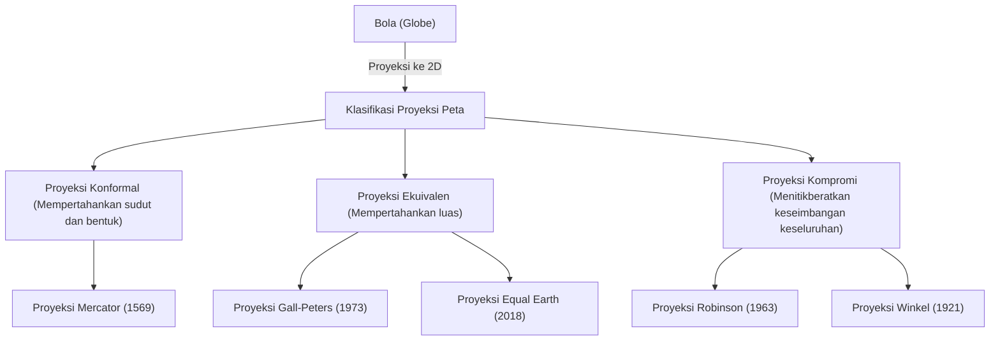

"Peta dunia" yang biasa kita lihat sehari-hari. Mulai dari peta digital yang ditampilkan di layar ponsel pintar hingga poster besar yang tertempel di dinding kelas, peta telah berakar kuat dalam kehidupan kita. Namun, pernahkah Anda berpikir secara mendalam tentang fakta bahwa peta dunia yang digambar pada bidang datar sebenarnya bukanlah "wujud Bumi yang akurat"?

Bumi memiliki bentuk yang mendekati bola tiga dimensi (tepatnya elipsoid referensi), tetapi sebagian besar peta yang kita gunakan adalah bidang datar dua dimensi. Dalam tindakan "membentangkan permukaan tiga dimensi ke dalam dua dimensi" ini, terdapat paradoks matematis yang signifikan dan tidak dapat dihindari. Artikel ini akan mengungkap sejarah dan konflik yang belum banyak diketahui tentang bagaimana umat manusia telah memahami dan merepresentasikan ruang angkasa raksasa yang disebut Bumi pada bidang datar, mulai dari Proyeksi Mercator yang mendorong Era Penjelajahan Samudra, Proyeksi Peters yang memicu gelombang politik, hingga Proyeksi Equal Earth modern.

## 1. Dilema Matematis dalam Menggambar Bola pada Bidang Datar

Saat membahas sejarah proyeksi peta, premis utama matematis yang pertama kali harus dipahami adalah apa yang dibuktikan oleh "Carl Friedrich Gauss". Gauss, seorang ahli matematika hebat dari abad ke-19, merumuskan teorema geometri diferensial yang disebut "Teorema Luar Biasa (Theorema Egregium)". Menurut teorema ini, kelengkungan Gauss pada suatu permukaan memiliki sifat yang tidak berubah meskipun permukaan tersebut ditekuk.

Kelengkungan Gauss dari permukaan bola seperti Bumi adalah positif, sedangkan kelengkungan Gauss dari bidang datar adalah nol. Oleh karena itu, secara matematis mustahil untuk memetakan permukaan dengan kelengkungan Gauss yang berbeda satu sama lain tanpa adanya peregangan, penyusutan, atau robekan. Ini adalah prinsip yang sama dengan ketidakmungkinan mengupas kulit jeruk dan membentangkannya ke dalam satu persegi panjang datar tanpa celah.

Karena dilema matematis ini, peta dunia apa pun tidak mungkin dapat mempertahankan keempat elemen berikut secara akurat dan bersamaan:

1. **Luas** (Ekuivalensi): Apakah rasio luas daratan dan lautan yang sebenarnya dipertahankan?
2. **Sudut dan Bentuk** (Konformalitas): Apakah kontur medan yang sebenarnya dan sudut garis yang berpotongan dipertahankan?
3. **Jarak** (Ekuidistan): Apakah rasio jarak dari titik tertentu dipertahankan?
4. **Arah** (Azimuthal): Apakah arah dari titik tertentu dipertahankan dengan benar?

Hanya "globe" (bola dunia) yang memenuhi semua ini. Saat membuat peta datar, pembuat peta terpaksa "berkompromi", mengorbankan sesuatu dan memprioritaskan yang lain demi tujuan tertentu. Pilihan inilah yang bisa dikatakan sebagai sejarah proyeksi peta itu sendiri.

## 2. Inovasi yang Mendukung Era Penjelajahan Samudra: Proyeksi Mercator

Jika berbicara tentang peta dunia yang paling akrab bagi kita saat ini, itu pastilah "Proyeksi Mercator". Peta ini, yang diperkenalkan pada tahun 1569 oleh ahli geografi asal Flandria (sekarang Belgia), Gerardus Mercator, adalah penemuan revolusioner yang sangat mengubah sejarah umat manusia.

Eropa pada saat itu berada di tengah "Era Penjelajahan Samudra", berlayar menuju benua dan lautan yang belum diketahui. Namun, tanpa adanya penunjuk jalan di lautan luas, para pelaut selalu berdampingan dengan risiko tersesat. Apa yang mereka cari adalah "peta laut yang pasti dapat membawa mereka ke tujuan".

Ciri terbesar dari Proyeksi Mercator adalah "konformalitas". Garis bujur dan garis lintang selalu berpotongan pada sudut tegak lurus, dan garis lurus yang menghubungkan dua titik mana pun (garis loksodrom) sesuai dengan arah yang ditunjuk oleh kompas yang sebenarnya. Artinya, para pelaut hanya perlu menarik garis lurus antara titik keberangkatan dan tujuan di peta, mengukur sudut (arah) yang dibentuk oleh garis tersebut dengan garis bujur, dan menjaga kompas pada sudut tersebut agar dapat dipastikan tiba di tujuan.

Peta fungsional dan revolusioner ini benar-benar merupakan alat ajaib bagi para navigator. Namun, di balik kenyamanan ini terdapat pengorbanan yang sangat besar, yaitu "distorsi luas yang ekstrem".
Dalam Proyeksi Mercator, semakin tinggi garis lintangnya, peta akan semakin diperbesar baik dari arah timur-barat maupun utara-selatan, sehingga daerah yang mendekati kutub digambarkan jauh lebih besar daripada luas sebenarnya.

Misalnya, jika dilihat pada Proyeksi Mercator, Greenland tampak sebesar Benua Afrika, atau bahkan lebih besar. Namun, jika membandingkan luas sebenarnya, Benua Afrika memiliki ukuran sekitar 14 kali lipat dari Greenland. Demikian pula, negara-negara lintang tinggi seperti Rusia dan Kanada ditekankan sebagai wilayah yang sangat luas melebihi luas aslinya.

Mercator sendiri bermaksud menjadikan peta ini khusus untuk "keperluan pelayaran". Namun, karena keindahan penampilannya yang linear dan rapi, peta ini akhirnya banyak diadopsi untuk masyarakat umum dan pendidikan sekolah di luar pelayaran, yang pada akhirnya mendistorsi "kognisi ruang terhadap dunia" pada orang-orang selama berabad-abad.

## 3. Proyeksi Politik dan Ideologi: Kontroversi Proyeksi Peters

Memasuki abad ke-20, kritik terhadap penggunaan Proyeksi Mercator secara umum mulai meningkat. Latar belakangnya tidak hanya sebatas pencarian keakuratan geografis semata, melainkan ada ideologi politik dan sosial yang sangat terkait di dalamnya.

Pada tahun 1973, sejarawan Jerman Arno Peters melontarkan kritik tajam: "Proyeksi Mercator secara tidak adil menggambarkan negara-negara maju yang berpusat di Eropa (terletak di lintang tinggi belahan bumi utara) menjadi besar, dan mengecilkan daerah sekitar khatulistiwa (seperti Afrika, Amerika Selatan, dan Asia Tenggara) tempat banyak negara berkembang berada. Ini merupakan manifestasi supremasi kulit putih yang bersifat kolonial."

Kemudian, peta yang ia perkenalkan secara luas sebagai "peta dunia yang lebih setara dan benar" adalah "Proyeksi Peters (secara resmi Proyeksi Gall-Peters)". Peta ini adalah "Proyeksi Ekuivalen", yang dikhususkan untuk mencerminkan rasio luas sebenarnya di semua wilayah di seluruh dunia secara akurat.

Jika melihat Proyeksi Peters, akan muncul wujud yang sangat berbeda dengan dunia yang selama ini kita kenal. Eropa digambarkan sangat kecil, sedangkan sebaliknya Benua Afrika dan Amerika Selatan memanjang ke bawah, sehingga ukurannya yang besar sangat menonjol. Ini menjadi senjata visual yang kuat bagi negara-negara Dunia Ketiga untuk secara adil menegaskan eksistensi negara mereka. UNESCO (Organisasi Pendidikan, Keilmuan, dan Kebudayaan PBB) serta banyak LSM internasional mendukung dan mengadopsi peta ini dari sudut pandang keadilan.

Namun, hal ini memicu reaksi keras dari para ahli kartografi. Demi membuat luasnya akurat, dalam Proyeksi Peters, "bentuk (kontur)" benua menjadi sangat terdistorsi. Negara-negara di sekitar khatulistiwa tampak memanjang secara vertikal, dan wilayah di lintang tinggi tampak tertekan secara horizontal. Timbul perdebatan sengit seperti "Bentuknya tidak alami dan tidak praktis digunakan" atau "Klaim Peters hanyalah propaganda politik".

"Kontroversi Proyeksi Peters" ini merupakan peristiwa bersejarah yang menyoroti bahwa peta tidak sekadar representasi informasi geografis semata, melainkan sebuah media yang membentuk pandangan dunia, dinamika kekuasaan, dan ideologi politik dari orang-orang yang melihatnya.

## 4. Mencari Titik Temu antara Keindahan dan Kepraktisan: Proyeksi Kompromi

"Kebohongan luas" pada Proyeksi Mercator dan "distorsi bentuk" pada Proyeksi Peters. Karena keduanya memiliki elemen yang ekstrem, para ahli kartografi mulai mencari "peta dengan luas dan bentuk yang memang tidak sempurna, namun terlihat paling alami dan seimbang secara visual". Inilah awal mula lahirnya "Proyeksi Kompromi".

Representasi utama dari Proyeksi Kompromi adalah "Proyeksi Robinson" yang diperkenalkan oleh ahli geografi Amerika Arthur H. Robinson pada tahun 1963. Robinson tidak membuat peta dari rumus matematika, tetapi bermula dari intuisi visual dan artistik tentang "bagaimana tampilannya di mata manusia". Ia melakukan simulasi berulang-ulang, secara manual mencari titik kompromi di mana bentuk daratan tidak terdistorsi secara ekstrem dan rasio luasnya pun tidak terlalu kacau, kemudian setelah itu baru menerapkannya ke dalam koordinat matematika.

Proyeksi Robinson berbentuk elips yang indah dan membulat secara keseluruhan, sehingga terlihat sangat alami di mata kita. Pada tahun 1988, saat National Geographic Society yang terkenal mengadopsi Proyeksi Robinson sebagai peta dunia resmi, peta ini menjadi salah satu standar global.

Selanjutnya, National Geographic Society beralih ke "Proyeksi Winkel (Proyeksi Winkel Tripel)" pada tahun 1998. Proyeksi yang digagas oleh Oswald Winkel ini mengambil pendekatan untuk meminimalkan tiga distorsi yaitu luas, sudut, dan jarak ("Tripel" berarti "3" dalam bahasa Jerman), serta dinilai memiliki lebih sedikit distorsi dan lebih seimbang dibandingkan dengan Proyeksi Robinson. Pada sebagian besar buku teks dan peta dunia umum saat ini, Proyeksi Winkel atau Proyeksi Kompromi yang serupa dengan Proyeksi Robinson telah menjadi arus utama.

## 5. Tantangan Modern dan Representasi Baru: Authagraph dan Proyeksi Equal Earth

Memasuki abad ke-21, evolusi proyeksi peta tidak berhenti. Di era modern di mana isu lingkungan global dan globalisasi terus berlanjut, kita dipaksa untuk mempertimbangkan kembali bumi dari perspektif baru.

Salah satu upayanya adalah "Peta Dunia Authagraph" yang dirancang oleh arsitek Jepang Hajime Narukawa dan rekan-rekannya. Peta ini menggunakan metode orisinal dengan membagi permukaan Bumi menjadi 96 bagian yang sama rata dan memproyeksikannya pada bidang tetrahedron reguler, kemudian membuka lipatannya menjadi peta datar persegi panjang. Keuntungan terbesarnya adalah peta ini dapat digabungkan dan disejajarkan tanpa batas dengan pusat di bagian mana pun, sambil tetap mempertahankan rasio luas aslinya. Peta ini sangat cocok untuk memandang dunia dari perspektif global yang tidak berpusat, seperti melihat jaringan jalur laut dan udara, dampak perubahan iklim, dan telah memenangkan Good Design Grand Award pada tahun 2016.

Kemudian, proyeksi baru yang paling banyak menarik perhatian dalam beberapa tahun terakhir adalah "Proyeksi Equal Earth" yang diperkenalkan oleh tiga ahli pemetaan: Bojan Šavrič, Tom Patterson, dan Bernhard Jenny pada tahun 2018.

Proyeksi Equal Earth adalah "Proyeksi Ekuivalen (peta dengan luas yang akurat)" baru yang dikembangkan untuk mengatasi "ketidakwajaran bentuk yang ekstrem" yang dialami oleh Proyeksi Peters. Mereka bertujuan menciptakan peta yang memiliki tampilan membulat dan nyaman dipandang seperti Proyeksi Robinson, namun pada saat yang sama rasio luas setiap benua dan negara sepenuhnya akurat.

Salah satu motivasi pengembangannya adalah perasaan krisis yang mendalam bahwa ketika memvisualisasikan data tentang perubahan iklim dan masalah lingkungan, jika luasnya tidak akurat, hal itu akan menimbulkan kesalahpahaman. Misalnya, ketika menunjukkan dampak deforestasi atau kenaikan permukaan laut, Proyeksi Mercator melebih-lebihkan dampak di lintang tinggi. Proyeksi Equal Earth adalah desain inovatif yang menggabungkan keindahan dan keakuratan ilmiah, yang baru bisa diwujudkan di era modern ini berkat perhitungan tingkat tinggi yang dimungkinkan oleh perkembangan teknologi komputer. Saat ini, penggunaannya semakin meluas, termasuk diadopsi untuk peta data iklim NASA (Badan Penerbangan dan Antariksa Amerika Serikat) dan GISS (Goddard Institute for Space Studies).

## Penutup: Peta adalah Pandangan Dunia Itu Sendiri

Jika melihat kembali sejarah proyeksi peta dari Proyeksi Mercator hingga Proyeksi Equal Earth, dapat dipahami bahwa di sana tidak hanya tercermin perkembangan teknik survei atau matematika, tetapi juga tekad kuat masyarakat di setiap era tentang "bagaimana kita ingin melihat Bumi, dan bagaimana kita seharusnya menggunakannya".

Konformalitas yang menyelamatkan nyawa para navigator dan memungkinkan perdagangan berskala global.
Ekuivalensi yang melempar batu ke permasalahan Utara-Selatan dan ketidaksetaraan, serta membawa beragam perspektif.
Dan representasi baru yang mencari harmoni secara keseluruhan dan berkontribusi pada pemecahan masalah masyarakat modern yang kompleks.

Peta dunia yang kita tatap bukanlah sebuah "kebenaran absolut". Itu adalah salah satu "interpretasi" manusia yang menerjemahkan Bumi tiga dimensi yang memiliki luas tak terbatas ke dalam dua dimensi agar sesuai dengan tujuan dan nilai-nilai kita sendiri. Saat Anda menatap peta dunia pada kesempatan berikutnya, silakan renungkan sejarah percobaan, kesalahan, dan konflik para pembuat peta selama berabad-abad yang tertuang pada selembar kertas (atau layar) tersebut. Bagaimana kita memandang dunia itu terbentuk oleh peta mana yang kita pilih.
