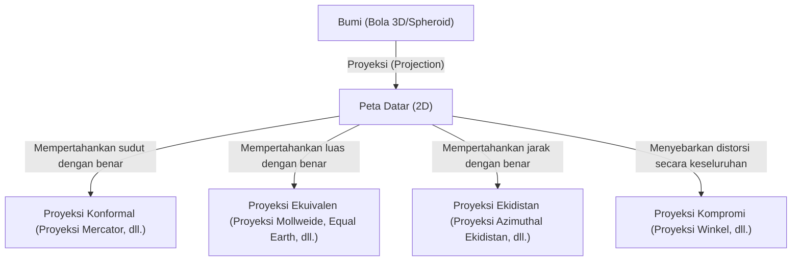
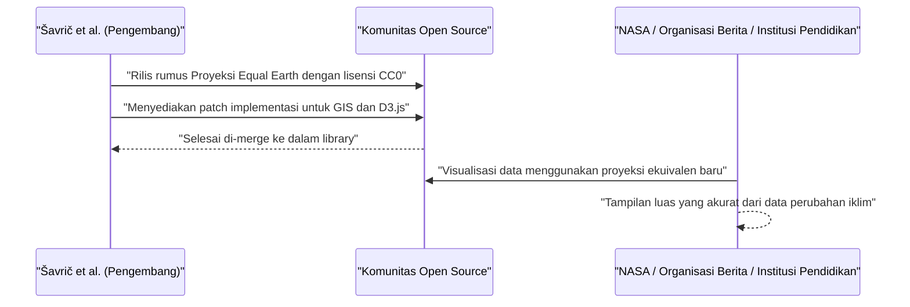

# Pendahuluan: Paradoks Utama Menggambar Bola pada Permukaan Datar

Sejak zaman kuno, umat manusia telah menggambar peta untuk memahami dan mencatat dunia tempat mereka tinggal. Namun, selalu ada satu paradoks besar. Fakta bahwa "secara matematis tidak mungkin membentangkan bola 3 dimensi (Bumi) ke dalam bidang datar 2 dimensi (peta) tanpa adanya distorsi". Hal ini didasarkan pada kebenaran matematis bahwa dua permukaan dengan kelengkungan yang berbeda tidak dapat dipetakan secara isometrik (mempertahankan jarak yang sama), seperti yang dibuktikan oleh Carl Friedrich Gauss dalam "Theorema Egregium" (Teorema Luar Biasa).

Sama seperti kulit jeruk yang akan robek atau berkerut jika Anda mencoba meratakannya, "distorsi" tertentu selalu terjadi saat membuat peta datar dari Bumi. Sejarah Proyeksi Peta (Map Projection) tidak lain adalah sejarah kompromi dan pilihan—bagaimana umat manusia menghadapi "distorsi" yang tidak dapat dihindari ini, elemen apa (luas, sudut, jarak, arah) yang harus dikorbankan, dan elemen apa yang harus dipertahankan.

Artikel ini akan menggali lebih dalam tentang evolusi proyeksi peta, dari lahirnya proyeksi Mercator pada abad ke-16 hingga proyeksi Equal Earth terbaru di abad ke-21, yang dipadukan dengan latar belakang matematis, historis, dan sosial.



## Bab 1: Era Penjelajahan Samudra dan Lahirnya Proyeksi Mercator

### 1.1 Penderitaan para Navigator

Selama Era Penjelajahan Samudra dari akhir abad ke-15 hingga abad ke-16, para navigator Eropa berlayar ke lautan yang belum dipetakan. Dengan pencapaian Columbus di Amerika dan pelayaran keliling dunia Magellan, dunia meluas secara dramatis, dan permintaan akan peta laut yang akurat meledak.

Peta laut pada saat itu, yang disebut peta portolan, mengandalkan garis arah (garis kompas) yang ditarik secara radial dari pusat. Namun, untuk pelayaran jarak jauh, terutama saat melintasi lautan, kesalahan akibat fakta bahwa Bumi itu bulat tidak bisa lagi diabaikan. Para navigator sangat mendambakan "peta yang memungkinkan mereka mencapai tujuan dengan berlayar lurus mengikuti arah kompas yang konstan (garis rhumb)".

### 1.2 Inovasi Gerardus Mercator

Pada tahun 1569, ahli geografi Flanders (sekarang Belgia), Gerardus Mercator, menerbitkan peta dunia inovatif yang menjawab keinginan mendesak para navigator ini. Itulah "Proyeksi Mercator".

Fitur terbesar dari proyeksi Mercator adalah bahwa "garis lurus yang menghubungkan dua titik mana pun selalu menunjukkan arah kompas yang konstan (garis rhumb direpresentasikan sebagai garis lurus)". Dengan ini, navigator dapat mengetahui arah kompas ke tujuan mereka hanya dengan menggunakan penggaris untuk menarik garis lurus di peta.

### 1.3 Dukungan Matematis Proyeksi Mercator

Proyeksi Mercator dapat dianggap sebagai jenis proyeksi silinder. Bayangkan sebuah silinder dililitkan di sekitar ekuator Bumi, dan sumber cahaya dari pusat Bumi memproyeksikan peta ke bagian dalam silinder. Namun, alih-alih proyeksi sederhana, Mercator menyesuaikan jarak antar garis lintang melalui perhitungan matematis.

Misalkan bujur adalah $\lambda$, lintang adalah $\phi$, dan koordinat pada peta adalah $(x, y)$, rumus proyeksi untuk proyeksi Mercator adalah sebagai berikut (mengasumsikan Bumi sebagai bola sempurna dengan jari-jari $R$).

$$ x = R(\lambda - \lambda_0) $$
$$ y = R \ln \left( \tan\left(\frac{\pi}{4} + \frac{\phi}{2}\right) \right) $$

Di sini, $\lambda_0$ adalah meridian tengah referensi. Seperti yang ditunjukkan oleh persamaan ini, semakin tinggi lintang, semakin cepat nilai $y$ meningkat, dan menyimpang menuju tak terhingga ($\infty$) pada kutub ($\phi = \pm \pi/2$).

Berikut adalah cuplikan kode sederhana yang melakukan transformasi koordinat proyeksi Mercator menggunakan Python.

```python
import math

def latlon_to_mercator(lat, lon, R=6378137.0):
    """
    Fungsi untuk mengubah lintang dan bujur menjadi koordinat XY proyeksi Mercator (dalam meter)
    Setara dengan perhitungan EPSG:3857 (Web Mercator)
    """
    # Mengubah lintang dan bujur menjadi radian
    lat_rad = math.radians(lat)
    lon_rad = math.radians(lon)
    
    # Perhitungan koordinat X
    x = R * lon_rad
    
    # Perhitungan koordinat Y (Fungsi invers dari fungsi Gudermannian)
    y = R * math.log(math.tan(math.pi / 4.0 + lat_rad / 2.0))
    
    return x, y

# Contoh: Perhitungan untuk Tokyo (Lintang 35.6812, Bujur 139.7671)
x, y = latlon_to_mercator(35.6812, 139.7671)
print(f"Tokyo (Mercator): X={x:.2f}, Y={y:.2f}")
```

### 1.4 Cahaya dan Bayangan Proyeksi Mercator

Karena proyeksi Mercator memiliki "konformalitas" (sudut dipertahankan dengan benar), bentuk lokalnya sesuai dengan kenyataan. Namun, sebagai gantinya, ia memiliki kelemahan fatal di mana "luas" sangat terdistorsi. Semakin tinggi garis lintang, semakin ia diperbesar, sehingga Greenland digambarkan hampir sama ukurannya dengan benua Afrika, padahal kenyataannya benua Afrika memiliki luas sekitar 14 kali lipat dari Greenland.

Distorsi wilayah ini kemudian akan menyebabkan masalah politik dan sosial. Meskipun wilayah lintang tinggi di belahan bumi utara seperti Eropa dan Amerika Utara direpresentasikan secara berlebihan, negara-negara berkembang di dekat khatulistiwa digambar lebih kecil, sehingga mendapat kritik karena "menanamkan pandangan dunia yang berpusat pada Barat".

## Bab 2: Mencari Akurasi Luas: Silsilah Proyeksi Ekuivalen

Menanggapi kritik terhadap distorsi luas pada proyeksi Mercator, banyak "proyeksi ekuivalen" (equal-area) dirancang, di mana rasio luas dipertahankan dengan benar.

### 2.1 Proyeksi Sanson dan Proyeksi Mollweide

Pada abad ke-17, "Proyeksi Sanson-Flamsteed", yang digunakan oleh Nicolas Sanson dari Prancis dan lainnya, menjadi populer. Ini adalah proyeksi ekuivalen di mana garis lintang digambar sebagai garis sejajar yang berjarak sama, dan garis bujur digambar sebagai kurva sinus. Meskipun ada sedikit distorsi di sekitar meridian tengah, ia memiliki kelemahan distorsi bentuk yang parah di area periferal (terutama pada lintang tinggi).

Ini kemudian disempurnakan oleh matematikawan Jerman Carl Mollweide, yang menerbitkan "Proyeksi Mollweide" pada tahun 1805. Proyeksi Mollweide memuat seluruh Bumi ke dalam satu bentuk elips, melunakkan distorsi bentuk pada lintang tinggi dibandingkan dengan proyeksi Sanson.

### 2.2 Proyeksi Homolosine Goode (Proyeksi Terputus)

Memasuki abad ke-20, ada upaya lebih lanjut untuk mempertahankan sifat ekuivalen sekaligus mengurangi distorsi bentuk. Pada tahun 1923, ahli geografi Amerika John Paul Goode menerbitkan "Proyeksi Goode (Proyeksi Homolosine)".

Ini menggunakan pendekatan tidak konvensional yang disebut "proyeksi terputus" (interrupted projection), yang menggabungkan proyeksi Sanson untuk lintang rendah dan proyeksi Mollweide untuk lintang tinggi, dan membelah bagian lautan (atau benua). Hal ini memungkinkan orang untuk memandang dunia dengan rasio luas yang benar sambil meminimalkan distorsi pada bentuk masing-masing benua. Namun, karena lautan terbelah, ada kelemahan di mana sulit untuk memahami bentuk Bumi yang kontinu secara intuitif.

## Bab 3: Perang Dingin dan Kontroversi Proyeksi Peters

Bagaimana proyeksi peta melampaui masalah matematika dan geografi dan berkembang menjadi kontroversi besar yang melibatkan konflik ideologi terlihat dalam kehebohan seputar "Proyeksi Peters" pada tahun 1970-an.

### 3.1 Proyeksi Silinder Ekuivalen Gall dan Klaim Arno Peters

Pada tahun 1973, sejarawan Jerman Arno Peters dengan keras mengkritik bahwa "proyeksi Mercator adalah peta arogan dari Eurosentrisme, dan secara sengaja membuat Dunia Ketiga terlihat lebih kecil," lalu menerbitkan "Proyeksi Peters" miliknya sendiri. Ia secara ekstensif mempromosikan ini sebagai "peta dunia baru yang benar-benar adil dan menggambarkan semua orang secara setara".

Proyeksi Peters adalah proyeksi ekuivalen, dan lintang tinggi tidak terlalu diperbesar seperti dalam proyeksi Mercator. Oleh karena itu, badan-badan PBB, banyak LSM, organisasi keagamaan, dan lainnya mendukung peta ini dan mengadopsinya secara luas sebagai poster edukasi.

### 3.2 Penolakan Keras dari Komunitas Kartografi

Namun, para kartografer profesional bereaksi keras terhadap pengumuman Peters ini. Alasannya adalah sebagai berikut:

1. **Dugaan Plagiarisme**: Secara matematis, proyeksi Peters persis sama dengan "Proyeksi Silinder Ekuivalen Gall" yang diterbitkan oleh James Gall dari Inggris pada tahun 1855. Itu adalah proyeksi yang sudah dikenal dalam dunia pemetaan dan bukan orisinalitas Peters.
2. **Distorsi Bentuk yang Parah**: Sebagai hasil dari penggunaan proyeksi silinder untuk menjaga ekuivalensi, daerah lintang rendah (Afrika dan Amerika Selatan) memanjang secara vertikal, dan daerah lintang tinggi (Eropa dan Kanada) tampak terjepit secara horizontal, menghasilkan bentuk yang sangat tidak proporsional.
3. **Penggunaan sebagai Propaganda**: Para kartografer menuduh Peters menggunakan propaganda ideologis dengan mengabaikan trade-off matematis dari proyeksi peta (mempertahankan luas mendistorsi bentuk) dan dengan tidak adil menjelekkan proyeksi Mercator.

Kontroversi ini membuat dunia menyadari kembali bahwa peta bukan hanya representasi objektif dari realitas, melainkan sebuah media yang sangat memengaruhi pandangan dunia dan kesadaran politik orang yang melihatnya.

## Bab 4: Seni Kompromi: Kebangkitan Proyeksi Kompromi

Jika Anda mencoba mempertahankan luas atau bentuk dengan sempurna, yang lain akan sangat dikorbankan. Oleh karena itu, "Proyeksi Kompromi", yang meninggalkan sifat ekuivalensi atau konformalitas yang ketat dan mengejar "penampilan alami" dan "sedikitnya distorsi keseluruhan", menjadi arus utama peta dunia umum pada paruh kedua abad ke-20.

### 4.1 Proyeksi Robinson

"Proyeksi Robinson", yang dirancang oleh kartografer Amerika Arthur H. Robinson pada tahun 1963, tidak berangkat dari rumus matematika, tetapi mengambil pendekatan unik dengan memprioritaskan "estetika visual" dan menentukan panjang dan jarak paralel secara empiris.

Proyeksi ini diakui secara luas di seluruh dunia ketika National Geographic Society mengadopsinya sebagai peta dunia resmi mereka pada tahun 1988.

### 4.2 Proyeksi Winkel Tripel

Kemudian, pada tahun 1998, National Geographic Society mengganti proyeksi Robinson dengan "Proyeksi Winkel Tripel". Dirancang oleh Oswald Winkel dari Jerman pada tahun 1921, proyeksi ini merupakan rata-rata aritmatika dari proyeksi Aitoff dan proyeksi ekidistans silinder. "Tripel" berarti "tiga" dalam bahasa Jerman, dan menunjukkan upaya untuk meminimalkan tiga distorsi: luas, sudut, dan jarak. Sampai saat ini, peta ini masih digunakan sebagai peta dunia standar di banyak buku catatan pembelajaran dan atlas.

## Bab 5: Tantangan Baru di Era Digital: Lahirnya Proyeksi Equal Earth

Memasuki abad ke-21, cara kita berinteraksi dengan peta berubah secara dramatis. Ini berkat meluasnya layanan peta Web seperti Google Maps. Ironisnya, peta web ini kembali mengadopsi "Proyeksi Mercator (Web Mercator)" untuk memfasilitasi operasi zoom yang mulus (walaupun baru-baru ini telah ditingkatkan sehingga jika diperkecil (zoom-out) akan beralih ke model bola bumi 3D).

Namun, dalam forum diskusi tentang tantangan global seperti perubahan iklim dan kesenjangan global, pentingnya memvisualisasikan dunia dengan "rasio luas yang akurat" tetap tinggi, dan proyeksi ekuivalen baru diperlukan.

### 5.1 Tantangan oleh Bojan Šavrič dan rekan-rekan

Pada tahun 2018, proyeksi ekuivalen yang sama sekali baru, "Proyeksi Equal Earth", diumumkan oleh tiga kartografer: Bojan Šavrič, Tom Patterson, dan Bernhard Jenny.

Tujuan mereka jelas:
"Untuk membuat peta dunia yang tidak memiliki distorsi bentuk yang parah seperti proyeksi Peters, memiliki penampilan yang alami dan indah seperti proyeksi Robinson, dan memiliki sifat ekuivalensi yang ketat."

### 5.2 Inovasi Matematis dari Proyeksi Equal Earth

Proyeksi Equal Earth sangat mirip dengan profil luar proyeksi Robinson, tetapi menggunakan polinomial tingkat tinggi untuk mencapai ekuivalensi yang ketat. Rumus proyeksinya adalah sebagai berikut:

Misalkan lintang adalah $\phi$, bujur adalah $\lambda$ (selisih dari meridian tengah), dan $ \theta $ adalah sudut yang memenuhi $ \sin \theta = \frac{\sqrt{3}}{2} \sin \phi $.

$$ x = \frac{2\sqrt{3} \lambda \cos \theta}{3 (9 A_4 \theta^8 + 7 A_3 \theta^6 + 3 A_2 \theta^2 + A_1)} $$
$$ y = A_4 \theta^9 + A_3 \theta^7 + A_2 \theta^3 + A_1 \theta $$

Di sini, koefisiennya adalah sebagai berikut:
$ A_1 = 1.340264 $
$ A_2 = -0.081106 $
$ A_3 = 0.000893 $
$ A_4 = 0.003796 $

Dengan formula rumit ini, proyeksi Equal Earth berhasil mewakili rasio luas yang benar sambil mempertahankan bentuk alami benua, tanpa membentangkan di sekitar khatulistiwa atau menekan secara ekstrem pada lintang tinggi.

### 5.3 Penyebaran sebagai Open Source

Apa yang membuat proyeksi Equal Earth inovatif bukan hanya desainnya, tetapi pendekatannya terhadap difusi. Para pengembang merilis rumus matematika untuk proyeksi ini dalam domain publik (CC0) dan mendorong implementasinya yang cepat ke perangkat lunak GIS open source seperti QGIS dan pustaka visualisasi data seperti D3.js.

Akibatnya, ini dengan cepat diterima oleh para ilmuwan dan media di seluruh dunia, termasuk diadopsi dalam peta anomali suhu global NASA.



## Kesimpulan: Peta Menciptakan Dunia

Sejarah dari proyeksi Mercator hingga proyeksi Equal Earth juga merupakan sejarah transisi ideologis tentang bagaimana manusia "memahami dunia tempat mereka tinggal dan bagaimana mereka ingin menyampaikannya."

Selama Era Penjelajahan Samudra, "mencapai tujuan dengan andal" adalah prioritas utama (konformalitas), dan selama era penjajahan kolonial, peta yang memamerkan luasnya negara sendiri disukai. Di era Perang Dingin, peta yang menyerukan koreksi masalah Utara-Selatan memicu perdebatan, dan saat ini, peta (ekuivalensi + bentuk alami) yang secara adil menggambarkan tantangan skala global seperti perubahan iklim sangat dibutuhkan.

**"Peta tidak hanya menjadi cermin yang memantulkan dunia, tetapi juga lensa yang menciptakan dunia."**

Saat melihat peta, kita harus selalu menyadari kompromi matematis macam apa yang mendasarinya dan niat seperti apa yang digunakan saat menggambarnya. Proyeksi Equal Earth dapat dikatakan sebagai salah satu "lensa" terbaru yang menunjukkan bagaimana kita saat ini mencoba untuk melihat dunia kembali.
