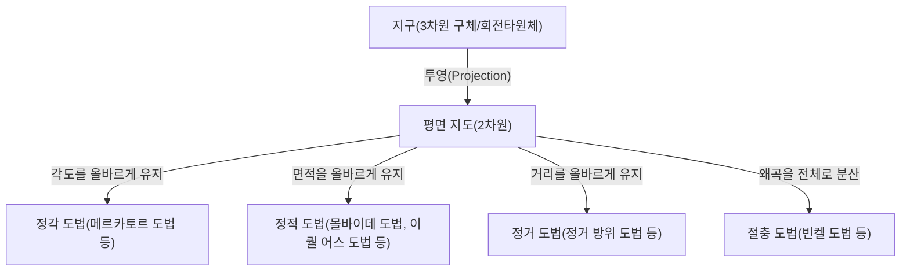
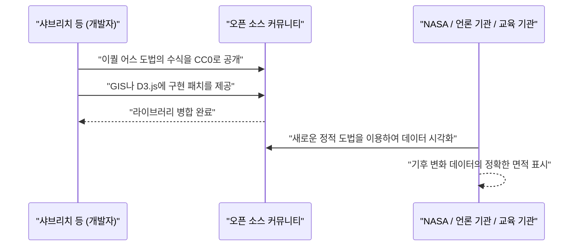

# 서론: 구체를 평면에 그린다는 궁극의 역설

인류는 예로부터 자신들이 사는 세상을 이해하고 기록하기 위해 지도를 그려왔습니다. 그러나 거기에는 항상 하나의 거대한 역설이 존재했습니다. "3차원의 구체(지구)를 왜곡 없이 2차원의 평면(지도)으로 펼치는 것은 수학적으로 불가능하다"는 사실입니다. 이는 카를 프리드리히 가우스가 '경이로운 정리(Theorema Egregium)'에서 증명했듯이, 곡률이 다른 곡면끼리 등장 사상(isometric mapping)을 할 수 없다는 수학적 진리에 근거하고 있습니다.

귤껍질을 평평하게 펼치려 하면 반드시 찢어지거나 주름이 생기듯이, 지구를 평면 지도로 만들 때에도 반드시 어떠한 '왜곡'이 발생합니다. 지도 투영법(Map Projection)의 역사란 이 피할 수 없는 '왜곡'과 인류가 어떻게 마주하고, 어떤 요소(면적, 각도, 거리, 방위)를 희생하여 어떤 요소를 지킬 것인가 하는 타협과 선택의 역사에 다름 아닙니다.

본 기사에서는 16세기 메르카토르 도법의 탄생부터 21세기 최신 이퀄 어스 도법에 이르기까지 지도 투영법의 진화를 수학적, 역사적, 사회적 배경과 함께 깊이 파헤쳐 봅니다.



## 제1장: 대항해시대와 메르카토르 도법의 탄생

### 1.1 항해자들의 고뇌

15세기 말부터 16세기에 걸친 대항해시대, 유럽의 항해자들은 미지의 바다를 향해 노를 저었습니다. 콜럼버스의 아메리카 도달, 마젤란의 지구 일주 등 세계가 극적으로 확대되면서 정확한 해도에 대한 수요는 폭발적으로 높아졌습니다.

당시의 해도는 포르톨라노 해도라 불리며, 중심에서 방사상으로 그어진 방위선(나침선)에 의존해 나아가는 것이었습니다. 그러나 장거리 항해, 특히 대양을 횡단하는 항해에서 지구가 구체임에 따라 발생하는 오차를 무시할 수 없게 되었습니다. 항해자들은 "나침반이 가리키는 일정한 방위(등각 항로)를 직진하면 목적지에 도달할 수 있는 지도"를 강력히 원하고 있었습니다.

### 1.2 게라르두스 메르카토르의 혁신

1569년, 플랑드르(현재의 벨기에)의 지리학자 게라르두스 메르카토르(Gerardus Mercator)는 이 항해자들의 간절한 바람에 부응하는 획기적인 세계 지도를 발표했습니다. 그것이 바로 '메르카토르 도법'입니다.

메르카토르 도법의 가장 큰 특징은 "임의의 두 점을 연결하는 직선이 항상 일정한 나침반 방위를 나타낸다(등각 항로가 직선으로 표현된다)"는 점입니다. 이를 통해 항해자는 지도 위에 자를 대고 직선을 긋는 것만으로 목적지까지의 나침반 방위를 알 수 있었습니다.

### 1.3 메르카토르 도법의 수학적 뒷받침

메르카토르 도법은 원통 투영법의 일종으로 볼 수 있습니다. 지구의 적도에 원통을 감고, 지구의 중심에서 광원을 비추어 원통 안쪽에 지도를 투영하는 이미지입니다. 그러나 메르카토르는 단순한 투영이 아니라, 수학적 계산을 통해 위선의 간격을 조정했습니다.

경도를 $\lambda$, 위도를 $\phi$라 하고 지도상의 좌표를 $(x, y)$라 할 때, 메르카토르 도법의 투영식은 다음과 같습니다(지구를 진구로 하고, 반지름을 $R$이라 함).

$$ x = R(\lambda - \lambda_0) $$
$$ y = R \ln \left( \tan\left(\frac{\pi}{4} + \frac{\phi}{2}\right) \right) $$

여기서 $\lambda_0$는 기준이 되는 중앙 경선입니다. 이 식이 보여주듯이, 고위도가 될수록 $y$의 값은 급격히 커지며, 극($\phi = \pm \pi/2$)에서는 무한대($\infty$)로 발산합니다.

다음은 Python을 사용하여 메르카토르 도법의 좌표 변환을 수행하는 간단한 코드 스니펫입니다.

```python
import math

def latlon_to_mercator(lat, lon, R=6378137.0):
    """
    위도 경도에서 메르카토르 도법의 XY 좌표(미터)로 변환하는 함수
    EPSG:3857 (Web Mercator)의 계산에 해당
    """
    # 위도 경도를 라디안으로 변환
    lat_rad = math.radians(lat)
    lon_rad = math.radians(lon)
    
    # X좌표 계산
    x = R * lon_rad
    
    # Y좌표 계산(구데르만 함수의 역함수)
    y = R * math.log(math.tan(math.pi / 4.0 + lat_rad / 2.0))
    
    return x, y

# 예: 도쿄(위도 35.6812, 경도 139.7671) 계산
x, y = latlon_to_mercator(35.6812, 139.7671)
print(f"Tokyo (Mercator): X={x:.2f}, Y={y:.2f}")
```

### 1.4 메르카토르 도법의 빛과 그림자

메르카토르 도법은 '정각성(각도가 올바르게 유지됨)'을 가지기 때문에 국소적인 형상은 현실과 일치합니다. 그러나 대가로 '면적'이 극단적으로 왜곡된다는 치명적인 단점을 안고 있습니다. 고위도 지방일수록 확대되기 때문에 그린란드는 아프리카 대륙과 거의 같은 크기로 그려지지만, 실제로는 아프리카 대륙이 그린란드의 약 14배의 면적을 가지고 있습니다.

이 면적의 왜곡은 훗날 정치적, 사회적인 문제를 야기하게 됩니다. 유럽이나 북미 등 북반구 고위도 지역이 과대하게 표현되는 반면, 적도 부근의 개발도상국이 작게 그려지기 때문에 "서구 중심주의적인 세계관을 심어준다"는 비판을 받게 되는 것입니다.

## 제2장: 면적의 정확성을 찾아서: 정적 도법의 계보

메르카토르 도법의 면적 왜곡에 대한 비판으로부터 면적비가 올바르게 유지되는 '정적 도법'이 수없이 고안되었습니다.

### 2.1 생송 도법과 몰바이데 도법

17세기에는 프랑스의 니콜라 생송 등이 사용한 '생송 도법(Sanson-Flamsteed projection)'이 보급되었습니다. 이는 위선이 등간격의 평행선이고, 경선이 정현 곡선(사인 커브)으로 그려지는 정적 도법입니다. 중앙 경선 부근의 왜곡은 적지만, 주변부(특히 고위도 지방)에서의 형태 왜곡이 심하다는 단점이 있었습니다.

이를 개량한 것이 1805년에 독일의 수학자 카를 몰바이데가 발표한 '몰바이데 도법(Mollweide projection)'입니다. 몰바이데 도법은 지구 전체를 하나의 타원형에 담아, 고위도 지방의 형태 왜곡을 생송 도법보다 완화했습니다.

### 2.2 구드의 호몰로사인 도법(단열 도법)

20세기에 들어서자 더욱 형태의 왜곡을 줄이면서 정적성을 유지하려는 시도가 이루어졌습니다. 1923년, 미국의 지리학자 존 폴 구드는 '구드 도법(호몰로사인 도법)'을 발표했습니다.

이는 저위도 지역에 생송 도법을, 고위도 지역에 몰바이데 도법을 이어 붙이고, 나아가 해양 부분(또는 대륙 부분)을 찢어서 표현하는 '단열 도법'이라는 기발한 접근을 취했습니다. 이를 통해 각 대륙의 형태 왜곡을 최소화하면서 올바른 면적비로 세계를 조감할 수 있게 되었습니다. 그러나 바다가 갈라져 있기 때문에 연속적인 지구의 모습을 직관적으로 파악하기 어렵다는 단점이 있었습니다.

## 제3장: 냉전과 피터스 도법의 논쟁

지도 투영법이 단순한 수학이나 지리학의 문제에 그치지 않고, 이데올로기의 대립을 끌어들인 대논쟁으로 발전한 것이 1970년대의 '피터스 도법(Peters projection)'을 둘러싼 소동입니다.

### 3.1 갈의 정적 원통 도법과 아르노 피터스의 주장

1973년, 독일의 역사가 아르노 피터스는 "메르카토르 도법은 유럽 중심주의의 오만한 지도이며, 제3세계를 의도적으로 작게 보이게 하고 있다"고 거세게 비판하며, 독자적인 '피터스 도법'을 발표했습니다. 그는 이것을 "모든 사람들을 평등하게 그리는, 진정으로 공평하고 새로운 세계 지도"로서 대대적으로 홍보했습니다.

피터스 도법은 정적 도법으로, 메르카토르 도법처럼 고위도 지방이 극단적으로 확대되는 일은 없었습니다. 그 때문에 유엔 기관이나 많은 NGO, 종교 단체 등이 이 지도를 지지하고, 계몽 포스터로서 널리 채택했습니다.

### 3.2 지도학계의 맹반발

그러나 이 피터스의 발표에 대해 전문 지도학자들은 거세게 반발했습니다. 그 이유는 다음과 같습니다.

1. **표절 의혹**: 피터스 도법은 수학적으로 1855년에 영국의 제임스 갈이 발표한 '갈 정적 원통 도법'과 완전히 같은 것이었습니다. 지도학계에서는 이미 알려진 도법이었으며, 피터스의 오리지널이 아니었습니다.
2. **형태의 심한 왜곡**: 정적성을 유지하기 위해 원통 도법을 사용한 결과, 저위도 지역(아프리카나 남미)은 세로로 극단적으로 늘어나고, 고위도 지역(유럽이나 캐나다)은 가로로 짓눌린 듯한, 매우 볼품없는 형태가 되었습니다.
3. **프로파간다로서의 이용**: 지도학자들은 피터스가 지도 투영법의 수학적 트레이드오프(면적을 유지하면 형태가 왜곡됨)를 무시하고, 메르카토르 도법을 부당하게 악역으로 취급함으로써 이데올로기적인 프로파간다를 하고 있다고 비난했습니다.

이 논쟁은 지도가 단순한 객관적 현실의 모사가 아니라, 그것을 보는 사람들의 세계관이나 정치 의식에 강한 영향을 미치는 매체임을 전 세계에 재인식시키는 결과가 되었습니다.

## 제4장: 타협의 예술: 절충 도법의 융성

면적도 형태도, 어느 한쪽을 완벽하게 유지하려고 하면 다른 한쪽이 극단적으로 희생됩니다. 그래서 엄밀한 정적성이나 정각성을 버리고, '시각적인 자연스러움'이나 '전체적인 왜곡의 최소화'를 추구하는 '절충 도법(Compromise projection)'이 20세기 후반 일반용 세계 지도의 주류가 되었습니다.

### 4.1 로빈슨 도법

1963년, 미국의 지도학자 아서 H. 로빈슨이 고안한 '로빈슨 도법(Robinson projection)'은 수학적인 공식에서 출발하는 것이 아니라, "보기에 아름다울 것"을 최우선으로 하여 위선의 길이와 간격을 경험적으로 결정한다는 독특한 접근법을 취했습니다.

이 도법은 내셔널 지오그래픽 협회가 1988년에 공식 세계 지도로 채택하면서 전 세계적으로 널리 인지되게 되었습니다.

### 4.2 빈켈 제3 도법

그 후, 내셔널 지오그래픽 협회는 1998년에 로빈슨 도법을 대신하여 '빈켈 제3 도법(Winkel Tripel projection)'을 채택했습니다. 1921년에 독일의 오스발트 빈켈이 고안한 이 도법은 에이토프 도법과 정거 원통 도법을 산술 평균한 것입니다. 'Tripel'이란 독일어로 '3개'를 의미하며, 면적, 각도, 거리의 세 가지 왜곡을 최소화하려고 했음을 나타냅니다. 현재도 많은 학습장이나 아틀라스에서 표준적인 세계 지도로 사용되고 있습니다.

## 제5장: 디지털 시대의 새로운 도전: 이퀄 어스 도법의 탄생

21세기에 들어서며, 우리가 지도와 관계를 맺는 방식은 극적으로 변화했습니다. Google Maps를 비롯한 웹 지도 서비스의 보급입니다. 이들 웹 지도에서는 줌 조작을 원활하게 하기 위해 아이러니하게도 다시 '메르카토르 도법(Web 메르카토르)'이 채택되었습니다(최근에는 줌 아웃하면 3D 지구본 모델로 전환되도록 개선되었습니다).

그러나 기후 변화나 세계적인 격차 문제 등 지구 규모의 과제를 논의하는 자리에서, '정확한 면적비'로 세계를 시각화하는 중요성은 여전히 높았고 새로운 정적 도법이 요구되고 있었습니다.

### 5.1 보얀 샤브리치 등의 도전

2018년, 보얀 샤브리치(Bojan Šavrič), 톰 패터슨(Tom Patterson), 베른하르트 제니(Bernhard Jenny) 세 명의 지도학자에 의해 완전히 새로운 정적 도법인 '이퀄 어스 도법(Equal Earth projection)'이 발표되었습니다.

그들의 목표는 명확했습니다.
"피터스 도법과 같은 형태의 심한 왜곡이 없고, 로빈슨 도법처럼 보기에 자연스럽고 아름다우며, 동시에 엄밀한 정적성을 가지는 세계 지도를 만드는 것"입니다.

### 5.2 이퀄 어스 도법의 수학적 혁신

이퀄 어스 도법은 로빈슨 도법의 외형과 매우 흡사하지만, 고도화된 다항식을 사용하여 엄밀한 정적성을 실현했습니다. 그 투영식은 다음과 같습니다.

위도를 $\phi$, 경도를 $\lambda$(중앙 경선으로부터의 차이)라 하고, $ \theta $ 를 $ \sin \theta = \frac{\sqrt{3}}{2} \sin \phi $ 를 만족하는 각이라고 합니다.

$$ x = \frac{2\sqrt{3} \lambda \cos \theta}{3 (9 A_4 \theta^8 + 7 A_3 \theta^6 + 3 A_2 \theta^2 + A_1)} $$
$$ y = A_4 \theta^9 + A_3 \theta^7 + A_2 \theta^3 + A_1 \theta $$

여기서 계수는 다음과 같습니다.
$ A_1 = 1.340264 $
$ A_2 = -0.081106 $
$ A_3 = 0.000893 $
$ A_4 = 0.003796 $

이 복잡한 수식을 통해 이퀄 어스 도법은 적도 부근이 늘어나거나 고위도가 극단적으로 찌그러지지 않고, 대륙의 형태를 자연스럽게 유지한 채 올바른 면적비를 표현하는 데 성공했습니다.

### 5.3 오픈 소스로서의 보급

이퀄 어스 도법이 획기적이었던 것은 그 설계뿐만 아니라 보급을 향한 접근이었습니다. 개발자들은 이 도법의 수식을 퍼블릭 도메인(CC0)으로 공개하고, QGIS 등의 오픈 소스 GIS 소프트웨어나 D3.js 등의 데이터 시각화 라이브러리에 신속하게 구현되도록 독려했습니다.

그 결과, NASA(미국항공우주국)의 전 세계 기온 이상 지도 등에서 채택되는 등 순식간에 전 세계의 과학자나 언론에 수용되었습니다.



## 결론: 지도는 세계를 창조한다

메르카토르 도법에서 이퀄 어스 도법에 이르기까지의 역사는, 인류가 '자신들이 사는 세상을 어떻게 파악하고, 어떻게 전하고 싶은가'라는 사상 변천의 역사이기도 합니다.

대항해시대에는 "목적지에 확실하게 도달하는 것"이 최우선시되었고(정각성), 식민지 지배 시대에는 자국의 광활함을 과시하는 지도를 선호했습니다. 그리고 냉전기에는 남북 문제의 시정을 호소하는 지도가 논란을 불렀고, 현대에는 기후 변화 등 지구 규모의 과제를 평탄하게 파악하기 위한 지도(정적성 + 자연스러운 형태)가 요구되고 있습니다.

**"지도는 세계를 비추는 거울인 동시에, 세계를 창조하는 렌즈이기도 하다"**.

우리는 지도를 볼 때, 그것이 어떠한 수학적 타협 위에 성립되었으며, 어떠한 의도를 가지고 그려진 것인지를 항상 의식할 필요가 있습니다. 이퀄 어스 도법은 현대의 우리가 세계를 어떻게 다시 바라보려 하는지를 보여주는 가장 새로운 '렌즈' 중 하나라고 할 수 있을 것입니다.
